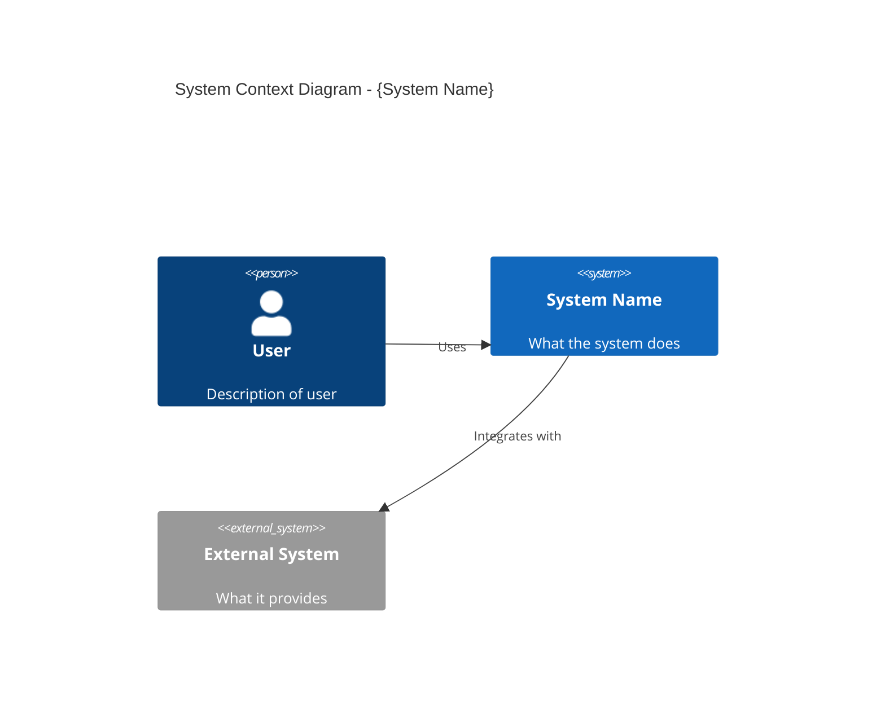
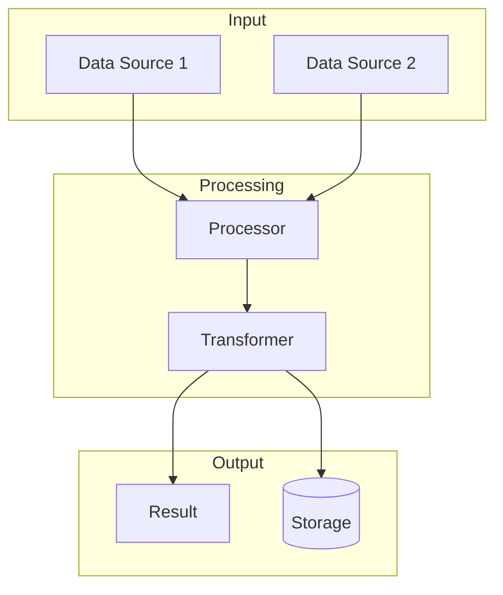
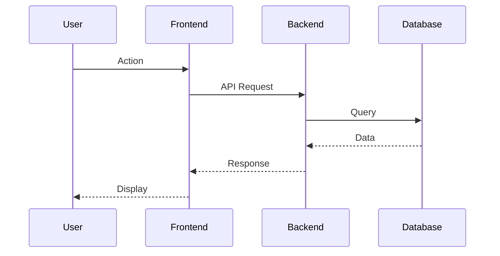
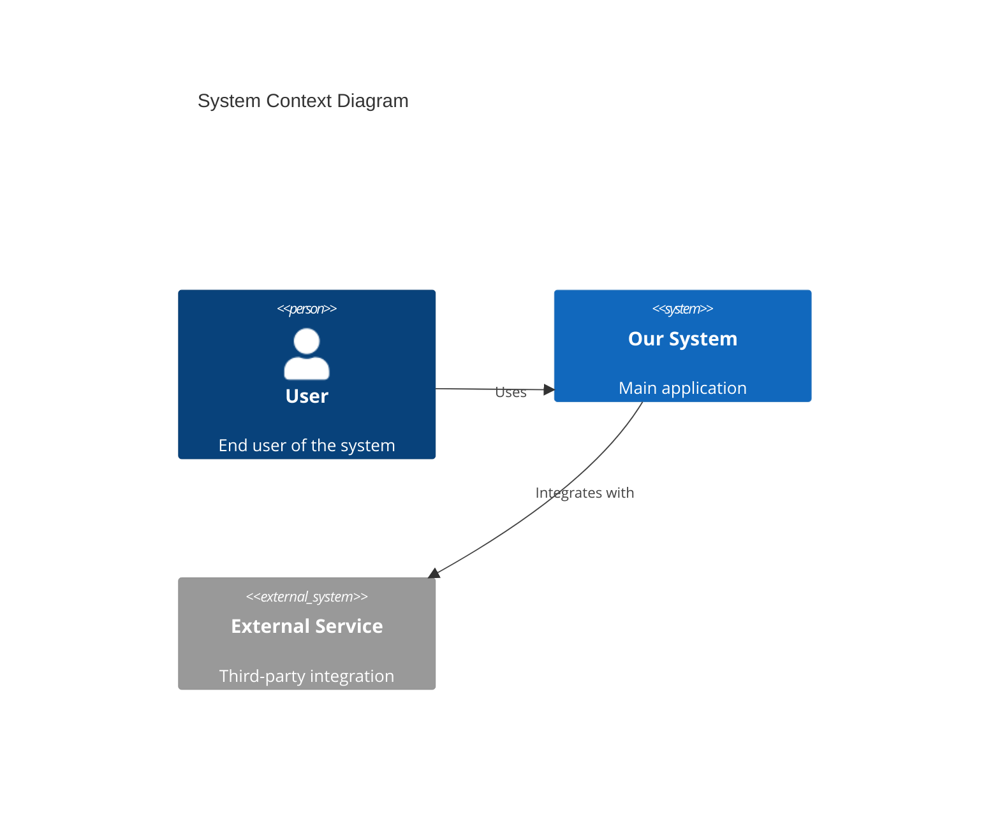
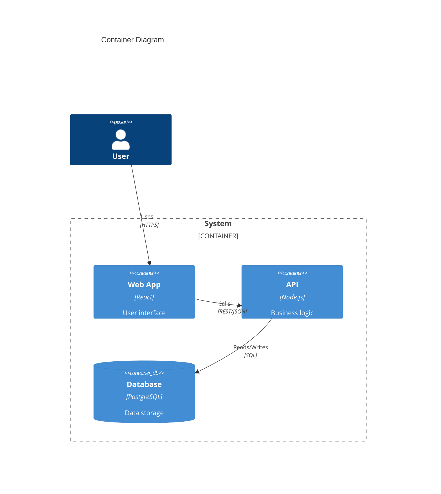
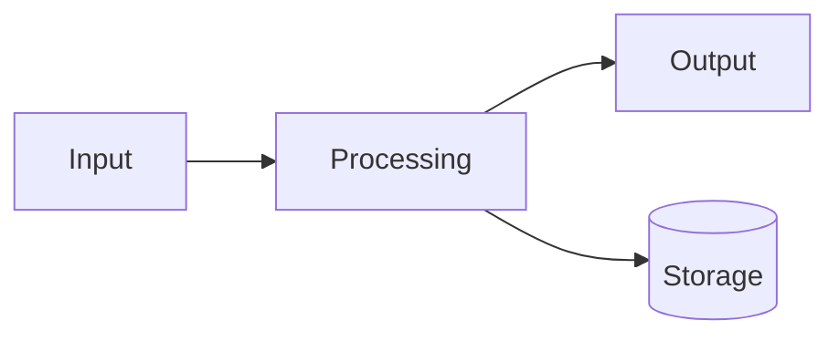
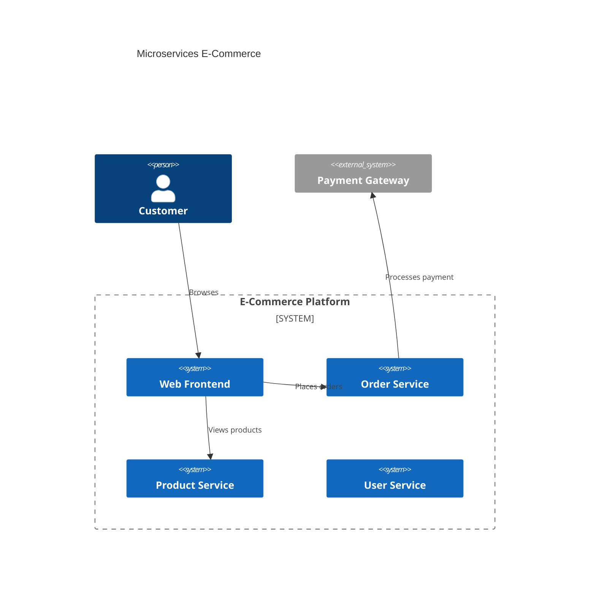
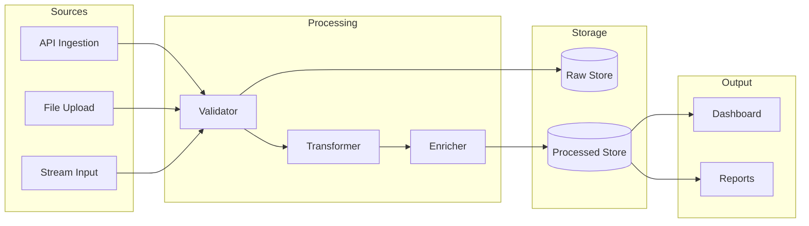

# Architecture Patterns Reference

This document contains detailed architecture diagram examples and templates for the Idea to Architecture skill.

---

## Mermaid Diagram Templates

### System Architecture (C4 Context)



### Container Diagram (C4 Container)


### Data Flow Diagram



### Sequence Diagram



---

## Tool-Specific Generation

### Mermaid Diagrams in Markdown

Generate Mermaid diagrams embedded in markdown files:

```markdown
# System Architecture

## Context Diagram (C4 Level 1)



## Container Diagram (C4 Level 2)



## Data Flow


```

### Excalidraw Integration

```
1. Check Excalidraw integration availability
2. Create architecture diagram using Excalidraw
3. Export as .excalidraw file and/or PNG
4. Save to architecture folder
```

### Manual Mode (No Tools)

```
1. Create detailed architecture description in markdown
2. Include text-based component listing
3. Document relationships and data flow
4. Save as architecture-description.md in {Current Idea Folder}/architecture/
```

---

## Architecture Patterns

### Pattern: Microservices Architecture

**When:** Idea describes multiple independent services

**Implementation:**
```
1. Create C4 Context showing all services
2. Create Container diagram for each service
3. Show inter-service communication
4. Document API boundaries
5. Include message queue if async communication mentioned
```

**Example Structure:**


### Pattern: Simple Web Application

**When:** Idea is a straightforward web app

**Implementation:**
```
1. Create simple 3-tier architecture (Frontend, Backend, Database)
2. Add external integrations if mentioned
3. Keep diagram minimal and clear
4. Focus on main data flows
```

**Example Structure:**


### Pattern: Data Pipeline

**When:** Idea focuses on data processing

**Implementation:**
```
1. Create data flow diagram as primary
2. Show data sources, transformations, and destinations
3. Include storage components
4. Document data formats at each stage
```

**Example Structure:**


### Pattern: No Technical Details in Idea

**When:** Idea summary lacks technical information

**Implementation:**
```
1. Ask clarifying questions about system needs
2. Suggest common architecture patterns
3. Create minimal viable architecture
4. Request feedback before expanding
```

**Clarifying Questions Template:**
- What type of users will interact with this system?
- Will this be a web application, mobile app, or both?
- Are there any external services or integrations needed?
- What kind of data will be stored and processed?
- Are there any real-time or performance requirements?

---

## Diagram Type Selection Guide

| Idea Contains | Recommended Diagram | Priority | Template Reference |
|---------------|---------------------|----------|-------------------|
| Multiple services/components | System Architecture (C4 Context/Container) | High | [C4 Context](#system-architecture-c4-context) |
| Data processing pipeline | Data Flow Diagram | High | [Data Flow](#data-flow-diagram) |
| User-system interactions | Sequence Diagram | Medium | [Sequence](#sequence-diagram) |
| External integrations | Integration Architecture | Medium | [C4 Context](#system-architecture-c4-context) |
| Microservices mentions | Component Diagram | Medium | [Microservices Pattern](#pattern-microservices-architecture) |
| Database mentions | Entity Relationship (high-level) | Low | Manual description |

---

## Output Artifact Structure

### Directory Layout

```
{Current Idea Folder}/
├── idea-summary-vN.md
├── architecture/
│   ├── system-architecture-v1.md    (mermaid diagrams in markdown)
│   ├── data-flow-v1.md              (data flow diagrams)
│   ├── sequence-v1.md               (sequence diagrams)
│   ├── architecture.excalidraw      (if excalidraw used)
│   └── architecture-description.md  (if manual mode)
└── files/
    └── (original idea files)
```

### File Naming Convention

```
{diagram-type}-v{version}.{extension}

Examples:
- system-architecture-v1.md
- data-flow-v1.md
- sequence-v1.md
- integration-v1.md
```

### Summary Update Template

```markdown
## Architecture Diagrams

| Diagram | Type | Path | Tool Used |
|---------|------|------|-----------|
| System Architecture | C4 Context/Container | architecture/system-architecture-v1.md | mermaid |
| Data Flow | Flowchart | architecture/data-flow-v1.md | mermaid |

### Viewing Instructions
- Open .md files to view mermaid diagrams (renders in most markdown viewers)
- Excalidraw files can be opened at excalidraw.com
```
