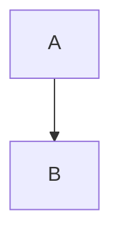
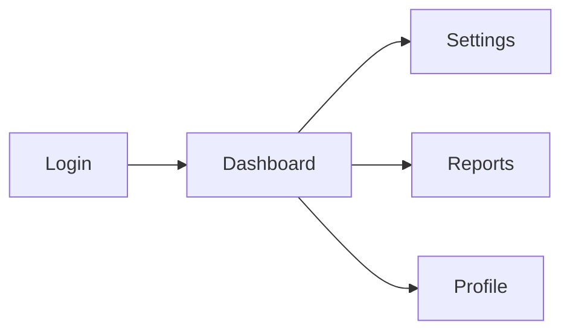
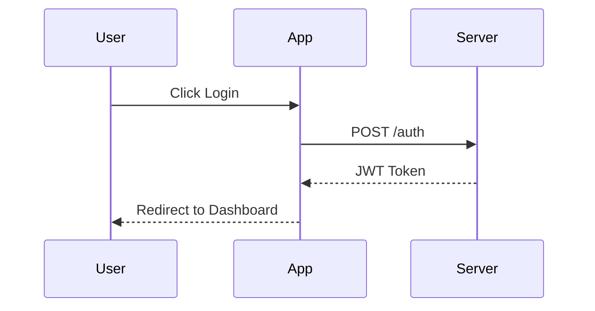
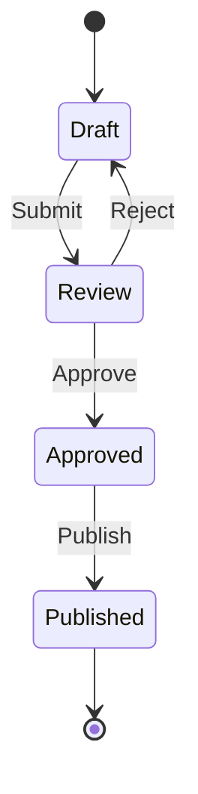

# Visualization Guidelines

Use visualization tools based on `.ideation-tools.json` config.

---

## When `ideation.antv-infographic: true`

Invoke `infographic-syntax-creator` skill to generate visual representations. Embed in markdown:

````markdown
```infographic
infographic <template-name>
data
  ...
```
````

### Recommended Infographic Templates

| Information Type | Recommended Template | Example Use |
|-----------------|---------------------|-------------|
| Feature list | `list-grid-badge-card`, `list-row-horizontal-icon-arrow` | Key Features section |
| Process/Workflow | `sequence-snake-steps-simple`, `sequence-timeline-simple` | User journey, implementation phases |
| Pros/Cons | `compare-binary-horizontal-badge-card-arrow` | Trade-off analysis |
| SWOT Analysis | `compare-swot` | Strategic analysis |
| Priority Matrix | `compare-quadrant-quarter-simple-card` | Feature prioritization |
| Architecture | `hierarchy-tree-tech-style-badge-card` | System overview |
| Mind Map | `hierarchy-mindmap-branch-gradient-capsule-item` | Concept exploration |
| Metrics/KPIs | `chart-pie-compact-card`, `chart-column-simple` | Success metrics |

---

## When `ideation.mermaid: true`

Generate mermaid diagrams directly. Embed in markdown:

````markdown

````

### Recommended Mermaid Diagrams

| Information Type | Mermaid Type | Example Use |
|-----------------|--------------|-------------|
| User Flow | `flowchart TD/LR` | User journey, process steps |
| Architecture | `flowchart TD` | System components |
| Sequence | `sequenceDiagram` | API interactions, user actions |
| State Machine | `stateDiagram-v2` | Status transitions |
| Timeline | `timeline` | Project phases, milestones |
| Entity Relationship | `erDiagram` | Data models |

---

## Visualization Examples

### Feature List (antv-infographic)

```infographic
infographic list-grid-badge-card
data
  title Core Features
  lists
    - label Fast Performance
      desc Sub-second response times
      icon flash
    - label Secure by Default
      desc End-to-end encryption
      icon shield check
    - label Easy Integration
      desc REST API & SDKs
      icon puzzle
    - label Real-time Sync
      desc Live collaboration
      icon sync
```

### User Flow (mermaid)



### Implementation Phases (antv-infographic)

```infographic
infographic sequence-roadmap-vertical-simple
data
  title Implementation Roadmap
  sequences
    - label Phase 1: MVP
      desc Core features only
    - label Phase 2: Beta
      desc User testing & feedback
    - label Phase 3: Launch
      desc Public release
    - label Phase 4: Scale
      desc Performance optimization
```

### Pros/Cons Analysis (antv-infographic)

```infographic
infographic compare-binary-horizontal-badge-card-arrow
data
  compares
    - label Pros
      children
        - label Lower cost
        - label Faster delivery
        - label Better UX
    - label Cons
      children
        - label Learning curve
        - label Migration effort
```

### Sequence Diagram (mermaid)



### State Diagram (mermaid)



---

## When NOT to Use Visualizations

- Simple bullet lists (< 3 items)
- Highly technical specifications
- Code examples or API documentation
- Legal/compliance text
- **When both `ideation.antv-infographic` and `ideation.mermaid` are `false`** → Use standard markdown
