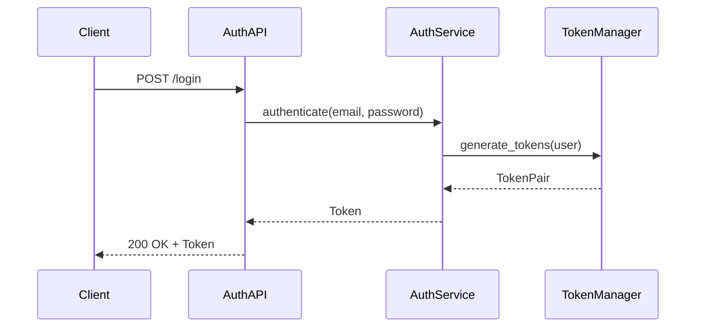
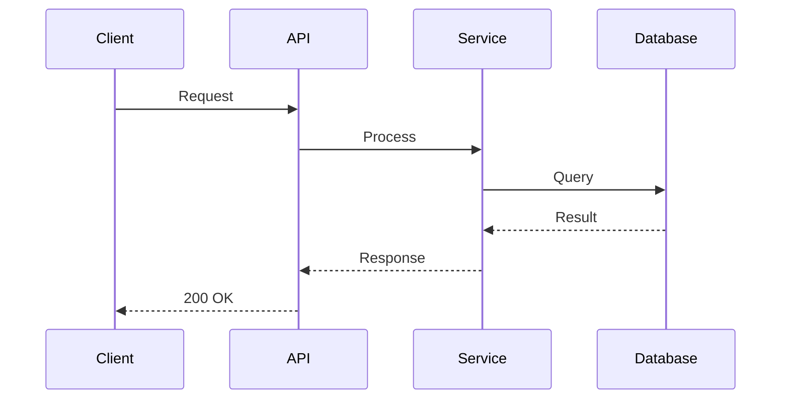
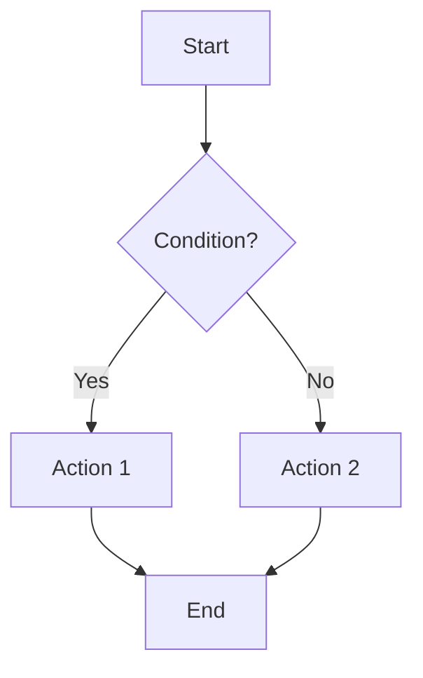
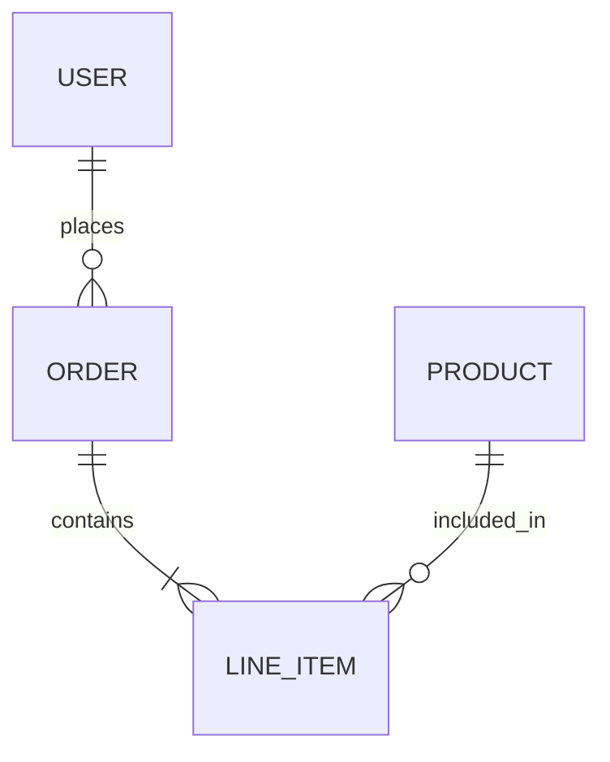
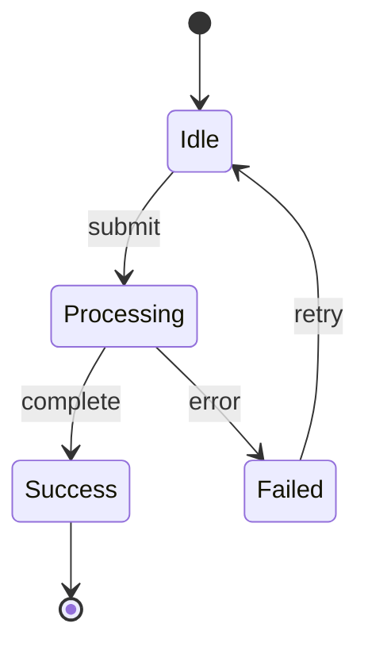
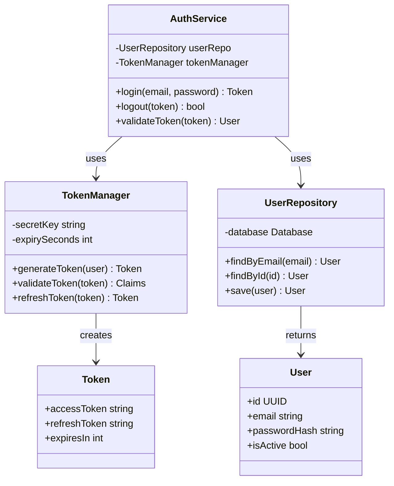

# Technical Design Templates Reference

This document contains detailed templates and examples for creating technical design documents.

---

## Document Template

```markdown
# Technical Design: {Feature Title}

> Feature ID: FEATURE-XXX | Version: v1.0 | Last Updated: YYYY-MM-DD

---

## Part 1: Agent-Facing Summary

> **Purpose:** Quick reference for AI agents navigating large projects.
> **📌 AI Coders:** Focus on this section for implementation context.

### Key Components Implemented

| Component | Responsibility | Scope/Impact | Tags |
|-----------|----------------|--------------|------|
| `AuthService` | User authentication | Login flow across apps | #auth #security #core |
| `TokenManager` | JWT generation/validation | Session management | #auth #jwt |

### Dependencies

| Dependency | Source | Design Link | Usage Description |
|------------|--------|-------------|-------------------|
| `UserRepository` | FEATURE-001 | [technical-design.md](../FEATURE-001/technical-design.md) | Query user records for credential validation |
| `ConfigManager` | Foundation | [config.md](../../architecture/technical-designs/config.md) | Load JWT secret and token expiry settings |

### Major Flow

1. Client submits credentials → AuthService validates → TokenManager generates JWT → Response returned
2. Subsequent requests include JWT → TokenManager validates → Access granted/denied

### Usage Example

```python
# Authentication flow
auth = AuthService()
token = auth.login(email="user@test.com", password="secure")

# Using the token
api.set_auth_header(token.access_token)
response = api.get("/protected-resource")
```

---

## Part 2: Implementation Guide

> **Purpose:** Human-readable details for developers.
> **📌 Emphasis on visual diagrams for comprehension.

### Workflow Diagram



### [Data Models / API Specs / CLI Commands - adapt to implementation type]

(Content varies based on whether this is API, CLI, frontend, etc.)

### Implementation Steps

1. **{Layer}:** [Tasks]
2. **{Layer}:** [Tasks]

### Edge Cases & Error Handling

| Scenario | Expected Behavior |
|----------|-------------------|
| Invalid password | 401 Unauthorized |
| Rate limit exceeded | 429 Too Many Requests |

---

## Design Change Log

| Date | Phase | Change Summary |
|------|-------|----------------|
| {YYYY-MM-DD} | Initial Design | Initial technical design created. |
```

---

## Version History Format

Add at top of document after header when design evolves:

```markdown
## Version History

| Version | Date | Description |
|---------|------|-------------|
| v2.0 | 01-22-2026 | Major upgrade: xterm.js, session persistence, split-pane |
| v1.0 | 01-18-2026 | Initial design with VanillaTerminal |
```

---

## Part 1: Agent-Facing Summary Guidelines

### Purpose
Enable AI agents to quickly understand and reference designs across large projects.

> **📌 Note for AI Coders:** Focus primarily on Part 1 for implementation. Part 2 is supplementary for complex scenarios.

### Required Elements

| Element | Description |
|---------|-------------|
| Key Components | What modules/classes/services were created or modified |
| Scope & Boundaries | What this design covers and what it doesn't |
| Dependencies | Components from other features/foundation this feature relies on |
| Major Flow | High-level description of how components interact |
| Usage Example | Code snippet showing how to use the implemented feature |

### Dependency Table Format

| Dependency | Source | Design Link | Usage Description (≤50 words) |
|------------|--------|-------------|-------------------------------|
| `AuthService` | FEATURE-001 | [technical-design.md](../FEATURE-001/technical-design.md) | Used for user authentication before accessing protected endpoints |
| `DatabaseManager` | Foundation | [database.md](../../architecture/technical-designs/database.md) | Provides connection pooling and query execution |

### Format Guidelines

- Use tables for component listings (Component | Responsibility | Scope/Impact | Tags)
- Use dependency table for cross-feature/foundation dependencies
- Tags enable semantic search across project designs
- Keep concise - this is a reference summary, not documentation

---

## Part 2: Implementation Guide Guidelines

### Purpose
Detailed guide for developers to understand and implement the design.

> **📌 Note:** This section emphasizes visual diagrams and step-by-step guidance for human comprehension.

### Sections (Include as needed)

| Section | When to Include |
|---------|-----------------|
| Workflow Diagrams | REQUIRED for complex flows |
| Class Diagram | RECOMMENDED for OOP designs |
| Data Models | Schema definitions, type structures |
| API/Interface Specs | Endpoints, CLI commands, function signatures |
| Implementation Steps | Ordered tasks to build the feature |
| Edge Cases | Error handling, boundary conditions |

### Format Guidelines

- **Prioritize visualization** - Use Mermaid diagrams liberally for:
  - Sequence diagrams for API/service interactions
  - Flowcharts for decision logic
  - Entity-relationship diagrams for data models
  - State diagrams for stateful components

---

## Implementation Type Adaptations

### API-Based Features

Focus on:
- Endpoints, request/response schemas
- Authentication requirements
- Rate limiting, pagination
- Sequence diagrams for complex flows

### CLI-Based Features

Focus on:
- Commands, flags, arguments
- Output formats
- Exit codes
- Help text structure

### Frontend Features

Focus on:
- Component architecture
- State management
- User interaction flows
- Wireframes/mockup references

### Backend/Service Features

Focus on:
- Service interfaces
- Data flow diagrams
- Integration points
- Error handling strategies

---

## Mockup Reference Guidelines

### When to Use Mockup List

```
IF Mockup List != N/A AND Technical Scope in specification.md includes [Frontend] OR [Full Stack]:
  1. OPEN and analyze the Mockup List file(s)
  2. Extract UI requirements from mockup:
     - Component hierarchy and structure
     - State management requirements
     - Event handlers and user interactions
     - CSS/styling approach
  3. Design frontend components based on mockup
  4. Include mockup-derived requirements in Part 2 Implementation Guide
  5. Reference mockup filenames in design decisions

ELSE IF Mockup List == N/A AND specification.md has "Linked Mockups" section:
  1. MUST review "Linked Mockups" section in specification.md
  2. Open and analyze each linked mockup file
  3. Follow same extraction process as above

ELSE (Backend/API Only/Database/Infrastructure OR no mockups available):
  - Skip mockup reference
  - Focus on service architecture, data models, APIs
```

### UI Design Document Additions

When Technical Scope includes frontend, Part 2 SHOULD include:
- UI Component breakdown
- State management strategy
- Mockup-to-component mapping

---

## Design Change Log Format

When the technical design needs to be updated (during implementation, bug fix, or feature extension), add an entry:

| Date | Phase | Change Summary |
|------|-------|----------------|
| YYYY-MM-DD | {Phase where change occurred} | {Summary in ~100 words: what changed, why it changed, impact on components} |

**Valid Phases:** Technical Design, Test Generation, Code Implementation, Bug Fix, Feature Extension

---

## API Design Example

```markdown
### API Specification

#### POST /api/v1/auth/login

**Request:**
```json
{
  "email": "user@example.com",
  "password": "secure123"
}
```

**Response (200):**
```json
{
  "access_token": "eyJ...",
  "refresh_token": "eyJ...",
  "expires_in": 3600
}
```

**Errors:**
| Status | Code | Description |
|--------|------|-------------|
| 401 | INVALID_CREDENTIALS | Email or password incorrect |
| 429 | RATE_LIMITED | Too many login attempts |
```

---

## Data Model Example

```markdown
### User Entity

```python
@dataclass
class User:
    id: UUID
    email: str
    password_hash: str
    created_at: datetime
    updated_at: datetime
    is_active: bool = True
```

### Database Schema

```sql
CREATE TABLE users (
    id UUID PRIMARY KEY DEFAULT gen_random_uuid(),
    email VARCHAR(255) UNIQUE NOT NULL,
    password_hash VARCHAR(255) NOT NULL,
    created_at TIMESTAMP DEFAULT NOW(),
    updated_at TIMESTAMP DEFAULT NOW(),
    is_active BOOLEAN DEFAULT TRUE
);
```
```

---

## Mermaid Diagram Examples

### Sequence Diagram



### Flowchart



### Entity Relationship



### State Diagram



### Class Diagram


