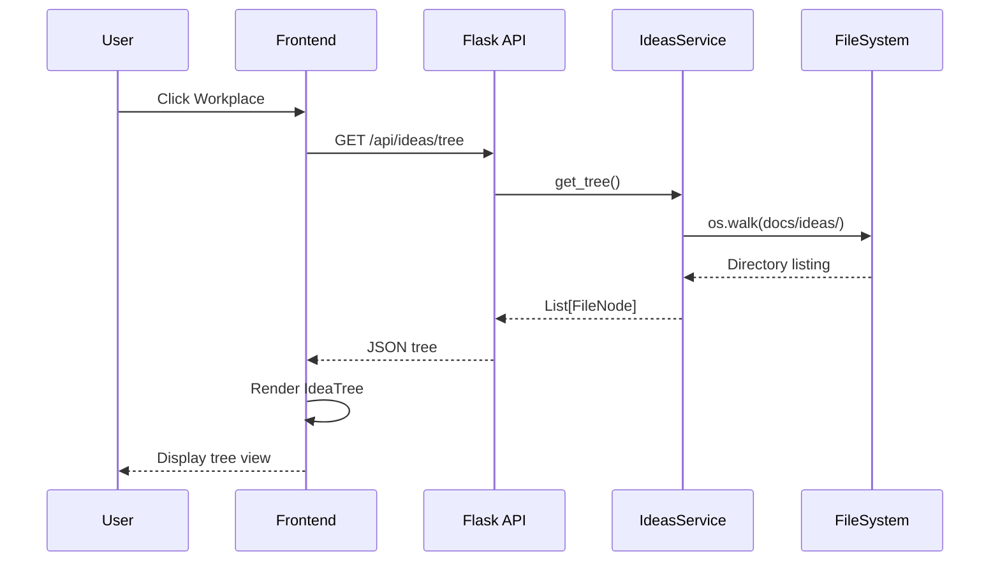
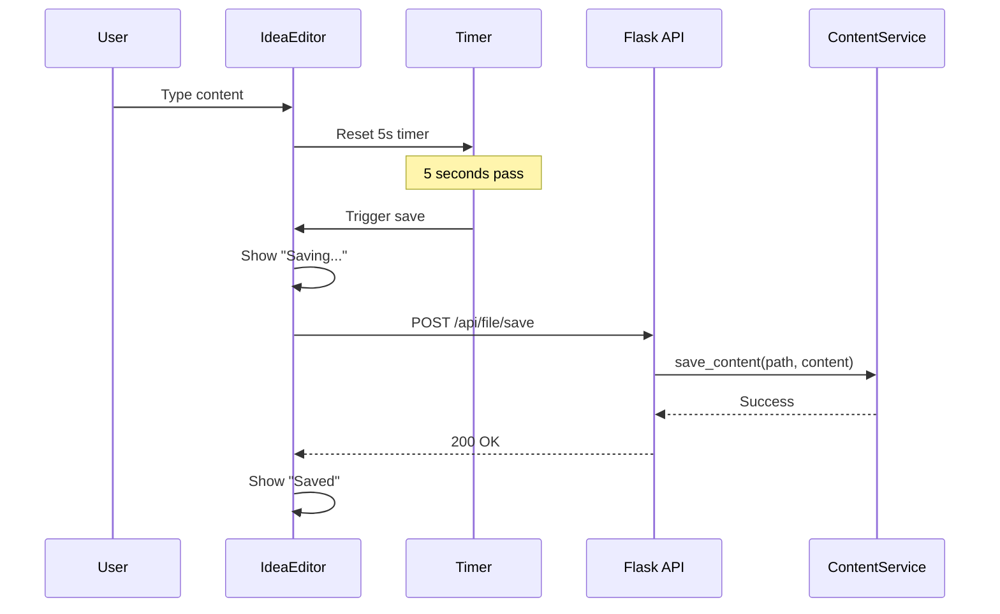
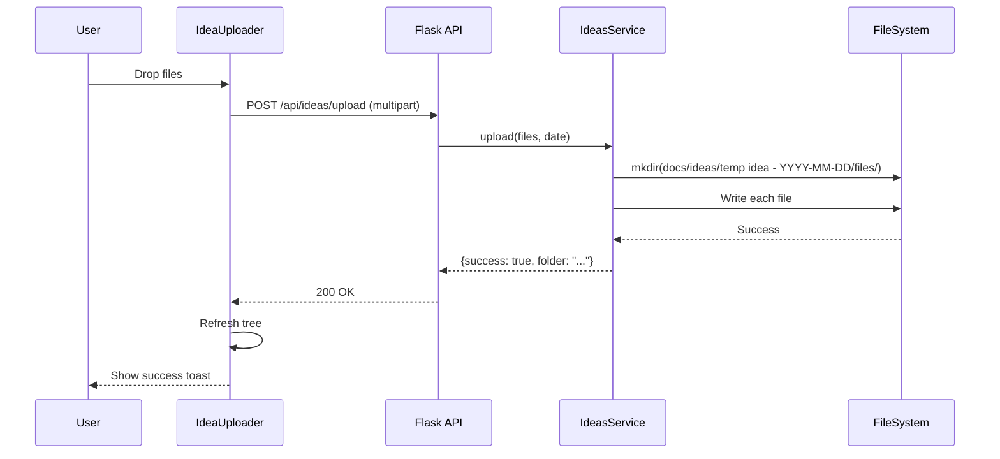
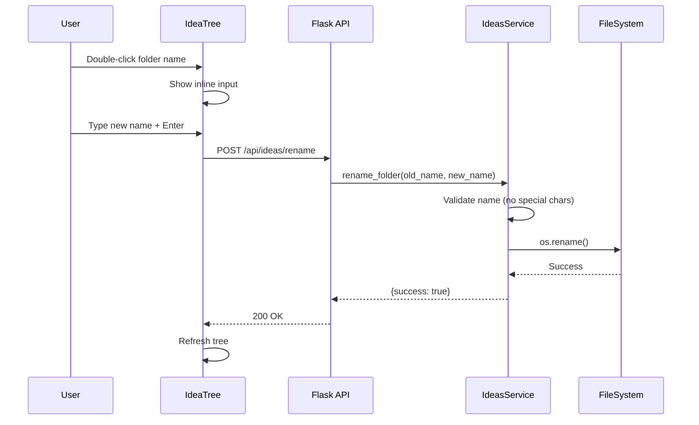

# Technical Design: Workplace (Idea Management)

> Feature ID: FEATURE-008 | Version: v1.0 | Last Updated: 01-22-2026

---

## Version History

| Version | Date | Description |
|---------|------|-------------|
| v1.0 | 01-22-2026 | Initial design |

---

## Part 1: Agent-Facing Summary

> **Purpose:** Quick reference for AI agents navigating large projects.
> **📌 AI Coders:** Focus on this section for implementation context.

### Key Components Implemented

| Component | Responsibility | Scope/Impact | Tags |
|-----------|----------------|--------------|------|
| `IdeasService` | CRUD operations for idea files/folders | Backend service class | #ideas #service #backend |
| `IdeasService.get_tree()` | Scan and return docs/ideas/ structure | Read idea tree | #ideas #tree |
| `IdeasService.upload()` | Handle file upload to new idea folder | Create idea folders | #ideas #upload |
| `IdeasService.rename_folder()` | Rename idea folder on disk | Folder management | #ideas #rename |
| `POST /api/ideas/tree` | API endpoint for idea tree | REST API | #ideas #api |
| `POST /api/ideas/upload` | API endpoint for file upload | REST API | #ideas #api #upload |
| `POST /api/ideas/rename` | API endpoint for folder rename | REST API | #ideas #api |
| `WorkplaceView` | Frontend two-column layout component | UI component | #ideas #frontend #workplace |
| `IdeaTree` | Frontend tree navigation component | UI component | #ideas #frontend #tree |
| `IdeaEditor` | File editor with auto-save (5s debounce) | UI component | #ideas #frontend #editor |
| `IdeaUploader` | Drag-drop and file picker component | UI component | #ideas #frontend #upload |

### Dependencies

| Dependency | Source | Design Link | Usage Description |
|------------|--------|-------------|-------------------|
| `ContentService` | FEATURE-002 | [technical-design.md](../FEATURE-002/technical-design.md) | Reuse `save_content()` for auto-save, `get_content()` for file loading |
| `ProjectService` | FEATURE-001 | [technical-design.md](../FEATURE-001/technical-design.md) | Reference tree scanning pattern for `IdeasService.get_tree()` |
| `FileNode` | FEATURE-001 | [services.py](../../../src/services.py) | Reuse dataclass for tree structure |

### Major Flow

1. **Tree Load:** User clicks Workplace → Frontend calls `GET /api/ideas/tree` → `IdeasService.get_tree()` scans `docs/ideas/` → Returns tree structure
2. **File View/Edit:** User clicks file → Frontend calls `GET /api/file/content?path=...` → Existing ContentService returns content → Display in editor
3. **Auto-save:** User edits → 5s debounce → Frontend calls `POST /api/file/save` → Existing ContentService saves → Show "Saved" indicator
4. **Upload:** User drops files → Frontend calls `POST /api/ideas/upload` → `IdeasService.upload()` creates folder + saves files → Refresh tree
5. **Rename:** User double-clicks folder → Edit name → Frontend calls `POST /api/ideas/rename` → `IdeasService.rename_folder()` → Refresh tree

### Usage Example

```python
# Backend: IdeasService usage
ideas = IdeasService(project_root)
tree = ideas.get_tree()  # Returns list of FileNode

# Upload files
result = ideas.upload(files=[('notes.md', b'# My Idea')], date='2026-01-22')
# Creates: docs/ideas/temp idea - 2026-01-22/files/notes.md

# Rename folder
result = ideas.rename_folder('temp idea - 2026-01-22', 'mobile-app-idea')
# Renames: docs/ideas/mobile-app-idea/
```

```javascript
// Frontend: WorkplaceView integration
// 1. Load tree
const tree = await fetch('/api/ideas/tree').then(r => r.json());

// 2. Auto-save with debounce
const editor = new IdeaEditor({
    saveDelay: 5000,
    onSave: async (path, content) => {
        await fetch('/api/file/save', { 
            method: 'POST', 
            body: JSON.stringify({ path, content }) 
        });
    }
});

// 3. Upload files
const uploader = new IdeaUploader({
    onUpload: async (files) => {
        const formData = new FormData();
        files.forEach(f => formData.append('files', f));
        await fetch('/api/ideas/upload', { method: 'POST', body: formData });
    }
});
```

---

## Part 2: Implementation Guide

> **Purpose:** Human-readable details for developers.
> **📌 Emphasis on visual diagrams for comprehension.

### Workflow Diagrams

#### Tree Load Flow



#### Auto-Save Flow



#### Upload Flow



#### Folder Rename Flow



### Data Models

#### Backend: IdeasService

```python
class IdeasService:
    """
    Service for managing idea files and folders.
    Location: src/services.py
    """
    
    IDEAS_PATH = 'docs/ideas'
    
    def __init__(self, project_root: str):
        self.project_root = Path(project_root).resolve()
        self.ideas_root = self.project_root / self.IDEAS_PATH
    
    def get_tree(self) -> List[FileNode]:
        """
        Scan docs/ideas/ and return tree structure.
        Creates docs/ideas/ if it doesn't exist.
        """
        pass
    
    def upload(self, files: List[Tuple[str, bytes]], date: str = None) -> Dict:
        """
        Upload files to new idea folder.
        Creates: docs/ideas/temp idea - {YYYY-MM-DD}/files/{filename}
        Returns: {success, folder_name, files_uploaded}
        """
        pass
    
    def rename_folder(self, old_name: str, new_name: str) -> Dict:
        """
        Rename idea folder.
        Validates: no special characters, unique name.
        Returns: {success, old_name, new_name}
        """
        pass
    
    def _validate_folder_name(self, name: str) -> Tuple[bool, str]:
        """
        Validate folder name for filesystem.
        Invalid chars: / \ : * ? " < > |
        Max length: 255
        """
        pass
    
    def _generate_unique_name(self, base_name: str) -> str:
        """
        Generate unique folder name if exists.
        Appends (2), (3), etc.
        """
        pass
```

#### Frontend: Components

```javascript
// WorkplaceView: Main container
class WorkplaceView {
    constructor(container) {
        this.container = container;
        this.tree = new IdeaTree();
        this.editor = new IdeaEditor();
        this.uploader = new IdeaUploader();
    }
    
    render() {
        // Two-column layout: left=tree+controls, right=content
    }
    
    showUploadView() {
        // Replace right panel with uploader
    }
    
    showEditor(path) {
        // Load file and show in editor
    }
}

// IdeaTree: Tree navigation
class IdeaTree {
    constructor() {
        this.items = [];
        this.selectedPath = null;
    }
    
    async loadTree() {
        const res = await fetch('/api/ideas/tree');
        this.items = await res.json();
        this.render();
    }
    
    onFileClick(path) {
        // Trigger file load in editor
    }
    
    onFolderDoubleClick(name) {
        // Enter inline rename mode
    }
    
    async renameFolder(oldName, newName) {
        // Call API and refresh tree
    }
}

// IdeaEditor: Auto-save editor
class IdeaEditor {
    constructor(options = {}) {
        this.saveDelay = options.saveDelay || 5000;
        this.saveTimer = null;
        this.status = 'idle'; // idle | saving | saved
    }
    
    loadFile(path) {
        // Load content from API
    }
    
    onContentChange(content) {
        this.status = 'modified';
        clearTimeout(this.saveTimer);
        this.saveTimer = setTimeout(() => this.save(), this.saveDelay);
    }
    
    async save() {
        this.status = 'saving';
        this.updateStatusUI();
        await this.saveToServer();
        this.status = 'saved';
        this.updateStatusUI();
        setTimeout(() => { this.status = 'idle'; this.updateStatusUI(); }, 2000);
    }
}

// IdeaUploader: Drag-drop + file picker
class IdeaUploader {
    constructor(options = {}) {
        this.onUploadComplete = options.onUploadComplete;
    }
    
    render() {
        // Render dropzone with dashed border
        // Include file input for click-to-browse
    }
    
    async handleFiles(files) {
        const formData = new FormData();
        for (const file of files) {
            formData.append('files', file);
        }
        const res = await fetch('/api/ideas/upload', {
            method: 'POST',
            body: formData
        });
        if (res.ok) {
            this.onUploadComplete?.();
        }
    }
}
```

### API Specifications

#### GET /api/ideas/tree

**Response:**
```json
{
    "success": true,
    "tree": [
        {
            "name": "mobile-app-idea",
            "type": "folder",
            "path": "docs/ideas/mobile-app-idea",
            "children": [
                {
                    "name": "files",
                    "type": "folder",
                    "path": "docs/ideas/mobile-app-idea/files",
                    "children": [
                        {
                            "name": "notes.md",
                            "type": "file",
                            "path": "docs/ideas/mobile-app-idea/files/notes.md"
                        }
                    ]
                }
            ]
        }
    ]
}
```

#### POST /api/ideas/upload

**Request:** `multipart/form-data`
- `files`: Multiple file uploads

**Response:**
```json
{
    "success": true,
    "folder_name": "temp idea - 2026-01-22",
    "folder_path": "docs/ideas/temp idea - 2026-01-22",
    "files_uploaded": ["notes.md", "sketch.png"]
}
```

**Error Response:**
```json
{
    "success": false,
    "error": "File too large (max 10MB)"
}
```

#### POST /api/ideas/rename

**Request:**
```json
{
    "old_name": "temp idea - 2026-01-22",
    "new_name": "mobile-app-idea"
}
```

**Response:**
```json
{
    "success": true,
    "old_name": "temp idea - 2026-01-22",
    "new_name": "mobile-app-idea",
    "new_path": "docs/ideas/mobile-app-idea"
}
```

**Error Response:**
```json
{
    "success": false,
    "error": "Folder name contains invalid characters"
}
```

### Implementation Steps

**Phase 1: Backend (IdeasService + API)**

1. Add `IdeasService` class to `src/services.py`
   - `get_tree()` - scan docs/ideas/
   - `upload()` - create folder + save files
   - `rename_folder()` - rename with validation
   - `_validate_folder_name()` - check invalid chars
   - `_generate_unique_name()` - handle duplicates

2. Add API endpoints to `src/app.py`
   - `GET /api/ideas/tree`
   - `POST /api/ideas/upload`
   - `POST /api/ideas/rename`

**Phase 2: Frontend (WorkplaceView)**

3. Add `WorkplaceView` class to `src/templates/index.html`
   - Two-column layout HTML/CSS
   - Mount point for tree and content

4. Add `IdeaTree` class
   - Tree rendering (reuse existing tree patterns)
   - File click handler → load in editor
   - Folder double-click → inline rename

5. Add `IdeaEditor` class
   - Load file content
   - 5-second debounce auto-save
   - Status indicators (Saving.../Saved)

6. Add `IdeaUploader` class
   - Drag-drop zone
   - File picker button
   - Upload progress/success feedback

**Phase 3: Sidebar Integration**

7. Update sidebar navigation in `src/templates/index.html`
   - Add Workplace as first item
   - Click handler to show WorkplaceView
   - Update existing items to follow Workplace

### Edge Cases & Error Handling

| Scenario | Expected Behavior |
|----------|-------------------|
| `docs/ideas/` doesn't exist | `get_tree()` creates it and returns empty array |
| Upload file > 10MB | Return error: "File too large (max 10MB)" |
| Rename to invalid name (has `/`) | Return error: "Folder name contains invalid characters" |
| Rename to existing name | Auto-append counter: `name (2)` |
| Save while previous save in progress | Queue save, debounce handles this |
| Network error during save | Show error toast, retry on next edit |
| Empty idea folder | Show in tree but no children |

### CSS Classes

```css
/* Workplace layout */
.workplace-container {
    display: flex;
    height: 100%;
}

.workplace-sidebar {
    width: 280px;
    border-right: 1px solid var(--bs-border-color);
    display: flex;
    flex-direction: column;
}

.workplace-content {
    flex: 1;
    overflow: auto;
    padding: 1rem;
}

/* Upload button */
.upload-btn {
    margin: 1rem;
}

/* Save status */
.save-status {
    font-size: 0.85rem;
    color: var(--bs-secondary);
}

.save-status.saving {
    color: var(--bs-warning);
}

.save-status.saved {
    color: var(--bs-success);
}

/* Upload dropzone */
.upload-dropzone {
    border: 2px dashed var(--bs-border-color);
    border-radius: 8px;
    padding: 3rem;
    text-align: center;
    cursor: pointer;
    transition: border-color 0.2s;
}

.upload-dropzone.dragover {
    border-color: var(--bs-primary);
    background: rgba(var(--bs-primary-rgb), 0.05);
}

/* Inline rename */
.folder-name-input {
    border: 1px solid var(--bs-primary);
    border-radius: 4px;
    padding: 2px 4px;
    font-size: inherit;
}
```

---

## Design Change Log

| Date | Phase | Change Summary |
|------|-------|----------------|
| 01-22-2026 | Initial Design | Initial technical design for FEATURE-008: Workplace (Idea Management). Two-column layout with IdeasService backend, auto-save editor, drag-drop upload, and inline folder rename. |

---
