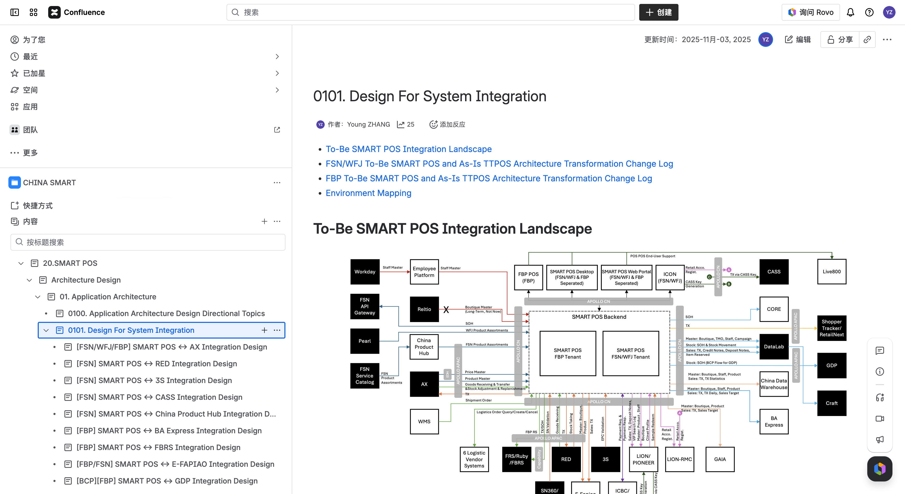

# Integration Landscape — SMART POS System Integration

> Parent page overview for 0101. Design For System Integration in CHINA SMART Confluence space.

## To-Be SMART POS Integration Landscape

The integration landscape diagram (`image2025-2-16_23-44-19.png`) illustrates the complete system integration map for SMART POS, showing all connected systems across FSN (Fashion), WFJ (Watches, Fine Jewelry), and FBP (Fragrance & Beauty Products) divisions.

---

## FSN/WFJ Transformation Change Log

Below is the To-Be and As-Is Architecture Comparison for FSN/WFJ divisions:

### New Introductions

| # | System | Description |
|---|--------|-------------|
| 1 | **Pearl** | Provides WFJ Product Assortments via Pearl WFJ Resource API |
| 2 | **TTPOS** | Introduced for parallel run phase, provides quota validation function |
| 3 | **China Product Hub** | Provides FSN/WFJ enhanced product data (Product Image, Chinese Name, etc.) |
| 4 | **WMS** | Provides shipment order info for enhanced receiving function and Receiving BCP solution |
| 5 | **Employee Platform** | Provides required Staff info for daily POS operation |
| 6 | **SN360/P360** | Serial Number validation during goods receiving and selling scenarios |
| 7 | **Fuji Printer Cloud** | Cloud printing capability for different printing scenarios |
| 8 | **LION RMC** | Replaces TTPOS client registration function; SMART POS no longer retains client profile |
| 9 | **Logistic Vendor Systems** | Supports SMART POS logistic related functions |
| 10 | **SMART POS Desktop** | Replaces TTPOS Desktop |
| 11 | **SMART POS Web Portal** | Provides process approval capabilities |

### Architecture Changes

| # | System | Description |
|---|--------|-------------|
| 1 | **CASS** | No longer integrates with POS directly; works with LION for CX related TX data |
| 2 | **AX** | Data flow remains same; introduced APOLLO APAC and APOLLO CN for efficient integration and Parallel Run |
| 3 | **LION CDM/PIONEER** | Extra API to query OneID level profile; security patch upgrade for PII; changes for parallel run |
| 4 | **FRS** | Upgraded integration method from RTT to Capability Platform API |
| 5 | **RED** | Data flow remains same; leveraged APOLLO APAC/CN for stock taking data dispatch |
| 6 | **DataLab** | Data flow no change; upgraded from RTT to proactive sync |
| 7 | **Craft (TM1)** | No longer directly integrated with POS; integrates with DataLab instead |
| 8 | **GDP** | No longer directly integrated with POS; integrates with DataLab instead |
| 9 | **Shopper Tracker/RetailNext** | No longer directly integrated with POS; integrates with DataLab instead |
| 10 | **China Data Warehouse** | No longer gets client profile from TTPOS; security patch for PII |
| 11 | **ICBC** | Online payment and payment status update introduced |
| 12 | **E-Fapiao** | Removed full sales transaction sync; no need to duplicate data |
| 13 | **ICON** | Adding more POS related functions with SMART POS integration |
| 14 | **CES** | Retired; related CASS function fulfilled by ICON |

---

## FBP Transformation Change Log

**Total: 12 + 2 + 3 Systems involved in direct integration**

| # | Type | System | Description |
|---|------|--------|-------------|
| 1 | New Introduced, Direct | **Live800** | FBP POS end user support system |
| 2 | New Introduced, Direct | **WMS** | Shipment order info for enhanced receiving and BCP |
| 3 | New Introduced, Direct, Not In Pilot | **Employee Platform (Workday)** | Staff info for daily POS operation |
| 4 | New Introduced, Direct, 3 in Pilot out of 6 | **Logistic Vendor Systems** | Logistic related function support |
| 5 | Architecture Changed, Direct | **LION/PIONEER** | Extra API for OneID profile query; security patch for PII |
| 6 | New Introduced, Direct | **RMC** | Replaces TTPOS client registration function |
| 7 | New Introduced, Direct, only QR Code For Pilot | **CRM 3.0** | Client info fetching via secured dynamic QR Code |
| 8 | Architecture Changed, Direct | **AX** | Introduced APOLLO APAC/CN for efficient integration and Parallel Run |
| 9 | Architecture Changed, Direct | **FBRS** | Added suggested replenishment order automation route |
| 10 | New Introduced, Direct | **Capability Platform** | SOH and TX flow standardization; supports RS and GDP |
| 11 | Architecture Changed, Indirect | **FBRS** | Upgraded from RTT to Capability Platform API |
| 12 | Architecture Changed, Direct, BCP for Pilot | **GDP** | Direct SOH integration; later via Capability Platform API |
| 13 | Architecture Changed, Direct | **DataLab** | Upgraded from RTT to proactive sync |
| 14 | Architecture Changed, Indirect | **GDP** | TX flow via DataLab |
| 15 | Architecture Changed, Indirect | **CRAFT** | No longer direct POS integration; uses DataLab |
| 16 | Architecture Changed, Indirect | **Shopper Tracker/RetailNext** | No longer direct POS integration; uses DataLab |
| 17 | New Introduced, Direct, 2 for Pilot out of 2 | **ICBC/HSBC** | Online/offline payments integration |
| 18 | Architecture Changed, Direct | **GAIA** | Integrates SMART POS; may add WFJ product receiving data flow (TBD) |
| 19 | Architecture Changed, Direct | **E-Fapiao** | Removed full sales transaction sync |
| 20 | Architecture Changed, Direct | **BAExpress** | Integrates SMART POS |
| 21 | New Introduced | **FBP POS** | Mobile App frontend replacing MPOS |
| 22 | New Introduced | **SMART POS Desktop** | Replaces TTPOS Desktop |
| 23 | New Introduced | **SMART POS Web Portal** | Process approval capabilities |

---

## Environment Mapping

Reference link: [0103. System Environment Mapping](https://jiranium-apac-japan.atlassian.net/wiki/spaces/CS/pages/185205965/0103.+System+Environment+Mapping)

---

## References

1. [0101. Design For System Integration](https://jiranium-apac-japan.atlassian.net/wiki/spaces/CS/pages/185204980/0101.+Design+For+System+Integration) — Accessed 2026-04-13
2. [0103. System Environment Mapping](https://jiranium-apac-japan.atlassian.net/wiki/spaces/CS/pages/185205965/0103.+System+Environment+Mapping) — Referenced
