# Idea Summary

> Idea ID: IDEA-007
> Folder: 007. Feature-Business Workflow Tracking
> Version: v2
> Created: 2026-01-31
> Status: Refined

## Overview

**Application Action Tracing System** - A comprehensive tracing framework to increase code transparency by automatically logging function calls, API requests, and execution flows with structured log files. This applies to both X-IPE internals and projects generated using X-IPE.

## Problem Statement

As applications grow in complexity, understanding execution flow becomes challenging:
- Debugging requires manually adding log statements
- No standardized way to trace function calls across the codebase
- Errors lack context about what led to the failure
- Code reviews cannot easily verify logging coverage
- Different developers implement logging inconsistently

## Target Users

| User Type | Need |
|-----------|------|
| **Developers** | Debug issues faster with complete execution traces |
| **Code Reviewers** | Verify tracing coverage as part of quality checks |
| **QA Engineers** | Understand application behavior during testing |
| **Operations** | Diagnose production issues with detailed logs |
| **AI Agents (X-IPE skills)** | Auto-generate and validate tracing code |

## Proposed Solution

A 3-phase implementation of Application Action Tracing:


## Key Features

### Feature 1: Tracing Utility (Python & TypeScript)

Decorator-based tracing with automatic parameter/return capture using **`@x_ipe_tracing`** decorator:

```python
# Python Example
from x_ipe.tracing import x_ipe_tracing

@x_ipe_tracing(level="INFO")
def process_order(order_id: str, items: list) -> dict:
    # Function automatically logged with:
    # - Entry: function name, parameters
    # - Exit: return value, execution time
    # - Errors: exception details
    pass
```

```typescript
// TypeScript Example
import { xIpeTracing } from '@x-ipe/tracing';

@xIpeTracing({ level: "INFO" })
async function processOrder(orderId: string, items: Item[]): Promise<Order> {
    // Same automatic tracing
}
```

### Feature 2: Tracing Principle & Guidelines

Consistent tracing across the codebase with clear rules:

| Level | What to Trace | Example |
|-------|---------------|---------|
| **INFO** | API entry points | `@app.route('/api/orders')` |
| **INFO** | Key business functions | `process_payment()`, `send_notification()` |
| **DEBUG** | Supporting/helper functions | `validate_input()`, `format_response()` |
| **SKIP** | Utility functions | `to_json()`, `get_timestamp()` |

**Tracing Principle:**
> "Trace the **what** and **why**, not the **how**. Every API endpoint MUST be traced. Business logic functions SHOULD be traced. Utility functions MAY be traced at DEBUG level."

### Feature 3: Log Storage & Format

**Storage Strategy:** In-memory buffer → flush to file on request completion

**Log File Pattern:**
- Normal: `{timestamp}-{root-api-name}-{tracing-id}.log`
- Error: `{timestamp}-{root-api-name}-{tracing-id}.error.log`

**Trace ID:** UUID per request (guaranteed unique)

**Log Format Example:**
```
[TRACE-START] 550e8400-e29b-41d4-a716-446655440000 | POST /api/orders | Create new order | {"customer_id": "C001", "items": [...]}
  [INFO] → start_function: validate_order | Validate order data | {"order_data": {...}}
  [DEBUG] → start_function: check_inventory | Check stock levels | {"item_ids": ["I1", "I2"]}
  [DEBUG] ← return_function: check_inventory | {"available": true} | 12ms
  [INFO] ← return_function: validate_order | {"valid": true} | 45ms
  [INFO] → start_function: process_payment | Process payment | {"amount": 99.99}
  [INFO] ← return_function: process_payment | {"status": "success"} | 230ms
[TRACE-END] 550e8400-e29b-41d4-a716-446655440000 | 287ms | SUCCESS
```

### Feature 4: Sensitive Data Redaction

Automatic redaction of common sensitive patterns:

| Pattern | Example Before | Example After |
|---------|---------------|---------------|
| Password | `password: "secret123"` | `password: "[REDACTED]"` |
| API Key | `api_key: "sk_live_xxx"` | `api_key: "[REDACTED]"` |
| Email | `email: "user@example.com"` | `email: "[EMAIL]"` |
| Credit Card | `card: "4111111111111111"` | `card: "[CARD]"` |
| Token | `token: "eyJhbGc..."` | `token: "[TOKEN]"` |

### Feature 5: Application Action Tracing UI

```mermaid
flowchart TD
    subgraph Header["Top Controls"]
        Toggle[Tracing Toggle<br/>Off/Console/File]
        Config[Config Panel<br/>Retention, Filters, Search]
        Ignored[Ignored APIs<br/>Manage List]
    end
    
    subgraph MainView["Split View Layout"]
        Sidebar[Left Sidebar<br/>Log File List<br/>🟢 Success<br/>⚫ Processing<br/>🔴 Error]
        Detail[Right Panel<br/>APM-Style Flow Diagram]
    end
    
    Header --> MainView
```



**UI Components:**
1. **Tracing Toggle:** 3-state toggle (Off/Console/File) → updates `.env`
2. **Config Panel:** Retention hours, log level filter, search
3. **Ignored APIs Button:** Modal to manage `ignored-tracing-apis.json`
4. **Left Sidebar:** Log files with status indicators (last X hours)
5. **Right Panel:** APM-style trace flow diagram (see Feature 5a)

### Feature 5a: APM-Style Trace Flow Diagram

When clicking a trace log in the sidebar, the right panel displays an **APM-style flow diagram** similar to tools like Datadog, New Relic, or Jaeger:

```
┌─────────────────────────────────────────────────────────────────────────────┐
│ POST /api/orders                                                    287ms   │
│ ┌─────────────────────────────────────────────────────────────────────────┐ │
│ │                                                                         │ │
│ │  ┌──────────────────┐      ┌──────────────────┐      ┌───────────────┐  │ │
│ │  │ 🟢 validate_order │ ──▶ │ 🟢 process_payment│ ──▶ │ 🟢 send_email │  │ │
│ │  │ 📥 📤    45ms    │      │ 📥 📤    230ms   │      │ 📥 📤   12ms  │  │ │
│ │  └────────┬─────────┘      └──────────────────┘      └───────────────┘  │ │
│ │           │                                                             │ │
│ │           ▼                                                             │ │
│ │  ┌──────────────────┐                                                   │ │
│ │  │ 🟢 check_inventory│                                                  │ │
│ │  │ 📥 📤    12ms    │                                                   │ │
│ │  └──────────────────┘                                                   │ │
│ │                                                                         │ │
│ └─────────────────────────────────────────────────────────────────────────┘ │
└─────────────────────────────────────────────────────────────────────────────┘
```

**Diagram Elements:**

| Element | Description |
|---------|-------------|
| **API Box** | Large container representing the root API call |
| **Function Nodes** | Rectangle boxes inside the API box representing traced functions |
| **DAG Arrows** | Directed edges showing call sequence and nesting |
| **Color Coding** | 🟢 Green = success, 🔴 Red = error (from .error.log) |
| **📥 Input Icon** | Expandable to show function input parameters |
| **📤 Output Icon** | Expandable to show function return value |
| **Execution Time** | Displayed on each node |

**Interactions:**

| Action | Result |
|--------|--------|
| **Hover node** | Show quick summary (name, time, status) |
| **Click 📥** | Expand panel showing input parameters (JSON formatted) |
| **Click 📤** | Expand panel showing return value (JSON formatted) |
| **Click node** | Open detail modal with full info (params, return, timing, stack) |
| **Zoom/Pan** | Navigate large traces with many nodes |
| **Filter** | Show/hide DEBUG level nodes |

**Error Visualization:**

When a function has an entry in the `.error.log`:
- Node border turns **red**
- Error icon (⚠️) appears on node
- Clicking shows exception details with stack trace
- Parent nodes show **yellow** border (error in child)

### Feature 5b: Smart Layout Strategy

To efficiently use space in the detail view, the diagram uses a **smart layout algorithm**:

**Layout Rules:**
1. **Key functions flow left-to-right** (main execution path)
2. **Supporting/nested functions positioned above or below** their parent
3. **Long chains can "turn"** (serpentine/switchback layout) when hitting view boundaries
4. **Automatic space optimization** based on available viewport

```
┌─────────────────────────────────────────────────────────────────────────────┐
│ POST /api/process-complex-order                                     1.2s    │
│ ┌─────────────────────────────────────────────────────────────────────────┐ │
│ │                                                                         │ │
│ │                    ┌────────────────┐                                   │ │
│ │                    │ check_inventory│ (supporting - above)              │ │
│ │                    └───────┬────────┘                                   │ │
│ │                            │                                            │ │
│ │  ┌─────────────┐   ┌──────┴───────┐   ┌─────────────┐   ┌────────────┐  │ │
│ │  │validate_order│──▶│ process_items │──▶│calc_shipping│──▶│apply_tax   │  │ │
│ │  └─────────────┘   └──────┬───────┘   └─────────────┘   └─────┬──────┘  │ │
│ │                           │                                    │        │ │
│ │                    ┌──────┴───────┐                            │        │ │
│ │                    │ update_stock │ (supporting - below)       │        │ │
│ │                    └──────────────┘                            │        │ │
│ │                                                                │        │ │
│ │  ┌─────────────────────────────────────────────────────────────┘        │ │
│ │  │  (turn - serpentine layout for long chains)                          │ │
│ │  ▼                                                                      │ │
│ │  ┌────────────┐   ┌─────────────┐   ┌─────────────┐                     │ │
│ │  │charge_card │◀──│create_invoice│◀──│send_confirm │                    │ │
│ │  └────────────┘   └─────────────┘   └─────────────┘                     │ │
│ │                                                                         │ │
│ └─────────────────────────────────────────────────────────────────────────┘ │
└─────────────────────────────────────────────────────────────────────────────┘
```

**Layout Algorithm (ELK-based):**

| Strategy | Description |
|----------|-------------|
| **Layered Layout** | Main flow arranged in horizontal layers (left-to-right) |
| **Hierarchical Nesting** | Supporting functions placed above/below parent |
| **Serpentine Turns** | When width exceeds viewport, flow turns back (right-to-left on next row) |
| **Compact Mode** | DEBUG-level nodes collapsed by default, expandable on demand |
| **Auto-Fit** | Initial zoom level fits entire trace in viewport |

### Feature 5c: Implementation Technology

Based on research of available JavaScript graph visualization libraries:

| Library | Pros | Cons | Recommendation |
|---------|------|------|----------------|
| **ELK.js** | Best layered layout, port support, direction control | Layout only (no rendering) | ✅ **Use for layout calculation** |
| **Dagre** | Simple API, good for DAGs | Less flexible than ELK | Alternative to ELK |
| **Cytoscape.js** | Full-featured, styling, events, analysis | Heavier, complex API | Consider for complex needs |
| **React Flow** | Great for React apps, interactive | Requires React | If using React |
| **D3.js** | Maximum flexibility | More code to write | For custom rendering |

**Recommended Architecture:**


**Implementation Stack:**
1. **Layout Engine:** `elkjs` - Eclipse Layout Kernel for JavaScript
   - Layered algorithm perfect for call flows
   - Supports hierarchical nesting (compound nodes)
   - Handles direction changes (left-to-right, right-to-left)
   
2. **Rendering:** Native SVG with D3.js for DOM manipulation
   - Lightweight (no heavy framework needed)
   - Full control over styling and interactions
   - X-IPE already uses similar patterns
   
3. **Interactions:** Vanilla JS event handlers
   - Click to expand/collapse
   - Hover for tooltips
   - Pan/zoom with mouse/touch

**ELK Layout Options for Trace Visualization:**

```javascript
const elkOptions = {
  'elk.algorithm': 'layered',
  'elk.direction': 'RIGHT',           // Main flow direction
  'elk.layered.spacing.nodeNodeBetweenLayers': 50,
  'elk.layered.spacing.edgeNodeBetweenLayers': 20,
  'elk.hierarchyHandling': 'INCLUDE_CHILDREN',  // For nested functions
  'elk.layered.nodePlacement.strategy': 'NETWORK_SIMPLEX',
  'elk.layered.wrapping.strategy': 'MULTI_EDGE',  // Enable serpentine turns
  'elk.layered.wrapping.additionalEdgeSpacing': 20
};
```

**Key Implementation Considerations:**

| Consideration | Solution |
|---------------|----------|
| Large traces (100+ nodes) | Virtual scrolling, collapse DEBUG nodes by default |
| Performance | Use Web Workers for ELK layout calculation |
| Responsive | Recalculate layout on viewport resize |
| Accessibility | ARIA labels on nodes, keyboard navigation |
| Export | SVG export for documentation/sharing |

### Feature 6: Skill Integration

**New Skill: `code-tracing-creator`**
- Creates tracing utility for the target language
- Generates decorator templates
- Sets up log output configuration

**Updated Skills:**

| Skill | Enhancement |
|-------|-------------|
| `task-type-code-implementation` | DoR: Check if tracing utility exists (create if not). DoD: All code has `@x_ipe_tracing` decorators |
| `task-type-test-generation` | Include tracing assertions in each unit test |
| `task-type-code-refactor-v2` | Preserve/add tracing during refactoring |
| `task-type-refactoring-analysis` | Check tracing coverage as quality dimension |
| `project-quality-board-management` | Report tracing gaps in quality reports |

### Feature 7: Quality Enforcement

**Enforcement Level:** Warning in quality report (non-blocking)

Quality reports will include a new section:

```markdown
## Tracing Coverage

| Category | Total | Traced | Coverage |
|----------|-------|--------|----------|
| API Endpoints | 15 | 14 | 93% |
| Business Functions | 42 | 38 | 90% |
| Overall | 57 | 52 | 91% |

### Missing Tracing
⚠️ `src/services/legacy.py:process_old_order()` - Missing @x_ipe_tracing decorator
⚠️ `src/routes/admin.py:/api/admin/reset` - API endpoint not traced
```

## Success Criteria

- [ ] Tracing utility works for Python and TypeScript
- [ ] Decorator-based API is intuitive and minimal boilerplate
- [ ] Log files are human-readable and parseable
- [ ] Sensitive data is automatically redacted
- [ ] UI provides clear visibility into execution flows
- [ ] APM-style flow diagram renders correctly with ELK.js layout
- [ ] Smart layout handles large traces with serpentine turns
- [ ] Supporting functions positioned above/below main flow
- [ ] Skills automatically generate and validate tracing code
- [ ] Quality reports include tracing coverage metrics
- [ ] Execution time is captured per function
- [ ] Error logs provide sufficient context for debugging

## Constraints & Considerations

| Constraint | Mitigation |
|------------|------------|
| Performance overhead | In-memory buffer, flush on completion |
| Log file size | Configurable retention, auto-cleanup |
| PII exposure | Automatic sensitive pattern redaction |
| Adoption resistance | Non-blocking warnings, gradual rollout |
| Language differences | Unified API design, language-specific implementations |

## Brainstorming Notes

**Key Decisions Made:**
1. **Granularity:** API entry points + key business functions (with clear guidelines)
2. **Storage:** In-memory buffer → file flush (performance optimized)
3. **Trace ID:** UUID for guaranteed uniqueness
4. **Languages:** Python + TypeScript from day 1
5. **Error handling:** Separate `.error.log` files
6. **Retention:** Configurable via `.env`
7. **API Design:** Decorators for both Python and TypeScript
8. **Quality:** Warning-level enforcement (non-blocking)
9. **Log levels:** INFO for API/business, DEBUG for helpers
10. **Sensitive data:** Auto-redact common patterns
11. **Test strategy:** Tracing assertions within each unit test
12. **UI layout:** Split view (sidebar + detail panel)
13. **Config:** Full panel with retention, filters, search
14. **Ignored APIs:** UI-managed with JSON backend
15. **Scope:** X-IPE internals + generated projects
16. **Performance:** Execution time per function
17. **Phases:** Core → UI → Skill integration

**Alignment with OpenTelemetry Concepts:**
- Trace ID = OpenTelemetry trace_id
- Function entries = Spans with parent_id hierarchy
- Error logs = Span events with error status
- Execution time = Span start_time/end_time

## Mockups & Prototypes

| Mockup | Version | Path | Tool Used |
|--------|---------|------|-----------|
| Tracing Dashboard | v4 (current) | [mockups/tracing-dashboard-v4.html](mockups/tracing-dashboard-v4.html) | G6 by AntV (canvas) |
| Tracing Dashboard | v3 (archived) | [mockups/tracing-dashboard-v3.html](mockups/tracing-dashboard-v3.html) | G6 by AntV (canvas) |
| Tracing Dashboard | v2 (archived) | [mockups/tracing-dashboard-v2.html](mockups/tracing-dashboard-v2.html) | G6 by AntV (canvas) |
| Tracing Dashboard | v1 (archived) | [mockups/tracing-dashboard-v1.html](mockups/tracing-dashboard-v1.html) | Pure HTML/CSS |
| Error Trace Detail | v1 | [mockups/error-trace-detail-v1.html](mockups/error-trace-detail-v1.html) | Pure HTML/CSS |

### Mockup Descriptions

**1. Tracing Dashboard v4 (tracing-dashboard-v4.html) - CURRENT**
- ✅ **Light theme** - Clean, professional appearance
- ✅ **Simplified header** - Config and ignored APIs buttons only
- ✅ **Duration-based tracing toggle** - 3min, 15min, or 30min buttons (instead of Off/Console/File)
- ✅ **Live countdown timer** - Shows remaining time (e.g., "12:34 remaining")
  - Green when active
  - Yellow/warning when < 1 minute remaining
  - Gray when inactive
- ✅ **Stop button** - Immediately stops tracing
- ✅ **Persistent config via tools.json** - Stores `tracing_stop_at` timestamp
  - On page reload: fetches config, resumes countdown if now < tracing_stop_at
- ✅ **Trace ID level sidebar** - Each entry represents a unique trace ID
- ✅ **Compact nodes** - Smaller function nodes for dense traces
- ✅ **Click-to-open modal** - 4-section modal (name+latency, input, output, errors)
- ✅ **Canvas-based DAG** - G6 by AntV with zoom/pan

**Tracing Duration Behavior:**

| User Action | Result |
|-------------|--------|
| Click "3 min" | Sets `tracing_stop_at` = now + 3 minutes in tools.json |
| Click "15 min" | Sets `tracing_stop_at` = now + 15 minutes in tools.json |
| Click "30 min" | Sets `tracing_stop_at` = now + 30 minutes in tools.json |
| Click "Stop" | Sets `tracing_stop_at` = null in tools.json |
| Page reload | Reads `tracing_stop_at` from tools.json, resumes countdown if valid |
| Countdown reaches 0 | Automatically stops tracing, clears `tracing_stop_at` |

**tools.json schema addition:**
```json
{
  "tracing_stop_at": "2026-02-01T03:30:00.000Z"  // ISO timestamp or null
}
```

**Modal Features:**
- Large enough to display errors clearly
- Scrollable input/output sections for long JSON
- Syntax-highlighted JSON (keys, strings, numbers, booleans)
- Full stack trace with file/line references

**2. Error Trace Detail (error-trace-detail-v1.html)**
- Focused view showing error visualization
- Error panel with exception details and stack trace
- Sensitive data redaction display ([CARD] placeholder)
- Skipped function visualization (grayed out nodes after error)

### Technology Choice: G6 by AntV

| Feature | G6 Capability |
|---------|---------------|
| Rendering | Canvas (hardware accelerated) |
| Zoom/Pan | Built-in with smooth animation |
| Layout | Dagre DAG layout algorithm |
| Arrows | Native canvas arrows (smooth) |
| Tooltips | Built-in tooltip plugin |
| Performance | Handles 1000+ nodes efficiently |
| Customization | Full custom node/edge shapes |

### Preview Instructions
- Open `tracing-dashboard-v4.html` in browser
- **Click** a duration button (3 min, 15 min, 30 min) to start tracing with countdown
- Watch the countdown timer update in real-time
- **Click "Stop"** to stop tracing early
- **Refresh the page** - countdown resumes from stored config
- **Scroll** on diagram to zoom in/out
- **Drag** on diagram to pan
- **Click** any node to open the modal

### Design Aesthetic
- **Theme:** Light professional (clean, modern)
- **Typography:** JetBrains Mono for code, Inter for UI
- **Colors:** White/gray backgrounds with vibrant status accents (green/red/blue)
- **Inspiration:** Modern developer tools (GitHub, Linear, Vercel)

## Ideation Artifacts

_See Mockups & Prototypes section above._

## Source Files

- `new idea.md` - Original idea description

## Next Steps

- [x] ~~Proceed to **Idea Mockup** (create UI mockups for Action Tracing View)~~ ✅ Completed
- [ ] Proceed to **Requirement Gathering** (transform idea into formal requirements)

## References & Common Principles

### Applied Principles

- **OpenTelemetry Tracing Concepts:** Traces, Spans, Context Propagation - [OpenTelemetry Docs](https://opentelemetry.io/docs/concepts/signals/traces/)
- **Structured Logging:** Consistent log format with JSON-serializable data
- **Decorator Pattern:** Non-invasive instrumentation via Python/TS decorators
- **Separation of Concerns:** Trace logs vs error logs for different consumers

### Further Reading

- [OpenTelemetry Traces Documentation](https://opentelemetry.io/docs/concepts/signals/traces/) - Core tracing concepts
- [Python Decorators](https://docs.python.org/3/glossary.html#term-decorator) - Python decorator syntax
- [TypeScript Decorators](https://www.typescriptlang.org/docs/handbook/decorators.html) - TS decorator support
- [ELK.js - Eclipse Layout Kernel](https://github.com/kieler/elkjs) - Layered graph layout for JavaScript
- [Dagre - DAG Layout](https://github.com/dagrejs/dagre/wiki) - Alternative graph layout library
- [Cytoscape.js](https://js.cytoscape.org/) - Full-featured graph visualization library
- [D3-hierarchy](https://d3js.org/d3-hierarchy) - D3 module for hierarchical data visualization
