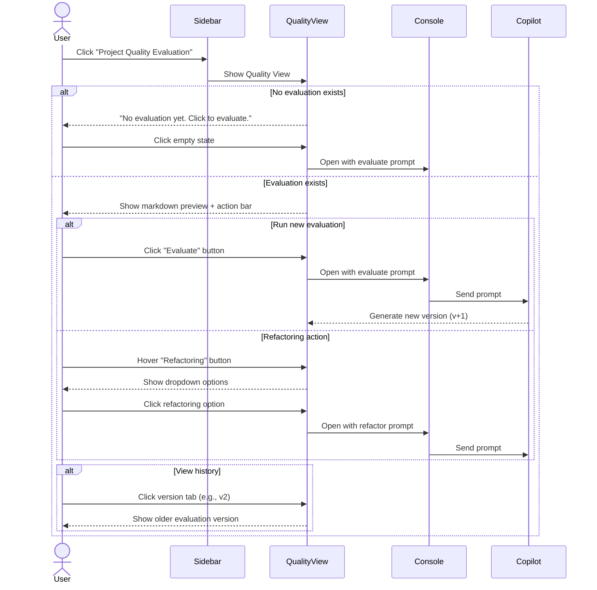

# Idea Summary

> Idea ID: IDEA-009
> Folder: 009. Project Quality Check
> Version: v2
> Created: 2026-02-01
> Status: Refined + Mockup

## Overview

A dedicated **Project Quality Evaluation** feature in the Workplace UI that provides formal support for code quality assessment and refactoring actions. This moves quality evaluation from an informal planning artifact to a first-class UI feature with action bar controls, version history, and configurable Copilot prompts.

## Problem Statement

Currently, project quality evaluation is stored informally in the `x-ipe-docs/planning/` folder as `project-quality-evaluation.md`. There's no dedicated UI to:
1. Trigger quality evaluations via Copilot
2. View evaluation results in a styled format
3. Execute refactoring actions based on identified gaps
4. Track evaluation history over time

## Target Users

- Developers using X-IPE to manage their projects
- Teams wanting to track code quality over time
- Anyone using the refactoring workflow

## Proposed Solution

Create a new **"Project Quality Evaluation"** submenu under **Workplace** in the sidebar with:

1. **Dedicated content view** showing the evaluation markdown
2. **Action bar** with Evaluate and Refactoring controls
3. **Version timeline** for comparing last 5 evaluations
4. **Dynamic prompts** from `copilot-prompt.json` config

## Key Features

```mermaid
flowchart TB
    subgraph Sidebar["Sidebar - Workplace"]
        QE[📊 Project Quality Evaluation]
    end
    
    subgraph ContentView["Content View"]
        ActionBar["Action Bar"]
        Timeline["Version Timeline (tabs)"]
        Preview["Markdown Preview"]
    end
    
    subgraph ActionBar
        RefactorBtn["Refactoring ▼"]
        EvalBtn["Evaluate"]
    end
    
    subgraph RefactorDropdown["Refactoring Dropdown"]
        R1["Refactor All"]
        R2["Refactor Requirements"]
        R3["Refactor Features"]
        R4["Refactor Tests"]
        R5["Refactor Tracing Decorators + Tests"]
        R6["Refactor Code + Tests"]
    end
    
    QE --> ContentView
    RefactorBtn -.hover.-> RefactorDropdown
    EvalBtn -->|click| Console["Console Prompt"]
    R1 -->|click| Console
```



### Feature 1: Quality Evaluation Submenu
- New submenu item under "Workplace" section
- Always visible (even when no evaluation exists)
- Shows empty state: "No evaluation yet. Click to evaluate."

### Feature 2: Quality Evaluation View
- Renders `project-quality-evaluation.md` as styled markdown preview (readonly)
- Consistent with other markdown preview views in X-IPE
- Location: `x-ipe-docs/quality-evaluation/project-quality-evaluation.md`

### Feature 3: Action Bar
- **Layout:** `[Refactoring ▼]` on left, `[Evaluate]` on right
- **Evaluate button:** Opens console with evaluation prompt
- **Refactoring button:** Dropdown-only (no action on click)
  - Options loaded dynamically from `copilot-prompt.json`
  - Each option opens console with configured prompt

### Feature 4: Version Timeline
- Mini-history as clickable tabs
- Shows last 5 evaluations (e.g., v1, v2, v3, v4, v5)
- Quick switching between versions for comparison
- Versioned files: `project-quality-evaluation-v1.md`, `v2.md`, etc.

### Feature 5: Configurable Prompts

Extend `copilot-prompt.json` with top-level sections:

```json
{
  "version": "2.0",
  "ideation": {
    "prompts": [
      {
        "id": "generate-architecture",
        "label": "Generate Architecture",
        "icon": "bi-diagram-3",
        "command": "Base on <current-idea-file> to generate layered architecture"
      },
      {
        "id": "generate-mockup",
        "label": "Generate Mockup",
        "icon": "bi-palette",
        "command": "Base on <current-idea-file> to generate mockups"
      },
      {
        "id": "free-question",
        "label": "Free Collaboration",
        "icon": "bi-chat-dots",
        "command": "Let's base on <current-idea-file> to collaborate, wait for my instructions."
      }
    ]
  },
  "evaluation": {
    "evaluate": {
      "label": "Evaluate Project Quality",
      "icon": "bi-clipboard-check",
      "command": "Evaluate project quality and generate report to <evaluation-file>"
    },
    "refactoring": [
      {
        "id": "refactor-all",
        "label": "Refactor All",
        "icon": "bi-arrow-repeat",
        "command": "Refactor all gaps identified in <evaluation-file> with reference to its code"
      },
      {
        "id": "refactor-requirements",
        "label": "Refactor Requirements",
        "icon": "bi-file-text",
        "command": "Refactor requirement gaps identified in <evaluation-file> with reference to its code"
      },
      {
        "id": "refactor-features",
        "label": "Refactor Features",
        "icon": "bi-puzzle",
        "command": "Refactor feature gaps identified in <evaluation-file> with reference to its code"
      },
      {
        "id": "refactor-tests",
        "label": "Refactor Tests",
        "icon": "bi-check2-square",
        "command": "Refactor test gaps identified in <evaluation-file> with reference to its code"
      },
      {
        "id": "refactor-tracing-tests",
        "label": "Refactor Tracing Decorators + Tests",
        "icon": "bi-graph-up",
        "command": "Refactor tracing decorator gaps identified in <evaluation-file> with reference to its feature"
      },
      {
        "id": "refactor-code-tests",
        "label": "Refactor Code + Tests",
        "icon": "bi-code-square",
        "command": "Refactor code gaps identified in <evaluation-file> with reference to its feature"
      }
    ]
  },
  "placeholder": {
    "current-idea-file": "Replaced with currently open idea file path",
    "evaluation-file": "Replaced with current quality evaluation file path"
  }
}
```

## User Flow



## Mockups & Prototypes

| Mockup | Type | Path | Tool Used |
|--------|------|------|-----------|
| Quality Evaluation View | HTML | mockups/quality-evaluation-v1.html | frontend-design |

### Preview Instructions
- Open `mockups/quality-evaluation-v1.html` in browser to view interactive mockup
- Use toggle buttons in top-right to switch between "With Evaluation" and "Empty State" views
- Hover on "Refactoring" dropdown to see options
- Click any action to see console popup simulation

### Mockup Features Demonstrated
1. ✅ Sidebar with "Project Quality Evaluation" item under Workplace
2. ✅ Action bar with Refactoring dropdown (left) and Evaluate button (right)
3. ✅ Version timeline as clickable tabs (v1-v5)
4. ✅ Markdown preview with quality metrics, gaps, and summary table
5. ✅ Empty state with call-to-action button
6. ✅ Console popup simulation when clicking actions

## Success Criteria

- [ ] Quality Evaluation submenu appears under Workplace
- [ ] Empty state shows when no evaluation exists
- [ ] Action bar with Evaluate and Refactoring controls
- [ ] Refactoring dropdown loads options from copilot-prompt.json
- [ ] Clicking options opens console with configured prompt
- [ ] Version timeline shows last 5 evaluations
- [ ] Markdown preview renders styled evaluation
- [ ] copilot-prompt.json supports ideation and evaluation sections

## Constraints & Considerations

1. **Backward Compatibility:** Ideation prompts must continue working after restructuring copilot-prompt.json
2. **Migration:** Move existing evaluation from `planning/` to `quality-evaluation/`
3. **File Naming:** Versioned files use pattern `project-quality-evaluation-vN.md`
4. **Version Limit:** Only keep last 5 versions (auto-cleanup older ones)
5. **Placeholder Resolution:** `<evaluation-file>` resolved at runtime

## Brainstorming Notes

Key decisions from brainstorming:
1. Location: Under Workplace section (not Planning)
2. Config: Extend existing `copilot-prompt.json` with top-level sections
3. View: Readonly markdown preview (consistent with other views)
4. History: Keep last 5 evaluations with tab-based navigation
5. Actions: Refactoring is dropdown-only, Evaluate is direct button
6. Dynamic: Both ideation and evaluation options read from config

## Source Files

- new idea.md

## Next Steps

- [x] Create interactive UI mockup
- [ ] Proceed to Requirement Gathering

## References & Common Principles

### Applied Principles

- **Quality Gate Pattern:** Establish checkpoints for code quality before major changes - common in CI/CD practices
- **Version History:** Keep historical artifacts for comparison and rollback - standard software engineering practice
- **Configuration-Driven UI:** Dynamic UI elements from config files - promotes flexibility without code changes

### Further Reading

- [Microsoft Engineering Playbook - Code Reviews](https://microsoft.github.io/code-with-engineering-playbook/code-reviews/)
- [Microsoft Engineering Playbook - Integration Testing](https://microsoft.github.io/code-with-engineering-playbook/automated-testing/integration-testing/)
