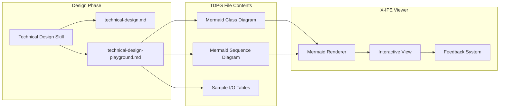
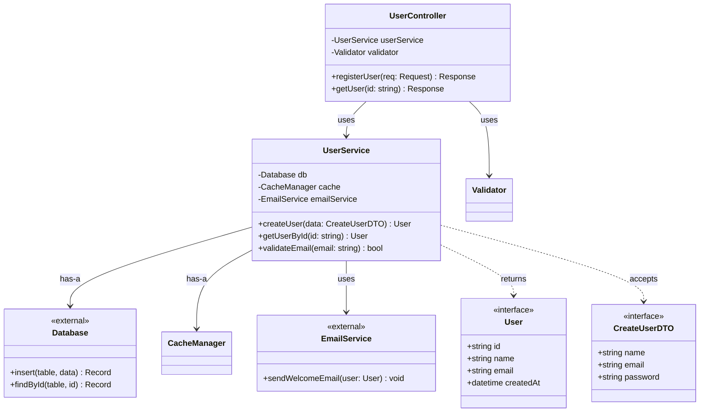
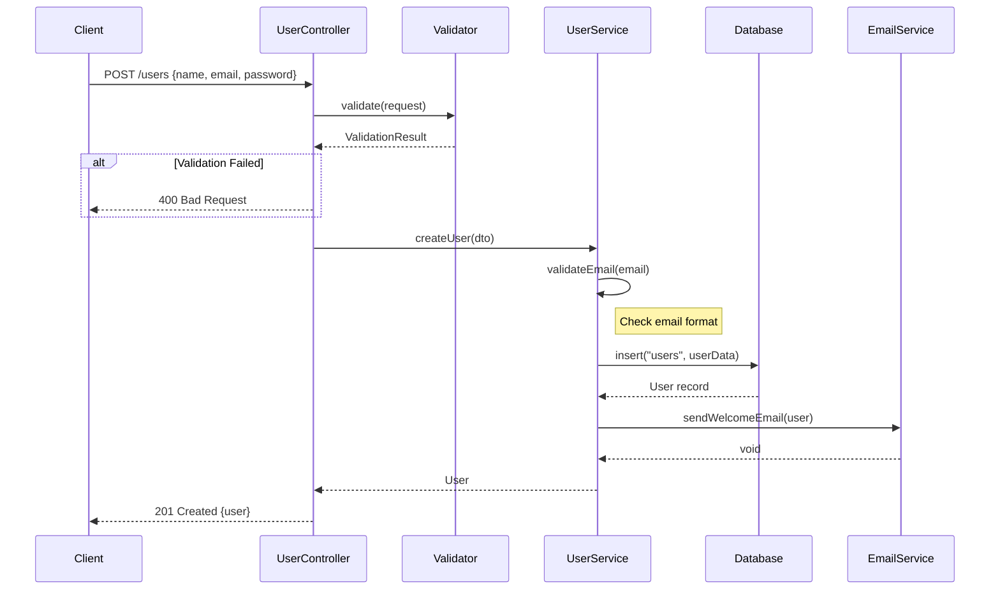
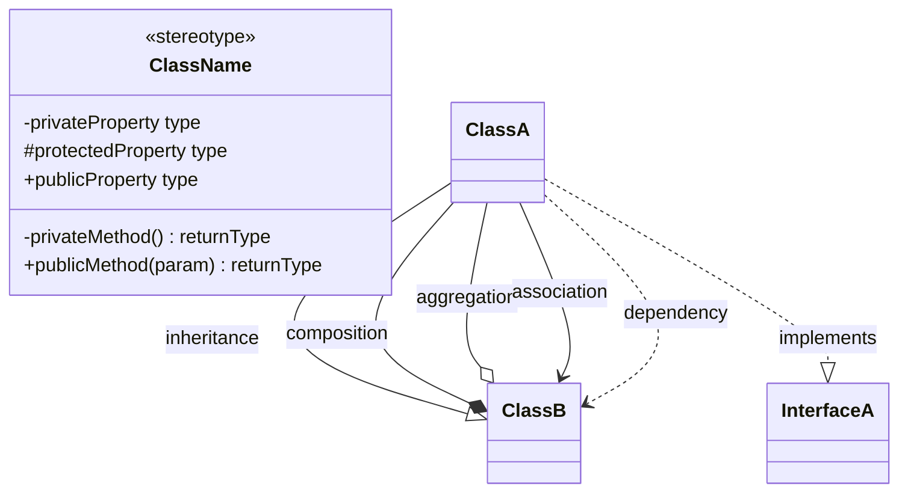
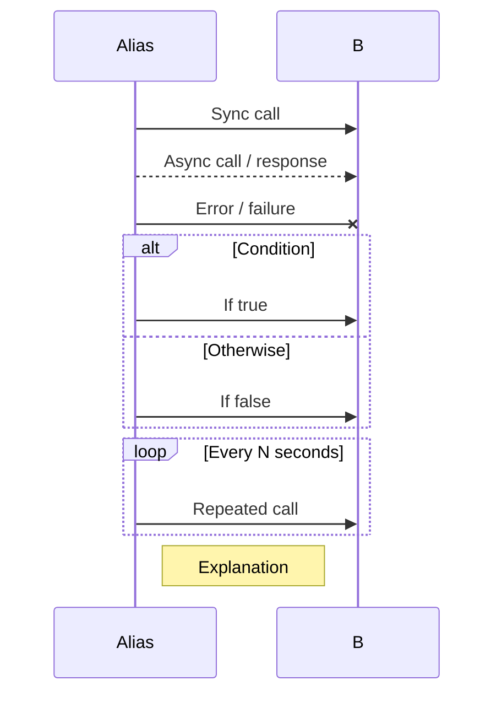
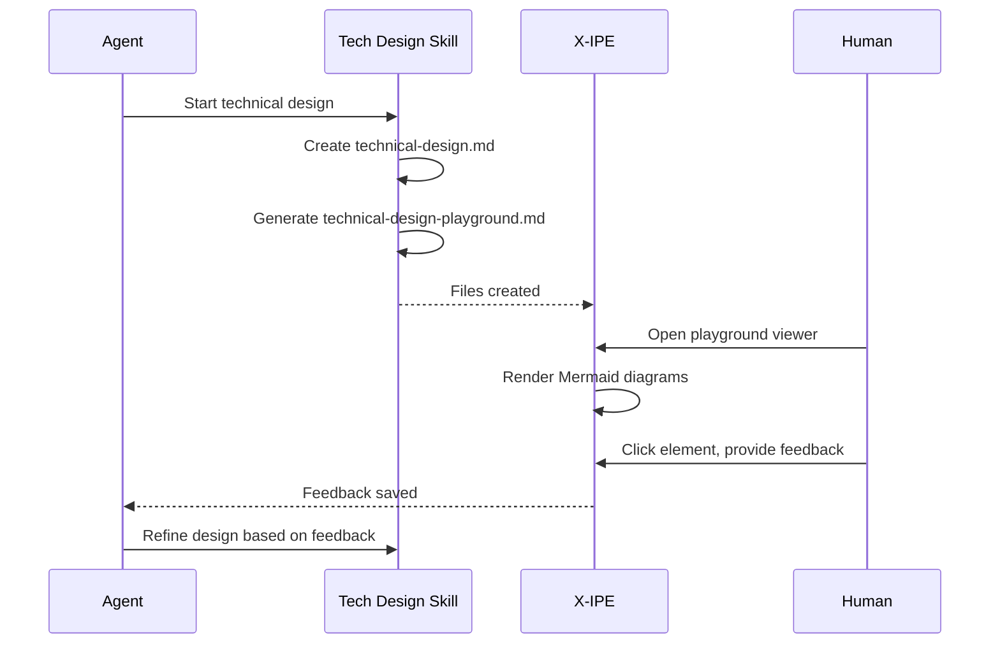

# Idea Summary: Technical Design Playground

**Idea ID:** IDEA-010  
**Version:** v3  
**Status:** Refined + Simplified  
**Date:** 2026-02-03  
**Refined By:** Ember  
**Reviewed By:** Sub-Agent Critical Review  
**Simplified By:** Human feedback - use Mermaid syntax

---

## Executive Summary

The **Technical Design Playground** is a feature that provides visual transparency into the architectural skeleton of a feature before implementation. During the technical design phase, the agent creates a `technical-design-playground.md` file containing:

1. **Mermaid Class Diagram** - Shows classes, interfaces, and their relationships
2. **Mermaid Sequence Diagram** - Shows function calling workflow  
3. **Sample I/O Tables** - Provides concrete input/output examples

X-IPE renders these as interactive diagrams, allowing stakeholders to review the design topology and provide feedback on selected elements.

---

## Problem Statement

Currently, the technical design skill creates a `technical-design.md` document, which describes the implementation plan in prose. While useful, this lacks:

1. **Visual Clarity** - Hard to see the big picture of class/function relationships
2. **Skeleton Preview** - No way to see what classes and functions will be created at a glance
3. **Feedback Mechanism** - No structured way to provide feedback on specific design elements
4. **Design-to-Implementation Traceability** - No link between planned design and actual runtime traces

---

## Proposed Solution

**Simplified Approach:** Use native Mermaid syntax with two diagram types:

1. **Class Diagram** - For class/interface/type definitions and their relationships
2. **Sequence Diagram** - For function calling workflow and data flow



**Benefits of Mermaid Approach:**
- ✅ No custom parser needed - Mermaid.js already in codebase
- ✅ Well-documented, widely adopted syntax
- ✅ Supports both class diagrams and sequence diagrams
- ✅ Easy for agents to generate
- ✅ Human-readable source format

---

## Core Components

### 1. Technical Design Playground File (`.md` format)

A markdown file containing Mermaid diagrams and sample I/O tables:

**File Location:** `x-ipe-docs/requirements/FEATURE-XXX/technical-design-playground.md`

**Structure:**
```markdown
# Technical Design Playground: FEATURE-XXX

## Class Diagram
[Mermaid classDiagram - shows classes, interfaces, relationships]

## Workflow Diagram  
[Mermaid sequenceDiagram - shows function call flow]

## Sample I/O
[Tables with input/output examples for each method]
```

---

## Example: User Registration Feature

### Class Diagram

Shows the **structural skeleton** - what classes exist and how they relate:



### Workflow Diagram

Shows the **behavioral flow** - how functions call each other:



### Sample I/O Tables

Provides concrete examples for each method:

#### UserController.registerUser

| Scenario | Input | Output |
|----------|-------|--------|
| Success | `{ "name": "Jane Doe", "email": "jane@example.com", "password": "secure123" }` | `{ "status": 201, "body": { "id": "usr_abc123", "name": "Jane Doe", "email": "jane@example.com" } }` |
| Invalid Email | `{ "name": "Jane", "email": "invalid", "password": "123" }` | `{ "status": 400, "error": "Invalid email format" }` |
| Duplicate Email | `{ "name": "Jane", "email": "existing@example.com", "password": "secure" }` | `{ "status": 409, "error": "Email already registered" }` |

#### UserService.createUser

| Scenario | Input | Output |
|----------|-------|--------|
| Success | `CreateUserDTO { name: "Jane", email: "jane@example.com", password: "..." }` | `User { id: "usr_abc123", name: "Jane", email: "jane@example.com", createdAt: "2026-02-03T10:00:00Z" }` |
| DB Error | `CreateUserDTO { ... }` | `throws DatabaseException("Connection failed")` |

#### UserService.validateEmail

| Input | Output | Notes |
|-------|--------|-------|
| `"jane@example.com"` | `true` | Valid format |
| `"jane@"` | `false` | Missing domain |
| `"@example.com"` | `false` | Missing local part |
| `""` | `false` | Empty string |

### 2. X-IPE Playground Viewer

Interactive visualization using Mermaid.js (already in codebase):

| Aspect | Description |
|--------|-------------|
| **Rendering** | Use existing Mermaid.js library to render diagrams |
| **Layout** | Two-panel view: Class Diagram (left) + Sequence Diagram (right) |
| **Interaction** | Click on class/method → highlight in both diagrams |
| **Zoom/Pan** | Built-in Mermaid zoom + pan support |
| **Feedback** | Click element → open feedback form |

### 3. Feedback System

Click on diagram elements to provide structured feedback:

| Feature | Description |
|---------|-------------|
| **Selection** | Click on class, method, or sequence step |
| **Feedback Form** | Text area + category dropdown (Design, Naming, Flow, Sample I/O) |
| **Storage** | `x-ipe-docs/requirements/FEATURE-XXX/td-feedback/Feedback-{timestamp}/` |
| **Screenshot** | Auto-capture diagram with selected element highlighted |

**Feedback File Format:**
```markdown
# Technical Design Feedback

**ID:** Feedback-20260203-114700
**Feature:** FEATURE-XXX
**Date:** 2026-02-03 11:47:00
**Category:** Flow

## Selected Element

- Diagram: Sequence Diagram
- Element: `UserService.createUser -> EmailService.sendWelcomeEmail`

## Feedback

Consider making email sending async/non-blocking. 
Current flow blocks the response until email is sent.
Suggest using a message queue for better reliability.

## Screenshot


```

---

## Diagram Types and When to Use

| Diagram Type | Mermaid Syntax | Purpose | Shows |
|--------------|----------------|---------|-------|
| **Class Diagram** | `classDiagram` | Structural skeleton | Classes, interfaces, properties, methods, relationships |
| **Sequence Diagram** | `sequenceDiagram` | Behavioral flow | Function calls, data flow, conditionals, loops |

### Class Diagram Elements



| Stereotype | Usage |
|------------|-------|
| `<<interface>>` | Interface/type definition |
| `<<abstract>>` | Abstract class |
| `<<external>>` | External dependency (DB, API, etc.) |
| `<<service>>` | Service class |
| `<<controller>>` | Controller/handler |

### Sequence Diagram Elements



---

## Workflow Integration



### Phase 1: Design Review (MVP)
1. Agent creates `technical-design-playground.md` with Mermaid diagrams during technical design
2. Human opens playground viewer in X-IPE
3. Human reviews class diagram + sequence diagram, provides feedback
4. Agent refines design based on feedback

### Phase 2: Implementation Comparison (Future)
1. After code implementation, compare design vs actual code structure
2. Highlight deviations (planned vs implemented)

### Phase 3: Tracing Integration (Future)
1. Link design nodes to runtime trace nodes
2. Click on design node → see actual runtime behavior
3. Validate that implementation matches design intent

---

## Technical Considerations

### No Custom Parser Needed
- Mermaid.js handles all parsing and rendering
- X-IPE already includes Mermaid in the frontend
- Just need to add interactive overlay for feedback

### Viewer Implementation
- Create `TechnicalDesignPlayground` component
- Parse markdown to extract Mermaid code blocks
- Render diagrams side-by-side
- Add click handlers for feedback

### Feedback Storage
- Store under feature folder: `x-ipe-docs/requirements/FEATURE-XXX/td-feedback/`
- Follow existing feedback pattern with `feedback.md` + screenshot
- Reference elements by diagram type + element name

---

## MVP Scope

| In Scope (MVP) | Out of Scope (Future) |
|---------------|----------------------|
| Mermaid class diagram | Version diff (v1 vs v2) |
| Mermaid sequence diagram | Design vs code comparison |
| Sample I/O tables | Tracing integration |
| Click-to-feedback on elements | Real-time collaboration |
| Screenshot capture | Auto-generate from technical-design.md |
| Feedback storage | Bidirectional sync |
| Two-panel viewer | Complex diagram types (state, ER) |

---

## Comparison: Custom DSL vs Mermaid

| Aspect | Custom DSL (v2) | Mermaid (v3) |
|--------|-----------------|--------------|
| **Parser** | Need to build | Already exists |
| **Learning curve** | New syntax | Widely known |
| **Rendering** | Build G6 component | Use Mermaid.js |
| **Maintenance** | Own the code | Community maintained |
| **Flexibility** | Full control | Mermaid limitations |
| **Sample I/O** | Inline in DSL | Separate tables |
| **Time to MVP** | 2-3 weeks | 1 week |

**Decision:** Use Mermaid for v1. Can always add custom DSL later if needed.

---

## Success Criteria

1. ✅ Agent generates `technical-design-playground.md` alongside `technical-design.md`
2. ✅ X-IPE renders Mermaid class diagram and sequence diagram
3. ✅ Human can click on elements and provide feedback
4. ✅ Feedback is saved in structured format with screenshot
5. ✅ Diagrams clearly show class structure and function call flow

---

## References

- **Mermaid.js Documentation**: https://mermaid.js.org/
- **IEEE 1016-2009**: Software Design Descriptions standard
- **Existing X-IPE Components:**
  - `src/x_ipe/static/js/lib/mermaid.min.js` - Mermaid renderer (already included)
  - `x-ipe-docs/uiux-feedback/` - Feedback storage pattern

---

## Next Steps

| Option | Description | When to Choose |
|--------|-------------|---------------|
| **Idea Mockup** | Create UI mockup of the playground viewer | Focus on UX/visual design first |
| **Idea to Architecture** | Create system architecture for the feature | Focus on technical components first |
| **Requirement Gathering** | Start formal requirements | Simple enough, skip mockup/architecture |
