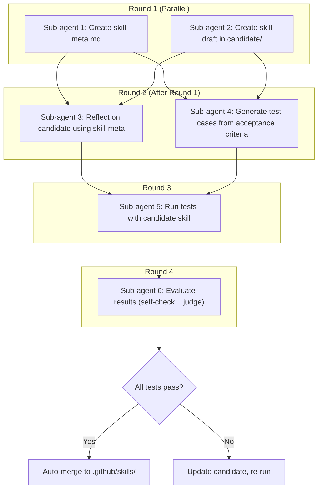
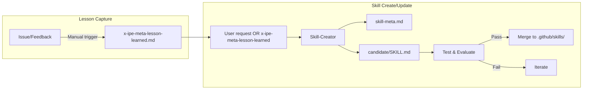

# Idea Summary

> Idea ID: IDEA-011
> Folder: 011. Feature-Skill Meta
> Version: v1
> Created: 2026-02-03
> Status: Refined

## Overview

A **Skill Meta Framework** for managing AI agent skills with formal specifications, automated testing, and continuous improvement through lesson capture. The framework separates skill specification (skill-meta) from implementation (.github/skills/), enabling testable, evolvable skills.

## Problem Statement

Currently, X-IPE skills lack:
1. **Formal specifications** - No standardized way to define skill inputs, outputs, and acceptance criteria
2. **Testing infrastructure** - No way to validate if a skill produces correct output
3. **Continuous improvement** - No mechanism to capture failures and refine skills

## Target Users

- AI Agents executing tasks using skills
- Human operators reviewing and improving skill quality

## Proposed Solution

Create a skill meta framework with three core components:
1. **Skill-Meta files** - YAML specifications with acceptance criteria (MoSCoW)
2. **Testing infrastructure** - Sub-agent workflow to validate skill output against criteria
3. **Lesson-Learned capture** - Manual trigger to record issues for future improvement

---

## For Agents: Technical Specification

### Folder Structure

```
x-ipe-docs/skill-meta/
├── {skill-name}/
│   ├── skill-meta.md              # Specification (YAML frontmatter + markdown)
│   ├── skill-version-history.md   # Version changelog
│   ├── x-ipe-meta-lesson-learned.md          # Captured issues and feedback
│   ├── candidate/                 # Draft skills during create/update
│   │   ├── SKILL.md               # Candidate skill entry point
│   │   ├── templates/             # Skill templates (if needed)
│   │   ├── references/            # Reference documents (if needed)
│   │   └── ...                    # Other skill artifacts per guideline
│   └── test-{timestamp}/          # Test runs (all retained)
│       ├── test-cases.yaml        # Generated test cases
│       └── sandbox/               # Skill execution output (varies by skill)
│           └── {skill-specific-outputs}  # e.g., technical-design.md, feature-spec.md
```

### Skill Meta File Structure (skill-meta.md)

```yaml
---
skill_name: x-ipe-task-based-technical-design
skill_type: task-type  # task-type | tools | board-management
version: 1.0.0
last_updated: 2026-02-03
implementation_path: .github/skills/x-ipe-task-based-technical-design/

inputs:
  - name: feature_id
    type: string
    required: true
    description: Feature ID from feature board

outputs:
  - name: technical_design_doc
    type: file
    path: x-ipe-docs/requirements/{feature_id}/technical-design.md

acceptance_criteria:
  must:
    - id: AC-001
      description: Technical design document follows template structure
      test_method: structure_validation
      expected: All required sections present
    - id: AC-002
      description: Design addresses all feature requirements
      test_method: requirement_coverage
      expected: 100% requirements mapped
  should:
    - id: AC-003
      description: Code examples use project's language/framework
      test_method: language_detection
      expected: Matches project tech stack
  could:
    - id: AC-004
      description: Includes performance considerations
      test_method: section_exists
      expected: Performance section present
  wont:
    - id: AC-005
      description: Generate actual code implementation
      reason: Out of scope for design phase
---

# Skill Meta: Technical Design

## Purpose
{Markdown description of skill purpose}

## Instructions
{Detailed instructions for skill execution}
```

### Skill Creator Sub-Agent Workflow (DAG)



### Evaluation Model

| Criteria Type | Evaluator | Method |
|--------------|-----------|--------|
| Structural (template, sections) | Self-check | Pattern matching |
| Coverage (requirements mapped) | Self-check | Cross-reference |
| Quality (clear, complete) | Judge agent | Rubric scoring |
| Subjective (readable, useful) | Judge agent | Holistic review |

### Lesson-Learned File Structure

```yaml
---
skill_name: x-ipe-task-based-technical-design
lessons:
  - id: LL-001
    date: 2026-02-03
    status: raw  # raw | reviewed | incorporated
    source: human_feedback  # human_feedback | error | observation
    summary: "Design document missing error handling section"
    context: |
      During TASK-150, human reviewer noted the technical design
      did not address error handling scenarios.
    ground_truth: |
      Technical design should include an "Error Handling" section
      that documents expected exceptions and recovery strategies.
    proposed_ac: |
      should:
        - id: AC-NEW
          description: Includes error handling section
          test_method: section_exists
          expected: Error Handling section present
---
```

### Skill Types

| Type | Description | Example Skills |
|------|-------------|----------------|
| `task-type` | Task execution skills (includes standalone) | x-ipe-task-based-technical-design, x-ipe-task-based-bug-fix |
| `tools` | Tool integration skills | x-ipe-tool-frontend-design, x-ipe-tool-architecture-dsl |
| `board-management` | Board CRUD skills | x-ipe+all+task-board-management, feature-board-management |

### Test Case Generation Rules

```yaml
# From acceptance_criteria in skill-meta.md:
test_cases:
  - id: TC-001
    source_ac: AC-001
    priority: must
    test_type: structural
    input:
      scenario: "Create technical design for FEATURE-001"
      feature_id: FEATURE-001
    expected:
      file_exists: true
      sections_present:
        - Overview
        - Requirements Mapping
        - Design Approach
        - Implementation Plan
    evaluation: self_check
    
  - id: TC-002
    source_ac: AC-002
    priority: must
    test_type: coverage
    input:
      scenario: "Verify all requirements addressed"
      feature_id: FEATURE-001
    expected:
      coverage_percentage: 100
    evaluation: self_check
```

---

## For Humans: Summary

### What This Idea Does

Creates a **quality assurance system for AI skills** with:

1. **📋 Skill Specifications** - Each skill gets a formal spec (`skill-meta.md`) that defines:
   - What inputs it needs
   - What outputs it produces
   - What "good output" looks like (acceptance criteria)

2. **🧪 Automated Testing** - When creating or updating skills:
   - Generate test cases from acceptance criteria
   - Run the skill and evaluate output
   - Auto-merge if all tests pass

3. **📝 Lesson Capture** - When things go wrong:
   - Manual trigger: "capture this as a lesson"
   - Recorded in `x-ipe-meta-lesson-learned.md`
   - Used by skill-creator to improve the skill

### Key Decisions

| Question | Answer |
|----------|--------|
| Where do meta files live? | `x-ipe-docs/skill-meta/{skill}/` (separate from implementation) |
| What skill types? | task-type, tools, board-management |
| How are criteria formatted? | YAML (machine-readable) with MoSCoW priority |
| When capture lessons? | Manual trigger (auto-detect planned for later) |
| How evaluate skill output? | Self-check for structural, Judge agent for quality |
| Auto-merge candidates? | Yes, if all tests pass |
| Keep test history? | Yes, all runs retained |
| Version tracking? | skill-meta.md + skill-version-history.md |

### New Skills to Create

| Skill | Purpose |
|-------|---------|
| **Skill-Creator** (update existing) | Sub-agent workflow to create/update skills with testing |
| **Lesson-Learned** (new) | Capture issues and feedback per skill |

### Workflow Diagram



---

## Success Criteria

- [ ] Skill-meta folder structure implemented
- [ ] skill-meta.md template created (YAML frontmatter)
- [ ] Skill-Creator skill updated with sub-agent DAG workflow
- [ ] Lesson-Learned skill created
- [ ] Test case generation from acceptance criteria works
- [ ] Self-check + Judge agent evaluation implemented
- [ ] Auto-merge on test pass works

## Constraints & Considerations

- **Storage**: All test runs retained (may grow large over time)
- **Evaluation quality**: Judge agent effectiveness depends on rubric clarity
- **Manual lesson capture**: Requires human discipline to trigger

## Brainstorming Notes

Key insights from ideation session:
- Skill-meta should be agent-readable (YAML) not human-focused (markdown tables)
- Separation of spec vs implementation enables independent evolution
- Combined evaluation (self-check + judge) balances speed and quality
- DAG-based sub-agent execution maximizes parallelism

## Source Files

- new idea.md

## Next Steps

- [ ] Create skill-meta templates (3 types: task-type, tools, board-management)
- [ ] Update Skill-Creator skill with new workflow
- [ ] Create Lesson-Learned skill
- [ ] Test with one skill (e.g., x-ipe-task-based-technical-design)

## References & Common Principles

### Applied Principles

- **MoSCoW Prioritization**: Must/Should/Could/Won't for acceptance criteria - [Wikipedia](https://en.wikipedia.org/wiki/MoSCoW_method)
- **Specification by Example**: Using concrete examples as acceptance criteria - [Martin Fowler](https://martinfowler.com/bliki/SpecificationByExample.html)
- **Judge LLM Pattern**: Using separate LLM to evaluate output quality - [LLM-as-Judge](https://arxiv.org/abs/2306.05685)

### Further Reading

- [Test-Driven Development](https://en.wikipedia.org/wiki/Test-driven_development) - Write tests before implementation
- [Continuous Improvement (Kaizen)](https://en.wikipedia.org/wiki/Kaizen) - Iterative quality improvement
