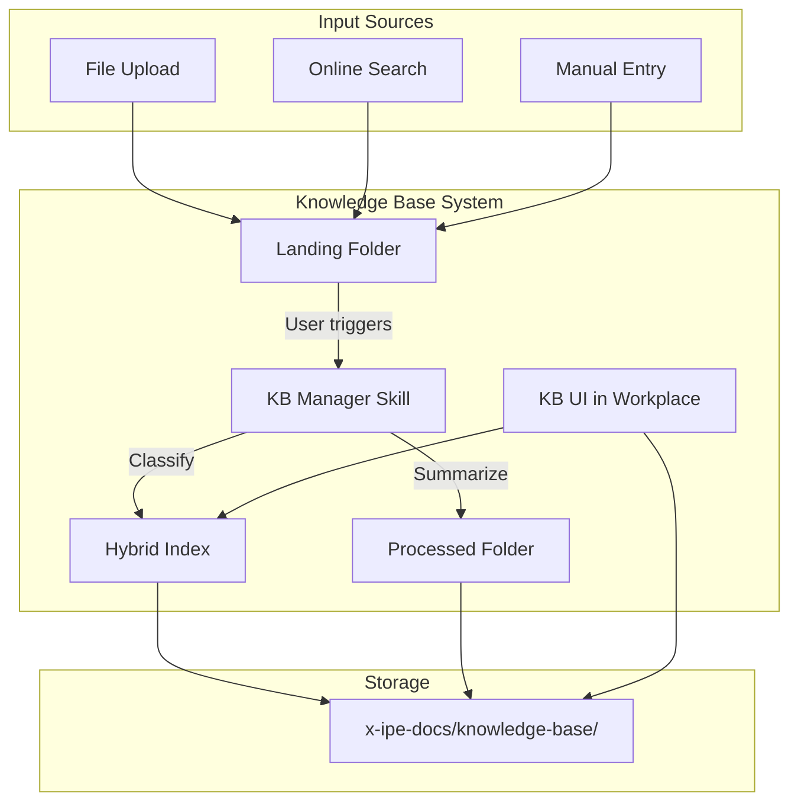
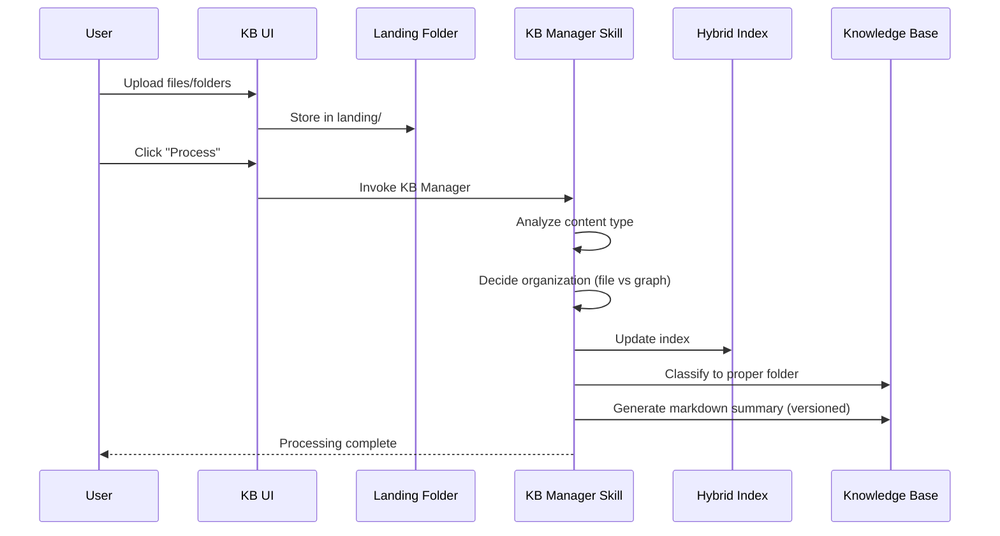
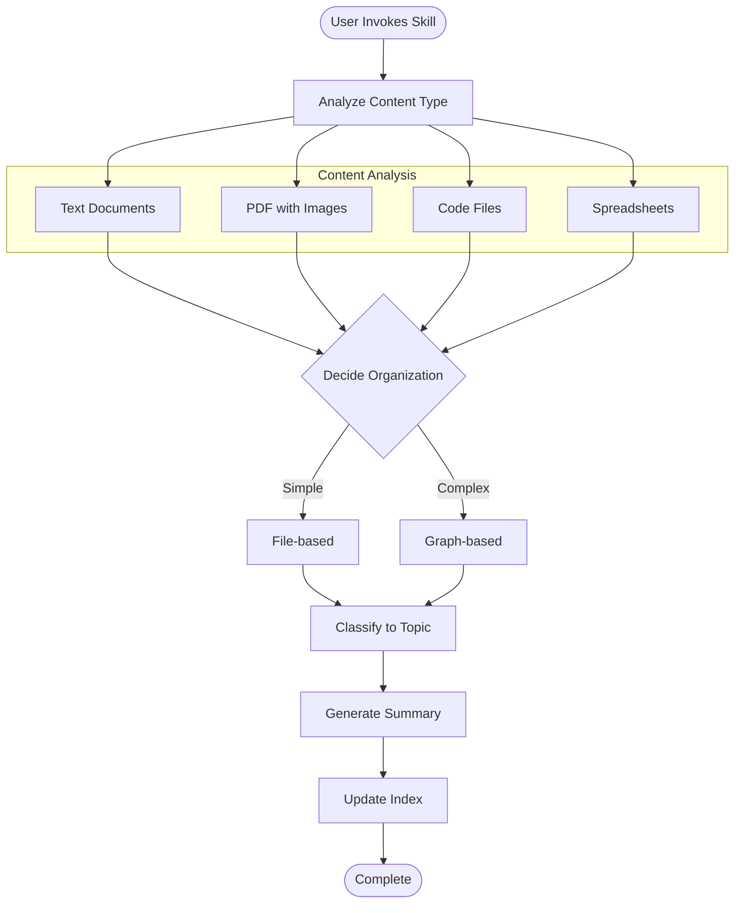
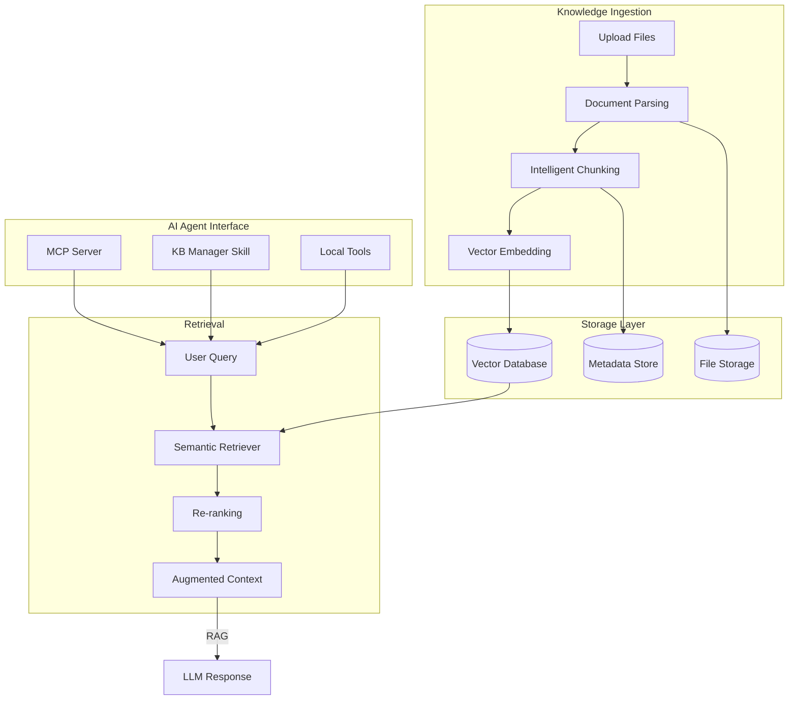
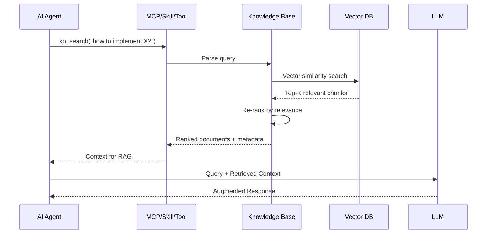

# Knowledge Base Feature - Idea Summary v2

> **Status:** Mockups Complete  
> **Created:** 2026-02-05  
> **Updated:** 2026-02-05  
> **Task:** TASK-186  
> **Assignee:** Flux

---

## Mockups & Prototypes

| Mockup | Type | Path | Description |
|--------|------|------|-------------|
| Landing View | HTML | [mockups/knowledge-base-v1.html](mockups/knowledge-base-v1.html) | Main KB view with file grid, sidebar tree, search modal |
| Processed View | HTML | [mockups/knowledge-base-processed-v1.html](mockups/knowledge-base-processed-v1.html) | Topic detail with AI summary, knowledge graph, source files |

### Preview Instructions
- Open HTML files in browser to view interactive mockups
- Click "Search" button or press `Cmd+K` to open search modal
- Click file cards to toggle selection

### Design Highlights
- **Dark theme** matching X-IPE aesthetic (warm dark palette)
- **Three-panel layout:** Sidebar tree + Content grid + Preview panel
- **Section tabs:** Landing / Topics toggle in sidebar
- **Action toolbar:** Select all, view modes, sort, filter
- **Processing indicator:** Shows AI processing status
- **Knowledge graph preview:** Visual relationships between topics

---

## 1. Executive Summary

A centralized **Knowledge Base** system integrated into X-IPE for organizing, storing, searching, and AI-processing multimodal knowledge artifacts. The system uses a hybrid organization model where AI determines the best representation (file structure vs. knowledge graph) per knowledge type.

---

## 2. Problem Statement

Currently, X-IPE lacks a dedicated system for:
- Storing and organizing reusable knowledge (documents, code snippets, research)
- Processing raw information into actionable summaries
- Searching across multimodal content (text, images, PDFs, spreadsheets)
- Maintaining knowledge relationships and dependencies

---

## 3. Proposed Solution

### 3.1 Core Components



### 3.2 Knowledge Lifecycle



---

## 4. Key Decisions (from Brainstorming)

| Question | Decision | Rationale |
|----------|----------|-----------|
| Organization Model | **Hybrid** - AI decides per type | Flexibility for different knowledge types |
| Processing Trigger | **Manual** - User clicks 'process' | User control, avoid unwanted processing |
| Output Format | **Markdown summaries** with linked source | Human-readable, fits X-IPE ecosystem |
| Online Search | **(Skipped)** - To be defined later | |
| Skill Triggers | **On-demand only** | Simplicity, user control |
| Versioning | **Yes** - versioned processed knowledge | Track evolution of understanding |

---

## 5. Folder Structure

```
x-ipe-docs/
└── knowledge-base/
    ├── landing/                    # Raw uploads go here first
    │   └── {uploaded files/folders}
    ├── processed/                  # AI-generated summaries
    │   └── {topic}/
    │       ├── summary-v1.md
    │       └── summary-v2.md
    ├── topics/                     # Organized knowledge by topic
    │   ├── {topic-1}/
    │   │   ├── raw/               # Original files
    │   │   └── metadata.json      # Index metadata
    │   └── {topic-2}/
    └── index/                      # Search index data
        ├── file-index.json        # File-based index
        └── graph-index.json       # Knowledge graph (when applicable)
```

---

## 6. UI/UX Requirements

### 6.1 Navigation
- Add **"Knowledge Base"** submenu under **Workplace** section
- Folder structure view similar to Ideation browser

### 6.2 Top Bar Actions
| Action | Icon | Description |
|--------|------|-------------|
| Upload | 📤 | Upload files/folders to landing |
| Process | ⚙️ | Trigger KB Manager on selected items |
| Search | 🔍 | Full-text + semantic search |
| Refresh | 🔄 | Reload index |

### 6.3 Content View
- **Raw Knowledge:** File preview with metadata
- **Processed Knowledge:** Markdown rendered with source links
- **Search Results:** Ranked list with snippets and relevance scores

---

## 7. Knowledge Base Manager Skill

### 7.1 Skill Capabilities

| Command | Description |
|---------|-------------|
| `classify` | Move items from landing to appropriate topic folders |
| `reorganize` | Restructure existing knowledge, provide adjustment summary |
| `process` | Generate markdown summaries from raw knowledge |
| `search` | Query the hybrid index |

### 7.2 Skill Workflow



---

## 8. Multimodal Support

| Content Type | Indexing Strategy | Processing Output |
|--------------|-------------------|-------------------|
| **Text** (md, txt) | Full-text search | Summary + key points |
| **PDF** | Text extraction + image OCR | Summary + figure descriptions |
| **Code** | AST parsing + semantic | Purpose + API documentation |
| **Excel** | Cell values + formula analysis | Data description + insights |
| **PPT** | Slide text + image analysis | Presentation outline |
| **Images** | Vision model description | Caption + content tags |

---

## 9. Indexing Technology

### 9.1 Hybrid Approach

| Layer | Technology | Purpose |
|-------|------------|---------|
| **File Index** | JSON-based inverted index | Fast text search |
| **Knowledge Graph** | JSON adjacency list | Relationship queries |
| **Embedding Store** | Vector similarity (future) | Semantic search |

### 9.2 When to Use Which

| Scenario | Strategy |
|----------|----------|
| Independent documents | File-based index |
| Related concepts/entities | Knowledge graph |
| "Find similar to X" | Embedding similarity |

---

## 10. Integration Points

### 10.1 With Existing X-IPE Features

| Feature | Integration |
|---------|-------------|
| **Ideation** | Reference KB items in ideas |
| **Requirements** | Link requirements to KB research |
| **Copilot** | KB as context for AI assistance |
| **Search** | Unified search across KB + project |

### 10.2 External Integration (Future)

- Online search/crawl (deferred - scope TBD)
- External knowledge sources (APIs, databases)

---

## 11. Success Criteria

1. ✅ Knowledge Base folder structure created under `x-ipe-docs/`
2. ✅ "Knowledge Base" menu item visible in Workplace
3. ✅ Users can upload files to landing folder
4. ✅ KB Manager skill can classify and organize knowledge
5. ✅ Processed summaries are versioned markdown files
6. ✅ Search returns relevant results across multimodal content

---

## 12. Out of Scope (v1)

- Real-time collaboration on knowledge items
- Automatic online crawling (manual upload only)
- Advanced permissions/access control
- External API integrations
- Vector embedding search (future enhancement)

---

## 13. Open Questions

1. **Search UI:** Should search be a modal or inline in the KB view?
2. **Graph Visualization:** Should we visualize the knowledge graph? (could use mermaid)
3. **Deduplication:** How to handle duplicate uploads?
4. **Size Limits:** Max file size for upload? Max total KB size?

---

## 14. Next Steps

| Step | Task | Description |
|------|-----------|-------------|
| 1 | **Idea Mockup** | Create UI mockups for KB views |
| 2 | **Idea to Architecture** | Detailed system architecture |
| 3 | **Requirement Gathering** | Formalize as requirement |

---

## 15. AI-Focused Architecture Recommendations

> **Key Insight:** Since the Knowledge Base is primarily used by AI agents to fetch data, the architecture should be optimized for **Retrieval-Augmented Generation (RAG)**.

### 15.1 Recommended Solution: RAG-Based Knowledge Base

Based on research of industry best practices, the recommended approach is:



### 15.2 Solution Comparison

| Solution | Pros | Cons | Recommendation |
|----------|------|------|----------------|
| **RAG with Vector DB** | Best accuracy, semantic search, scales well | Requires embedding model, more complex | ✅ **Primary** |
| **Knowledge Graph** | Great for relationships, reasoning | Complex to build, needs structured data | ✅ **Secondary** (for related concepts) |
| **File-based Index** | Simple, fast, no dependencies | Limited semantic understanding | ✅ **Fallback** (for exact match) |
| **Full-text Search** | Good for keyword search | No semantic understanding | ✅ **Supplementary** |

### 15.3 AI Agent Access Methods

Since AI agents (like Copilot) can call local tools or Skills (Anthropic's new technology), the Knowledge Base should expose multiple access methods:

#### Method 1: MCP Server (Model Context Protocol)

```yaml
# x-ipe-docs/knowledge-base/mcp-server.yaml
name: kb-mcp-server
description: Knowledge Base MCP Server for AI agents
tools:
  - name: kb_search
    description: Semantic search across knowledge base
    parameters:
      query: string
      top_k: integer (default: 5)
      
  - name: kb_get_document
    description: Retrieve full document by ID
    parameters:
      doc_id: string
      
  - name: kb_list_topics
    description: List all knowledge topics
    
  - name: kb_add_knowledge
    description: Add new knowledge to landing folder
    parameters:
      content: string
      source: string
```

#### Method 2: Anthropic Skill (X-IPE Native)

```yaml
# .github/skills/knowledge-base-manager/SKILL.md
name: knowledge-base-manager
description: AI skill to manage and query knowledge base
triggers:
  - "search knowledge"
  - "find in knowledge base"
  - "add to knowledge base"
  - "organize knowledge"
capabilities:
  - search: Semantic search with RAG
  - retrieve: Get full documents
  - classify: Organize landing folder
  - process: Generate summaries
  - reorg: Restructure knowledge
```

#### Method 3: Local Tool Functions

```python
# For direct Python integration
def kb_search(query: str, top_k: int = 5) -> List[Document]:
    """Search knowledge base with semantic similarity."""
    
def kb_retrieve(doc_id: str) -> Document:
    """Retrieve document by ID."""
    
def kb_classify(landing_items: List[str]) -> Dict[str, str]:
    """Classify landing items into topics."""
```

### 15.4 RAG Pipeline Specification



### 15.5 Technology Stack Recommendation

#### MVP Phase 1: File-Based Foundation (Weeks 1-2)

| Component | MVP Technology | Notes |
|-----------|---------------|-------|
| **Storage** | File system | x-ipe-docs/knowledge-base/ |
| **Index** | JSON metadata | file-index.json |
| **Search** | Full-text grep | Basic keyword search |
| **Skill** | KB Manager Skill | Classify, organize, process |
| **UI** | Existing folder browser | Reuse ideation pattern |

#### MVP Phase 2: RAG Enhancement (Weeks 3-4)

| Component | Technology | Reason |
|-----------|------------|--------|
| **Vector DB** | ChromaDB (local) | Lightweight, no external deps |
| **Embedding Model** | sentence-transformers | Local, free, good quality |
| **Document Parser** | Unstructured.io or PyMuPDF | Handles complex docs |
| **Chunking** | Recursive character splitter | Balance size/context |
| **Reranker** | Cross-encoder (optional) | Improves precision |
| **MCP Server** | Python FastMCP | X-IPE is Python-based |

#### Confirmed MVP Scope

| Feature | Phase 1 | Phase 2 |
|---------|---------|---------|
| Landing folder upload | ✅ | ✅ |
| Folder structure view | ✅ | ✅ |
| Manual "Process" action | ✅ | ✅ |
| KB Manager Skill (classify) | ✅ | ✅ |
| Markdown summaries | ✅ | ✅ |
| Full-text search | ✅ | ✅ |
| Semantic/vector search | ❌ | ✅ |
| MCP Server | ❌ | ✅ |
| Knowledge graph | ❌ | ❌ (Future) |

### 15.6 Implementation Phases

**Phase 1: Foundation (MVP - Weeks 1-2)**
- File storage structure
- Basic UI (folder browser)
- Landing folder workflow
- JSON metadata index
- Full-text search
- KB Manager Skill (basic classify/organize)

**Phase 2: RAG Core (Weeks 3-4)**
- ChromaDB integration
- Embedding pipeline (sentence-transformers)
- Semantic search
- MCP Server for AI agent access

**Phase 3: Advanced (Future)**
- Knowledge graph for relationships
- Re-ranking optimization
- Online search/crawl integration

---

## 16. Updated Folder Structure (RAG-Optimized)

```
x-ipe-docs/
└── knowledge-base/
    ├── landing/                    # Raw uploads (unprocessed)
    ├── processed/                  # AI summaries (versioned)
    │   └── {topic}/
    │       ├── summary-v1.md
    │       └── summary-v2.md
    ├── topics/                     # Organized knowledge
    │   └── {topic}/
    │       ├── raw/               # Original files
    │       ├── chunks/            # Chunked documents
    │       └── metadata.json      
    ├── vector-store/              # ChromaDB storage
    │   ├── chroma.sqlite3
    │   └── embeddings/
    ├── index/                      
    │   ├── file-index.json        # File metadata index
    │   └── graph-index.json       # Knowledge relationships
    └── config/
        ├── embedding-model.json   # Model configuration
        └── chunking-config.json   # Chunking parameters
```

---

## Appendix: Research Notes

### RAG (Retrieval-Augmented Generation) - Key Findings

> Source: Wikipedia, Pinecone, LlamaIndex

**What is RAG?**
- Technique that enables LLMs to retrieve and incorporate information from external data sources
- Reduces hallucinations by grounding responses in authoritative data
- More cost-effective than retraining or fine-tuning models

**Core Components:**
1. **Ingestion:** Load data, chunk, embed, store in vector DB
2. **Retrieval:** Semantic search for relevant documents
3. **Augmentation:** Combine query + retrieved context
4. **Generation:** LLM produces response with context

**Benefits for Knowledge Base:**
- Access to proprietary/domain-specific data
- Reduces hallucinations with source citations
- Cost-effective (no model retraining needed)
- Real-time data access

### Model Context Protocol (MCP) - Key Findings

> Source: modelcontextprotocol.io

**What is MCP?**
- Open-source standard for connecting AI applications to external systems
- "USB-C for AI" - standardized way to connect AI to data sources, tools, workflows

**Relevance to Knowledge Base:**
- Perfect interface for AI agents to access KB
- Provides standardized tools: search, retrieve, add
- Enterprise chatbots can connect to multiple data sources

### Anthropic Skills (X-IPE Context)

**What are Skills?**
- X-IPE's native AI capability system
- Skills are triggered by user intent
- Skills can call tools, access files, execute workflows

**KB Manager Skill:**
- Native integration with X-IPE ecosystem
- Can leverage existing skill infrastructure
- Provides classify, reorganize, process capabilities

### Knowledge Management Principles (from Wikipedia)
- **Organizational learning** focus is essential
- Knowledge management as a **strategic asset**
- Key success factors: people, cultural norms, cognitive/social learning processes
- Measurement and benchmarking drive cultural change
- ISO 9001:2015 includes 'organizational knowledge' specification
