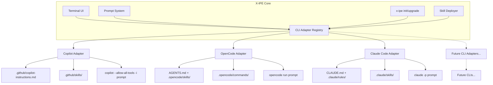
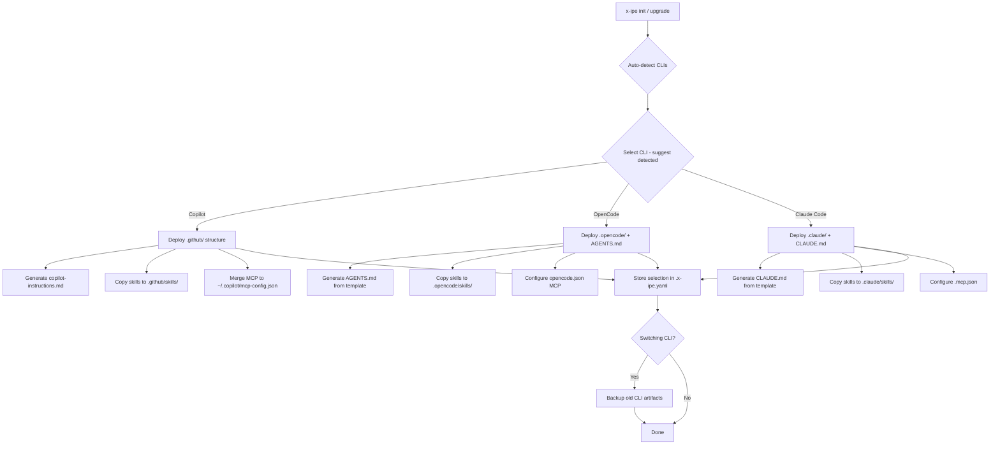
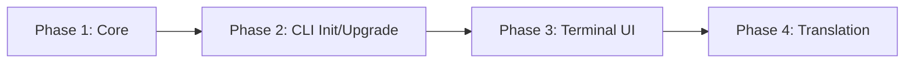

# Idea Summary

> Idea ID: IDEA-013
> Folder: 013. Feature-Adding Support to OpenCode CLI
> Version: v1
> Created: 2026-02-07
> Status: Refined

## Overview

Make X-IPE **CLI-agnostic** by introducing an extensible adapter pattern that supports multiple AI coding CLIs (GitHub Copilot CLI, OpenCode CLI, Claude Code CLI, and future CLIs). Currently X-IPE is tightly coupled to GitHub Copilot CLI — this idea abstracts the CLI layer so users can choose and switch between CLIs through configuration.

## Problem Statement

X-IPE currently hardcodes GitHub Copilot CLI as its only AI coding agent. The terminal integration (`terminal.js`) directly invokes `copilot --allow-all-tools ...`, the skill/instructions system is Copilot-specific (`.github/copilot-instructions.md` + `.github/skills/`), and there is no mechanism to choose an alternative CLI. As the AI coding CLI landscape evolves (OpenCode, Claude Code, etc.), X-IPE needs to support multiple CLIs without rewriting core logic each time.

## Target Users

- **X-IPE developers** who prefer OpenCode CLI or Claude Code CLI over Copilot
- **Teams** evaluating different AI coding agents and wanting to switch without project restructuring
- **Future users** as new AI coding CLIs emerge

## Proposed Solution

Introduce a **CLI Adapter Registry** — a configuration-driven system where each supported CLI is defined as an adapter with its command syntax, arguments, instruction file format, and skill folder structure. The system supports one active CLI at a time per project, configurable via `x-ipe init` / `x-ipe upgrade`.

### Architecture



## Key Features

### 1. CLI Adapter Registry

A centralized registry defining each CLI's capabilities and configuration. Each adapter is a YAML config + a translation template:

```yaml
# Adapter definition structure
cli_adapters:
  copilot:
    display_name: "GitHub Copilot CLI"
    command: "copilot"
    run_args: "--allow-all-tools --allow-all-paths --allow-all-urls"
    inline_prompt_flag: "-i"
    prompt_format: '{command} {run_args} {inline_prompt_flag} "{escaped_prompt}"'
    instructions_file: ".github/copilot-instructions.md"
    skills_folder: ".github/skills/"
    mcp_config_path: "~/.copilot/mcp-config.json"
    mcp_config_format: "standalone_json"
    detection_command: "which copilot"
    translation_template: "adapters/copilot/skill-template.md"
    
  opencode:
    display_name: "OpenCode CLI"
    command: "opencode"
    run_args: ""
    inline_prompt_flag: "run"
    prompt_format: '{command} {inline_prompt_flag} "{escaped_prompt}"'
    instructions_file: "AGENTS.md"
    skills_folder: ".opencode/skills/"
    agents_folder: ".opencode/agents/"
    commands_folder: ".opencode/commands/"
    config_file: "opencode.json"
    mcp_config_path: "opencode.json"
    mcp_config_format: "embedded_json_key:mcpServers"
    detection_command: "which opencode"
    translation_template: "adapters/opencode/skill-template.md"

  claude-code:
    display_name: "Claude Code CLI"
    command: "claude"
    run_args: ""
    inline_prompt_flag: "-p"
    prompt_format: '{command} {inline_prompt_flag} "{escaped_prompt}"'
    instructions_file: "CLAUDE.md"
    instructions_dir: ".claude/"
    skills_folder: ".claude/skills/"
    rules_folder: ".claude/rules/"
    agents_folder: ".claude/agents/"
    config_file: ".claude/settings.json"
    mcp_config_path: ".mcp.json"
    mcp_config_format: "standalone_json"
    detection_command: "which claude"
    translation_template: "adapters/claude-code/skill-template.md"
```

> **Discovery:** Claude Code's skill format (`.claude/skills/<name>/SKILL.md` with YAML frontmatter) is nearly identical to X-IPE's canonical format. Translation is minimal — mostly path relocation and frontmatter field mapping.

### 2. Unified Prompt System

Prompts remain the same across CLIs — only the invocation changes:

```json
{
  "version": "2.0",
  "prompts": [
    {
      "id": "generate-architecture",
      "label": "Generate Architecture",
      "icon": "bi-diagram-3",
      "command": "Base on <current-idea-file> to generate layered architecture"
    }
  ],
  "cli": {
    "active": "copilot",
    "adapters": "cli-adapters.yaml"
  }
}
```

The terminal constructs the full CLI command dynamically:
- **Copilot**: `copilot --allow-all-tools --allow-all-paths --allow-all-urls -i "Base on ..."`
- **OpenCode**: `opencode run "Base on ..."`
- **Claude Code**: `claude -p "Base on ..."`

### 3. Skill/Instruction Translation

Each CLI has its own instruction format. X-IPE maintains a **canonical skill format** (current `.github/skills/` structure with `SKILL.md` entry points) and **translates** to each CLI's native format during `x-ipe init` / `x-ipe upgrade`.

**Translation mapping:**

| Canonical (X-IPE) | Copilot CLI | OpenCode CLI | Claude Code CLI |
|---|---|---|---|
| `.github/skills/<name>/SKILL.md` | `.github/skills/<name>/SKILL.md` (native) | `.opencode/skills/<name>/SKILL.md` (frontmatter remapped) | `.claude/skills/<name>/SKILL.md` (near-native) |
| `.github/copilot-instructions.md` | `.github/copilot-instructions.md` (native) | `AGENTS.md` (reformatted) | `CLAUDE.md` (reformatted) |
| MCP config | `~/.copilot/mcp-config.json` (global) | `opencode.json` `mcpServers` (project) | `.mcp.json` (project) |

**Concrete translation examples:**

Canonical X-IPE skill (`SKILL.md`):
```markdown
---
name: task-type-bug-fix
description: Diagnose and fix bugs in existing code.
---
# Task Type: Bug Fix
## Purpose
Diagnose and fix bugs by writing a failing test first...
```

Translated to OpenCode skill (`.opencode/skills/task-type-bug-fix/SKILL.md`):
```markdown
---
name: task-type-bug-fix
description: Diagnose and fix bugs in existing code.
---
# Task Type: Bug Fix
## Purpose
Diagnose and fix bugs by writing a failing test first...
```

> **Discovery:** OpenCode also supports `.opencode/skills/<name>/SKILL.md` with the same `SKILL.md` convention! Frontmatter requires only `name` and `description` (both required). OpenCode also reads `.claude/skills/` for compatibility. Translation from X-IPE canonical format is minimal.

Translated to Claude Code skill (`.claude/skills/task-type-bug-fix/SKILL.md`):
```markdown
---
name: task-type-bug-fix
description: Diagnose and fix bugs in existing code.
context: fork
---
# Task Type: Bug Fix
## Purpose
Diagnose and fix bugs by writing a failing test first...
```

> **Key insight:** Claude Code's `.claude/skills/` format with `SKILL.md` entry point is nearly identical to X-IPE's canonical format. The main differences are optional frontmatter fields (`context`, `allowed-tools`, `model`) and the folder location. This makes Claude Code the easiest CLI to support.

### 4. CLI Selection in `x-ipe init` / `x-ipe upgrade`



**CLI auto-detection**: During `x-ipe init`, the system runs detection commands (`which copilot`, `which opencode`) and suggests the detected CLI as the default choice.

**Migration behavior** (switching CLIs via `x-ipe upgrade --cli opencode`):
1. Old CLI artifacts (e.g., `.github/copilot-instructions.md`) are **backed up** (moved to `.x-ipe/backup/`)
2. New CLI artifacts are generated from canonical skills
3. `.x-ipe.yaml` is updated with the new CLI selection
4. User is informed which files were backed up and which were created

**Error handling**: If the selected CLI is not installed, `x-ipe init` warns the user but still deploys the configuration (the CLI may be installed later). `x-ipe upgrade` with `--cli` flag validates CLI availability and warns if not found.

### 5. Runtime CLI Detection

Terminal UI detects which CLI is active and adjusts behavior:
- **Command construction**: Uses adapter's `prompt_format`
- **CLI mode detection**: Detects CLI-specific prompts (e.g., `copilot>`, `opencode>`)
- **Session persistence**: Knows which CLI is in use per project

## Success Criteria

- [ ] Users can select CLI during `x-ipe init` (Copilot, OpenCode, or Claude Code)
- [ ] Auto-detection suggests installed CLI as default
- [ ] `x-ipe upgrade --cli <name>` can migrate projects between CLIs with backup
- [ ] Terminal prompt button works correctly with all supported CLIs
- [ ] Skills/instructions are properly translated using per-adapter translation templates
- [ ] MCP configuration is correctly handled per CLI's native format
- [ ] Adding a new CLI adapter requires only a YAML config + translation template (no core code changes)
- [ ] Single CLI active at a time per project (stored in `.x-ipe.yaml`)
- [ ] Prompt escaping handles quotes and special characters correctly
- [ ] Existing Copilot-based projects continue working without changes (backward compatible)

## Constraints & Considerations

- **Single CLI at a time**: Only one CLI is active per project to avoid confusion
- **Canonical format stays**: X-IPE's internal skill format (`.github/skills/` with `SKILL.md` entry points) remains the source of truth; translations are generated artifacts
- **CLI availability**: Warn but don't block if selected CLI is not installed; user may install later
- **OpenCode is Go-based**: Different ecosystem than Copilot; skill format uses OpenCode's agent markdown frontmatter (`description`, `mode`, `model`, `tools`)
- **Claude Code skill format**: Nearly identical to X-IPE's canonical format (`.claude/skills/<name>/SKILL.md` with YAML frontmatter). Easiest adapter to implement.
- **Backward compatibility**: Existing Copilot-based projects continue working unchanged; Copilot remains the default CLI
- **Prompt escaping**: CLI invocation must properly escape quotes and special characters in prompts to avoid shell injection
- **MCP scope**: Each CLI has its own MCP config format/location; model provider configuration is out of scope (handled by each CLI independently)
- **Migration is non-destructive**: When switching CLIs, old artifacts are backed up, not deleted
- **Testing**: Adapter correctness can be tested by validating generated files against expected templates, without requiring the target CLI to be installed

## Brainstorming Notes

### Key Insights

1. **OpenCode uses `AGENTS.md` + `.opencode/skills/`** for instructions and skills. OpenCode also supports `.opencode/skills/<name>/SKILL.md` (same SKILL.md convention as X-IPE and Claude Code!). Frontmatter requires `name` and `description`. OpenCode also reads `.claude/skills/` for cross-CLI compatibility.

2. **OpenCode's non-interactive mode** is `opencode run "prompt"` — no `-i` flag like Copilot. The prompt format template in the adapter handles this difference cleanly.

3. **OpenCode has custom commands** via `.opencode/commands/` which could map to X-IPE's prompt system. E.g., "Generate Architecture" could become `.opencode/commands/generate-architecture.md`.

4. **MCP config locations differ**: Copilot uses `~/.copilot/mcp-config.json`, OpenCode embeds it in `opencode.json` under `mcpServers`.

5. **OpenCode supports GitHub Copilot as a model provider** — users could use OpenCode CLI with Copilot's models, which adds an interesting dimension.

6. **Extensible design chosen**: Rather than a 2-choice toggle, we chose an adapter registry pattern that can accommodate Claude Code CLI and future CLIs without architectural changes.

7. **OpenCode commands mapping**: X-IPE's prompt buttons (e.g., "Generate Architecture") could be deployed as `.opencode/commands/generate-architecture.md` files. This is a natural extension but deferred to post-v1 as the prompt system already handles CLI invocation generically.

8. **Canonical skill schema**: The canonical format is defined by the existing `.github/skills/` structure where each skill has a `SKILL.md` with YAML frontmatter (`name`, `description`) and markdown body. This is the "schema" for translation.

9. **Claude Code uses `.claude/skills/<name>/SKILL.md`** — a folder structure with `SKILL.md` entry point, nearly identical to X-IPE's canonical `.github/skills/<name>/SKILL.md`. The frontmatter fields differ slightly (`context`, `allowed-tools`, `disable-model-invocation` vs X-IPE's `name`, `description`), but the overall structure is the closest match of all three CLIs.

10. **Claude Code's `CLAUDE.md`** serves as project instructions (equivalent to `copilot-instructions.md`). It also supports `.claude/rules/*.md` for modular, topic-specific rules — a more granular approach than a single instructions file.

11. **Claude Code's MCP config** uses `.mcp.json` at the project root — simple standalone JSON, same format concept as Copilot's but project-scoped rather than global.

12. **Claude Code's non-interactive mode** is `claude -p "prompt"`. Also supports `--append-system-prompt` for adding instructions without replacing the default prompt — useful for X-IPE skill injection.

## Implementation Steps

### Phase 1: Core Adapter Infrastructure



**Step 1.1: Define CLI Adapter Schema**
- Create `src/x_ipe/resources/config/cli-adapters.yaml` with adapter definitions for Copilot, OpenCode, and Claude Code
- Define the data model: `CLIAdapter` class with fields for command, args, prompt format, paths, detection, etc.
- Store the active CLI selection in `.x-ipe.yaml` under a `cli` key

**Step 1.2: Create Adapter Registry Service**
- Create `src/x_ipe/services/cli_adapter_service.py`
- Load and parse `cli-adapters.yaml`
- Methods: `get_active_adapter()`, `list_adapters()`, `detect_installed_clis()`, `switch_cli(name)`
- Read active CLI from `.x-ipe.yaml`, fall back to `copilot` as default

**Step 1.3: API Endpoint**
- Create `/api/config/cli-adapter` endpoint to expose active adapter info to the frontend
- Return: adapter name, command, prompt format, detection status

### Phase 2: CLI Init / Upgrade Integration

**Step 2.1: Update `x-ipe init`**
- Add CLI selection prompt: auto-detect installed CLIs, present choices, suggest detected one
- Store selection in `.x-ipe.yaml`
- Deploy CLI-specific artifacts based on selection

**Step 2.2: Update `x-ipe upgrade`**
- Add `--cli <name>` flag for CLI migration
- Implement backup logic: move old CLI artifacts to `.x-ipe/backup/`
- Generate new CLI artifacts from canonical skills
- Update `.x-ipe.yaml`

**Step 2.3: Skill Translation Engine**
- Create `src/x_ipe/services/skill_translator.py`
- For each adapter, define translation logic:
  - **Copilot**: No-op (native format — `.github/skills/`)
  - **OpenCode**: Copy skills to `.opencode/skills/`, remap frontmatter (keep `name`+`description`, drop unsupported fields), generate `AGENTS.md`
  - **Claude Code**: Copy skills to `.claude/skills/`, remap frontmatter fields (`context`, `allowed-tools`), generate `CLAUDE.md`
- MCP config translation: Copilot → global JSON merge, OpenCode → embed in `opencode.json`, Claude Code → `.mcp.json`

### Phase 3: Terminal UI Integration

**Step 3.1: Update `terminal.js` / `terminal-v2.js`**
- Replace hardcoded `copilot` command with dynamic adapter lookup
- Fetch active adapter from `/api/config/cli-adapter` 
- Build CLI command using adapter's `prompt_format` template
- Implement proper prompt escaping for shell safety

**Step 3.2: Update CLI Mode Detection**
- Currently detects `copilot>` prompt; make detection adapter-aware
- Each adapter defines its terminal prompt pattern
- Update `terminal.js` to check against active adapter's pattern

**Step 3.3: Update `copilot-prompt.json`**
- Rename to `cli-prompt.json` (or keep name but make CLI-agnostic)
- Remove CLI-specific references; prompts become universal
- Add `cli` section for adapter reference

### Phase 4: Testing & Validation

**Step 4.1: Unit Tests**
- Test adapter registry loading and querying
- Test skill translation for each CLI (canonical → target format)
- Test prompt escaping with special characters
- Test CLI detection logic
- Test migration backup/restore

**Step 4.2: Integration Tests**
- Test `x-ipe init` with each CLI selection
- Test `x-ipe upgrade --cli` migration between CLIs
- Test terminal prompt button with each adapter
- Validate generated files against expected templates

### Estimated File Changes

| File | Change Type | Description |
|---|---|---|
| `src/x_ipe/resources/config/cli-adapters.yaml` | **New** | Adapter definitions |
| `src/x_ipe/services/cli_adapter_service.py` | **New** | Adapter registry service |
| `src/x_ipe/services/skill_translator.py` | **New** | Skill translation engine |
| `src/x_ipe/routes/config_routes.py` | **Modify** | Add `/api/config/cli-adapter` endpoint |
| `src/x_ipe/cli/main.py` | **Modify** | Update `init` and `upgrade` commands |
| `src/x_ipe/static/js/terminal.js` | **Modify** | Dynamic CLI command construction |
| `src/x_ipe/static/js/terminal-v2.js` | **Modify** | Dynamic CLI command construction |
| `src/x_ipe/resources/config/copilot-prompt.json` | **Modify** | Make CLI-agnostic |
| `src/x_ipe/resources/adapters/copilot/` | **New** | Copilot translation templates |
| `src/x_ipe/resources/adapters/opencode/` | **New** | OpenCode translation templates |
| `src/x_ipe/resources/adapters/claude-code/` | **New** | Claude Code translation templates |
| `tests/test_cli_adapter.py` | **New** | Adapter tests |
| `tests/test_skill_translator.py` | **New** | Translation tests |

## Source Files

- new idea.md

## Next Steps

- [ ] Proceed to Requirement Gathering (this is a feature implementation idea)

## References & Common Principles

### Applied Principles

- **Adapter Pattern**: Structural design pattern that allows incompatible interfaces to work together — each CLI gets an adapter that translates X-IPE's canonical interface to the CLI's native format.
- **Strategy Pattern**: The CLI adapter is selected at configuration time and used at runtime, allowing behavior to be swapped without changing the consuming code.
- **Convention over Configuration**: Each CLI has sensible defaults in its adapter definition; users only need to select which CLI to use.

### Research Findings

- **OpenCode CLI** (opencode.ai): Go-based TUI with `opencode run` for non-interactive mode, `.opencode/agents/` for custom agents, `.opencode/commands/` for custom commands, `AGENTS.md` for project context, MCP via `opencode.json`
- **GitHub Copilot CLI**: `copilot -i "prompt"` for inline prompts, `.github/copilot-instructions.md` for instructions, `.github/skills/` for skills, MCP via `~/.copilot/mcp-config.json`
- **Claude Code CLI** (docs.anthropic.com): `claude -p "prompt"` for non-interactive, `CLAUDE.md` for project instructions, `.claude/skills/<name>/SKILL.md` for skills (nearly identical to X-IPE canonical format!), `.claude/rules/*.md` for modular rules, `.claude/agents/` for subagents, `.mcp.json` for MCP config

### Further Reading

- [OpenCode Documentation](https://opencode.ai/docs) - Official OpenCode docs
- [OpenCode Agents](https://opencode.ai/docs/agents) - Agent configuration for OpenCode
- [OpenCode Commands](https://opencode.ai/docs/commands) - Custom commands for OpenCode
- [OpenCode Config](https://opencode.ai/docs/config) - Configuration reference
- [Claude Code Documentation](https://docs.anthropic.com/en/docs/claude-code) - Official Claude Code docs
- [Claude Code CLI Usage](https://docs.anthropic.com/en/docs/claude-code/cli-usage) - CLI flags and non-interactive mode
- [Claude Code Skills](https://docs.anthropic.com/en/docs/claude-code/skills) - Skill format (Agent Skills standard)
- [Claude Code Memory](https://docs.anthropic.com/en/docs/claude-code/memory) - CLAUDE.md and memory system
- [Claude Code Settings](https://docs.anthropic.com/en/docs/claude-code/settings) - Configuration and permissions
