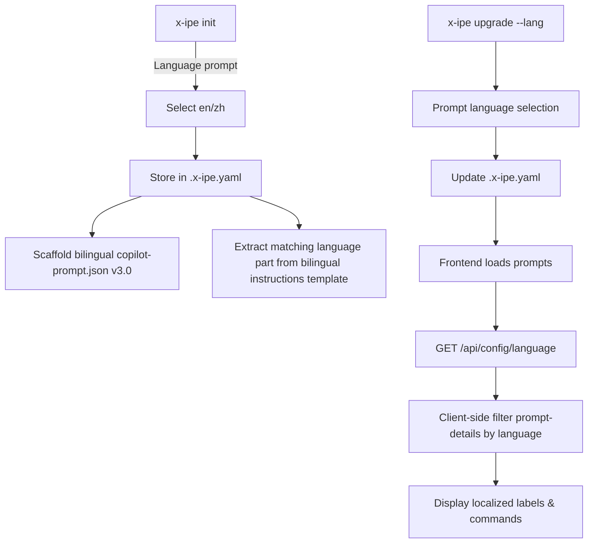
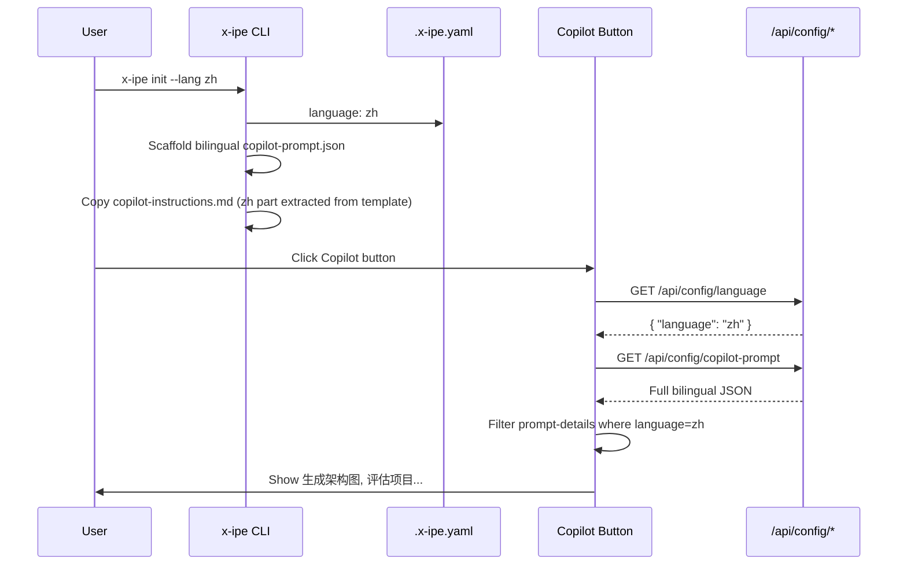

# Idea Summary

> Idea ID: IDEA-019
> Folder: 015. Feature-Prompt Bi-language Support
> Version: v1
> Created: 2026-02-10
> Status: Refined

## Overview

Add bilingual (Chinese/English) support to X-IPE's copilot-prompt system and skill routing. Users select their preferred language during `x-ipe init`, and all Copilot button prompts display localized labels in that language. The `copilot-prompt.json` stores both languages side-by-side via a `prompt-details` array. Skill routing gains Chinese trigger keywords via SKILL.md frontmatter extensions, enabling the AI to correctly match Chinese requests to the right skill.

## Problem Statement

Currently, X-IPE's copilot-prompt.json labels and copilot-instructions.md skill triggers are English-only. Chinese-speaking users must mentally translate button labels and write requests in English for correct skill routing. This creates friction for the primary user base and limits adoption. For example, a user typing "优化创意" expects the Ideation skill to activate, but the current system only matches English triggers like "refine idea".

## Target Users

- **Primary:** Chinese-speaking developers using X-IPE with GitHub Copilot, OpenCode, or Claude Code
- **Secondary:** English-speaking developers (default experience preserved)

## Proposed Solution

A four-part solution touching CLI, config schema, skill frontmatter, and frontend:

### 1. Language Selection at Init

During `x-ipe init`, add a language selection prompt after CLI detection. Also support non-interactive mode via `--lang` flag for scripted/CI setups:

```
# Interactive
? Select prompt language (default: en):
  ❯ English (en)
    中文 (zh)

# Non-interactive
x-ipe init --cli copilot --lang zh
```

The selection is persisted in `.x-ipe.yaml`:

```yaml
cli: copilot
language: en
```

### 2. Bilingual copilot-prompt.json Structure

Each prompt entry gains a `prompt-details` array containing per-language variants. The schema version bumps from `"2.0"` to `"3.0"`:

```json
{
  "version": "3.0",
  "ideation": {
    "prompts": [
      {
        "id": "generate-architecture",
        "icon": "bi-diagram-3",
        "prompt-details": [
          {
            "language": "en",
            "label": "Generate Architecture",
            "command": "Base on <current-idea-file> to generate layered architecture"
          },
          {
            "language": "zh",
            "label": "生成架构图",
            "command": "基于<current-idea-file>生成分层架构图"
          }
        ]
      }
    ]
  },
  "evaluation": {
    "evaluate": {
      "id": "evaluate",
      "icon": "bi-clipboard-check",
      "prompt-details": [
        {
          "language": "en",
          "label": "Evaluate Project",
          "command": "Evaluate the project quality..."
        },
        {
          "language": "zh",
          "label": "评估项目",
          "command": "评估项目质量..."
        }
      ]
    },
    "refactoring": [...]
  }
}
```

**Key design details:**
- `label` only exists inside `prompt-details` entries (not at the prompt level) — each language provides its own label
- `command` fields are translated — they are user-visible instructions and changing the language changes the AI's response language, which is the desired behavior for Chinese users
- Backward compatibility: consumers first check `prompt-details`, then fall back to top-level `command`/`label` fields if present (v2.0 format)
- Applies uniformly to all prompt structures: `prompts[]` arrays, singleton `evaluate` objects, and `refactoring[]` arrays

### 3. Single-Source Bilingual copilot-instructions.md

Maintain a **single** `copilot-instructions.md` template in the package with two clearly separated parts:

```
copilot-instructions.md (package template)
├── Part 1: English version (full instructions + EN skill keywords)
├── --- language separator ---
└── Part 2: Chinese version (full instructions + CN skill keywords)
```

- `x-ipe init` reads the selected language, extracts the matching part, and copies **only that part** into the project as `copilot-instructions.md`
- `x-ipe upgrade --lang` re-extracts the selected part and overwrites the project copy
- Skills (SKILL.md) are **not modified** — they remain English-only
- One source file to maintain — editing the template updates both languages in one place

### 4. Language Switching via Upgrade

`x-ipe upgrade --lang` presents a language selection prompt:

```
? Select prompt language:
  ❯ English (en)
    中文 (zh)
```

This updates the `language` field in `.x-ipe.yaml`, re-extracts the matching language part from the bilingual instructions template, and the frontend switches prompt display via client-side filtering of `prompt-details`.

### 5. Frontend Client-Side Filtering

The existing `/api/config/copilot-prompt` endpoint continues to serve the full JSON file (no server-side filtering). A new lightweight endpoint `/api/config/language` returns the current language from `.x-ipe.yaml`. The frontend JavaScript:

1. Fetches the language setting from `/api/config/language`
2. For each prompt, selects the matching `prompt-details` entry by language
3. Falls back to `"en"` entry if no match, then to top-level `command` if no `prompt-details`

This approach avoids modifying the prompt-serving API and keeps filtering logic in the frontend.

## Key Features





## Success Criteria

- [ ] `x-ipe init` prompts for language selection (default: en), also supports `--lang` flag
- [ ] Language preference stored in `.x-ipe.yaml`
- [ ] copilot-prompt.json v3.0 contains `prompt-details` array with en/zh entries for all prompts (arrays and singletons)
- [ ] Frontend Copilot button displays labels and commands in the selected language via client-side filtering
- [ ] Single bilingual `copilot-instructions.md` template with EN and ZH parts separated
- [ ] `x-ipe init` and `x-ipe upgrade --lang` extract the selected language part into the project
- [ ] Chinese user requests (e.g., "优化创意") correctly route to the intended skill via Chinese instructions part
- [ ] `x-ipe upgrade --lang` allows switching language post-init
- [ ] Existing v2.0 copilot-prompt.json (without `prompt-details`) still works via fallback to `command` field
- [ ] Existing projects upgrading default to English when no language is set
- [ ] No regression in English-only user experience

## Constraints & Considerations

- **Scope limited to zh/en** — no extensibility framework for additional languages in this iteration
- **Skills remain in English** — SKILL.md files are not modified; Chinese skill routing keywords live in the ZH part of the instructions template
- **Token efficiency** — only the selected language part is copied into the project, so no token overhead from bilingual content at runtime
- **Single source** — both language versions maintained in one template file, easier to keep in sync
- **Backward compatibility** — v2.0 copilot-prompt.json without `prompt-details` must still work (fallback to top-level `command`/`label` fields)
- **copilot-prompt.json is user-editable** — upgrade must detect customized prompts and merge carefully; new bilingual entries are additive
- **Schema migration** — `x-ipe upgrade` handles v2.0 → v3.0 migration: wraps existing `command`/`label` into `prompt-details[{language:"en",...}]` and adds `{language:"zh",...}` entries
- **Mixed-language input** — Users may type mixed Chinese/English (e.g., "修复 login bug"); the AI agent handles this naturally as LLMs understand mixed-language input; no special handling needed

## Brainstorming Notes

### Key Design Decisions

1. **prompt-details array pattern** — Chosen over top-level language split (`{ "zh": {...}, "en": {...} }`) because it keeps related translations together per prompt, easier to maintain and review.

2. **Single bilingual instructions template** — One `copilot-instructions.md` in the package with EN and ZH parts. Init/upgrade extracts the selected part. Simpler than maintaining two separate files; one place to edit, no sync drift.

3. **Client-side filtering** — Frontend filters `prompt-details` by language rather than the API doing server-side filtering. This avoids modifying the existing static-file-serving endpoint and keeps the solution simpler.

4. **Commands are translated** — `command` fields are translated to Chinese for zh users. Since commands are visible instructions that also influence the AI's response language, translating them gives Chinese users a fully localized experience.

5. **`.x-ipe.yaml` for persistence** — Language setting stored alongside CLI selection in the project-level config, keeping all init-time choices in one place.

6. **English default for upgrades** — Safer for international users; Chinese users can switch via `x-ipe upgrade --lang`.

7. **Schema version bump to 3.0** — Explicit version allows consumers to detect the format and apply the correct parsing logic (v2.0 fallback vs v3.0 prompt-details).

### Architecture Impact

```architecture-dsl
@startuml module-view
title "Bi-language Support - Module View"
direction top-to-bottom
grid 12 x 8

layer "CLI Layer" {
  color "#fef3c7"
  border-color "#f97316"
  rows 2

  module "CLI Commands" {
    cols 12
    rows 2
    grid 2 x 1
    align center center
    gap 8px
    component "Init Command\n--lang flag" { cols 1, rows 1 }
    component "Upgrade Command\n--lang switch" { cols 1, rows 1 }
  }
}

layer "Config Layer" {
  color "#dbeafe"
  border-color "#3b82f6"
  rows 2

  module "Config Files" {
    cols 12
    rows 2
    grid 3 x 1
    align center center
    gap 8px
    component ".x-ipe.yaml\nlanguage pref" { cols 1, rows 1 }
    component "copilot-prompt.json v3.0\nprompt-details array" { cols 1, rows 1 }
    component "copilot-instructions.md\nbilingual template" { cols 1, rows 1 }
  }
}

layer "API Layer" {
  color "#fce7f3"
  border-color "#ec4899"
  rows 2

  module "Endpoints" {
    cols 12
    rows 2
    grid 2 x 1
    align center center
    gap 8px
    component "/api/config/copilot-prompt\nserves full JSON" { cols 1, rows 1 }
    component "/api/config/language\nreturns lang pref" { cols 1, rows 1 }
  }
}

layer "Frontend Layer" {
  color "#dcfce7"
  border-color "#22c55e"
  rows 2

  module "UI Components" {
    cols 12
    rows 2
    grid 2 x 1
    align center center
    gap 8px
    component "Copilot Button JS\nclient-side filtering" { cols 1, rows 1 }
    component "Prompt Dropdown\nlocalized labels" { cols 1, rows 1 }
  }
}

@enduml
```

## Source Files

- new idea.md

## Next Steps

- [ ] Proceed to Requirement Gathering (this idea impacts CLI, config schema, skill frontmatter, API, and frontend)

## References & Common Principles

### Applied Principles

- **Single Source of Truth** — Language preference in `.x-ipe.yaml`; bilingual instructions maintained in one template file
- **Progressive Enhancement** — English remains the default; Chinese is additive with graceful fallback
- **Backward Compatibility** — v2.0 format still works via fallback chain (prompt-details → command)
- **KISS** — Client-side filtering avoids API changes; single template file avoids maintaining separate files

### Further Reading

- [GNU gettext Manual](https://www.gnu.org/software/gettext/manual/) — Standard i18n approach for reference (not adopted due to 2-language simplicity)
- [i18n Anti-Patterns](https://phrase.com/blog/posts/i18n-anti-patterns/) — Common mistakes in internationalization
