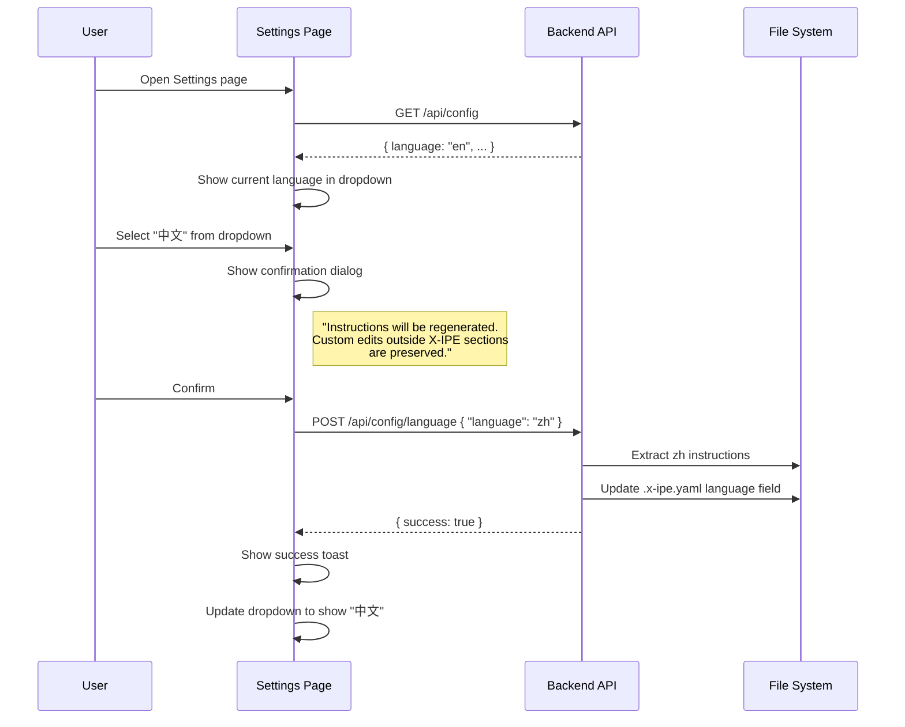
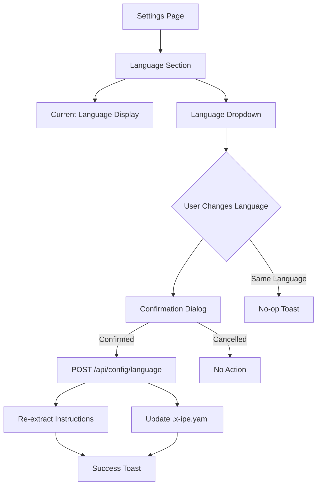

# Idea Summary

> Idea ID: IDEA-020
> Folder: 016. CR-Switch Language in Settings
> Version: v1
> Created: 2026-02-11
> Status: Refined
> Classification: Change Request (CR) to FEATURE-028 Bilingual Support

## Overview

Add a language dropdown (en / 中文) to the Settings web UI page, enabling users to switch the project's language without using the CLI. The switch should replicate `x-ipe upgrade --lang zh|en` behavior — updating `.x-ipe.yaml` and re-extracting copilot instructions for the selected language automatically.

## Problem Statement

Language switching is currently **CLI-only** (`x-ipe upgrade --lang zh|en`). Users who interact primarily through the web UI must drop to the terminal for a simple preference change. The Settings page — the natural home for project configuration — cannot change the language setting.

## Target Users

- X-IPE web UI users who want to switch language without CLI access
- Non-technical users who prefer GUI-based configuration
- Developers working in bilingual environments who frequently toggle languages

## Proposed Solution

Add a **dedicated "Language" section** on the Settings page with a dropdown select control. On change, an AJAX call to a new API endpoint triggers the same backend logic as `x-ipe upgrade --lang`, with a confirmation dialog and toast notification.

### User Flow



## Key Features

### Feature Map



1. **Dedicated Language Section** — Prominent display of current language with dropdown to change
2. **Dropdown Select** — `en` / `中文` matching the CLI's `SUPPORTED_LANGUAGES`
3. **Confirmation Dialog** — Warns user that copilot instructions will be regenerated; custom edits outside X-IPE sections are preserved
4. **AJAX + Toast** — No page reload; success/error feedback via Bootstrap toast
5. **Same-as-current Guard** — If user selects the language already active, show "Already using [language]" toast without re-extracting
6. **Backend Reuse** — Calls the same `ScaffoldManager` methods as CLI `_handle_language_switch()`

## Architecture Integration

```architecture-dsl
@startuml
title CR-016: Settings Language Switch
theme corporate

layer "Frontend" {
  component "settings.html" {
    component "Language Section"
    component "Dropdown Control"
    component "Confirm Dialog"
  }
}

layer "API" {
  component "settings_routes.py" {
    component "POST /api/config/language"
  }
}

layer "Service" {
  component "ScaffoldManager" {
    component "create_config_file()"
    component "copy_copilot_instructions()"
  }
}

layer "Storage" {
  component ".x-ipe.yaml"
  component "copilot-instructions.md"
}
@enduml
```

## Technical Approach

### API Contract

```
POST /api/config/language
Body: { "language": "zh" }
Response (success): { "success": true, "language": "zh", "message": "Language switched to 中文" }
Response (error):   { "success": false, "error": "Failed to extract instructions" }
```

### Safety & Atomicity

- **Order of operations:** Extract instructions FIRST, then update `.x-ipe.yaml` — so if extraction fails, config remains on the previous language (consistent state)
- **Custom edits preserved:** The existing `copy_copilot_instructions()` uses X-IPE header markers to identify managed sections — user customizations outside these markers are preserved
- **Dropdown disabled during operation:** Prevent double-submit with a loading state on the control

### Edge Cases Addressed

| Edge Case | Behavior |
|-----------|----------|
| Same language selected | No-op with toast "Already using [language]" |
| `.x-ipe.yaml` missing | Return error; language switch requires initialized project |
| Instruction extraction fails | Rollback: keep previous language in config; show error toast |
| Concurrent switches | Dropdown disabled during operation; prevents race condition |
| Active project context | Language applies to the **active project** only; reads from active project's `.x-ipe.yaml` |

## Success Criteria

- [x] Problem is clearly defined (CLI-only language switch gap)
- [ ] Language dropdown visible in Settings page with current language shown
- [ ] Switching language updates `.x-ipe.yaml` and re-extracts instructions
- [ ] Confirmation dialog appears before switching
- [ ] Success/error feedback via toast notification
- [ ] Same-language selection handled gracefully (no-op)
- [ ] No page reload required
- [ ] Existing custom instructions outside X-IPE markers preserved

## Constraints & Considerations

- **Supported languages:** Only `en` and `zh` (hardcoded in CLI `SUPPORTED_LANGUAGES`). Dropdown can be hardcoded for now; future extensibility is out of scope.
- **Multi-project:** Language is per-project. The dropdown reflects and changes the **active project's** language.
- **ScaffoldManager in web layer:** This introduces `ScaffoldManager` as a new dependency in `settings_routes.py`. Currently `ScaffoldManager` is only used in CLI code. Need to ensure it works correctly when called from the web server process (file paths, working directory context).
- **No "Don't ask again" option:** Keep the confirmation dialog simple for v1. Can be added later if needed.
- **No real-time cross-page updates:** After switching language, other already-open pages (e.g., Workplace) will reflect the new language on their next data fetch, not in real-time. This is acceptable for v1.

## Brainstorming Notes

**Key decisions made during brainstorming:**
1. Dropdown select (not toggle or radio) — most natural for language selection
2. Auto re-extract instructions on switch — matches CLI behavior exactly
3. AJAX + toast — consistent with existing Settings page patterns (ProjectFoldersManager)
4. Confirmation dialog — necessary because instruction regeneration is destructive
5. Dedicated section — not buried in read-only config display
6. CR to FEATURE-028 — not a standalone feature; extends existing bilingual support

**Critique feedback addressed:**
- Atomicity: Instructions extracted BEFORE config update (rollback-safe)
- Same-language guard: No-op with informational toast
- Custom instructions risk: Explicitly documented that X-IPE markers preserve custom edits
- API contract: Explicitly defined endpoint, request/response format
- Loading state: Dropdown disabled during operation
- Multi-project: Scoped to active project only

## Source Files

- new idea.md — Original idea: "I would like to have language switch in settings. it should behave just like x-ipe upgrade --lang zh|cn."

## Mockups and Prototypes

- [Settings Language Switch Mockup v1](mockups/settings-language-v1.html) — Interactive mockup showing all 4 scenarios: Default State, Confirmation Dialog, Success Toast, Same-Language Guard

## Next Steps

- [ ] Proceed to Change Request (CR) processing via `x-ipe-task-based-change-request`

## References & Common Principles

### Applied Principles

- **Consistency:** Mirrors CLI behavior exactly (`_handle_language_switch()` logic)
- **Fail-safe ordering:** Write-then-rename pattern — extract instructions first, then update config
- **Progressive disclosure:** Confirmation dialog only when action has side effects
- **Reuse:** Leverages existing `ScaffoldManager`, `ConfirmDialog`, Bootstrap toasts
