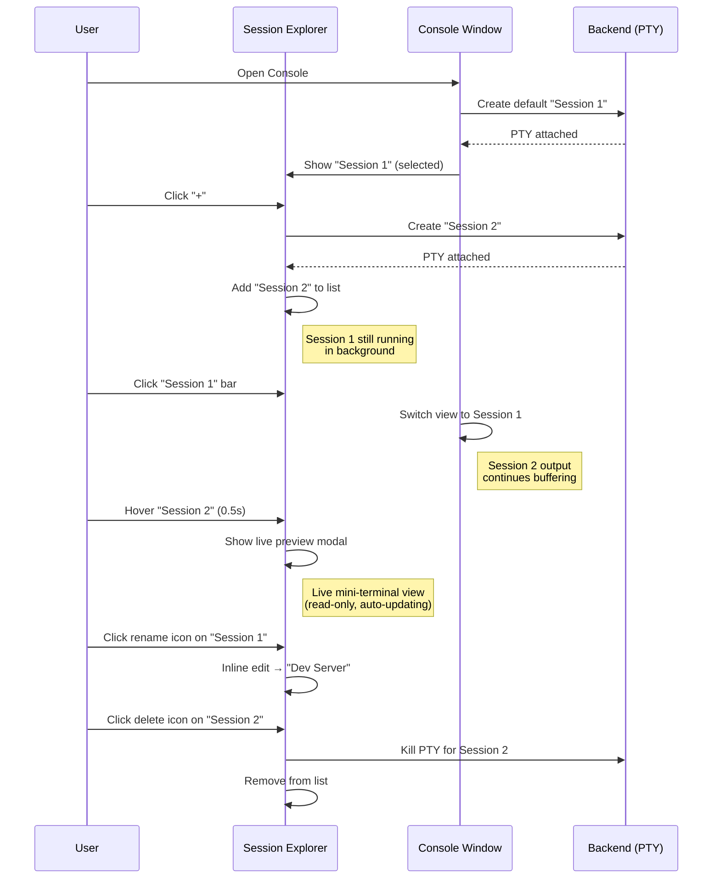
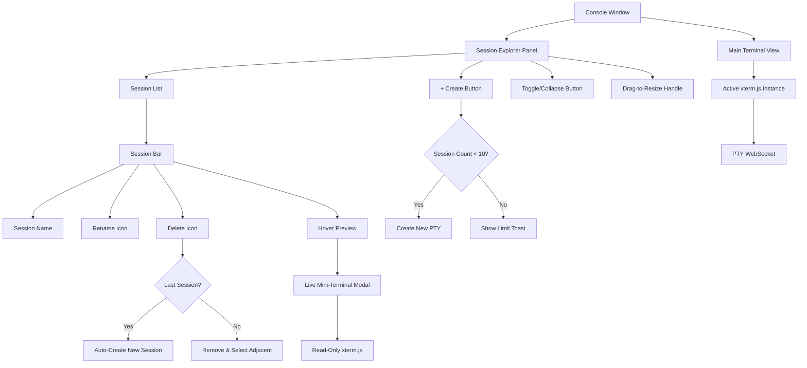

# Idea Summary

> Idea ID: IDEA-021
> Folder: 017. CR-Console Window Explorer
> Version: v2
> Created: 2026-02-11
> Status: Refined
> Classification: Change Request (CR) to FEATURE-005 Interactive Console

## Overview

Replace the current 2-pane split-terminal layout in the console window with a **Session Explorer** — a collapsible, resizable right-side panel that lists up to 10 independent terminal sessions. Only the selected session is visible in the main console area; all other sessions continue running in the background. Sessions can be created via a "+" button, renamed inline, deleted without confirmation, and previewed via a hover-triggered live mini-terminal modal.

## Problem Statement

The existing console feature (FEATURE-005) supports a maximum of **2 terminal sessions** displayed side-by-side. This rigid layout limits productivity for users who need to monitor multiple processes (servers, builds, logs, REPL sessions) simultaneously. There is no way to:

- Manage more than 2 sessions
- Name or organize sessions for quick identification
- Preview a background session without switching to it
- Utilize the full console width for a single session while keeping others accessible

## Target Users

- Developers running multiple concurrent processes (dev servers, test watchers, REPLs)
- Users who need to monitor background tasks without losing context
- Power users managing complex multi-service environments

## Proposed Solution

Add a **Session Explorer panel** to the right side of the console window. The panel is collapsible via a toggle button and resizable via drag. Each session appears as a bar in the explorer with rename and delete action icons. Hovering over a session bar for 0.5 seconds triggers a live preview modal.

### User Flow

## Key Features

### Feature Architecture

1. **Session Explorer Panel** — Right-side collapsible panel listing all active sessions. Resizable via drag handle. Toggle button to show/hide.

2. **Session Creation ("+" Button)** — Creates a new terminal session with sequential default naming (Session 1, Session 2, ...). Maximum 10 concurrent sessions. Shows toast notification when limit reached.

3. **Single-Session View** — Only the selected session is rendered in the main console area. All other sessions run in the background with their PTY processes active and output buffered.

4. **Session Switching** — Click a session bar in the explorer to switch. The previous session's container div is hidden (`display: none`), and the new session's container is shown (`display: block`). All xterm.js instances remain mounted in the DOM to avoid re-render cost. Output buffer replays any missed content on reconnection.

5. **Session Naming** — Default name: "Session N" (sequential). Rename via edit icon on each session bar — inline text editing. Names persist in localStorage.

6. **Session Deletion** — Click delete icon to immediately terminate PTY and remove session (no confirmation dialog). If the last session is deleted, a new "Session 1" is auto-created.

7. **Hover Preview** — Hovering over a non-selected session bar for 0.5 seconds opens a **live mini-terminal modal** (read-only, auto-updating via OutputBuffer replay + live output stream). The modal size defaults to 50% width × 60% height of the console area and is configurable in `.x-ipe.yaml` (`console.preview_size_percent`). The hover zone includes both the session bar and the modal itself (connected area with 100ms grace period for jitter). Clicking inside the preview switches to that session. Moving cursor outside both bar and modal dismisses it.

## Success Criteria

- [ ] Users can create up to 10 independent terminal sessions via "+" button
- [ ] Only the selected session is visible; all others run in the background
- [ ] Clicking a session bar in the explorer switches the active session
- [ ] Sessions can be renamed inline via edit icon
- [ ] Sessions can be deleted (no confirmation); last-session-deleted auto-creates new one
- [ ] Hovering 0.5s on a session bar shows live mini-terminal preview modal
- [ ] Explorer panel is collapsible via toggle button
- [ ] Explorer panel is resizable via drag
- [ ] Preview modal size is configurable in `.x-ipe.yaml` (`console.preview_size_percent`, default: 50, range: 20–80)
- [ ] No side-by-side split layout — single session view only
- [ ] All existing console functionality (WebSocket, reconnection, buffer replay) preserved
- [ ] Session names map to session UUIDs and persist across page reloads (localStorage)
- [ ] PTY creation failure shows error toast without affecting existing sessions
- [ ] Explorer panel starts expanded by default; collapsed state persists in localStorage

## Constraints & Considerations

- **Backend Impact**: The current `SessionManager` supports multiple PTY sessions but the frontend caps at 2 (`MAX_TERMINALS = 2` in terminal.js). Backend changes should be minimal — primarily raising the session limit to 10.
- **Memory/Performance**: 10 concurrent PTY processes with output buffers (`BUFFER_MAX_CHARS = 10240` each) = ~100KB max buffer memory. Non-visible sessions: keep all xterm.js instances mounted in the DOM but hide their containers via CSS `display: none`. This avoids the xterm.js limitation where `Terminal.open()` is a one-time call with no built-in detach-from-DOM method. Only one container is `display: block` at a time.
- **WebSocket Architecture**: Keep the current pattern of **one Socket.IO connection per session** (`_createSocket` creates a new `io()` per terminal). With 10 sessions, this means 10 WebSocket connections per browser tab. This is simpler and scales the existing 1:1 `socket_sid → session_id` mapping without backend changes.
- **Preview Modal Architecture**: The live preview reads from the session's **OutputBuffer** (replay of last ~10KB). The preview xterm.js instance is read-only and receives buffer replay via a new Socket.IO event `preview_attach` that sends the buffer snapshot without changing the active `socket_to_session` mapping. This avoids breaking the 1:1 socket-session model. The preview updates by listening to the same `output` events broadcast to the session's socket — the frontend routes output to both the main terminal and any active preview.
- **Preview Modal Hover Behavior**: The hover zone includes both the session bar AND the preview modal itself (connected hover area). Moving the cursor from the bar to the modal keeps it open. Moving the cursor outside both dismisses it. Clicking inside the preview switches to that session and dismisses the modal. A 100ms grace period handles hover jitter between bar and modal.
- **Resizable Panel**: Use a CSS drag handle (mousedown + mousemove). Panel width persists in localStorage. Default width: 200px.
- **Breaking Change**: This CR replaces the split-pane layout entirely. Users accustomed to side-by-side terminals will need to adapt to the session explorer workflow.
- **Configuration**: Preview modal size in `.x-ipe.yaml` under a new `console` section: `console.preview_size_percent: 50` — this means 50% of the console area **width** and 60% of the console area **height**. Valid range: 20–80.
- **PTY Creation Failure**: If `pty.fork()` fails when creating session N (e.g., OS file descriptor limit), show an error toast "Failed to create session — system resource limit reached" and do not add the session to the explorer list. Existing sessions remain unaffected.
- **Session Ordering**: Sessions are listed in creation order. Drag-to-reorder is **out of scope for v1**.
- **Keyboard Shortcuts**: Out of scope for v1. May be added as a follow-up CR.
- **Explorer Default State**: Panel starts **expanded** when the console opens. Users can collapse it via the toggle button and the state persists in localStorage.

## Brainstorming Notes

**Key Decisions Made:**
1. Explorer is **right-side, collapsible, and resizable** via drag handle
2. **Auto-create 1 session** on console load (no empty state)
3. **No confirmation dialog** for deletion; auto-create if last session deleted
4. Only **rename and delete** icons on session bars (no copy/duplicate)
5. Default naming: **"Session 1", "Session 2", ...** (sequential)
6. Preview shows **live mini-terminal** (read-only, auto-updating via buffer replay + live stream)
7. Preview modal size **configurable in `.x-ipe.yaml`**, default 50% width × 60% height
8. Keep **one Socket.IO connection per session** (current pattern, no multiplexing)
9. Non-visible xterm.js instances stay **mounted in DOM** (CSS hide/show, not detach/reattach)
10. Preview hover zone includes **both session bar and modal** (connected area)

**Additions Beyond Original Request** (validated during brainstorming):
- Session deletion behavior (not in original 5 requirements — added based on completeness)
- Collapsible + resizable panel (original only mentioned session explorer)
- Explorer default state (expanded)
- Error handling for PTY creation failures

**Explicitly Out of Scope (v1):**
- Keyboard shortcuts for session navigation (Ctrl+Tab, etc.)
- Drag-to-reorder sessions in the explorer
- Session grouping or tagging
- Split-pane view within a session

## Source Files

- `new idea.md` — Original idea description with 5 requirements
- `console-explorer.png` — Reference screenshot of session explorer UI

## Next Steps

- [x] ~~Proceed to Idea Mockup~~ — Completed (see mockup below)
- [ ] Proceed to Requirement Gathering (recommended next)
- [ ] Proceed to Idea to Architecture

## Mockups and Prototypes

### Console Explorer Interactive Mockup

- **File:** [mockups/console-explorer-v1.html](mockups/console-explorer-v1.html)
- **Tool:** x-ipe-tool-frontend-design
- **Theme:** Default (Slate/Emerald) adapted to terminal-dark aesthetic

**Scenarios included:**

| Scenario | What It Shows |
|----------|---------------|
| Default View | Console with 1 session, explorer panel on the right |
| 5 Sessions | Multiple named sessions (Dev Server, Test Runner, Log Watcher, Node Debug, Session 5) |
| Rename Session | Inline rename editing with focused input field |
| Hover Preview | Live mini-terminal preview modal appearing on hover |
| Max Sessions | 10/10 sessions with toast notification for limit reached |
| Explorer Collapsed | Full-width console with explorer hidden |

**Interactive features:**
- Click sessions to switch between them
- Click "+" to create new sessions (up to 10)
- Click rename icon for inline editing
- Click delete icon to remove sessions
- Hover session bars to see live preview modal (0.5s delay)
- Click toggle button to collapse/expand explorer
- Drag resize handle to adjust explorer width

## References & Common Principles

### Applied Principles

- **Single Active View Pattern** — Only one session is rendered at a time to optimize performance and reduce cognitive load. Background sessions remain alive but detached from the DOM. Used by VS Code, iTerm2, and all modern terminal emulators.
- **Lazy Rendering** — xterm.js instances for non-visible sessions are detached from the DOM but kept in memory. When switching back, the instance is re-attached without re-parsing the output buffer. This is the standard approach for tab-based terminal UIs.
- **Hover Preview (Peek Pattern)** — A 0.5-second delay before showing the preview prevents accidental triggers while still being responsive. Live content in the preview gives users a reason to peek without fully switching context. Inspired by VS Code's editor preview and browser tab previews.
- **Progressive Disclosure** — The explorer panel is collapsible, so users who only need one session see a clean, full-width terminal. Power users who need multi-session management can expand it. The drag-to-resize handle lets users find their preferred panel width.

### Further Reading

- xterm.js API: Terminal.open(), Terminal.dispose(), attach/detach patterns
- Socket.IO rooms: routing output to multiple consumers (active view + preview)
- CSS resize/drag patterns for panel resizing
