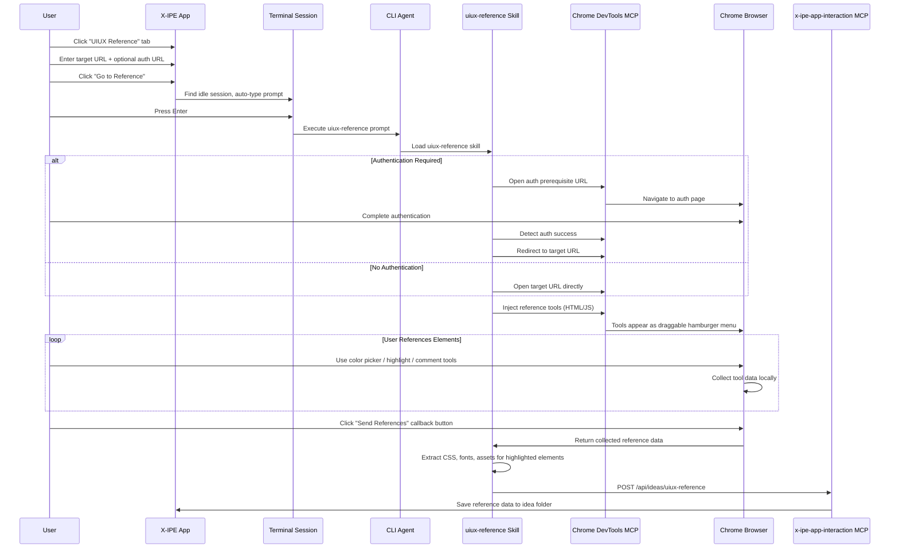

# Idea Summary

> Idea ID: IDEA-018
> Folder: 018. Feature-UIUX Reference
> Version: v1
> Created: 2026-02-13
> Status: Refined

## Overview

Add a **UIUX Reference** tab to the ideation workflow that lets users reference external web pages for design inspiration. The tab integrates with Chrome DevTools MCP to open target URLs, inject interactive tools (color picker, element inspector, commenting), and extract design assets (CSS, fonts, images) for 1:1 mockup reproduction. All collected reference data is saved back to the idea folder via a new MCP-based API.

## Problem Statement

When ideating new features with UI/UX components, designers and developers often reference existing websites for inspiration — picking colors, studying layouts, inspecting typography, and noting interaction patterns. Currently, this is a manual, disconnected process: users take screenshots, manually copy hex codes, and paste notes into documents. There is no integrated way to reference a live web page, extract design data, and feed it directly into the ideation workflow.

## Target Users

- **X-IPE users** who create ideas with strong UI/UX components
- **Developers** who want to replicate existing UI patterns in their projects
- **Designers** who need to extract design tokens from reference sites

## Proposed Solution

A three-layer solution:

1. **Frontend Tab** — New "UIUX Reference" tab in the ideation interface with URL input, authentication prerequisites, extra instructions, and a "Go to Reference" button
2. **Agent Skill** — A `uiux-reference` skill that uses Chrome DevTools MCP to open the URL, inject interactive tools into the page, and collect reference data
3. **MCP API** — A new `x-ipe-app-and-agent-interaction` MCP endpoint that receives collected reference data and saves it to the idea folder

### End-to-End Flow



## Key Features

### 1. UIUX Reference Tab (Frontend)

- URL input box for target page
- Optional prerequisite URL(s) for authentication flows
- Extra instruction text box for guiding the agent
- "Go to Reference" button that triggers console prompt
- Uses `copilot-prompt.json` for prompt template configuration

### 2. uiux-reference Skill (Agent-Side)

- Opens target URL via Chrome DevTools MCP
- Handles prerequisite authentication pages
- Injects interactive reference tools as a **draggable toolbar** (starts top-right)
- Tools are collapsed as a hamburger menu; expand on hover

#### Injected Tool List

| Tool | Function | Data Collected |
|------|----------|----------------|
| **Color Picker** | Pick any color from the page | Hex, RGB, HSL values + CSS selector of source element |
| **Element Highlighter** | Highlight & inspect any element (like browser DevTools) | CSS selector path, bounding box, full-page + cropped screenshot |
| **Element Commenter** | Attach text comments to highlighted elements | Comment text + CSS tree selector (e.g., `body > header > nav.main-nav`) |
| **Asset Extractor** | Extract computed styles, CSS rules, fonts, icons, images for 1:1 reproduction | Computed CSS, relevant stylesheets, font files, icon refs, image URLs |

### 3. Callback & Data Flow

- Single "Send References" button — sends all collected data at once
- Agent processes data: takes screenshots, extracts CSS/assets
- Calls `x-ipe-app-and-agent-interaction` MCP to save data

### 4. x-ipe-app-and-agent-interaction MCP

- New MCP server with dedicated API endpoint
- `POST /api/ideas/uiux-reference` — receives and saves reference data
- Saves to idea folder with structured subfolder layout

### 5. Design System Integration

- Extracted colors/typography auto-generate a local `design-system.md` in the idea folder
- Can be promoted to global `brand-theme-creator` level if needed

## Reference Data JSON Schema

```json
{
  "version": "1.0",
  "source_url": "https://example.com/page",
  "auth_url": "https://example.com/login",
  "timestamp": "2026-02-13T07:26:00Z",
  "idea_folder": "018. Feature-UIUX Reference",
  "colors": [
    {
      "id": "color-001",
      "hex": "#1A73E8",
      "rgb": "26, 115, 232",
      "hsl": "217, 80%, 51%",
      "source_selector": "body > header > .brand-logo",
      "context": "Primary brand color from header logo"
    }
  ],
  "elements": [
    {
      "id": "elem-001",
      "selector": "body > main > section.hero > .cta-button",
      "tag": "button",
      "bounding_box": { "x": 120, "y": 340, "width": 200, "height": 48 },
      "screenshots": {
        "full_page": "screenshots/full-page-001.png",
        "element_crop": "screenshots/elem-001-crop.png"
      },
      "comment": "Primary CTA button — rounded corners, gradient background",
      "extracted_assets": {
        "computed_css": "assets/elem-001/computed-styles.json",
        "relevant_css_rules": "assets/elem-001/rules.css",
        "fonts": ["assets/fonts/Inter-Bold.woff2"],
        "icons": [],
        "images": ["assets/elem-001/bg-gradient.png"]
      }
    }
  ],
  "design_tokens": {
    "colors": {
      "primary": "#1A73E8",
      "secondary": "#34A853",
      "background": "#FFFFFF",
      "text": "#202124"
    },
    "typography": {
      "heading_font": "Google Sans",
      "body_font": "Roboto",
      "base_size": "16px"
    },
    "spacing": {
      "unit": "8px"
    }
  }
}
```

## Folder Structure for Reference Data

```
x-ipe-docs/ideas/{idea-folder}/
├── new idea.md                     # Original idea file
├── idea-summary-v1.md              # This summary
└── uiux-references/
    ├── reference-data.json          # Main reference data (JSON schema above)
    ├── design-system.md             # Auto-generated design system from extracted tokens
    ├── screenshots/
    │   ├── full-page-001.png        # Full page screenshots
    │   ├── elem-001-crop.png        # Cropped element screenshots
    │   └── elem-002-crop.png
    └── assets/
        ├── elem-001/
        │   ├── computed-styles.json  # Full computed CSS for element
        │   ├── rules.css             # Relevant CSS rules
        │   └── bg-gradient.png       # Extracted image assets
        ├── fonts/
        │   ├── Inter-Bold.woff2
        │   └── Roboto-Regular.woff2
        └── icons/
            └── arrow-right.svg
```

### Naming Conventions

| Asset Type | Pattern | Example |
|------------|---------|---------|
| Full-page screenshot | `full-page-{NNN}.png` | `full-page-001.png` |
| Element crop | `elem-{NNN}-crop.png` | `elem-001-crop.png` |
| Computed styles | `elem-{NNN}/computed-styles.json` | `elem-001/computed-styles.json` |
| CSS rules | `elem-{NNN}/rules.css` | `elem-001/rules.css` |
| Fonts | `fonts/{font-name}.{ext}` | `fonts/Inter-Bold.woff2` |
| Icons | `icons/{icon-name}.svg` | `icons/arrow-right.svg` |

## Architecture

### System Landscape

```architecture-dsl
landscape "UIUX Reference System"

zone "User Interface" {
  app "X-IPE Web App" {
    desc "Ideation UIUX Reference Tab"
    type frontend
  }
}

zone "Terminal Layer" {
  app "Terminal Session" {
    desc "Console window running CLI agent"
    type service
  }
  app "CLI Agent" {
    desc "Copilot/OpenCode CLI"
    type service
  }
}

zone "Skill & MCP Layer" {
  app "uiux-reference Skill" {
    desc "Chrome DevTools orchestration"
    type service
  }
  app "Chrome DevTools MCP" {
    desc "Browser automation protocol"
    type service
  }
  app "x-ipe-app-interaction MCP" {
    desc "API for receiving reference data"
    type service
  }
}

zone "Browser" {
  app "Chrome Browser" {
    desc "Target page with injected tools"
    type frontend
  }
}

flow "X-IPE Web App" -> "Terminal Session" "trigger prompt"
flow "Terminal Session" -> "CLI Agent" "execute"
flow "CLI Agent" -> "uiux-reference Skill" "load"
flow "uiux-reference Skill" -> "Chrome DevTools MCP" "open URL, inject tools"
flow "Chrome DevTools MCP" -> "Chrome Browser" "automate"
flow "Chrome Browser" -> "uiux-reference Skill" "callback data"
flow "uiux-reference Skill" -> "x-ipe-app-interaction MCP" "POST reference data"
flow "x-ipe-app-interaction MCP" -> "X-IPE Web App" "save to idea folder"
```

### Module View

```architecture-dsl
modules "UIUX Reference Modules"

layer "Frontend" {
  module "UIUX Reference Tab" {
    desc "URL input, auth config, Go to Reference button"
    depends "Console Integration"
  }
  module "Injected Toolbar" {
    desc "Draggable hamburger menu with color picker, highlighter, commenter, extractor"
  }
}

layer "Integration" {
  module "Console Integration" {
    desc "Find idle session, auto-type copilot-prompt"
    depends "copilot-prompt.json Config"
  }
  module "copilot-prompt.json Config" {
    desc "Prompt template for uiux-reference"
  }
}

layer "Agent Skills" {
  module "uiux-reference Skill" {
    desc "Orchestrates Chrome DevTools, handles auth, injects tools, collects data"
    depends "Chrome DevTools MCP"
    depends "x-ipe-app-interaction MCP"
  }
}

layer "MCP Servers" {
  module "Chrome DevTools MCP" {
    desc "CDP-based browser automation"
  }
  module "x-ipe-app-interaction MCP" {
    desc "POST /api/ideas/uiux-reference endpoint"
    depends "Idea Folder Storage"
  }
}

layer "Storage" {
  module "Idea Folder Storage" {
    desc "uiux-references/ subfolder with JSON, screenshots, assets"
  }
}
```

## Success Criteria

- [ ] UIUX Reference tab visible in ideation interface with URL input, auth URL, instructions, and Go to Reference button
- [ ] Clicking Go to Reference opens console, auto-types prompt from copilot-prompt.json
- [ ] Agent opens target URL in Chrome via DevTools MCP (with auth prerequisite support)
- [ ] Draggable toolbar injected with color picker, element highlighter, element commenter, asset extractor
- [ ] Color picker captures hex/RGB/HSL + source CSS selector
- [ ] Element highlighter captures CSS selector path + full-page + cropped screenshots
- [ ] Element commenter attaches text comments to elements via CSS tree selector
- [ ] Asset extractor captures computed CSS, relevant rules, fonts, icons, images
- [ ] Single "Send References" callback button sends all data at once
- [ ] Reference data saved as JSON in `uiux-references/` subfolder of idea folder
- [ ] Auto-generated `design-system.md` from extracted design tokens
- [ ] Screenshots and assets organized per naming conventions

## Constraints & Considerations

- **Authentication:** Some pages require login — prerequisite URL flow handles this
- **Cross-origin:** Asset extraction may be limited by CORS; document known limitations
- **Font licensing:** Extracted fonts are for reference only; note licensing concerns
- **Page complexity:** Heavy SPA pages may have dynamic content; tools should work with current DOM state
- **Chrome DevTools MCP dependency:** Requires MCP server to be configured and running
- **Data size:** Full-page screenshots + assets can be large; consider compression

## Brainstorming Notes

Key decisions from brainstorming:

1. **Standalone tab** — UIUX Reference is a third way to create an idea (alongside Compose and Upload)
2. **Console-first flow** — User sees console open, prompt auto-typed, hits Enter; agent takes over
3. **Draggable toolbar** — Starts top-right, user can move anywhere; collapses to hamburger icon
4. **Authentication support** — Prerequisite URL for login pages, agent detects auth success and redirects
5. **Single callback** — All data sent at once when user clicks "Send References"
6. **Full extraction** — Computed CSS, relevant rules, fonts, icons, images for 1:1 reproduction
7. **Local design-system.md** — Auto-generated in idea folder; can be promoted to global brand theme
8. **JSON data format** — Optimized for MCP transport; structured schema with element-level granularity
9. **CSS tree selectors** — Used for element identification (e.g., `body > header > nav.main-nav`)
10. **copilot-prompt.json** — Prompt template stored in existing config mechanism

## Ideation Artifacts (If Tools Used)

- Sequence diagram: End-to-end flow (mermaid)
- System landscape: Architecture overview (architecture-dsl)
- Module view: Component breakdown (architecture-dsl)

## Source Files

- new idea.md

## Next Steps

- [ ] Proceed to Idea Mockup (for the UIUX Reference tab UI)
- [ ] Proceed to Idea to Architecture (for the MCP server design)
- [ ] Proceed to Requirement Gathering (for full feature breakdown)

## References & Common Principles

### Applied Principles

- **Chrome DevTools Protocol (CDP)** — Standard protocol for browser automation, inspection, and page manipulation. Used via Chrome DevTools MCP for injecting tools and extracting data.
- **Design Tokens (W3C)** — Community-standard format for storing design decisions (colors, typography, spacing) in a portable, tool-agnostic way.
- **CSS Selector Specificity** — Using full CSS tree paths (e.g., `body > header > nav.main-nav`) ensures reliable, unambiguous element identification.
- **Model Context Protocol (MCP)** — Anthropic's standard for LLM-to-service communication. Used for both Chrome DevTools integration and the new app-interaction API.

### Further Reading

- [Chrome DevTools Protocol Documentation](https://chromedevtools.github.io/devtools-protocol/)
- [W3C Design Tokens Community Group](https://www.w3.org/community/design-tokens/)
- [MCP Specification](https://spec.modelcontextprotocol.io/)
