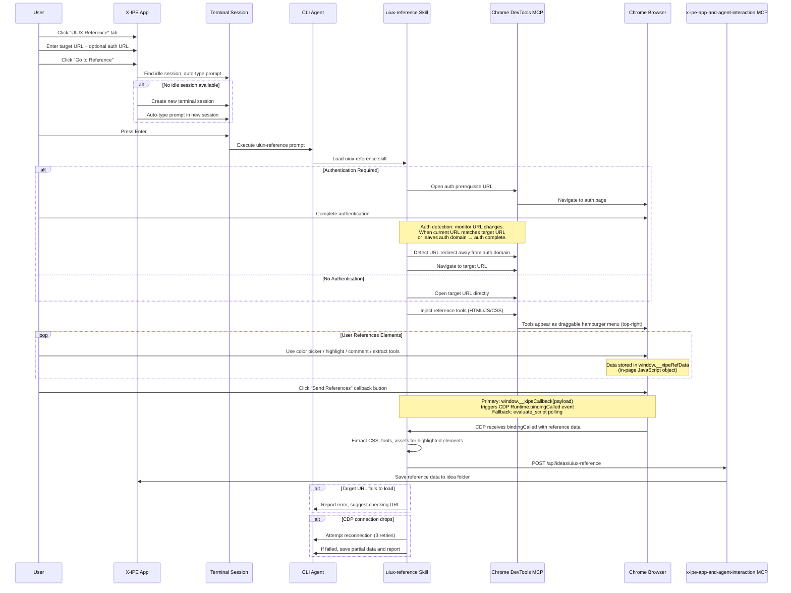
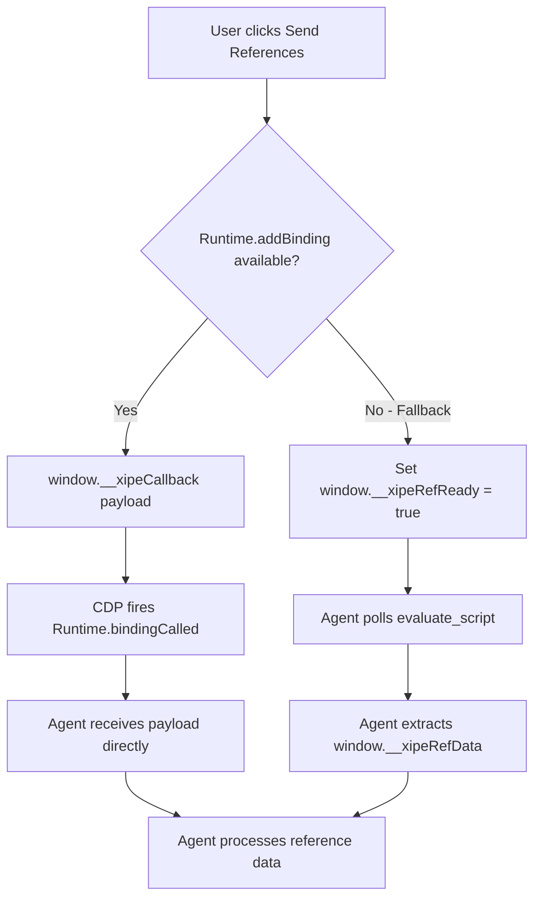
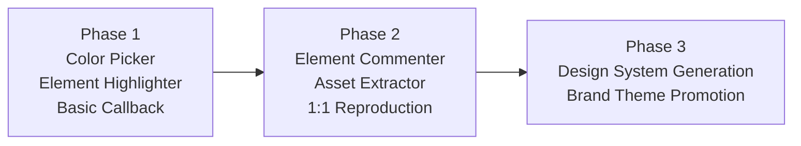

# Idea Summary

> Idea ID: IDEA-018
> Folder: 018. Feature-UIUX Reference
> Version: v3
> Created: 2026-02-13
> Status: Refined

## Overview

Add a **UIUX Reference** tab to the ideation workflow that lets users reference external web pages for design inspiration. The tab integrates with Chrome DevTools MCP to open target URLs, inject interactive tools (color picker, element inspector, commenting, asset extractor), and extract design assets (CSS, fonts, images) for 1:1 mockup reproduction. All collected reference data is saved back to the idea folder via a new MCP-based API.

## Problem Statement

When ideating new features with UI/UX components, designers and developers often reference existing websites for inspiration — picking colors, studying layouts, inspecting typography, and noting interaction patterns. Currently, this is a manual, disconnected process: users take screenshots, manually copy hex codes, and paste notes into documents. There is no integrated way to reference a live web page, extract design data, and feed it directly into the ideation workflow.

## Target Users

- **X-IPE users** who create ideas with strong UI/UX components
- **Developers** who want to replicate existing UI patterns in their projects
- **Designers** who need to extract design tokens from reference sites

## Proposed Solution

A three-layer solution:

1. **Frontend Tab** — New "UIUX Reference" tab in the ideation interface with URL input, authentication prerequisites, extra instructions, and a "Go to Reference" button
2. **Agent Skill** — A `uiux-reference` skill that uses Chrome DevTools MCP to open the URL, inject interactive tools into the page, and collect reference data
3. **MCP API** — A new `x-ipe-app-and-agent-interaction` MCP endpoint that receives collected reference data and saves it to the idea folder

## Out of Scope

- **Multi-URL sessions** — Each reference session targets a single page URL (plus optional auth prerequisite). Multiple reference sessions for the same idea can be run separately and merged.
- **iframe / Shadow DOM** — Initial version targets top-level DOM only. Shadow DOM and cross-origin iframe inspection may be added later.
- **Real-time collaboration** — Only single-user reference sessions; no multi-user sync.
- **Automated design system inference** — Spacing grids, component hierarchies, and layout patterns are NOT auto-inferred. Only directly extractable tokens (colors, fonts, sizes) are captured.
- **Adding references to existing Compose/Upload ideas** — v1 is standalone only. Future versions may allow adding references to existing ideas.

### End-to-End Flow



## Key Features

### Phase 1: Core Reference Tools

#### 1. UIUX Reference Tab (Frontend)

- URL input box for target page
- Optional prerequisite URL for authentication flows
- Extra instruction text box for guiding the agent
- "Go to Reference" button that triggers console prompt
- Uses `copilot-prompt.json` for prompt template configuration (key: `uiux-reference`)

#### 2. uiux-reference Skill (Agent-Side)

- Opens target URL via Chrome DevTools MCP
- Handles prerequisite authentication pages (URL-change-based detection)
- Injects interactive reference tools as a **draggable toolbar** (starts top-right)
- Tools are collapsed as a hamburger menu; expand on hover

#### Injected Tool List — Phase 1

| Tool | Function | Data Collected |
|------|----------|----------------|
| **Color Picker** | Pick any color from the page | Hex, RGB, HSL values + CSS selector of source element |
| **Element Highlighter** | Highlight & inspect any element (like browser DevTools) | CSS selector path, bounding box, full-page + cropped screenshot |

#### 3. Callback Mechanism

**Primary: CDP `Runtime.addBinding` (Option A)**

- Before injecting tools, agent calls `Runtime.addBinding(name: "__xipeCallback")` to register a named binding
- This creates a native `window.__xipeCallback(payload)` function in the page context
- Injected tools store data in `window.__xipeRefData` (in-page JavaScript object)
- "Send References" button calls `window.__xipeCallback(JSON.stringify(window.__xipeRefData))`
- CDP fires `Runtime.bindingCalled` event with `name: "__xipeCallback"` and `payload: <JSON string>`
- Agent receives the event directly — no string parsing, no polling, no console noise
- This binding survives page reloads (if `addBinding` is called without `executionContextId`)

> **Why `Runtime.addBinding`?** It is purpose-built for page→DevTools communication. Puppeteer's `page.exposeFunction()` and Playwright's `page.exposeBinding()` both use this mechanism internally. While marked "Experimental" in the CDP spec, it is stable and widely adopted.

**Fallback: `evaluate_script` pull (Option D)**

If `Runtime.addBinding` is not available (e.g., MCP doesn't support raw CDP events):
- Injected "Send References" button sets `window.__xipeRefReady = true`
- Agent uses Chrome DevTools MCP's `evaluate_script` tool to poll: `() => window.__xipeRefReady ? window.__xipeRefData : null`
- When non-null response received, agent extracts the reference data
- Alternatively, "Send References" changes the page title to `__XIPE_REF_READY__`; agent detects via `take_snapshot`



### Phase 2: Advanced Tools

| Tool | Function | Data Collected |
|------|----------|----------------|
| **Element Commenter** | Attach text comments to highlighted elements | Comment text + CSS tree selector (e.g., `body > header > nav.main-nav`) |
| **Asset Extractor** | Extract computed styles, CSS rules, fonts, icons, images for 1:1 reproduction | Computed CSS, relevant stylesheets, font files (downloaded), icon refs, image URLs (downloaded) |

### Phase 3: Design System Integration

- Extracted colors/typography auto-generate a local `design-system.md` in the idea folder
- Can be promoted to global `brand-theme-creator` level if needed

### 4. x-ipe-app-and-agent-interaction MCP

- **Purpose-built MCP server** specifically for X-IPE app ↔ agent communication
- Designed for reuse: UIUX Reference is the first use case, but the MCP can host additional app-agent interaction endpoints in the future
- `POST /api/ideas/uiux-reference` — receives and saves reference data to idea folder
- Future endpoints may include: feedback submission, idea status updates, etc.

### 5. Console Session Handling

- "Go to Reference" first searches for a non-in-progress terminal session
- If no idle session exists → creates a new terminal session
- Auto-types the prompt: `copilot execute uiux-reference --url {url} --auth-url {auth_url} --extra "{instructions}"`
- Prompt template stored in `copilot-prompt.json`

## Error Handling

| Scenario | Behavior |
|----------|----------|
| Target URL fails to load | Report error to agent, suggest checking URL or network |
| CDP connection drops mid-session | Attempt 3 reconnection retries; if failed, save partial data and report |
| User closes browser tab | Detect tab close via CDP event, report to agent, allow restart |
| Auth timeout | After 5 minutes on auth page without redirect, prompt user |
| CORS-blocked assets | Log warning, skip blocked assets, continue with available data |
| Page with z-index conflicts | Toolbar uses `z-index: 2147483647` (max) to stay on top |

## Reference Data JSON Schema

```json
{
  "version": "1.0",
  "source_url": "https://example.com/page",
  "auth_url": "https://example.com/login",
  "timestamp": "2026-02-13T07:26:00Z",
  "idea_folder": "018. Feature-UIUX Reference",
  "session_id": "ref-session-001",
  "colors": [
    {
      "id": "color-001",
      "hex": "#1A73E8",
      "rgb": "26, 115, 232",
      "hsl": "217, 80%, 51%",
      "source_selector": "body > header > .brand-logo",
      "context": "Primary brand color from header logo"
    }
  ],
  "elements": [
    {
      "id": "elem-001",
      "selector": "body > main > section.hero > .cta-button",
      "tag": "button",
      "bounding_box": { "x": 120, "y": 340, "width": 200, "height": 48 },
      "screenshots": {
        "full_page": "screenshots/full-page-001.png",
        "element_crop": "screenshots/elem-001-crop.png"
      },
      "comment": "Primary CTA button — rounded corners, gradient background",
      "extracted_assets": {
        "computed_css": "assets/elem-001/computed-styles.json",
        "relevant_css_rules": "assets/elem-001/rules.css",
        "fonts": ["assets/fonts/Inter-Bold.woff2"],
        "icons": [],
        "images": ["assets/elem-001/bg-gradient.png"]
      }
    }
  ],
  "design_tokens": {
    "colors": {
      "primary": "#1A73E8",
      "secondary": "#34A853",
      "background": "#FFFFFF",
      "text": "#202124"
    },
    "typography": {
      "heading_font": "Google Sans",
      "body_font": "Roboto",
      "base_size": "16px"
    }
  }
}
```

> **Note on design_tokens:** Only directly extractable values are captured (color hex codes from computed styles, font-family names, font-size values). Spacing grids and component hierarchies are NOT auto-inferred — they require manual curation in the generated `design-system.md`.

> **Note on fonts/images:** Binary assets (fonts, images) are downloaded and stored locally in the `assets/` folder. These are for reference purposes only — licensing for production use is the user's responsibility.

## Folder Structure for Reference Data

```
x-ipe-docs/ideas/{idea-folder}/
├── new idea.md                      # Original idea file
├── idea-summary-v2.md               # This summary
└── uiux-references/
    ├── reference-data.json           # Main reference data (latest session)
    ├── sessions/
    │   ├── ref-session-001.json      # Individual session data (for multi-session)
    │   └── ref-session-002.json      # Each session appends; reference-data.json = merged view
    ├── design-system.md              # Auto-generated design system from extracted tokens
    ├── screenshots/
    │   ├── full-page-001.png         # Full page screenshots
    │   ├── elem-001-crop.png         # Cropped element screenshots
    │   └── elem-002-crop.png
    └── assets/
        ├── elem-001/
        │   ├── computed-styles.json   # Full computed CSS for element
        │   ├── rules.css              # Relevant CSS rules
        │   └── bg-gradient.png        # Extracted image assets
        ├── fonts/
        │   ├── Inter-Bold.woff2
        │   └── Roboto-Regular.woff2
        └── icons/
            └── arrow-right.svg
```

> **Multi-session handling:** Each reference session saves to `sessions/ref-session-NNN.json`. The top-level `reference-data.json` is the merged view of all sessions. Running a new session appends — never overwrites.

### Naming Conventions

| Asset Type | Pattern | Example |
|------------|---------|---------|
| Full-page screenshot | `full-page-{NNN}.png` | `full-page-001.png` |
| Element crop | `elem-{NNN}-crop.png` | `elem-001-crop.png` |
| Computed styles | `elem-{NNN}/computed-styles.json` | `elem-001/computed-styles.json` |
| CSS rules | `elem-{NNN}/rules.css` | `elem-001/rules.css` |
| Fonts | `fonts/{font-name}.{ext}` | `fonts/Inter-Bold.woff2` |
| Icons | `icons/{icon-name}.svg` | `icons/arrow-right.svg` |
| Session data | `sessions/ref-session-{NNN}.json` | `sessions/ref-session-001.json` |

## Architecture

### System Landscape

```architecture-dsl
landscape "UIUX Reference System"

zone "User Interface" {
  app "X-IPE Web App" {
    desc "Ideation UIUX Reference Tab"
    type frontend
  }
}

zone "Terminal Layer" {
  app "Terminal Session" {
    desc "Console window running CLI agent"
    type service
  }
  app "CLI Agent" {
    desc "Copilot/OpenCode CLI"
    type service
  }
}

zone "Skill & MCP Layer" {
  app "uiux-reference Skill" {
    desc "Chrome DevTools orchestration, auth handling, tool injection"
    type service
  }
  app "Chrome DevTools MCP" {
    desc "CDP-based browser automation protocol"
    type service
  }
  app "x-ipe-app-and-agent-interaction MCP" {
    desc "General-purpose app-agent communication API"
    type service
  }
}

zone "Browser" {
  app "Chrome Browser" {
    desc "Target page with injected toolbar (color picker, highlighter, commenter, extractor)"
    type frontend
  }
}

flow "X-IPE Web App" -> "Terminal Session" "find idle or create session, auto-type prompt"
flow "Terminal Session" -> "CLI Agent" "user presses Enter"
flow "CLI Agent" -> "uiux-reference Skill" "load skill"
flow "uiux-reference Skill" -> "Chrome DevTools MCP" "open URL, inject tools, register binding"
flow "Chrome DevTools MCP" -> "Chrome Browser" "CDP automation"
flow "Chrome Browser" -> "uiux-reference Skill" "callback via Runtime.bindingCalled"
flow "uiux-reference Skill" -> "x-ipe-app-and-agent-interaction MCP" "POST /api/ideas/uiux-reference"
flow "x-ipe-app-and-agent-interaction MCP" -> "X-IPE Web App" "save to idea folder"
```

### Module View

```architecture-dsl
modules "UIUX Reference Modules"

layer "Frontend" {
  module "UIUX Reference Tab" {
    desc "URL input, auth URL, extra instructions, Go to Reference button"
    depends "Console Integration"
  }
  module "Injected Toolbar" {
    desc "Draggable hamburger menu: color picker, highlighter, commenter, extractor"
    depends "Chrome DevTools MCP"
    depends "Callback Mechanism"
  }
}

layer "Integration" {
  module "Console Integration" {
    desc "Find idle session or create new, auto-type copilot-prompt"
    depends "copilot-prompt.json Config"
  }
  module "copilot-prompt.json Config" {
    desc "Prompt template entry for uiux-reference"
  }
  module "Callback Mechanism" {
    desc "Primary: Runtime.addBinding + bindingCalled. Fallback: evaluate_script polling"
  }
}

layer "Agent Skills" {
  module "uiux-reference Skill" {
    desc "Orchestrates CDP: auth detection, tool injection, data collection, asset extraction"
    depends "Chrome DevTools MCP"
    depends "x-ipe-app-and-agent-interaction MCP"
    depends "Callback Mechanism"
  }
}

layer "MCP Servers" {
  module "Chrome DevTools MCP" {
    desc "CDP-based browser automation"
  }
  module "x-ipe-app-and-agent-interaction MCP" {
    desc "POST /api/ideas/uiux-reference — general-purpose app-agent API"
    depends "Idea Folder Storage"
  }
}

layer "Storage" {
  module "Idea Folder Storage" {
    desc "uiux-references/ subfolder: sessions/, screenshots/, assets/, design-system.md"
  }
}
```

### Phasing Roadmap



## Success Criteria

### Phase 1

- [ ] UIUX Reference tab visible in ideation interface with URL input, auth URL, instructions, and Go to Reference button
- [ ] Clicking Go to Reference opens console (idle session or new), auto-types prompt from copilot-prompt.json
- [ ] Agent opens target URL in Chrome via DevTools MCP
- [ ] Auth prerequisite flow works: open auth URL → user authenticates → URL-change detection → redirect to target
- [ ] Draggable toolbar injected top-right, remains on top (z-index max), functional after scroll/resize
- [ ] Color picker captures hex/RGB/HSL + source CSS selector
- [ ] Element highlighter captures CSS selector path + full-page + cropped screenshots
- [ ] Single "Send References" callback via `Runtime.addBinding` (primary) or `evaluate_script` polling (fallback)
- [ ] Reference data saved as JSON in `uiux-references/sessions/` subfolder
- [ ] Top-level `reference-data.json` created as merged view

### Phase 2

- [ ] Element commenter attaches text comments via CSS tree selector
- [ ] Asset extractor captures computed CSS, relevant rules, fonts, icons, images
- [ ] Binary assets (fonts, images) downloaded and stored in `assets/` folder

### Phase 3

- [ ] Auto-generated `design-system.md` from extracted design tokens (colors, fonts only)
- [ ] Promotion path to global brand-theme-creator level documented

## Constraints & Considerations

- **Authentication:** Prerequisite URL flow with URL-change-based detection; 5-minute timeout before prompting user
- **Cross-origin (CORS):** Asset extraction may be limited; blocked assets are skipped with warnings logged
- **Font licensing:** Extracted fonts are for reference only; licensing disclaimer included
- **Page complexity:** Works with current DOM state; dynamic SPA content may need manual refresh
- **Chrome DevTools MCP dependency:** Requires MCP server to be configured and running
- **Data size:** Full-page screenshots + assets can be large; consider compression for storage
- **z-index conflicts:** Toolbar uses max z-index; tested on pages with high z-index elements
- **Top-level DOM only:** Shadow DOM and cross-origin iframes are out of scope for v1

## Brainstorming Notes

Key decisions from brainstorming:

1. **Standalone tab** — UIUX Reference is a third way to create an idea (alongside Compose and Upload)
2. **Console-first flow** — User sees console open, prompt auto-typed, hits Enter; agent takes over
3. **Draggable toolbar** — Starts top-right, user can move anywhere; collapses to hamburger icon
4. **Authentication support** — Prerequisite URL for login pages, URL-change-based detection for auth success
5. **Primary callback: `Runtime.addBinding`** — Agent registers `__xipeCallback` binding; injected JS calls it; CDP fires `bindingCalled` event. Fallback: `evaluate_script` polling via Chrome DevTools MCP tools.
6. **Full extraction (Phase 2)** — Computed CSS, relevant rules, fonts, icons, images downloaded for 1:1 reproduction
7. **Local design-system.md (Phase 3)** — Auto-generated in idea folder; can be promoted to global brand theme
8. **JSON data format** — Optimized for MCP transport; structured schema with session-level granularity
9. **CSS tree selectors** — Used for element identification (e.g., `body > header > nav.main-nav`)
10. **copilot-prompt.json** — Prompt template stored in existing config mechanism (key: `uiux-reference`)
11. **Multi-session support** — Each session saves separately; top-level JSON is merged view
12. **New MCP is reusable** — `x-ipe-app-and-agent-interaction` MCP designed for general app-agent communication, not just UIUX Reference
13. **Phased approach** — Phase 1 (color picker + highlighter), Phase 2 (commenter + extractor), Phase 3 (design system)
14. **No idle session → create new** — Console integration handles missing sessions gracefully

## Mockups & Prototypes

| Mockup | Type | Path | Theme | Tool Used |
|--------|------|------|-------|-----------|
| UIUX Reference Tab (v2) | HTML | mockups/uiux-reference-tab-v2.html | Light / Editorial | x-ipe-tool-frontend-design |
| Injected Reference Toolbar (v2) | HTML | mockups/injected-toolbar-v2.html | Light / Editorial | x-ipe-tool-frontend-design |
| UIUX Reference Tab (v1) | HTML | mockups/uiux-reference-tab-v1.html | Dark / Glassmorphism | x-ipe-tool-frontend-design |
| Injected Reference Toolbar (v1) | HTML | mockups/injected-toolbar-v1.html | Dark / Glassmorphism | x-ipe-tool-frontend-design |

> **Primary mockups:** v2 (light theme). v1 retained as dark-mode alternative.

### Preview Instructions

- Open HTML files in browser to view interactive mockups
- **UIUX Reference Tab (v2)** — Light editorial aesthetic with warm cream canvas, Fraunces + Outfit typography, deep indigo accents. Shows the new third tab with URL input, collapsible auth prerequisite, extra instructions, "Go to Reference" button with flow preview. Interactive: tab switching, auth toggle, button state animation, staggered entrance reveals.
- **Injected Reference Toolbar (v2)** — Frosted-glass panel on simulated website. Shows Phase 1 (Color Picker, Element Highlighter) and Phase 2 (Element Commenter, Asset Extractor) tools, collected data summary, element highlighting with CSS selector label, color picker swatch, comment tooltip, and "Send References" callback button. Interactive: collapsed/expanded toggle, tool selection, comment tooltip, send animation, drag to move.

### Design Decisions

- **Light editorial** aesthetic (v2) — warm cream/white canvas with deep indigo accents; Fraunces serif display + Outfit geometric sans typography
- **Frosted-glass toolbar** — `backdrop-filter: blur` ensures readability over any page content
- **Phase 1/2 separator** in toolbar makes the phased delivery visible to reviewers
- **CSS selector label** shown above highlighted elements (e.g., `body > main > .cards > .card:nth-child(2)`)
- **Collected References summary** shows running count of picked colors and elements
- **"What happens next" flow** in the tab helps users understand the console-first flow
- **Collapsible auth** keeps the tab clean for pages that don't need login
- Dark glassmorphism (v1) retained as alternative for dark-mode preference

## Ideation Artifacts (If Tools Used)

- Sequence diagram: End-to-end flow with auth, callback mechanism, and error handling (mermaid)
- System landscape: Architecture overview with all zones (architecture-dsl)
- Module view: Component breakdown with dependencies (architecture-dsl)
- Phasing roadmap: 3-phase delivery plan (mermaid)
- **Mockup: UIUX Reference Tab** — Interactive HTML prototype, light editorial theme (x-ipe-tool-frontend-design)
- **Mockup: Injected Reference Toolbar** — Interactive HTML prototype on simulated page, light editorial theme (x-ipe-tool-frontend-design)

## Source Files

- new idea.md

## Next Steps

- [x] Proceed to Idea Mockup (for the UIUX Reference tab UI and injected toolbar design)
- [ ] Proceed to Idea to Architecture (for the MCP server and skill architecture)
- [ ] Proceed to Requirement Gathering (for full feature breakdown across phases)

## References & Common Principles

### Applied Principles

- **Chrome DevTools Protocol (CDP)** — Standard protocol for browser automation, inspection, and page manipulation. `Runtime.consoleAPICalled` used for callback mechanism. URL monitoring for auth detection.
- **Design Tokens (W3C)** — Community-standard format for storing design decisions (colors, typography) in a portable, tool-agnostic way. Only directly extractable tokens captured; no inference.
- **CSS Selector Specificity** — Using full CSS tree paths (e.g., `body > header > nav.main-nav`) ensures reliable, unambiguous element identification across page states.
- **Model Context Protocol (MCP)** — Anthropic's standard for LLM-to-service communication. Used for Chrome DevTools integration and the new `x-ipe-app-and-agent-interaction` API.

### Further Reading

- [Chrome DevTools Protocol Documentation](https://chromedevtools.github.io/devtools-protocol/)
- [W3C Design Tokens Community Group](https://www.w3.org/community/design-tokens/)
- [MCP Specification](https://spec.modelcontextprotocol.io/)
- [CDP Runtime Domain — addBinding](https://chromedevtools.github.io/devtools-protocol/tot/Runtime/#method-addBinding)
- [CDP Runtime Domain — bindingCalled](https://chromedevtools.github.io/devtools-protocol/tot/Runtime/#event-bindingCalled)
