# Idea Summary

> Idea ID: IDEA-019
> Folder: 019. CR-UIUX Reference
> Version: v1
> Created: 2026-02-14
> Status: Refined

## Overview

Redesign the UIUX Reference toolbar into a two-mode guided wizard system. The current toolbar's standalone color picker and element highlighter are replaced by two purpose-driven workflows: **Catch Design Theme** (extract a reusable design theme from any page) and **Copy Design as Mockup** (capture and replicate page components as pixel-perfect mockups). Both modes share a single toolbar panel with the hamburger menu as the sole entry point.

## Problem Statement

The current UIUX reference toolbar captures raw colors and elements but leaves users to manually assemble them into themes or mockups. There is no guided workflow to turn captured references into actionable design artifacts. Users need:
- A structured flow to extract design tokens and generate a brand theme automatically
- A way to capture components with enough fidelity for an AI agent to replicate them as 1:1 mockups
- Pixel-level color picking with magnification for precision across all visual sources (images, video, canvas, gradients)

## Target Users

- Designers and developers using X-IPE to capture design references from existing websites
- Agents that consume captured data to auto-generate themes and mockups via downstream skills

## Proposed Solution

Replace the existing toolbar with a hamburger-menu-driven panel offering two guided wizards. Each wizard uses a step-by-step UI. Behind the scenes, the UIUX reference skill chains to `x-ipe-tool-brand-theme-creator` (for themes) or a mockup creation skill (for mockups) via the agent interaction MCP.

```mermaid
flowchart TD
    A["🍔 Hamburger Menu"] --> B["Catch Design Theme"]
    A --> C["Copy Design as Mockup"]

    B --> B1["Step 1: Pick Colors\n(offscreen canvas + magnifier)"]
    B1 --> B2["Step 2: Annotate Roles\n(primary / secondary / accent / custom)"]
    B2 --> B3["Step 3: Create Theme\n→ brand-theme-creator skill"]

    C --> C1["Step 1: Select Components\n(smart-snap to semantic containers)"]
    C1 --> C2["Step 2: Add Instructions\n(per-component text notes)"]
    C2 --> C3["Step 3: Analyze\n(agent self-assessment loop)"]
    C3 --> C4["Step 4: Generate Mockup\n(1:1 replication with validation)"]
    C3 -->|"need more info"| C1
    C4 -->|"<90% match\n(max 3 iterations)"| C3
```

## Key Features

### Feature 1 — Catch Design Theme

```mermaid
sequenceDiagram
    actor User
    participant Toolbar
    participant Agent
    participant ThemeCreator as brand-theme-creator

    User->>Toolbar: Select "Catch Design Theme"
    Toolbar->>Toolbar: Expand step wizard

    Note over User,Toolbar: Step 1 — Pick Colors
    User->>Toolbar: Click pixels on page
    Toolbar->>Toolbar: Offscreen canvas sampling<br/>Circular magnifier (120px, 10x zoom)
    Toolbar->>Toolbar: Store {hex, rgb, hsl, source}

    Note over User,Toolbar: Step 2 — Annotate Roles
    User->>Toolbar: Assign role per color<br/>(primary|secondary|accent|custom)

    Note over User,Toolbar: Step 3 — Create Theme
    User->>Toolbar: Click "Create Theme"
    Toolbar->>Agent: Send annotated colors via __xipeRefReady
    Agent->>ThemeCreator: Invoke brand-theme-creator skill
    ThemeCreator-->>Agent: design-system.md + component-visualization.html
    Agent-->>Toolbar: Toast: "Theme created ✓"
```

- **Offscreen canvas color picker**: Renders viewport to a hidden canvas for universal pixel-level sampling (handles CSS gradients, images, video, canvas elements, text). Avoids CORS taint issues with same-origin content.
- **Circular magnifier**: 120px diameter, 10x zoom, crosshair overlay for precise pixel targeting. Follows cursor in real-time.
- **Role annotation**: Predefined chips (primary, secondary, accent) plus a free-text input for custom labels.
- **Progress toasts**: Inline toast notifications at the bottom of the toolbar panel showing progress and completion status.

### Feature 2 — Copy Design as Mockup

```mermaid
sequenceDiagram
    actor User
    participant Toolbar
    participant Agent
    participant MockupSkill as mockup-creator

    User->>Toolbar: Select "Copy Design as Mockup"
    Toolbar->>Toolbar: Expand step wizard

    Note over User,Toolbar: Step 1 — Select Components
    User->>Toolbar: Click page elements
    Toolbar->>Toolbar: Smart-snap to nearest semantic container<br/>Capture: dimensions, screenshot, minimal HTML/CSS
    User->>Toolbar: Adjust selection with drag handles

    Note over User,Toolbar: Step 2 — Add Instructions
    User->>Toolbar: Type per-component notes

    Note over User,Toolbar: Step 3 — Analyze
    User->>Toolbar: Click "Analyze"
    Toolbar->>Agent: Send captured data
    Agent->>Agent: Rubric self-assessment<br/>Confidence check: can I replicate this?
    Agent->>Toolbar: Request more data if needed
    Toolbar->>User: Toast: "Collecting additional info..."

    Note over User,Toolbar: Step 4 — Generate Mockup
    User->>Toolbar: Click "Generate 1:1 Mockup"
    Agent->>MockupSkill: Generate mockup from all collected data
    Agent->>Agent: Screenshot comparison<br/>< 90% match → retry (max 3)
    Agent-->>Toolbar: Toast: "Mockup generated ✓"
```

- **Smart-snap selection**: Click detects nearest semantic container (`section`, `nav`, `article`, `card`, etc.). Draggable resize handles allow adjusting the selection boundary.
- **Lightweight initial capture**: First pass captures bounding box dimensions, a screenshot crop, and minimal computed styles (box model, colors, fonts, borders). Keeps payload small.
- **Agent analysis loop**: Agent performs a rubric-based confidence self-assessment. If captured data is insufficient to replicate the component, it instructs the toolbar to capture deeper DOM/CSS info. DoD: "With this data, can I produce a visual match?"
- **Iterative mockup validation**: After generating a mockup, agent compares its screenshot to the original. If < 90% match, loops back to analysis (max 3 iterations). After 3 failed iterations, asks human for approval to continue.
- **Per-component instructions**: Free-text box for each selected component to add context (e.g., "this is a sticky header", "animation on scroll").

### Shared Behaviors

- **Single toolbar panel**: Both modes share the same panel space. Only one mode is active at a time. Switching modes via hamburger menu.
- **Hamburger menu as sole entry point**: No standalone tools — all functionality accessed via the menu.
- **Inline toast notifications**: Progress messages appear at the bottom of the toolbar panel. States: info, in-progress (spinner), success (✓), error (✗).
- **Data session**: Both modes share the same `window.__xipeRefData` store. Colors captured in Theme mode are available if user switches to Mockup mode.

## Success Criteria

- [ ] Hamburger menu shows exactly 2 options: "Catch Design Theme" and "Copy Design as Mockup"
- [ ] Color picker uses offscreen canvas with circular magnifier (120px, 10x zoom, crosshair)
- [ ] Color picker works on images, video, canvas, CSS gradients, and text
- [ ] Colors can be annotated with roles (primary, secondary, accent, or custom text)
- [ ] "Create Theme" triggers brand-theme-creator skill and produces design-system.md
- [ ] Component selector smart-snaps to semantic containers with resizable handles
- [ ] Initial capture is lightweight (dimensions + screenshot + minimal CSS)
- [ ] Agent analysis loop deepens capture when confidence is low
- [ ] Mockup generation validates against original screenshot (< 90% → retry, max 3)
- [ ] Toast notifications show progress for all async operations
- [ ] Both modes share one panel, one data session

## Constraints & Considerations

- **CORS limitation**: Offscreen canvas cannot sample pixels from cross-origin images/iframes. Fallback: report the limitation to the user via toast.
- **Performance**: Rendering the full viewport to an offscreen canvas on every mouse move (for magnifier) must be throttled to avoid jank. Consider requestAnimationFrame-based throttling.
- **Toolbar injection**: The toolbar is injected as a self-contained IIFE. All CSS must be scoped to avoid conflicts with the host page.
- **CSP restrictions**: Some pages may block inline scripts or canvas operations. The toolbar should gracefully degrade.
- **Agent polling**: The existing `__xipeRefReady` polling mechanism (3s interval, 30min timeout) works for theme creation. Mockup analysis may require bi-directional communication (agent → toolbar) for "capture more" requests — consider adding a `__xipeRefCommand` channel.
- **Iteration limit**: Mockup validation loop is capped at 3 iterations to prevent infinite loops. Beyond 3, human approval required.

## Brainstorming Notes

Key decisions made during brainstorming:

1. **Toolbar replacement**: The current standalone color picker and element highlighter are fully replaced. The hamburger menu with 2 modes is the only interface.
2. **Offscreen canvas for color picking**: Chosen over EyeDropper API (limited browser support, no custom magnifier) and existing canvas sampling (more universal via viewport-to-canvas rendering).
3. **Smart-snap for component selection**: Rather than freeform rectangle drawing, clicking snaps to the nearest semantic HTML container, with drag handles for fine-tuning.
4. **Lightweight-first capture strategy**: Initial capture is minimal (dimensions, screenshot, key CSS). Agent then decides if deeper DOM extraction is needed — not the user.
5. **Iterative validation**: Agent generates mockup → screenshots → compares to original. < 90% match triggers re-analysis. Max 3 auto-iterations before human intervention.
6. **Minimal color role presets**: Only primary, secondary, accent + custom textbox. Avoids overwhelming users with too many predefined categories.
7. **Bi-directional communication**: The existing `__xipeRefReady` signal needs extension. A `__xipeRefCommand` queue allows the agent to request additional captures from the toolbar during the analysis phase.

## Ideation Artifacts (If Tools Used)

- Workflow diagram: Embedded mermaid flowchart (see Proposed Solution section)
- Sequence diagrams: Embedded mermaid sequence diagrams per feature (see Key Features section)

## Source Files

- new idea.md

## Next Steps

- [ ] Proceed to Requirement Gathering (this is a CR for an existing feature, FEATURE-030-B)

## References & Common Principles

### Applied Principles

- **Progressive Disclosure**: The step-by-step wizard pattern hides complexity until each step is needed, avoiding cognitive overload.
- **Smart Defaults with Override**: Smart-snap selects the best container automatically but allows manual adjustment via drag handles.
- **Fail-Safe Iteration**: The 3-iteration cap on mockup validation prevents runaway loops while the human-approval escape hatch ensures quality.
- **Lightweight-First Data Collection**: Capture minimal data initially, deepen only when needed — reduces payload size and speeds up the common case.

### Design System Capture Best Practices

- **Token-based theming**: Colors should map to semantic roles (primary, secondary, accent) rather than raw hex values, enabling theme portability.
- **Visual regression testing**: Comparing generated mockups to original screenshots via pixel-diff is the industry standard for validating UI fidelity.
- **Component isolation**: Capturing components by semantic container (not arbitrary rectangles) produces more meaningful, reusable mockup units.
