# Idea Summary

> Idea ID: IDEA-019
> Folder: 019. CR-UIUX Reference
> Version: v2.1
> Created: 2026-02-14
> Status: Refined

## Overview

Redesign the UIUX Reference toolbar into a two-mode guided wizard system. The current toolbar's standalone color picker and element highlighter are replaced by two purpose-driven workflows: **Catch Design Theme** (extract a reusable design theme from any page) and **Copy Design as Mockup** (capture and replicate page components as pixel-perfect mockups). Both modes share a single toolbar panel with the hamburger menu as the sole entry point.

## Problem Statement

The current UIUX reference toolbar captures raw colors and elements but leaves users to manually assemble them into themes or mockups. There is no guided workflow to turn captured references into actionable design artifacts. Users need:
- A structured flow to extract design tokens and generate a brand theme automatically
- A way to capture components with enough fidelity for an AI agent to replicate them as 1:1 mockups
- Pixel-level color picking with magnification for precision across all visual sources (images, video, canvas, gradients)

## Target Users

- Designers and developers using X-IPE to capture design references from existing websites
- Agents that consume captured data to auto-generate themes and mockups via downstream skills

## Proposed Solution

Replace the existing toolbar with a hamburger-menu-driven panel offering two guided wizards. Each wizard uses a step-by-step UI. Behind the scenes, the UIUX reference skill chains to `x-ipe-tool-brand-theme-creator` (for themes) or a mockup creation skill (for mockups) via the agent interaction MCP.

```mermaid
flowchart TD
    A["🍔 Hamburger Menu"] --> B["Catch Design Theme"]
    A --> C["Copy Design as Mockup"]

    B --> B1["Step 1: Pick Colors\n(offscreen canvas + magnifier)"]
    B1 --> B2["Step 2: Annotate Roles\n(primary / secondary / accent / custom)"]
    B2 --> B3["Step 3: Create Theme\n→ brand-theme-creator skill"]

    C --> C1["Step 1: Select Components\n(smart-snap to semantic containers)"]
    C1 --> C2["Step 2: Add Instructions\n(per-component text notes)"]
    C2 --> C3["Step 3: Analyze\n(agent rubric assessment)"]
    C3 --> C4["Step 4a: Save Reference Data\n(persist via MCP)"]
    C4 --> C5["Step 4b: Generate Mockup\n(1:1 replication + validation)"]
    C3 -->|"need more info"| C1
    C5 -->|"<90% match\n(max 3 iterations)"| C3
```



## Key Features

### Feature 1 — Catch Design Theme

```mermaid
sequenceDiagram
    actor User
    participant Toolbar
    participant Agent
    participant ThemeCreator as brand-theme-creator

    User->>Toolbar: Select "Catch Design Theme"
    Toolbar->>Toolbar: Expand step wizard

    Note over User,Toolbar: Step 1 — Pick Colors
    User->>Toolbar: Click pixels on page
    Toolbar->>Toolbar: Offscreen canvas sampling<br/>Circular magnifier (120px, 10x zoom)
    Toolbar->>Toolbar: Store {hex, rgb, hsl, source}

    Note over User,Toolbar: Step 2 — Annotate Roles
    User->>Toolbar: Assign role per color<br/>(primary|secondary|accent|custom)

    Note over User,Toolbar: Step 3 — Create Theme
    User->>Toolbar: Click "Create Theme"
    Toolbar->>Agent: Send annotated colors via __xipeRefReady
    Agent->>ThemeCreator: Invoke brand-theme-creator skill
    ThemeCreator-->>Agent: design-system.md + component-visualization.html
    Agent-->>Toolbar: Toast: "Theme created ✓"
```



- **Offscreen canvas color picker**: Renders the visible viewport to a hidden canvas for universal pixel-level sampling. Handles CSS gradients, images, video, canvas elements, and text. Same-origin content only (CORS limitation acknowledged).
- **Circular magnifier**: 120px diameter, 10x zoom, crosshair overlay for precise pixel targeting. Follows cursor in real-time. Rendered from the offscreen canvas data, throttled via `requestAnimationFrame`.
- **Role annotation**: Predefined chips (primary, secondary, accent) plus a free-text input for custom labels. Each collected color gets exactly one role.
- **Progress toasts**: Inline toast notifications at the bottom of the toolbar panel showing progress and completion status.

### Feature 2 — Copy Design as Mockup

```mermaid
sequenceDiagram
    actor User
    participant Toolbar
    participant Agent
    participant MockupSkill as mockup-creator

    User->>Toolbar: Select "Copy Design as Mockup"
    Toolbar->>Toolbar: Expand step wizard

    Note over User,Toolbar: Step 1 — Select Components
    User->>Toolbar: Click page elements
    Toolbar->>Toolbar: Smart-snap to semantic container<br/>Capture: dimensions, screenshot, minimal CSS
    User->>Toolbar: Adjust selection with drag handles

    Note over User,Toolbar: Step 2 — Add Instructions
    User->>Toolbar: Type per-component notes

    Note over User,Toolbar: Step 3 — Analyze
    User->>Toolbar: Click "Analyze"
    Toolbar->>Agent: Send captured data
    Agent->>Agent: Rubric self-assessment<br/>(5-dimension confidence check)
    alt Confidence < threshold
        Agent->>Toolbar: Request deeper capture
        Toolbar->>Toolbar: Deep DOM/CSS extraction
        Toolbar->>Agent: Send enriched data
    end

    Note over User,Toolbar: Step 4a — Save Reference Data
    Agent->>Agent: Persist metadata via MCP<br/>(before generation)

    Note over User,Toolbar: Step 4b — Generate Mockup
    Agent->>MockupSkill: Generate from all collected data
    Agent->>Agent: Screenshot comparison (TBD method)
    alt Match < 90%
        Agent->>Agent: Re-analyze (max 3 iterations)
    end
    Agent-->>Toolbar: Toast: "Mockup generated ✓"
```



- **Smart-snap selection**: Click detects nearest semantic container (`section`, `nav`, `article`, `card`, etc.) by traversing up from clicked element. **Fallback**: If no semantic element is found within 5 ancestor levels, snaps to the nearest `div` with both width > 50px and height > 50px. Draggable resize handles allow adjusting the selection boundary after snapping.
- **Lightweight initial capture**: First pass captures bounding box dimensions, a screenshot crop, and minimal computed styles (box model, colors, fonts, borders). Keeps payload small.
- **Agent analysis rubric**: The agent evaluates captured data across 5 dimensions:
  1. **Layout structure**: Is the spatial arrangement (flex/grid/position) captured?
  2. **Typography**: Are font family, size, weight, line-height, and color available?
  3. **Color palette**: Are background, border, and text colors captured?
  4. **Spacing & sizing**: Are margins, padding, and explicit dimensions present?
  5. **Visual effects**: Are shadows, border-radius, gradients, and opacity captured?
  
  Each dimension scored as confident/uncertain/missing. If any dimension is "missing", agent requests deeper capture from the toolbar for that specific area.
- **Metadata persistence before generation**: Step 4a saves all collected data (screenshots, HTML/CSS, dimensions, instructions) via the agent-interaction MCP **before** mockup generation begins. This ensures resumability if generation fails.
- **Iterative mockup validation**: After generating a mockup, agent compares its screenshot to the original. Comparison method and exact threshold (targeting ~90%) to be defined in technical design (options: pixel-diff, SSIM, or perceptual hash). If below threshold, loops back to analysis (max 3 auto-iterations). After 3 failed iterations, asks human for approval to continue or stop.
- **Per-component instructions**: Free-text box for each selected component to add context (e.g., "this is a sticky header", "animation on scroll").

### Shared Behaviors

- **Single toolbar panel**: Both modes share the same panel space. Only one mode is active at a time. Switching modes via hamburger menu.
- **Hamburger menu as sole entry point**: No standalone tools — all functionality accessed via the menu. Current standalone color picker and element highlighter are removed.
- **Inline toast notifications**: Progress messages appear at the bottom of the toolbar panel. States: info, in-progress (spinner), success (✓), error (✗).
- **Shared data session**: Both modes share the same `window.__xipeRefData` store. Colors captured in Theme mode are available if user switches to Mockup mode.

## Data Schema

Both modes produce structured data stored in `window.__xipeRefData`. The schema extends the existing format:

```json
{
  "mode": "theme | mockup",
  "colors": [
    {
      "id": "color-001",
      "hex": "#3730a3",
      "rgb": "55, 48, 163",
      "hsl": "246, 42%, 43%",
      "source_selector": "body > nav.header > .logo",
      "role": "primary | secondary | accent | {custom_text}",
      "context": ""
    }
  ],
  "components": [
    {
      "id": "comp-001",
      "selector": "body > main > section.hero",
      "tag": "section",
      "bounding_box": { "x": 0, "y": 0, "width": 1440, "height": 600 },
      "screenshot_dataurl": "data:image/png;base64,...",
      "html_css": {
        "level": "minimal | deep",
        "computed_styles": {},
        "outer_html": "<section>...</section>"
      },
      "instruction": "This is the hero section with parallax scroll",
      "agent_analysis": {
        "confidence": {},
        "additional_captures": []
      }
    }
  ],
  "design_tokens": null
}
```

> **Note:** Detailed schema and downstream skill contracts (input/output interfaces for brand-theme-creator and mockup-creator) will be finalized during technical design.

## Bi-Directional Communication

The existing `__xipeRefReady` polling mechanism (agent polls every 3s) is sufficient for the "send" flow (toolbar → agent). For the mockup analysis loop where the agent needs to request additional captures from the toolbar, a `__xipeRefCommand` queue is introduced:

```
Agent writes: window.__xipeRefCommand = { action: "deep_capture", target: "comp-001" }
Toolbar polls: reads __xipeRefCommand, executes, clears, sets __xipeRefReady when done
```

This avoids replacing the existing polling architecture while enabling the new bi-directional needs.

## Scope Clarification

This idea is a **Change Request (CR) for FEATURE-030-B** (UIUX Reference Agent Skill & Toolbar). It covers:

- **In scope**: Toolbar UI redesign, offscreen canvas color picker with magnifier, role annotations, smart-snap component selector, agent analysis rubric, iterative validation loop, toast notifications, `__xipeRefCommand` channel.
- **Downstream skill availability**: `x-ipe-tool-brand-theme-creator` already exists. The mockup creation skill may need to be created or extended — this is **out of scope** for this CR but must be identified during requirement gathering.
- **Backward compatibility**: The current toolbar data format (`colors[]`, `elements[]`) is replaced by the new schema. No migration needed since references are session-based and not persisted between toolbar injections.

## Success Criteria

- [ ] Hamburger menu shows exactly 2 options: "Catch Design Theme" and "Copy Design as Mockup"
- [ ] Current standalone color picker and element highlighter are removed
- [ ] Color picker uses offscreen canvas with circular magnifier (120px, 10x zoom, crosshair)
- [ ] Color picker works on images, video, canvas, CSS gradients, and text
- [ ] Colors can be annotated with roles (primary, secondary, accent, or custom text)
- [ ] "Create Theme" triggers brand-theme-creator skill and produces design-system.md
- [ ] Component selector smart-snaps to semantic containers with drag-handle resize
- [ ] Fallback to nearest sizeable `div` when no semantic container found
- [ ] Initial capture is lightweight (dimensions + screenshot + minimal CSS)
- [ ] Agent analysis rubric evaluates 5 dimensions (layout, typography, color, spacing, effects)
- [ ] Agent requests deeper capture when confidence is low
- [ ] Metadata is persisted via MCP before mockup generation
- [ ] Mockup generation validates against original screenshot (max 3 auto-iterations)
- [ ] Toast notifications show progress for all async operations
- [ ] Both modes share one panel, one data session
- [ ] `__xipeRefCommand` channel enables agent-to-toolbar communication

## Constraints & Considerations

- **CORS limitation**: Offscreen canvas cannot sample pixels from cross-origin images/iframes. Fallback: report limitation via toast ("Some cross-origin content may not be color-sampled").
- **Performance**: Rendering viewport to offscreen canvas for magnifier must use `requestAnimationFrame` throttling. Consider caching the canvas snapshot and only re-rendering on scroll/resize.
- **Toolbar injection**: Self-contained IIFE with all CSS scoped (prefixed selectors or shadow DOM) to avoid host page conflicts.
- **CSP restrictions**: Some pages block inline scripts or canvas operations. Toolbar should gracefully degrade with a toast notification.
- **Iteration limit**: Mockup validation loop capped at 3 auto-iterations. Human approval required beyond 3 to prevent infinite loops.
- **Screenshot comparison method**: TBD during technical design. Options: pixel-diff, SSIM, perceptual hash. Threshold targeting ~90% match.

## Brainstorming Notes

Key decisions made during brainstorming:

1. **Toolbar replacement**: The current standalone color picker and element highlighter are fully replaced. The hamburger menu with 2 modes is the only interface.
2. **Offscreen canvas for color picking**: Chosen over EyeDropper API (limited browser support, no custom magnifier) and existing canvas sampling (more universal via viewport-to-canvas rendering).
3. **Smart-snap for component selection**: Clicking snaps to nearest semantic HTML container, with drag handles for fine-tuning. Falls back to nearest sizeable `div` if no semantic element found within 5 levels.
4. **Lightweight-first capture strategy**: Initial capture is minimal. Agent decides if deeper DOM extraction is needed via a 5-dimension rubric — not the user.
5. **Iterative validation**: Agent generates mockup → screenshots → compares to original. Below threshold triggers re-analysis. Max 3 auto-iterations before human intervention.
6. **Minimal color role presets**: Only primary, secondary, accent + custom textbox.
7. **Bi-directional communication**: `__xipeRefCommand` queue for agent → toolbar requests during analysis, complementing the existing `__xipeRefReady` toolbar → agent signal.
8. **Metadata persistence before generation**: All captured data saved via MCP before mockup generation for resumability.

## Source Files

- new idea.md

## Feature Reorganization Strategy

### Current Feature Landscape

| Feature ID | Name | Status | What It Does |
|-----------|------|--------|-------------|
| FEATURE-030-A | UIUX Reference Tab & Console Integration | ✅ Completed | Workplace tab with URL input → console prompt |
| FEATURE-030-B | UIUX Reference Agent Skill & Toolbar | ✅ Implemented (v1.1) | Injected toolbar with color picker + element highlighter |
| FEATURE-031 | UIUX Reference Advanced Tools (Phase 2) | 📋 Planned | Element Commenter + Asset Extractor |
| FEATURE-032 | UIUX Reference Design System (Phase 3) | 📋 Planned | Design system generation from captured data |
| FEATURE-033 | App-Agent Interaction MCP | ✅ Completed | MCP bridge for saving reference data |

### Impact Analysis

This CR **replaces the entire toolbar** with a two-mode wizard. This has cascading effects:


### Recommended Reorganization

#### 1. FEATURE-030-A — ✅ **Keep as-is**
No changes needed. The Workplace tab + console integration remains the entry point.

#### 2. FEATURE-030-B — 🔄 **Major version bump to v2.0**
The current v1.1 toolbar (standalone color picker + element highlighter) is **fully replaced** by the two-mode wizard. This is not a minor CR — it's a complete toolbar rewrite. Recommended approach:
- Bump FEATURE-030-B to **v2.0**
- Update specification to reflect the new wizard-based design
- Deprecate all v1.x user stories (US-1 through US-14) and write new ones
- Keep the same feature ID since the *purpose* is the same (toolbar for reference capture)

#### 3. FEATURE-031 (Phase 2 Advanced Tools) — ❌ **Cancel / Absorb**
The planned Phase 2 features were:
- **Element Commenter** → Absorbed into "Copy Design as Mockup" Step 2 (per-component instructions)
- **Asset Extractor** → Absorbed into the agent analysis loop (agent decides what to extract during rubric assessment)

**Action:** Cancel FEATURE-031. Remove the Phase 2 placeholder UI from the toolbar. All its intended functionality is covered by the new "Copy Design as Mockup" mode.

#### 4. FEATURE-032 (Phase 3 Design System) — ❌ **Cancel / Absorb**
The planned Phase 3 was about generating a design system from captured data. This is now **exactly** what "Catch Design Theme" does — it captures colors with role annotations and calls `brand-theme-creator` to generate a design system.

**Action:** Cancel FEATURE-032. Its entire purpose is fulfilled by "Catch Design Theme" mode.

#### 5. FEATURE-033 — ✅ **Keep as-is, extend if needed**
The MCP bridge (`save_uiux_reference`) still serves as the data persistence layer. May need schema updates to support the new data format (roles on colors, components with analysis data), but the feature itself stays.

### Summary of Changes

| Feature | Action | Rationale |
|---------|--------|-----------|
| FEATURE-030-A | ✅ Keep | Unchanged entry point |
| FEATURE-030-B | 🔄 Bump to v2.0 | Complete toolbar redesign |
| FEATURE-031 | ❌ Cancel | Absorbed into Copy Design as Mockup mode |
| FEATURE-032 | ❌ Cancel | Absorbed into Catch Design Theme mode |
| FEATURE-033 | ✅ Keep + extend schema | Data bridge still needed |

### Implementation Order


**Recommended sequence:**
1. Cancel FEATURE-031 and FEATURE-032 on the feature board
2. Proceed with Requirement Gathering as a CR for FEATURE-030-B → v2.0
3. Write new specification replacing v1.x user stories
4. Technical design + implementation

## Next Steps

- [ ] Cancel FEATURE-031 and FEATURE-032 on the feature board
- [ ] Proceed to Requirement Gathering (CR for FEATURE-030-B v2.0)

## References & Common Principles

### Applied Principles

- **Progressive Disclosure**: Step-by-step wizard hides complexity until each step is needed, avoiding cognitive overload.
- **Smart Defaults with Override**: Smart-snap selects the best container automatically but allows manual adjustment via drag handles.
- **Fail-Safe Iteration**: The 3-iteration cap prevents runaway loops while the human-approval escape hatch ensures quality.
- **Lightweight-First Data Collection**: Capture minimal data initially, deepen only when needed — reduces payload and speeds up the common case.
- **Persistence Before Processing**: Save all metadata before generation begins, ensuring resumability on failure.

### Design System Capture Best Practices

- **Token-based theming**: Colors map to semantic roles (primary, secondary, accent) rather than raw hex values, enabling theme portability.
- **Visual regression testing**: Comparing generated mockups to original screenshots via pixel-diff/SSIM is the industry standard for validating UI fidelity.
- **Component isolation**: Capturing components by semantic container (not arbitrary rectangles) produces more meaningful, reusable mockup units.
