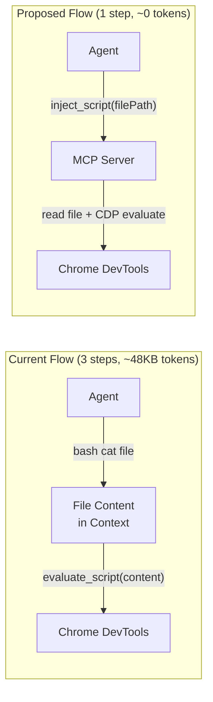
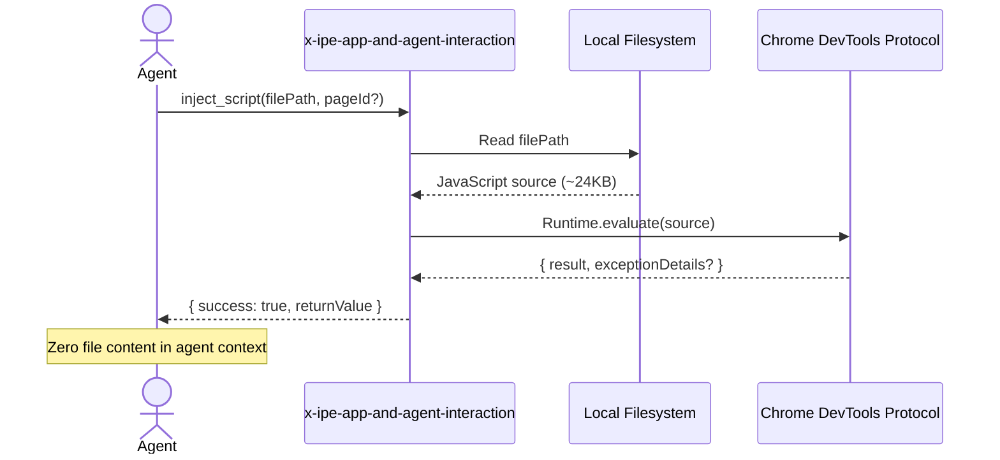
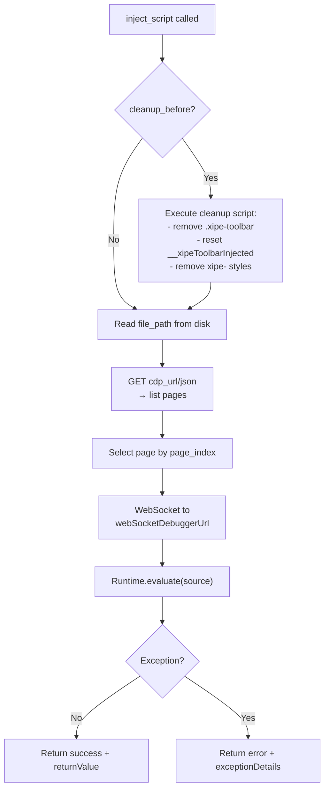

# Idea Summary

> Idea ID: IDEA-020
> Folder: 020. CR-MCP for script injection for UIUX Reference tool
> Version: v1
> Created: 2026-02-14
> Status: Refined

## Overview

Add an `inject_script` tool to the existing `x-ipe-app-and-agent-interaction` MCP server (FEATURE-033). This tool reads a JavaScript file from the local filesystem and executes it in the browser via Chrome DevTools Protocol, eliminating the need for agents to read file contents into their context window and then relay them to `evaluate_script`.

## Problem Statement

The current UIUX Reference toolbar injection workflow requires the agent to:

1. **Read** `toolbar.min.js` from disk (~24KB) into its context via `bash cat` or `view`
2. **Copy** the entire file content into a `chrome-devtools-evaluate_script` call
3. This **duplicates ~48KB of tokens** in the conversation (read + paste)
4. On iterative testing (re-inject after edits), this cost is paid **every time**

This is wasteful because the agent doesn't need to reason about the script content — it just needs to shuttle bytes from disk to browser. An MCP tool can do this in a single call with **zero context token cost**.



## Target Users

- CLI agents (Copilot CLI, Claude CLI, OpenCode) executing the `x-ipe-tool-uiux-reference` skill
- Any future skill that needs to inject scripts into browser pages (e.g., accessibility audits, visual regression testing)

## Proposed Solution

Add a new `inject_script` tool to the existing MCP server at `src/x_ipe/mcp/app_agent_interaction.py`. The tool:

1. Reads a JavaScript file from disk
2. Connects to Chrome DevTools Protocol (CDP)
3. Executes the script in the target page
4. Returns the result



### Tool Signature

```python
@mcp.tool
def inject_script(
    file_path: str,
    cdp_url: str = "http://localhost:9222",
    page_index: int = 0,
    cleanup_before: bool = False
) -> dict:
    """Read a JavaScript file and execute it in a Chrome browser page via CDP.

    Args:
        file_path: Absolute path to the .js file to inject.
        cdp_url: Chrome DevTools Protocol endpoint URL.
        page_index: Index of the browser page/tab to target (0-based).
        cleanup_before: If True, removes any existing X-IPE toolbar
                        before injecting (resets __xipeToolbarInjected, removes DOM).
    
    Returns:
        dict with success, returnValue, and optional error details.
    """
```

### CDP Connection Strategy

The MCP server connects to Chrome's DevTools Protocol directly (no Playwright/Puppeteer dependency):

1. **Discovery**: `GET {cdp_url}/json` → list of pages with `webSocketDebuggerUrl`
2. **Connect**: WebSocket to `webSocketDebuggerUrl` of target page
3. **Execute**: Send `Runtime.evaluate` message with script content
4. **Disconnect**: Close WebSocket after receiving result



## Key Features

### Feature 1 — inject_script Tool

- **File reading**: Reads `.js` file from absolute path, validates it exists and is readable
- **CDP connection**: Lightweight WebSocket-based CDP client (no heavy browser automation deps)
- **Script execution**: Wraps content in `Runtime.evaluate` with `awaitPromise: true` for async scripts
- **Cleanup mode**: Optional `cleanup_before` flag removes previous X-IPE toolbar injection before re-injecting (critical for iterative development)
- **Error handling**: Returns structured errors for: file not found, CDP unreachable, page not found, script execution error

### Feature 2 — Reusable CDP Client

The CDP connection logic should be extracted into a reusable internal module (`src/x_ipe/mcp/cdp_client.py`) so future MCP tools can also interact with the browser:

```python
class CDPClient:
    """Lightweight Chrome DevTools Protocol client."""
    
    async def connect(self, cdp_url: str, page_index: int) -> None: ...
    async def evaluate(self, expression: str) -> dict: ...
    async def close(self) -> None: ...
```

This enables future tools like:
- `take_page_screenshot(file_path)` — save screenshot to disk without context tokens
- `extract_page_data(selector, properties)` — extract DOM data directly

### Shared Behaviors

- **Same MCP server**: No new server process — tool is added to the existing `x-ipe-app-and-agent-interaction` server
- **Same transport**: stdio transport, same config in `claude_desktop_config.json` / Copilot MCP settings
- **Graceful fallback**: If CDP is unreachable, returns clear error message so agent can fall back to manual `evaluate_script`

## Success Criteria

- [ ] `inject_script` tool registered in `x-ipe-app-and-agent-interaction` MCP server
- [ ] Reads `.js` file from disk and executes via CDP `Runtime.evaluate`
- [ ] Returns `{ success: true, returnValue: ... }` on success
- [ ] Returns `{ success: false, error: "...", message: "..." }` on failure (file not found, CDP unreachable, script error)
- [ ] `cleanup_before=true` removes existing toolbar before re-injection
- [ ] Works with Chrome launched with `--remote-debugging-port=9222`
- [ ] Zero file content appears in agent's conversation context
- [ ] `x-ipe-tool-uiux-reference` SKILL.md updated to prefer `inject_script` over manual `evaluate_script`
- [ ] CDP client logic extracted into reusable `cdp_client.py` module

## Constraints & Considerations

- **Chrome must be running with CDP enabled**: User must launch Chrome with `--remote-debugging-port=9222`. The skill instructions should document this prerequisite.
- **CDP access conflicts**: If Chrome DevTools MCP is also connected via CDP, there may be session conflicts. The inject_script tool should use a short-lived connection (connect → evaluate → disconnect) to minimize conflicts.
- **File size limits**: CDP `Runtime.evaluate` has practical limits (~10MB). The toolbar.min.js is ~24KB, well within limits. No need for chunking.
- **Security**: The tool reads arbitrary files from disk and executes them in the browser. This is intentional for local development but should not be exposed to remote/untrusted agents.
- **Async vs sync**: FastMCP tools are synchronous by default. CDP communication is WebSocket-based (async). May need `asyncio.run()` wrapper or switch to async tool definition.
- **Dependencies**: Needs `websockets` package for CDP WebSocket communication. Already available or easily installable.

## Brainstorming Notes

Key decisions:

1. **Add to existing MCP server vs new server**: Adding to existing server avoids another process and MCP registration. The `x-ipe-app-and-agent-interaction` server is the right home since it bridges agents and browser/backend.
2. **Direct CDP vs Playwright**: Direct CDP is much lighter (~50 lines) vs full Playwright dependency. We only need `Runtime.evaluate`, not page navigation or DOM manipulation.
3. **cleanup_before flag**: Essential for iterative development. Without it, re-injection fails silently because `__xipeToolbarInjected` guard returns early.
4. **Page targeting by index**: Simpler than URL matching. The agent already knows which page it's working on from Chrome DevTools MCP's `list_pages`.
5. **Reusable CDP client**: Extracting connection logic enables future tools without duplicating WebSocket boilerplate.

## Impact Analysis

### Existing Feature: FEATURE-033 (App-Agent Interaction MCP)

- **Modified file**: `src/x_ipe/mcp/app_agent_interaction.py` — add `inject_script` tool
- **New file**: `src/x_ipe/mcp/cdp_client.py` — reusable CDP client
- **No breaking changes**: Existing `save_uiux_reference` tool is unchanged
- **Dependency addition**: `websockets` package added to `pyproject.toml`

### Existing Skill: x-ipe-tool-uiux-reference

- **SKILL.md update**: Step 5 (Inject Toolbar) updated to prefer `inject_script` MCP tool over manual `evaluate_script`
- **Fallback preserved**: If MCP tool is unavailable, agent can still use `evaluate_script` directly

## Source Files

- (This document)

## Next Steps

- [ ] Proceed to Change Request processing via `x-ipe-task-based-change-request`

## References & Common Principles

### Applied Principles

- **Zero-copy data transfer**: The script file goes directly from disk to browser without passing through the agent's context window. This is the same principle as Unix pipes — don't materialize intermediate data if the consumer doesn't need to inspect it.
- **Single Responsibility Extension**: The MCP server's responsibility is "bridge agent ↔ app". Script injection is a natural extension of this bridge — the agent wants to affect the browser, the MCP server facilitates it.
- **Graceful Degradation**: If CDP is unreachable, the agent falls back to the existing `evaluate_script` workflow. No functionality is lost.
- **KISS**: Direct CDP WebSocket is ~50 lines vs pulling in Playwright/Puppeteer. We only need one CDP method (`Runtime.evaluate`).
