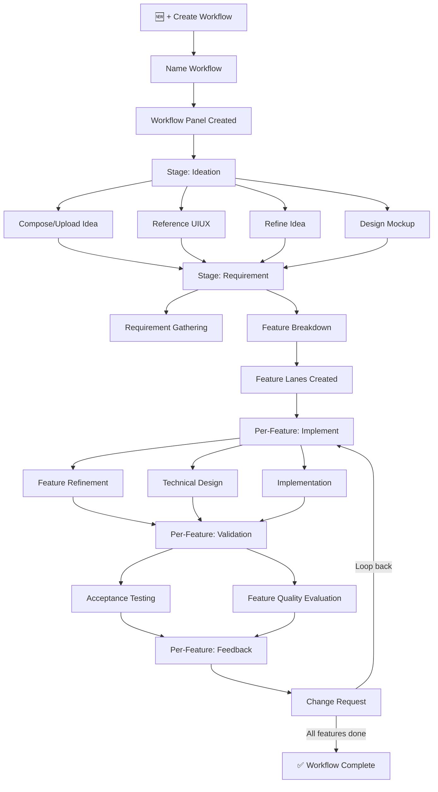
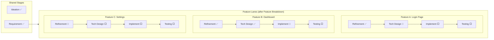

# Idea Summary

> Idea ID: IDEA-021
> Folder: 021. Feature-Engineering-Workflow
> Version: v1
> Created: 2026-02-16
> Status: Refined

## Overview

A centralized **Engineering Workflow** view integrated into the X-IPE application that orchestrates the full project value delivery lifecycle — from ideation through requirement, implementation, validation, and feedback — in a single, visual, panel-based interface. It leverages existing X-IPE skills, console capabilities, and the app-agent-interaction MCP, unifying them under a new **Engineering Workflow Manager** backend service with workflow-scoped state persistence.

## Problem Statement

Currently, X-IPE provides powerful skills for each stage of software delivery (ideation, requirements, design, implementation, testing, feedback), but they are accessed in isolation — users must manually navigate between the console, sidebar, knowledge base, and idea views to track progress. There is no unified view that shows:
- **Where am I** in the delivery lifecycle?
- **What should I do next** to move a feature forward?
- **What deliverables** have been produced so far?
- **Which features** can progress in parallel?

This fragmentation leads to context-switching overhead and makes it hard to maintain a disciplined, stage-gated delivery process.

## Target Users

- **Solo developers** using X-IPE for end-to-end feature delivery
- **Technical leads** managing multiple features within a project
- **Anyone** who wants a guided, workflow-driven development experience instead of ad-hoc skill invocation

## Proposed Solution

### Architecture Overview

```architecture-dsl
view module-view
title Engineering Workflow — Module Architecture

layer "Presentation Layer" {
  module "Workflow View" {
    desc "New middle-content mode with workflow panels, stage ribbons, action buttons, feature lanes, and deliverables"
  }
  module "Create Workflow Modal" {
    desc "Modal dialog for naming and creating new workflows"
  }
  module "Working Item Selector" {
    desc "Feature picker within a workflow — shows available features and their current stage"
  }
}

layer "Application Layer" {
  module "Engineering Workflow Manager" {
    desc "Backend service: defines workflow logic, tracks stage progression, suggests next actions, persists state"
  }
  module "MCP Extension" {
    desc "New app-agent-interaction MCP tools: update_workflow_status, get_workflow_state — called by skills after completion"
  }
}

layer "Integration Layer" {
  module "Existing Skills" {
    desc "Ideation, Requirement, Design, Implementation, Testing, Feedback skills — unchanged"
  }
  module "Console / Terminal" {
    desc "Existing xterm.js console — used for agent CLI interactions"
  }
  module "Deliverables Resolver" {
    desc "Resolves file paths from x-ipe-docs/ to display deliverables in workflow view"
  }
}

layer "Persistence Layer" {
  module "Workflow State Files" {
    desc "x-ipe-docs/engineering-workflow/workflow-{name}.json — workflow config, stage status, feature tracking"
  }
  module "Existing Docs" {
    desc "x-ipe-docs/ideas/, requirements/, planning/ — deliverable files stay in original locations"
  }
}
```

### Workflow Lifecycle Flow



### Feature Lanes for Parallel Work



## Key Features

### 1. Workflow View (New Middle-Content Mode)
- **Top menu entry** — "Engineering Workflow" positioned left of the Knowledge menu
- When clicked, replaces the middle content area (sidebar + content) with the workflow view
- Shows all workflows as vertically stacked panels
- **"+ Create Workflow"** button in the top-right corner opens a modal with name input

### 2. Workflow Panel
Each workflow is displayed as an expandable panel with:
- **Header** — Workflow name, current stage indicator, "Working Item Selection" button
- **Stage Ribbon** — Horizontal progression bar: `Ideation → Requirement → Implement → Validation → Feedback`
- **Action Buttons** — Stage-specific actions with three visual states:
  - 🟢 **Done** (green background) — action completed, deliverables generated
  - 🟡 **Suggested** (dashed yellow border) — recommended next action
  - ⬜ **Normal** (default border) — available but not suggested
- **Deliverables Section** — Categorized output artifacts (Ideas, Mockups, Requirements, Implementations, Quality Reports) with clickable links to source files

### 3. Stage Progression (Strictly Sequential)
- Stages unlock sequentially: Ideation → Requirement → Implement → Validation → Feedback
- The **Engineering Workflow Manager** determines which actions are available and which is suggested next
- Actions within a stage may have dependencies (e.g., "Refine Idea" requires "Compose/Upload Idea" first)

### 4. Feature Lanes (Post-Breakdown)
- **Shared stages**: Ideation and Requirement stages are shared across the workflow (no lanes)
- **Feature-specific stages**: After Feature Breakdown, the Implement → Validation → Feedback stages split into horizontal swimlanes — one per feature
- Each lane shows the feature's name, current stage, and next suggested action
- Users can work on multiple features in parallel, each progressing independently

### 5. Action Button Interactions
Actions follow two interaction patterns:

| Pattern | Actions | Behavior |
|---------|---------|----------|
| **Modal** | Compose/Upload Idea | Opens modal to compose markdown or upload files (reuses existing idea compose/upload) |
| **CLI Agent** | Refine Idea, Reference UIUX, Requirement Gathering, Feature Breakdown, Feature Refinement, Technical Design, Implementation, Acceptance Testing, Quality Evaluation, Change Request, Design Mockup | Expands the existing console window, creates a new session, auto-types the skill command (e.g., `copilot "refine idea x-ipe-docs/ideas/021/idea-summary-v1.md"`) |

### 6. Engineering Workflow Manager (Backend Service)
A new backend service responsible for:
- **Workflow CRUD** — Create, read, update workflows
- **Stage logic** — Determine next available/suggested actions based on current state
- **State persistence** — Read/write `x-ipe-docs/engineering-workflow/workflow-{name}.json`
- **MCP bridge** — Receive status updates from agent skills via app-agent-interaction MCP

### 7. MCP Extension (App-Agent Interaction)
New MCP tools for skill-to-workflow communication:
- `update_workflow_status(workflow_name, action, status, deliverables[])` — Called by skills after completing an action
- `get_workflow_state(workflow_name)` — Query current workflow state for context

### 8. Workflow State Persistence

State is persisted in `x-ipe-docs/engineering-workflow/workflow-{name}.json`:

```json
{
  "name": "My Feature Workflow",
  "created": "2026-02-16T08:00:00Z",
  "current_stage": "implement",
  "stages": {
    "ideation": {
      "status": "completed",
      "actions": {
        "compose_idea": { "status": "done", "deliverables": ["x-ipe-docs/ideas/021/idea-summary-v1.md"] },
        "reference_uiux": { "status": "done", "deliverables": ["x-ipe-docs/ideas/021/uiux-references/..."] },
        "refine_idea": { "status": "done", "deliverables": ["x-ipe-docs/ideas/021/idea-summary-v2.md"] },
        "design_mockup": { "status": "done", "deliverables": ["x-ipe-docs/ideas/021/mockups/mockup-v1.html"] }
      }
    },
    "requirement": {
      "status": "completed",
      "actions": {
        "requirement_gathering": { "status": "done", "deliverables": ["x-ipe-docs/requirements/requirement-details-part-9.md"] },
        "feature_breakdown": { "status": "done", "deliverables": ["x-ipe-docs/requirements/features.md"] }
      }
    },
    "implement": {
      "status": "in_progress",
      "features": {
        "FEATURE-040": {
          "name": "Login Page",
          "actions": {
            "feature_refinement": { "status": "done", "deliverables": ["specification.md"] },
            "technical_design": { "status": "in_progress", "deliverables": [] },
            "implementation": { "status": "pending", "deliverables": [] }
          }
        },
        "FEATURE-041": {
          "name": "Dashboard",
          "actions": {
            "feature_refinement": { "status": "done", "deliverables": ["specification.md"] },
            "technical_design": { "status": "done", "deliverables": ["technical-design.md"] },
            "implementation": { "status": "in_progress", "deliverables": [] }
          }
        }
      }
    }
  }
}
```

> **Note:** This JSON structure is initial; it will evolve as more detailed requirements for different actions are defined. Only the Engineering Workflow Manager (via MCP) should update this file for accuracy.

### 9. Deliverables View
- Deliverables are grouped by category: Ideas, Mockups, Requirements, Implementations, Quality Reports
- Each deliverable links to the **original file location** in `x-ipe-docs/`
- A "New Deliverable Quick Access" section shows the most recently generated artifacts
- Deliverable metadata is tracked in the `workflow-{name}.json` state file

## Action-to-Stage Mapping (v1)

| Stage | Action | Interaction | Skill |
|-------|--------|-------------|-------|
| Ideation | Compose/Upload Idea | Modal | (built-in) |
| Ideation | Reference UIUX | CLI Agent | x-ipe-tool-uiux-reference |
| Ideation | Refine Idea | CLI Agent | x-ipe-task-based-ideation-v2 |
| Ideation | Design Mockup | CLI Agent | x-ipe-task-based-idea-mockup |
| Requirement | Requirement Gathering | CLI Agent | x-ipe-task-based-requirement-gathering |
| Requirement | Feature Breakdown | CLI Agent | x-ipe-task-based-feature-breakdown |
| Implement | Feature Refinement | CLI Agent | x-ipe-task-based-feature-refinement |
| Implement | Technical Design | CLI Agent | x-ipe-task-based-technical-design |
| Implement | Implementation | CLI Agent | x-ipe-task-based-code-implementation |
| Validation | Acceptance Testing | CLI Agent | x-ipe-task-based-feature-acceptance-test |
| Validation | Feature Quality Evaluation | CLI Agent | (quality evaluation tool) |
| Feedback | Change Request | CLI Agent | x-ipe-task-based-change-request |

## Success Criteria

- [ ] Engineering Workflow menu item visible and functional in top navigation
- [ ] User can create, view, and manage multiple workflows
- [ ] Stage ribbon accurately reflects workflow progression with sequential gating
- [ ] Action buttons correctly show done/suggested/normal states
- [ ] Modal actions (Compose/Upload Idea) work within workflow context
- [ ] CLI actions open console, create session, and auto-type the correct skill command
- [ ] Feature lanes appear after Feature Breakdown, supporting parallel feature work
- [ ] Engineering Workflow Manager correctly determines next suggested action
- [ ] Skills can report completion back via MCP → workflow state auto-updates
- [ ] Workflow state persists in `x-ipe-docs/engineering-workflow/workflow-{name}.json`
- [ ] Deliverables section shows linked artifacts from original file locations
- [ ] Working Item Selection allows picking which feature to focus on

## Constraints & Considerations

- **No skill refactoring** — Existing skills remain unchanged; the workflow manager orchestrates them without modifying their behavior
- **Reuse existing UI** — Console window, idea compose/upload, sidebar patterns are reused, not rebuilt
- **State file authority** — Only the Engineering Workflow Manager (via MCP) writes to `workflow-{name}.json` to ensure accuracy
- **Sequential gating** — Stages are strictly ordered; actions within a stage may have their own dependency ordering
- **Shared vs. feature-specific stages** — Ideation and Requirement are workflow-wide; Implement, Validation, and Feedback are per-feature after breakdown
- **Extensibility** — Action list is v1; additional actions can be added later without architectural changes
- **JSON schema evolution** — The workflow state JSON structure will evolve as more detailed requirements emerge for different actions

## Brainstorming Notes

Key insights from the brainstorming session:

1. **Workflow scope is flexible** — Users decide what a workflow represents (a feature, a project, a product). The system doesn't impose constraints.

2. **Feature lanes are the key UX innovation** — After Feature Breakdown, the workflow splits into parallel swimlanes per feature. Ideation and Requirement stages remain shared because they define the overall scope.

3. **Working Item Selection** — A critical UX element that shows available features within a workflow and their current stage, allowing users to pick which one to focus on. The workflow manager provides the intelligence (what's left, what's next).

4. **Leverage, don't replace** — The Engineering Workflow Manager integrates existing skills and console capabilities under a centralized view. No existing behavior is refactored.

5. **State persistence via MCP only** — Workflow state files are updated exclusively through the app-agent-interaction MCP for reliability and accuracy. Skills call MCP → MCP calls Workflow Manager → Manager updates JSON.

6. **Status is action-level, not stage-level** — Instead of a high-level "In Progress" status, the workflow tracks which specific action (task) in which stage is current. The stage ribbon derives its visual state from action statuses.

## Ideation Artifacts

- Reference mockup: `engineering-workflow-reference.png` — Original workflow panel layout concept
- Architecture diagram: Embedded Architecture DSL (Module View) above
- Lifecycle flow: Embedded Mermaid flowchart above
- Feature lanes diagram: Embedded Mermaid swimlane diagram above

## Source Files

- `new idea.md` — Original raw idea notes
- `engineering-workflow-reference.png` — Reference mockup image

## Next Steps

- [ ] Proceed to Idea Mockup (recommended — strong UI focus with workflow panels, lanes, and action states)
- [ ] Or: Idea to Architecture (to detail the Engineering Workflow Manager service design)
- [ ] Or: Skip to Requirement Gathering

## References & Common Principles

### Applied Principles

- **Stage-Gate Process** — Sequential phases with gates (approval points) between stages; widely used in product development to ensure quality before advancing
- **Kanban Swimlanes** — Horizontal lanes grouping work items by category (here: by feature), enabling visual tracking of parallel workstreams
- **Orchestration Pattern** — A central coordinator (Engineering Workflow Manager) manages the flow between independent services (skills) without those services knowing about each other
- **Event-Driven State** — State changes triggered by external events (skill completion → MCP callback → state update) rather than polling

### Further Reading

- Stage-Gate Innovation Process (Robert G. Cooper) — Foundation for sequential stage gating in product delivery
- Kanban Method (David J. Anderson) — Visualization of work, limiting WIP, and managing flow
- Orchestration vs. Choreography — Centralized vs. decentralized service coordination patterns
