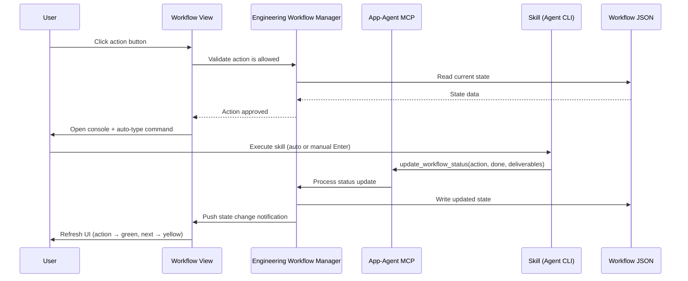
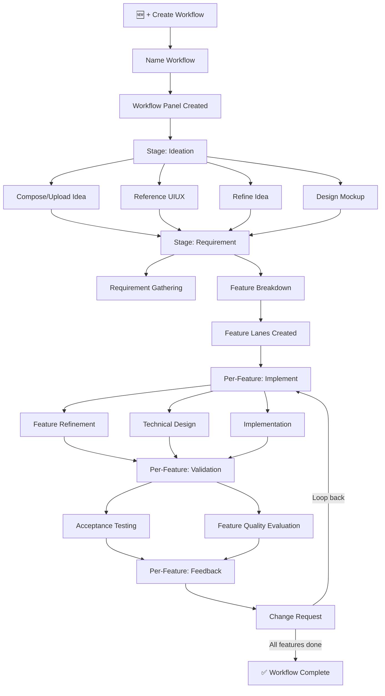
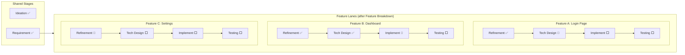

# Idea Summary

> Idea ID: IDEA-021
> Folder: 021. Feature-Engineering-Workflow
> Version: v2
> Created: 2026-02-16
> Status: Refined

## Overview

A centralized **Engineering Workflow** view integrated into the X-IPE application that orchestrates the full project value delivery lifecycle — from ideation through requirement, implementation, validation, and feedback — in a single, visual, panel-based interface. It leverages existing X-IPE skills, console capabilities, and the app-agent-interaction MCP, unifying them under a new **Engineering Workflow Manager** backend service with workflow-scoped state persistence.

## Problem Statement

Currently, X-IPE provides powerful skills for each stage of software delivery (ideation, requirements, design, implementation, testing, feedback), but they are accessed in isolation — users must manually navigate between the console, sidebar, knowledge base, and idea views to track progress. There is no unified view that shows:
- **Where am I** in the delivery lifecycle?
- **What should I do next** to move a feature forward?
- **What deliverables** have been produced so far?
- **Which features** can progress in parallel?

This fragmentation leads to context-switching overhead and makes it hard to maintain a disciplined, stage-gated delivery process.

## Target Users

- **Solo developers** using X-IPE for end-to-end feature delivery
- **Technical leads** managing multiple features within a project
- **Anyone** who wants a guided, workflow-driven development experience instead of ad-hoc skill invocation

## Proposed Solution

### Architecture Overview

```architecture-dsl
view module-view
title Engineering Workflow — Module Architecture

layer "Presentation Layer" {
  module "Workflow View" {
    desc "New middle-content mode with workflow panels, stage ribbons, action buttons, feature lanes, and deliverables"
  }
  module "Create Workflow Modal" {
    desc "Modal dialog for naming and creating new workflows"
  }
  module "Working Item Selector" {
    desc "Dropdown panel listing features in this workflow with their current stage and next action"
  }
}

layer "Application Layer" {
  module "Engineering Workflow Manager" {
    desc "Backend service: workflow CRUD, stage gating logic, next-action suggestion, state persistence, event dispatch"
  }
  module "MCP Extension" {
    desc "New app-agent-interaction MCP tools: update_workflow_status, get_workflow_state — called by skills after completion"
  }
  module "Notification Dispatcher" {
    desc "Pushes workflow state changes to frontend via existing SSE/polling mechanism for real-time UI updates"
  }
}

layer "Integration Layer" {
  module "Existing Skills" {
    desc "Ideation, Requirement, Design, Implementation, Testing, Feedback skills — unchanged"
  }
  module "Console / Terminal" {
    desc "Existing xterm.js console — used for agent CLI interactions; one session per action"
  }
  module "Deliverables Resolver" {
    desc "Reads deliverable paths from workflow JSON state → verifies file existence → returns resolved links for UI"
  }
}

layer "Persistence Layer" {
  module "Workflow State Files" {
    desc "x-ipe-docs/engineering-workflow/workflow-{name}.json — versioned workflow config with schema_version field"
  }
  module "Existing Docs" {
    desc "x-ipe-docs/ideas/, requirements/, planning/ — deliverable files stay in original locations"
  }
}
```

### Data Flow



### Workflow Lifecycle Flow



### Feature Lanes for Parallel Work



## Key Features

### 1. Workflow View (New Middle-Content Mode)
- **Top menu entry** — "Engineering Workflow" positioned left of the Knowledge menu
- When clicked, replaces the middle content area (sidebar + content) with the workflow view
- Shows all workflows as vertically stacked panels
- **"+ Create Workflow"** button in the top-right corner opens a modal with name input

### 2. Workflow Panel
Each workflow is displayed as an expandable panel with:
- **Header** — Workflow name, current stage indicator, "Working Item Selection" button, delete/archive actions
- **Stage Ribbon** — Horizontal progression bar: `Ideation → Requirement → Implement → Validation → Feedback`
- **Action Buttons** — Stage-specific actions with three visual states:
  - 🟢 **Done** (green background) — action completed, deliverables generated
  - 🟡 **Suggested** (dashed yellow border) — recommended next action
  - ⬜ **Normal** (default border) — available but not suggested
- **Deliverables Section** — Categorized output artifacts (Ideas, Mockups, Requirements, Implementations, Quality Reports) with clickable links to source files

### 3. Working Item Selector
A **dropdown panel** triggered by the "Working Item Selection" button in the workflow header:
- Lists all features created during Feature Breakdown
- Each item shows: Feature ID, Feature Name, Current Stage, Next Suggested Action
- Selecting a feature scrolls to / highlights its lane in the workflow panel
- Before Feature Breakdown, this button is disabled (no features to select yet)

### 4. Stage Progression (Strictly Sequential with Gating Rules)
- Stages unlock sequentially: Ideation → Requirement → Implement → Validation → Feedback
- The **Engineering Workflow Manager** determines which actions are available and which is suggested next

**Stage Completion Rules:**

| Stage | Mandatory Actions | Optional Actions | Gate to Next |
|-------|-------------------|------------------|--------------|
| Ideation | Compose/Upload Idea, Refine Idea | Reference UIUX, Design Mockup | All mandatory done |
| Requirement | Requirement Gathering, Feature Breakdown | — | All mandatory done |
| Implement (per-feature) | Feature Refinement, Technical Design, Implementation | — | All mandatory done |
| Validation (per-feature) | Acceptance Testing | Feature Quality Evaluation | Acceptance Testing done |
| Feedback (per-feature) | — | Change Request | Stage auto-completes; CR loops back to Implement |

> **Optional actions** can be executed at any time during their stage but are not required to advance to the next stage.

### 5. Feature Lanes (Post-Breakdown)
- **Shared stages**: Ideation and Requirement stages are shared across the workflow (no lanes)
- **Feature-specific stages**: After Feature Breakdown, the Implement → Validation → Feedback stages split into horizontal swimlanes — one per feature
- Each lane shows the feature's name, current stage, and next suggested action
- Users can work on multiple features in parallel, each progressing independently

### 6. Action Button Interactions
Actions follow two interaction patterns:

| Pattern | Actions | Behavior |
|---------|---------|----------|
| **Modal** | Compose/Upload Idea | Opens modal to compose markdown or upload files (reuses existing idea compose/upload) |
| **CLI Agent** | All other actions | Expands the existing console window, creates a new session, auto-types the skill command. **User presses Enter to execute** (no auto-execution for safety). |

> **Console session lifecycle:** Each CLI Agent action creates a new console session. Sessions are one-at-a-time — starting a new action while one is running will prompt the user to confirm. Previous sessions remain accessible in the session list for reference.

### 7. Engineering Workflow Manager (Backend Service)
A new backend service responsible for:
- **Workflow CRUD** — Create, read, update, delete/archive workflows
- **Stage gating logic** — Evaluate completion rules, determine next available/suggested actions
- **State persistence** — Read/write `x-ipe-docs/engineering-workflow/workflow-{name}.json`
- **MCP bridge** — Receive status updates from agent skills via app-agent-interaction MCP
- **Notification dispatch** — Push state changes to frontend for real-time UI refresh

### 8. MCP Extension (App-Agent Interaction)
New MCP tools for skill-to-workflow communication:
- `update_workflow_status(workflow_name, action, status, deliverables[])` — Called by skills after completing an action. On failure, status stays `in_progress` with an optional `error` field.
- `get_workflow_state(workflow_name)` — Query current workflow state for context

### 9. Error Handling & Recovery

| Scenario | Behavior |
|----------|----------|
| **Skill fails mid-action** | Action stays `in_progress`; user sees a retry button; error details logged in state JSON |
| **MCP callback never arrives** | After 10-minute timeout, action shows "status unknown" with manual override options (mark done / retry) |
| **State file corrupted** | Engineering Workflow Manager validates JSON on read; falls back to last known good state |
| **Deliverable file missing** | Deliverables Resolver marks link as "⚠️ not found" instead of breaking the UI |
| **Manual override** | User can right-click an action → "Mark as Done" or "Reset to Pending" for recovery |

### 10. Workflow State Persistence

State is persisted in `x-ipe-docs/engineering-workflow/workflow-{name}.json`:

```json
{
  "schema_version": "1.0",
  "name": "My Feature Workflow",
  "created": "2026-02-16T08:00:00Z",
  "idea_folder": "x-ipe-docs/ideas/021. Feature-Engineering-Workflow",
  "current_stage": "implement",
  "stages": {
    "ideation": {
      "status": "completed",
      "actions": {
        "compose_idea": { "status": "done", "deliverables": ["x-ipe-docs/ideas/021/idea-summary-v1.md"] },
        "reference_uiux": { "status": "skipped", "deliverables": [] },
        "refine_idea": { "status": "done", "deliverables": ["x-ipe-docs/ideas/021/idea-summary-v2.md"] },
        "design_mockup": { "status": "skipped", "deliverables": [] }
      }
    },
    "requirement": {
      "status": "completed",
      "actions": {
        "requirement_gathering": { "status": "done", "deliverables": ["x-ipe-docs/requirements/requirement-details-part-9.md"] },
        "feature_breakdown": { "status": "done", "deliverables": ["x-ipe-docs/requirements/features.md"], "features_created": ["FEATURE-040", "FEATURE-041"] }
      }
    },
    "implement": {
      "status": "in_progress",
      "features": {
        "FEATURE-040": {
          "name": "Login Page",
          "actions": {
            "feature_refinement": { "status": "done", "deliverables": ["specification.md"] },
            "technical_design": { "status": "in_progress", "deliverables": [], "error": null },
            "implementation": { "status": "pending", "deliverables": [] }
          }
        },
        "FEATURE-041": {
          "name": "Dashboard",
          "actions": {
            "feature_refinement": { "status": "done", "deliverables": ["specification.md"] },
            "technical_design": { "status": "done", "deliverables": ["technical-design.md"] },
            "implementation": { "status": "in_progress", "deliverables": [] }
          }
        }
      }
    }
  }
}
```

> **Schema versioning:** The `schema_version` field enables future migrations. When the JSON schema evolves, the Engineering Workflow Manager detects older versions on read and auto-migrates them to the current schema.

> **Workflow-to-idea mapping:** Each workflow is linked 1:1 to an idea folder via the `idea_folder` field. A workflow tracks the full delivery journey of one idea/project scope.

> **Feature IDs:** Feature IDs (e.g., `FEATURE-040`) are generated by the Feature Breakdown skill and recorded in the `features_created` array. The Workflow Manager uses these IDs to create feature lanes.

> **State file authority:** Only the Engineering Workflow Manager (via MCP) writes to this file to ensure accuracy and prevent concurrent corruption.

### 11. Real-Time UI Updates
When a skill completes and calls MCP → Workflow Manager → JSON update, the frontend is notified via the **existing polling/SSE mechanism** already used by X-IPE. The Workflow View polls for state changes at a configurable interval (default: 5 seconds) or receives push updates if SSE is available.

### 12. Deliverables View
- Deliverables are grouped by category: Ideas, Mockups, Requirements, Implementations, Quality Reports
- Each deliverable links to the **original file location** in `x-ipe-docs/`
- **Deliverables Resolver** reads paths from the workflow JSON state → verifies file existence on disk → returns resolved links (or "⚠️ not found" if missing)
- A "New Deliverable Quick Access" section shows the most recently generated artifacts

## Action-to-Stage Mapping (v1)

| Stage | Action | Mandatory | Interaction | Skill |
|-------|--------|-----------|-------------|-------|
| Ideation | Compose/Upload Idea | ✅ | Modal | (built-in) |
| Ideation | Reference UIUX | ❌ | CLI Agent | x-ipe-tool-uiux-reference |
| Ideation | Refine Idea | ✅ | CLI Agent | x-ipe-task-based-ideation-v2 |
| Ideation | Design Mockup | ❌ | CLI Agent | x-ipe-task-based-idea-mockup |
| Requirement | Requirement Gathering | ✅ | CLI Agent | x-ipe-task-based-requirement-gathering |
| Requirement | Feature Breakdown | ✅ | CLI Agent | x-ipe-task-based-feature-breakdown |
| Implement | Feature Refinement | ✅ | CLI Agent | x-ipe-task-based-feature-refinement |
| Implement | Technical Design | ✅ | CLI Agent | x-ipe-task-based-technical-design |
| Implement | Implementation | ✅ | CLI Agent | x-ipe-task-based-code-implementation |
| Validation | Acceptance Testing | ✅ | CLI Agent | x-ipe-task-based-feature-acceptance-test |
| Validation | Feature Quality Evaluation | ❌ | CLI Agent | (deferred to v2 — skill TBD) |
| Feedback | Change Request | ❌ | CLI Agent | x-ipe-task-based-change-request |

## Success Criteria

- [ ] Engineering Workflow menu item visible and functional in top navigation
- [ ] User can create, view, delete/archive, and manage multiple workflows
- [ ] Stage ribbon accurately reflects workflow progression with sequential gating
- [ ] Action buttons correctly show done/suggested/normal states based on gating rules
- [ ] Modal actions (Compose/Upload Idea) work within workflow context
- [ ] CLI actions open console, create session, and auto-type the correct skill command (user confirms with Enter)
- [ ] Feature lanes appear after Feature Breakdown, supporting parallel feature work
- [ ] Working Item Selector shows feature list with stage progress and highlights selected lane
- [ ] Engineering Workflow Manager correctly determines next suggested action per gating rules
- [ ] Skills report completion back via MCP → workflow state auto-updates → UI refreshes within 5 seconds
- [ ] Workflow state persists in `x-ipe-docs/engineering-workflow/workflow-{name}.json` with schema versioning
- [ ] Deliverables section shows linked artifacts; missing files show "⚠️ not found" gracefully
- [ ] Error recovery: failed actions show retry button; manual override available via right-click

## Constraints & Considerations

- **No skill refactoring** — Existing skills remain unchanged; the workflow manager orchestrates them without modifying their behavior
- **Reuse existing UI** — Console window, idea compose/upload, sidebar patterns are reused, not rebuilt
- **State file authority** — Only the Engineering Workflow Manager (via MCP) writes to `workflow-{name}.json` to ensure accuracy
- **Sequential gating** — Stages are strictly ordered; mandatory actions must complete before the next stage unlocks; optional actions can be skipped
- **Shared vs. feature-specific stages** — Ideation and Requirement are workflow-wide; Implement, Validation, and Feedback are per-feature after breakdown
- **Console sessions are one-at-a-time** — Parallel feature lanes can be worked on, but only one CLI agent session runs at a time
- **Extensibility** — Action list is v1; additional actions can be added later without architectural changes; "Feature Quality Evaluation" is deferred to v2
- **JSON schema evolution** — `schema_version` field enables forward-compatible migrations
- **Single-user scope** — Multi-user concurrent access to the same workflow file is not addressed in v1; acknowledged as future consideration
- **1:1 workflow-to-idea mapping** — Each workflow corresponds to one idea folder; multi-idea workflows are not supported in v1

## Brainstorming Notes

Key insights from the brainstorming session:

1. **Workflow scope is flexible** — Users decide what a workflow represents (a feature, a project, a product). The system doesn't impose constraints.

2. **Feature lanes are the key UX innovation** — After Feature Breakdown, the workflow splits into parallel swimlanes per feature. Ideation and Requirement stages remain shared because they define the overall scope.

3. **Working Item Selection** — A dropdown panel that shows available features within a workflow and their current stage, allowing users to pick which one to focus on. The workflow manager provides the intelligence (what's left, what's next).

4. **Leverage, don't replace** — The Engineering Workflow Manager integrates existing skills and console capabilities under a centralized view. No existing behavior is refactored.

5. **State persistence via MCP only** — Workflow state files are updated exclusively through the app-agent-interaction MCP for reliability and accuracy. Skills call MCP → MCP calls Workflow Manager → Manager updates JSON.

6. **Status is action-level, not stage-level** — The workflow tracks which specific action (task) in which stage is current. The stage ribbon derives its visual state from action statuses.

7. **Safety-first CLI interaction** — Auto-typed commands require user to press Enter to execute, preventing accidental actions.

8. **Graceful degradation** — Missing deliverables, failed callbacks, corrupted state files all have defined recovery behaviors rather than breaking the UI.

## Ideation Artifacts

- Reference mockup: `engineering-workflow-reference.png` — Shows a full-width panel with a horizontal stage ribbon at top (Ideation → Requirement → Implement → Validation → Feedback), action buttons organized by stage below the ribbon, and a collapsible deliverables section at the bottom showing categorized output files with quick-access links
- Architecture diagram: Embedded Architecture DSL (Module View) — 4-layer architecture showing Presentation, Application, Integration, and Persistence layers
- Data flow diagram: Embedded Mermaid sequence diagram — Shows the action execution → MCP callback → state update → UI refresh flow
- Lifecycle flow: Embedded Mermaid flowchart — End-to-end workflow from creation to completion
- Feature lanes diagram: Embedded Mermaid swimlane — Shared stages vs. per-feature parallel lanes

## Source Files

- `new idea.md` — Original raw idea notes
- `engineering-workflow-reference.png` — Reference mockup image

## Next Steps

- [ ] Proceed to Idea Mockup (recommended — strong UI focus with workflow panels, lanes, and action states)
- [ ] Or: Idea to Architecture (to detail the Engineering Workflow Manager service design)
- [ ] Or: Skip to Requirement Gathering

## References & Common Principles

### Applied Principles

- **Stage-Gate Process** — Sequential phases with gates (approval points) between stages; widely used in product development to ensure quality before advancing. Applied: mandatory action completion gates each stage transition.
- **Kanban Swimlanes** — Horizontal lanes grouping work items by category (here: by feature), enabling visual tracking of parallel workstreams. Applied: feature lanes after breakdown.
- **Orchestration Pattern** — A central coordinator (Engineering Workflow Manager) manages the flow between independent services (skills) without those services knowing about each other. Applied: workflow manager as the single orchestrator.
- **Event-Driven State** — State changes triggered by external events (skill completion → MCP callback → state update) rather than polling. Applied: MCP-based status reporting.
- **Graceful Degradation** — System continues functioning when components fail, rather than crashing. Applied: error recovery for failed actions, missing files, stale callbacks.

### Further Reading

- Stage-Gate Innovation Process (Robert G. Cooper) — Foundation for sequential stage gating in product delivery
- Kanban Method (David J. Anderson) — Visualization of work, limiting WIP, and managing flow
- Orchestration vs. Choreography — Centralized vs. decentralized service coordination patterns
