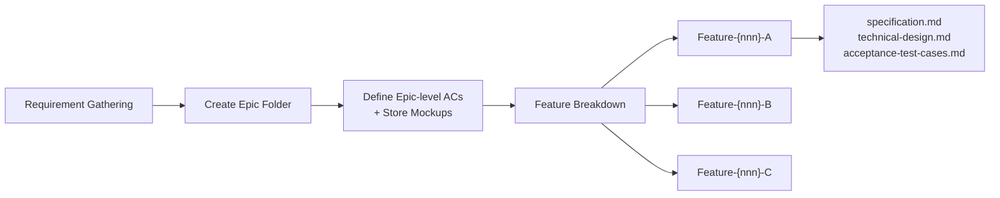
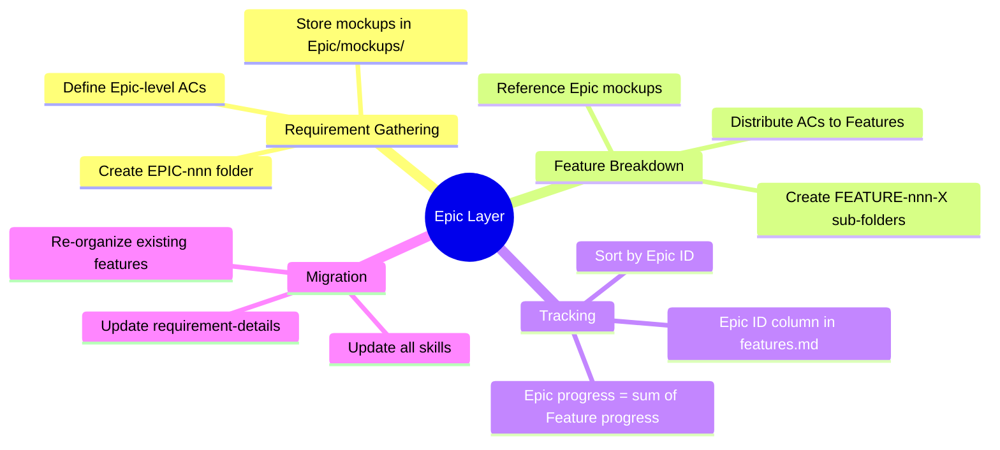

# Idea Summary

> Idea ID: IDEA-022
> Folder: 022. CR-Introduce Epic
> Version: v1
> Created: 2026-02-17
> Status: Refined

## Overview

Introduce an **Epic** layer into X-IPE's requirement management workflow, sitting above Features. Epics group related Features under a single deliverable unit, replacing the current ad-hoc sub-feature pattern (e.g., `FEATURE-030-B-THEME`, `FEATURE-030-B-MOCKUP`) with a formal hierarchy: **Epic → Features**.

## Problem Statement

As the project grows, individual Features frequently expand beyond their original scope. A single Feature can no longer cover all required functionality, leading to organic splitting into sub-features with inconsistent naming (e.g., `FEATURE-030-B`, `FEATURE-030-B-THEME`, `FEATURE-030-B-MOCKUP`). There is no formal structure to:

1. Group related Features under a parent concept
2. Define high-level acceptance criteria that span multiple Features
3. Track the overall progress of a "big idea" across its constituent Features
4. Store shared artifacts (mockups, references) at the group level

## Target Users

- **X-IPE Agent sessions** — agents following the requirement/feature workflow
- **Human project managers** — reviewing and planning work across Epics
- **Developers** — understanding how Features relate to the bigger picture

## Proposed Solution

### Workflow Change



### Folder Structure

```
x-ipe-docs/requirements/
  EPIC-030/
    mockups/                    ← shared mockups at Epic level
    FEATURE-030-A/
      specification.md
      technical-design.md
      acceptance-test-cases.md
    FEATURE-030-B/
      specification.md
      technical-design.md
      acceptance-test-cases.md
```

### Naming Convention

| Entity | Pattern | Example |
|--------|---------|---------|
| Epic | `EPIC-{nnn}` | `EPIC-030` |
| Feature | `FEATURE-{nnn}-{A\|B\|C...}` | `FEATURE-030-A` |

- The `{nnn}` in Feature **always follows** its parent Epic's number
- Every requirement gets an Epic (even single-feature requirements, for consistency)

### features.md Changes

Add an **Epic ID** column to the flat table, sorted by Epic ID:

| Epic ID | Feature ID | Title | Version | Status | Specification |
|---------|------------|-------|---------|--------|---------------|
| EPIC-030 | FEATURE-030-A | Toolbar Shell | v2.0 | Completed | [spec](EPIC-030/FEATURE-030-A/specification.md) |
| EPIC-030 | FEATURE-030-B | Theme Mode | v2.0 | Completed | [spec](EPIC-030/FEATURE-030-B/specification.md) |
| EPIC-031 | FEATURE-031-A | Console Core | v1.0 | Implemented | [spec](EPIC-031/FEATURE-031-A/specification.md) |

### Key Design Decisions

1. **Always Epic** — every requirement creates an Epic, even for single-feature work
2. **No Epic-level specification.md** — all functional specs live at Feature level; Epic folder holds shared mockups and grouping context
3. **Epic-level ACs in requirement-details** — acceptance criteria are written at Epic scope during Requirement Gathering, then distributed to Features during Feature Breakdown
4. **Mockups at Epic level only** — Features reference `../mockups/` from the Epic folder, no duplicate mockups per Feature
5. **Full retroactive migration** — all existing features will be reorganized under Epics after skill updates

## Key Features



## Success Criteria

- [ ] Requirement Gathering skill creates `EPIC-{nnn}/` folder with `mockups/` sub-directory
- [ ] Feature Breakdown skill creates `FEATURE-{nnn}-{X}/` sub-folders under Epic
- [ ] features.md includes Epic ID column, sorted by Epic ID
- [ ] All Feature specs reference mockups from parent Epic folder
- [ ] Existing features retroactively organized under Epics
- [ ] Change Request skill supports Epic-aware updates
- [ ] Git commit message format supports Epic references
- [ ] requirement-details files reference Epics correctly

## Constraints & Considerations

- **Blast radius is large**: 57+ skill files reference `FEATURE-` patterns — migration must be carefully sequenced
- **Backward compatibility**: existing task board history references old `FEATURE-XXX` IDs — archives should not be rewritten
- **Single-feature Epics**: may feel like overhead for simple changes, but consistency wins
- **File splitting**: requirement-details parts currently group by feature ranges — need to accommodate Epic-based grouping

## Brainstorming Notes

### Key Insights from Brainstorming

1. **Current pain is real** — FEATURE-030-B already split organically into THEME/MOCKUP, showing the need for a formal Epic layer
2. **Epic folder is a container, not a spec** — user explicitly chose NOT to have Epic-level specification.md; all functional detail lives in Features
3. **Mockup sharing** — a major benefit: mockups created during Requirement Gathering live at Epic level and are referenced (not duplicated) by Features
4. **Consistency over flexibility** — every requirement becomes an Epic, eliminating the "is this big enough for an Epic?" decision

### Skills Requiring Updates (Full Blast Radius)

**Critical (core workflow):**
- `x-ipe-task-based-requirement-gathering` — create Epic folder, Epic-level ACs
- `x-ipe-task-based-feature-breakdown` — create Feature sub-folders under Epic
- `x-ipe+feature+feature-board-management` — Epic ID column in features.md
- `x-ipe-task-based-change-request` — Epic-aware CR handling

**High impact (feature lifecycle):**
- `x-ipe-task-based-feature-refinement` — spec paths change to `EPIC-XXX/FEATURE-XXX-X/`
- `x-ipe-task-based-feature-acceptance-test` — path updates
- `x-ipe-task-based-feature-closing` — path updates
- `x-ipe-task-based-technical-design` — path updates
- `x-ipe-task-based-code-implementation` — path updates
- `x-ipe-task-based-test-generation` — path updates

**Medium impact (supporting):**
- `x-ipe-tool-git-version-control` — commit message format
- Requirement-details templates (index, parts, splitting logic)

**Low impact (reference updates):**
- Various skill references/examples that mention `FEATURE-` patterns

## Ideation Artifacts

- Source: [new idea.md](x-ipe-docs/ideas/022. CR-Introduce Epic/new idea.md)

## Source Files

- new idea.md

## Next Steps

- [ ] Proceed to Requirement Gathering (this is a Change Request affecting multiple skills)

## References & Common Principles

### Applied Principles

- **Epic/Feature/Story hierarchy** — standard agile practice (Jira, Azure DevOps, SAFe) for organizing work at scale
- **Single Responsibility** — Epic owns grouping + shared artifacts; Feature owns functional specification
- **Consistency over flexibility** — always-Epic rule eliminates classification overhead

### Further Reading

- SAFe Epic definition — large initiatives decomposed into Features and Stories
- Jira hierarchy — Epic → Story → Sub-task pattern used by most engineering teams
