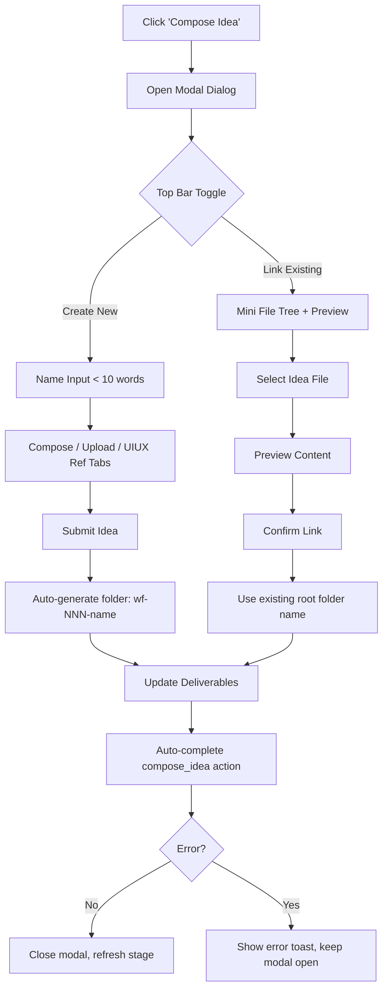
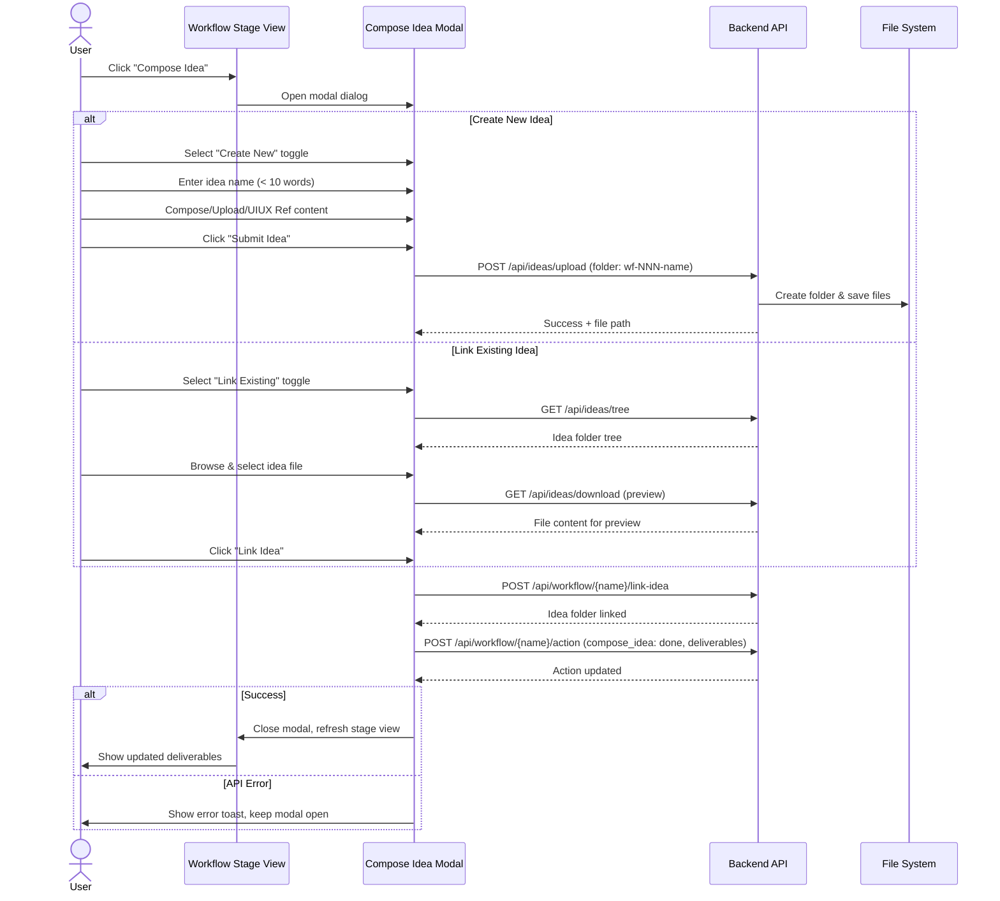

# Idea Summary

> Idea ID: IDEA-023
> Folder: 023. CR-Compose Idea in Workflow
> Version: v2
> Created: 2026-02-18
> Status: Refined

## Overview

Replace the current simple prompt-based "Compose Idea" workflow action with a rich modal dialog that supports **creating new ideas** or **linking existing ideas** — all without leaving the workflow view. The modal embeds the full Workplace compose/upload/UIUX-reference tabs for new ideas and a mini file-tree browser with preview for linking existing ones.

## Problem Statement

Currently, clicking "Compose Idea" in the workflow opens a basic text prompt asking for a folder name, then navigates away to the Workplace tab. This creates a disjointed experience:

1. **Context switching** — Users lose the workflow context when redirected to Workplace
2. **No link-existing option** — Users cannot link an already-composed idea to the workflow
3. **No preview** — Users cannot see what they're linking before committing
4. **Poor folder naming** — Manual folder naming without consistent convention

## Target Users

- X-IPE users who run engineering workflows and need to compose or attach ideas as the first step of the ideation stage

## Proposed Solution

A **full-featured modal dialog** that opens when clicking "Compose Idea" in the workflow stage view:



### Modal Layout — Create New Mode

```
┌──────────────────────────────────────────────────┐
│  Compose Idea                              [  ×  ]│
├──────────────────────────────────────────────────┤
│  [ Create New ●]  [ Link Existing ]              │
├──────────────────────────────────────────────────┤
│                                                   │
│  Idea Name: [________________________] < 10 words │
│                                                   │
│  ┌─────────┬─────────┬──────────────┐            │
│  │ Compose │ Upload  │ UIUX Ref     │            │
│  ├─────────┴─────────┴──────────────┤            │
│  │                                   │            │
│  │  (Reused Workplace tabs content)  │            │
│  │                                   │            │
│  └───────────────────────────────────┘            │
│                                                   │
│                        [ Cancel ]  [ Submit Idea ]│
└──────────────────────────────────────────────────┘
```

### Modal Layout — Link Existing Mode

```
┌──────────────────────────────────────────────────┐
│  Compose Idea                              [  ×  ]│
├──────────────────────────────────────────────────┤
│  [ Create New ]  [ Link Existing ●]              │
├──────────────────────────────────────────────────┤
│  ┌──────────────┬─────────────────────────┐      │
│  │ 📁 001.      │                         │      │
│  │ 📁 002.      │  Preview of selected    │      │
│  │ 📁 003.      │  idea file content      │      │
│  │  └ 📄 idea.. │                         │      │
│  │ 📁 004.      │  (read-only markdown    │      │
│  │ ...          │   rendered view)         │      │
│  │              │                         │      │
│  │ [🔍 Search]  │                         │      │
│  └──────────────┴─────────────────────────┘      │
│                                                   │
│                        [ Cancel ]  [ Link Idea  ] │
└──────────────────────────────────────────────────┘
```

## Key Features

### Feature 1: Toggle Mode Selection
- Top bar with **[Create New]** / **[Link Existing]** toggle buttons
- Switches the entire content area below based on selection
- Default mode: "Create New"

### Feature 2: Create New Idea
- **Name input** field (max 10 words) — required before submit
- **Tabbed interface** reusing Workplace's Compose / Upload / UIUX Reference tabs
- Compose tab: Markdown text editor (EasyMDE)
- Upload tab: Drag-and-drop file upload zone
- UIUX Reference tab: Design reference capture
- **Note:** `setupComposer()` and `setupUploader()` in workplace.js currently use hardcoded DOM IDs (e.g., `#workplace-submit-idea`, `#workplace-compose-textarea`). These must be refactored to accept a container element parameter, enabling reuse in both the Workplace page and this modal.

### Feature 3: Link Existing Idea
- **Mini file tree** (left panel) mirroring the Workplace sidebar tree
- Fetches from `/api/ideas/tree` API (already exists)
- **Search/filter** bar: client-side filtering on folder and file names (reuse existing `/api/ideas/search` endpoint if available, otherwise client-side filter on the loaded tree)
- **Preview panel** (right side) showing read-only rendered content of selected file
- Preview fetched via `/api/ideas/download` endpoint (already exists) — rendered using the app's existing markdown renderer (marked.js or EasyMDE preview)
- **Granularity:** User selects a specific **file** within an idea folder; the deliverable records both the file path and its root folder name
- No editing operations (no create, rename, delete, move)

### Feature 4: Auto-Generated Folder Naming
- New ideas: `wf-{NNN}-{sanitized-idea-name}` under `x-ipe-docs/ideas/`
- `NNN` auto-increments from highest existing `wf-XXX` folder (scan `x-ipe-docs/ideas/wf-*` folders)
- Linked ideas: use the root folder name (e.g., `003. Feature-Toolbox Design`)
- **Sanitization rules:** lowercase, replace spaces with hyphens, strip non-alphanumeric characters except hyphens, max 50 chars
- **Coexistence:** `wf-` folders coexist with numbered folders in the ideas directory; tree sorting places them after numbered folders

### Feature 5: Dual Deliverables
Two deliverables produced by the compose_idea action:
1. **Idea file** — the new idea file path or the linked idea file path
2. **Idea folder** — `wf-NNN-{name}` for new ideas, or root folder name for linked ideas

### Feature 6: Auto-Complete Workflow Action
- After submit/link, the compose_idea action automatically marks as "done"
- Deliverables are immediately visible in the workflow stage view
- Workflow can auto-advance to the next action
- **Note:** `reference_uiux` remains an independent action — embedding the UIUX Reference tab in this modal is for convenience only. Completing compose_idea does NOT auto-complete reference_uiux

### Feature 7: Error Handling
- **Folder creation failure** (name collision, disk error): show error toast in modal, keep modal open, user can retry
- **Workflow action update failure** after file save: show warning that files were saved but workflow status failed, suggest manual refresh
- **Modal closed mid-upload**: cancel in-flight requests, no partial files saved (or clean up temp files)
- **Empty/invalid idea name**: inline validation error, prevent submit

## Success Criteria

- [ ] Modal opens when clicking "Compose Idea" in workflow stage
- [ ] Toggle between "Create New" and "Link Existing" modes works
- [ ] "Create New" embeds the full Compose/Upload/UIUX Reference tabs
- [ ] "Link Existing" shows mini file tree with search and preview
- [ ] Idea name validation enforces < 10 words
- [ ] Name sanitization produces valid folder names (lowercase, hyphens, max 50 chars)
- [ ] New idea folders follow `wf-NNN-{sanitized-name}` convention
- [ ] Linked ideas use root folder name as deliverable folder
- [ ] compose_idea action auto-completes with correct deliverables
- [ ] Deliverables appear in workflow stage view after submit
- [ ] No navigation away from workflow view required
- [ ] EasyMDE instances properly destroyed on modal close (no memory leaks)
- [ ] Error states handled gracefully (folder collision, API failure, mid-upload cancel)

## Constraints & Considerations

- **Reuse existing components** — Refactor `setupComposer()`/`setupUploader()` to accept container element parameter instead of hardcoded DOM IDs
- **Existing APIs** — Leverage `/api/ideas/tree`, `/api/ideas/upload`, `/api/ideas/download`, `/api/workflow/{name}/link-idea`, `/api/workflow/{name}/action` — no new endpoints except possibly a content-preview endpoint (or reuse `/api/ideas/download`)
- **Modal size** — ~80% viewport width, ~70% viewport height to comfortably edit markdown and browse files
- **Performance** — File tree uses existing `/api/ideas/tree` with lazy loading
- **Keyboard support** — Enter to submit, Escape to cancel, consistent with existing modal patterns
- **EasyMDE cleanup** — Must properly destroy instances when modal closes
- **`wf-` folder naming** — These are permanent; renaming to numbered convention is a separate manual operation (standard rename in Ideas tab)

## Brainstorming Notes

Key decisions made during brainstorming:

1. **Modal scope**: Full modal with embedded compose/upload tabs — no navigation away from workflow
2. **Mode selection**: Top bar toggle buttons `[Create New] / [Link Existing]`
3. **Link existing UI**: Mini file tree (like sidebar) + read-only preview panel on right side
4. **Folder naming**: Auto-generated `wf-{NNN}-{sanitized-idea-name}` with auto-increment
5. **Numbering**: Auto-increment from highest existing `wf-XXX` folder in ideas directory
6. **Auto-complete**: Yes — after submit, action auto-completes and deliverables appear
7. **Create new tabs**: Embed the same Compose/Upload/UIUX Reference tabs from Workplace

## User Flow Diagram



## Architecture Context

```architecture-dsl
view: module
title: Compose Idea Modal — Module View

layer UI {
  [Compose Idea Modal] {
    desc: Full-screen modal with toggle, tabs, tree, preview
    tech: JavaScript, HTML, CSS
  }
  [Workflow Stage View] {
    desc: Existing workflow stage renderer
    tech: workflow-stage.js
  }
  [Workplace Components] {
    desc: Refactored Compose/Upload/UIUX tabs (parameterized container)
    tech: workplace.js
  }
}

layer API {
  [Ideas API] {
    desc: /api/ideas/tree, /api/ideas/upload, /api/ideas/download
    tech: Flask, ideas_routes.py
  }
  [Workflow API] {
    desc: /api/workflow/{name}/link-idea, /api/workflow/{name}/action
    tech: Flask, workflow_routes.py
  }
}

layer Service {
  [Workflow Manager] {
    desc: State machine, deliverables, action tracking
    tech: workflow_manager_service.py
  }
  [Ideas Service] {
    desc: File management, tree building, search
    tech: ideas service
  }
}

Compose Idea Modal -> Ideas API
Compose Idea Modal -> Workflow API
Workflow Stage View -> Compose Idea Modal
Compose Idea Modal -> Workplace Components
Ideas API -> Ideas Service
Workflow API -> Workflow Manager
```

## Source Files

- new idea.md (original raw idea)

## Next Steps

- [ ] Proceed to Idea Mockup (create visual prototype of the modal)
- [ ] Or proceed to Requirement Gathering (formalize as CR for existing workflow feature)

## References & Common Principles

### Applied Principles

- **Modal Dialog UX Best Practices** — Large modals for complex tasks should maintain context, support keyboard navigation, and have clear primary/secondary actions
- **Component Reuse (DRY)** — Compose/Upload tabs are reused from Workplace via parameterized container refactoring
- **Progressive Disclosure** — Toggle between "Create New" and "Link Existing" reduces cognitive load
- **Consistent Naming Convention** — `wf-NNN-{name}` provides predictable, sortable folder names
- **Graceful Error Handling** — Modal stays open on error, allowing retry without data loss

### Critique Feedback Addressed

| # | Feedback | Resolution |
|---|----------|------------|
| 1 | No `/api/ideas/content` endpoint | Changed to `/api/ideas/download` (existing endpoint) |
| 2 | WorkplaceManager methods use hardcoded DOM IDs | Added refactoring note: parameterize container element |
| 3 | `wf-NNN` coexistence with numbered folders | Clarified sort order and coexistence in Feature 4 |
| 4 | Missing error handling flows | Added Feature 7: Error Handling + error alt in sequence diagram |
| 5 | Search/filter behavior unspecified | Specified client-side filter on folder/file names in Feature 3 |
| 6 | Existing `link-idea` API not acknowledged | Referenced existing endpoint in Constraints section |
| 7 | Sanitization rules undefined | Added explicit rules in Feature 4 |
| 8 | EasyMDE cleanup not a success criterion | Added as success criterion |
| Q1 | File vs folder linking granularity | Clarified: select file, deliverable records both file + root folder |
| Q2 | reference_uiux independence | Clarified: UIUX tab is convenience only, actions remain independent |
| Q3 | `wf-NNN` naming reversibility | Clarified: permanent, rename is separate manual operation |
| Q4 | Markdown renderer for preview | Specified: app's existing renderer (marked.js / EasyMDE preview) |
