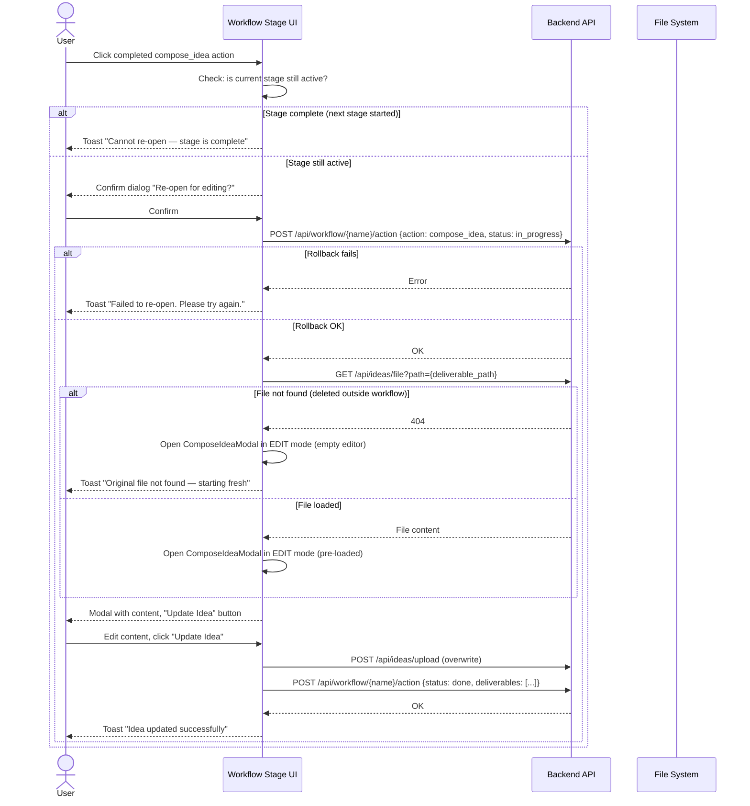

# Idea Summary

> Idea ID: IDEA-024
> Folder: 024. CR-Compose idea Supporting Re-open
> Version: v1
> Created: 2026-02-19
> Status: Refined

## Overview

A Change Request for FEATURE-037-A (Compose Idea Modal) that enables users to **re-open a completed `compose_idea` action** in the Engineering Workflow. Currently, clicking a completed action shows an "already completed" toast with no way to edit. This CR adds a confirmation dialog, edit mode with content pre-loading, and an "Update Idea" flow — gated so re-open is only allowed while the current stage is still active.

## Problem Statement

Once a user completes the `compose_idea` action in a workflow, the idea is permanently locked. Users cannot:
- Fix typos or refine content they just composed
- Change the linked folder or re-link to a different idea
- Update the idea name after realizing it needs adjustment

This forces users to either live with mistakes or manually edit files outside the workflow, breaking the workflow's deliverable tracking.

## Target Users

- **Idea Authors** — users who compose ideas in the workflow and want to iterate
- **Project Leads** — who may review an idea and ask the author to refine before moving to the next stage

## Proposed Solution

Add a **re-open capability** to completed workflow actions (starting with `compose_idea`, designed as a general pattern for all actions). When a user clicks a completed `compose_idea` action:

1. **Gate check** — verify the current stage is not yet fully complete (next stage not started)
2. **Confirmation dialog** — "Re-open for editing?" with Confirm/Cancel
3. **Status rollback** — revert action status from `done` → `in_progress`
4. **Edit mode** — open compose modal pre-loaded with existing content:
   - Folder name shown and editable
   - Idea file content loaded into EasyMDE editor (auto-detected from deliverables in workflow JSON)
   - Button label changes to "Update Idea"
5. **Save** — overwrite idea file in-place, update deliverables

### User Flow

## Key Features

### 1. Re-open Gate Check
- **Definition:** A completed action can be re-opened if and only if **no action in the next stage** has moved to `in_progress` or `done`. The check is: "has the next stage started?" — not "are all actions in the current stage done."
- If the next stage has started, show a toast: "Cannot re-open — stage is complete"
- Implemented as a **reusable function** accepting any action name (not hardcoded to `compose_idea`), enabling future extension to all action types
- Re-opening does NOT invalidate downstream deliverable references because the stage gate guarantees no downstream actions have consumed the deliverables yet

### 2. Confirmation Dialog
- Simple modal: "Re-open for editing? This will set the action back to in-progress."
- Confirm / Cancel buttons
- Uses existing `workflow-modal` pattern from workflow-stage.js

### 3. Edit Mode for Compose Modal
- `ComposeIdeaModal` accepts new option: `{ mode: 'edit', filePath, folderPath, folderName }`
- Loads existing file content into EasyMDE editor
- Folder name field pre-populated and editable
- Submit button label: "Update Idea" (instead of "Submit Idea")
- Overwrite file in-place on save (no version increment)

### 4. Status Rollback
- POST to `/api/workflow/{name}/action` with `status: in_progress`
- Backend already supports status updates — no new endpoint needed

### 5. File Content Loading
- Auto-detect file path from deliverables stored in workflow JSON
- New API: `GET /api/ideas/file?path=x-ipe-docs/ideas/wf-001-name/new idea.md`
- Returns raw file content for editor pre-loading
- **Security:** Backend MUST validate the path stays within the project workspace root (reject path traversal like `../../etc/passwd`). Use `Path.resolve()` and check it starts with `project_root`
- **Graceful degradation:** If the file was deleted outside the workflow, return 404; frontend opens an empty editor with a warning toast

## Success Criteria

- [ ] Clicking completed compose_idea shows confirmation dialog (not toast)
- [ ] Re-open is blocked when next stage has started (any action in next stage is in_progress or done)
- [ ] Compose modal opens in edit mode with existing content loaded
- [ ] If original file is missing, editor opens empty with warning toast
- [ ] Folder name is shown and editable
- [ ] Button says "Update Idea" in edit mode
- [ ] Saving overwrites the file in-place
- [ ] Deliverables in workflow JSON are updated after save
- [ ] Re-open gate-check logic is a reusable function accepting any action name
- [ ] File-read API validates path stays within project workspace root

## Constraints & Considerations

- **Stage gating** — re-open only allowed while the current stage is active; once the workflow moves to the next stage, the action is permanently locked
- **Overwrite semantics** — no version history on re-open save; user explicitly chooses to update. **Safety net:** git history and the workflow JSON's previous deliverables snapshot serve as implicit recovery points. This is an intentional design choice, not an oversight.
- **Link Existing** — NOT in scope for this CR; record as separate CR for future implementation
- **Concurrency** — if another agent is working on downstream actions, re-open should be blocked (same stage-gate rule covers this)
- **Downstream references** — re-opening cannot invalidate downstream deliverable references because the stage gate ensures no downstream action has consumed them yet. If the user changes the folder name, new deliverables are written to the updated path.
- **Path security** — the file-read API must validate paths to prevent directory traversal attacks
- **Backward compatibility** — existing workflows with completed compose_idea must continue to work; re-open is additive

## Brainstorming Notes

**Key decisions from brainstorming session:**
1. **Scope:** General re-open pattern for all actions, but implement for `compose_idea` first
2. **Editing scope:** Full editing — content, folder name, and file override
3. **History:** Overwrite in-place (no auto-versioning on re-open)
4. **Trigger UX:** Simple confirm dialog on click
5. **File detection:** Auto-detect from deliverables in workflow JSON
6. **Link Existing:** Separate CR — not in this scope
7. **Downstream impact:** Re-open only if current stage not done (clean gate)

**Related CR:** Link Existing mode for compose modal (future CR — when a user wants to point compose_idea to an existing folder instead of creating new)

## Source Files

- new idea.md (original raw idea notes)

## Next Steps

- [ ] Proceed to Requirement Gathering (this is a CR for an existing feature)

## References & Common Principles

### Applied Principles

- **Principle of Least Surprise** — clicking a completed action should offer a clear path to edit, not silently block
- **Reversibility** — users should be able to undo/revise decisions before they cascade to downstream stages
- **Progressive Disclosure** — re-open gate is invisible when stage is active (simple confirm); only explains the lock when stage is complete

### Design Patterns

- **Optimistic Locking** — stage-gate acts as a natural lock; no need for explicit lock/unlock mechanisms
- **Edit-in-Place** — consistent with how other IDE-like tools handle file editing
