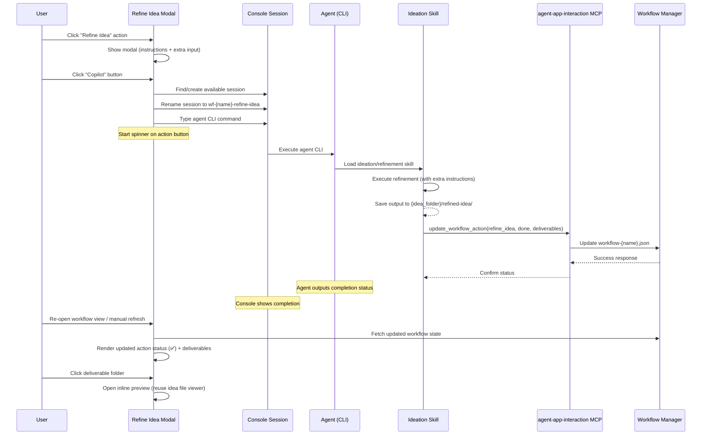
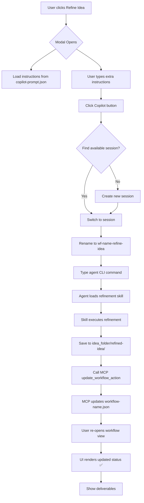

# Idea Summary

> Idea ID: IDEA-025
> Folder: 025. CR-Refine Idea Action
> Version: v2
> Created: 2026-02-20
> Status: Refined

## Overview

A Change Request to implement the **"Refine Idea" workflow action** end-to-end — from the user clicking the action button in the workflow UI, through agent-driven refinement via CLI in an integrated terminal session, to automatic workflow status updates and deliverable display.

## Problem Statement

Currently, the "Refine Idea" action button exists in the workflow stage ribbon but has no automated execution path. Users must manually:
1. Open a terminal and type the agent CLI command with correct parameters
2. Know which idea folder to reference
3. Manually update the workflow status after refinement completes
4. Navigate to find the refined output files

This creates friction, breaks the automated workflow experience, and introduces human error in status tracking.

## Target Users

- **Product owners / Idea authors** — who want one-click idea refinement from the workflow UI
- **AI agents** — that need a structured MCP API to report refinement results back to the workflow
- **Developers** — who maintain the workflow action system and want a consistent pattern

## Proposed Solution

A three-layer solution connecting the **UI modal**, **agent CLI execution**, and **workflow status sync**:



> **Note on UI refresh:** The current workflow UI uses **event-driven re-renders** (callback-based via `window.workflowView.render()`), not polling. After the agent completes and updates the workflow JSON via MCP, the user re-opens or manually refreshes the workflow view to see the updated status. A future enhancement could add WebSocket-based real-time status push.

## Key Features

### 1. Refine Idea Modal Window

When the user clicks the "Refine Idea" action button in the workflow stage view:

- **Open a modal** with the following content:
  - **Refinement instructions** (readonly textarea): loaded from `copilot-prompt.json` (served from `src/x_ipe/resources/config/copilot-prompt.json` at runtime), mapped by the `refine-idea` action ID
  - **Extra instructions** (editable textarea): optional user input for additional guidance
  - **"Copilot" button**: triggers the console session + agent CLI execution

> **Reuse pattern:** Follow the same modal lifecycle pattern as `compose-idea-modal.js` (open → populate → submit → close) which is already proven in the codebase.

### 2. Console Session Management

When the user clicks the "Copilot" button:

1. **Find an available session** from the existing terminal sessions:
   - A session is "available" if: not currently executing a command, in a normal shell prompt (not inside a CLI tool), and can accept input
   - **⚠ New capability required:** The existing `SessionManager` only tracks `is_expired()` (disconnect > 1hr). Shell-prompt detection does NOT exist today. Options:
     - **Option A (simpler):** Always create a new dedicated session for each refinement — avoids availability detection entirely
     - **Option B (smarter):** Add a `is_idle()` method to `PersistentSession` that checks if the last output buffer ends with a known shell prompt pattern (e.g., `$`, `%`, `>`)
   - If no available session → create a new one
2. **Rename the session** to `wf-{workflow_name}-refine-idea` — this name is used for:
   - User identification in the session list (so they know which terminal is running the refinement)
   - Potential cleanup/recovery (find and kill stale refinement sessions)
3. **Type the agent CLI command** into the session:
   - Abstract command structure: `<agent-tool> "<refinement-instructions>" --context <idea-folder-path> [--extra-instructions "<user-extra-text>"]`
   - Concrete example (OpenCode): `opencode "refine the idea x-ipe-docs/ideas/025/new idea.md with ideation skill" --extra-instructions "focus on error handling"`
   - The modal constructs the command based on the installed/configured agent tool

### 3. Refinement Skill Updates

The existing ideation/refinement skill needs modifications:

- **Accept `extra_instructions`** as an input parameter (already partially supported)
- **Output refined idea** to `{idea_folder}/refined-idea/` subfolder — this is a **new dedicated subfolder** that coexists with `idea-summary-vN.md` at the folder root. The `refined-idea/` folder contains the agent's refinement output, while `idea-summary-vN.md` remains the canonical ideation artifact. They serve different purposes and do NOT replace each other.
- **Call workflow manager** via `agent-app-interaction` MCP's `update_workflow_action` tool in the skill's DoD:
  - Action: `refine_idea`
  - Status: `done`
  - Deliverables: both file paths and folder path are valid (e.g., `["{idea_folder}/refined-idea/"]`) — consistent with existing workflow JSON patterns
- **Output the file path** and workflow manager execution response status

### 4. Execution Skill DoD Update

Add a new checkpoint to the `x-ipe-workflow-task-execution` skill's **Step 5 (Check Global DoD)** section:
- **Where:** After the existing "Changes committed to git" check
- **Check:** If the skill's `task_completion_output` declares `next_task_based_skill` or interacts with workflow actions, verify that `update_workflow_action` was called (i.e., the workflow action status is NOT still `pending`)
- **On failure:** Flag the task as incomplete and log: "Skill completed but workflow status not updated"

### 5. Workflow Manager MCP API

Extend the existing `update_workflow_action` MCP tool:

**Current API signature (already exists):**
```python
def update_workflow_action(
    workflow_name: str,
    action: str,           # e.g., "refine_idea"
    status: str,           # "pending" | "in_progress" | "done" | "skipped" | "failed"
    feature_id: str = None,
    deliverables: list = None  # e.g., ["{idea_folder}/refined-idea/"]
) -> dict
```

**Contract:**
- Input values should be directly extractable from the skill's `task_completion_output` data model
- If the skill output doesn't provide reasonable values, constrain the skill to produce consistent data
- Response: `{ success: true/false, workflow_state: {...} }` or error details
- Workflow JSON files follow existing naming: `workflow-{name}.json` (e.g., `workflow-hello.json`)

### 6. Post-Refinement UI Updates

After the agent completes refinement and calls the MCP:

- **Action button** shows spinner/pulse during execution → transitions to ✅ done on next workflow view render
- **UI refresh model:** The current workflow UI uses event-driven re-renders (not polling). The updated status is visible when the user re-opens the workflow view or manually refreshes. The `onComplete` callback in the modal can trigger `window.workflowView.render()` if the console session completes while the view is active.
- **Deliverables section** shows the `refined-idea/` folder
- **Next action** is indicated (suggested state on the next action button)
- **Click on deliverable folder** → opens modal with inline text/markdown preview, reusing the existing linked idea file viewer component
- Scope: files within the current idea folder only

### 7. Progress Indicator

While the agent is executing:
- **Simple spinner/pulse animation** on the "Refine Idea" action button
- Non-blocking: user can continue using the rest of the UI

## Architecture Overview

```architecture-dsl
@startuml module-view
title "CR-Refine Idea Action\nComponent Architecture"
theme "theme-default"
direction top-to-bottom
grid 12 x 8

layer "Presentation Layer" {
  color "#E3F2FD"
  border-color "#1565C0"
  rows 2

  module "Workflow UI" {
    cols 4
    rows 2
    grid 2 x 1
    align center center
    gap 8px
    component "Stage Ribbon\n(Action Buttons)" { cols 1, rows 1 }
    component "Deliverable\nViewer" { cols 1, rows 1 }
  }

  module "Refine Idea Modal" {
    cols 4
    rows 2
    grid 2 x 1
    align center center
    gap 8px
    component "Instruction\nDisplay" { cols 1, rows 1 }
    component "Extra Input\n& Copilot Btn" { cols 1, rows 1 }
  }

  module "Console Session" {
    cols 4
    rows 2
    grid 2 x 1
    align center center
    gap 8px
    component "Session\nFinder" { cols 1, rows 1 }
    component "Terminal\nEmitter" { cols 1, rows 1 }
  }
}

layer "Agent Layer" {
  color "#E8F5E9"
  border-color "#2E7D32"
  rows 2

  module "Agent CLI" {
    cols 6
    rows 2
    grid 2 x 1
    align center center
    gap 8px
    component "Command\nParser" { cols 1, rows 1 }
    component "Skill\nLoader" { cols 1, rows 1 }
  }

  module "Ideation Skill" {
    cols 6
    rows 2
    grid 3 x 1
    align center center
    gap 8px
    component "Refinement\nEngine" { cols 1, rows 1 }
    component "Output\nWriter" { cols 1, rows 1 }
    component "MCP\nCaller" { cols 1, rows 1 }
  }
}

layer "Service Layer" {
  color "#FFF3E0"
  border-color "#E65100"
  rows 2

  module "MCP Server" {
    cols 6
    rows 2
    grid 2 x 1
    align center center
    gap 8px
    component "update_workflow\n_action" { cols 1, rows 1 }
    component "get_workflow\n_state" { cols 1, rows 1 }
  }

  module "Workflow Manager" {
    cols 6
    rows 2
    grid 2 x 1
    align center center
    gap 8px
    component "Status\nUpdater" { cols 1, rows 1 }
    component "workflow-{name}\n.json Persistence" { cols 1, rows 1 }
  }
}

layer "Data Layer" {
  color "#F3E5F5"
  border-color "#6A1B9A"
  rows 2

  module "Idea Storage" {
    cols 6
    rows 2
    grid 2 x 1
    align center center
    gap 8px
    component "copilot-prompt\n.json" { cols 1, rows 1 }
    component "{idea_folder}/\nrefined-idea/" { cols 1, rows 1 }
  }

  module "Workflow Storage" {
    cols 6
    rows 2
    grid 1 x 1
    align center center
    gap 8px
    component "workflow-{name}\n.json" { cols 1, rows 1 }
  }
}

@enduml
```

## Data Flow



## Success Criteria

- [ ] Clicking "Refine Idea" action opens a modal with readonly instructions and extra input textarea
- [ ] "Copilot" button finds/creates a console session and types the correct agent CLI command
- [ ] Session is renamed to `wf-{workflow_name}-refine-idea`
- [ ] Agent refinement skill accepts extra instructions parameter
- [ ] Refined output is saved to `{idea_folder}/refined-idea/` subfolder
- [ ] Skill calls `update_workflow_action` MCP tool with action=refine_idea, status=done, deliverables
- [ ] Workflow JSON (`workflow-{name}.json`) is updated with new action status and deliverables
- [ ] Action button shows spinner/pulse during execution and ✅ when complete
- [ ] Deliverable section shows the refined-idea folder
- [ ] Clicking the folder opens inline markdown preview using existing idea file viewer
- [ ] User can continue using the UI while agent works (non-blocking)
- [ ] Execution skill DoD checks that workflow status is NOT pending after completion

## Constraints & Considerations

- **Scope**: This CR is for the "Refine Idea" action ONLY — not a generic pattern for all actions (yet)
- **Console availability**: Need a reliable way to determine if a session is "available" (see Feature §2 for options). Simplest approach: always create a new dedicated session
- **Agent CLI format**: The abstract command structure is defined, but concrete syntax varies per agent tool. The modal should read the installed agent tool from config
- **copilot-prompt.json**: Served from `src/x_ipe/resources/config/copilot-prompt.json` at runtime (the `x-ipe-docs/config/` copy is for documentation). The `refine-idea` action is already defined
- **Existing MCP**: The `update_workflow_action` tool already exists — this CR ensures the refinement skill calls it in its DoD
- **Deliverable paths**: Must use relative paths consistent with existing deliverable display system. Both file and folder paths are supported (per existing `workflow-hello.json` patterns)
- **Output folder coexistence**: The `refined-idea/` subfolder coexists with `idea-summary-vN.md` — they serve different purposes and do NOT replace each other

## Failure Modes & Error Handling

| Failure Scenario | Detection | Expected Behavior |
|-----------------|-----------|-------------------|
| **Agent crashes mid-refinement** | Console session shows error/exit | Action status remains `in_progress` or `pending`. User can re-trigger from modal. Partial output may exist in `refined-idea/` |
| **MCP call fails** | Skill DoD check finds status still `pending` | Skill reports incomplete. Agent logs error. User can manually update status via workflow context menu (existing feature) |
| **Session disconnects** | `PersistentSession.is_connected` = false | PTY stays alive (existing behavior). User can reconnect. Agent continues in background |
| **copilot-prompt.json missing refine-idea** | Modal fails to load instructions | Show error toast: "Refine idea instructions not configured". Disable Copilot button |
| **No console session can be created** | SessionManager.create_session() fails | Show error toast: "Failed to create terminal session". Log error for debugging |
| **Workflow JSON write fails** | MCP returns error response | Agent retries once. On second failure: log error, mark action as `failed`, alert user |

## Brainstorming Notes

### Key Decisions Made
1. **Narrow scope** — Refine Idea action only, not a generic pattern for all workflow actions
2. **Output location** — New `refined-idea/` subfolder under idea folder, coexists with `idea-summary-vN.md` (different purposes, no replacement)
3. **Status communication** — Agent → MCP → `workflow-{name}.json` → UI re-render on next view open (event-driven, not polling)
4. **Progress UX** — Simple spinner/pulse on action button, non-blocking
5. **Deliverable viewer** — Inline text/markdown preview, reusing existing linked idea file viewer component
6. **MCP contract** — Reuse existing `update_workflow_action` API, values directly extractable from skill output
7. **Console sessions** — Leverage existing X-IPE integrated terminal sessions; prefer creating new dedicated session (simpler than availability detection)
8. **Modal pattern** — Follow `compose-idea-modal.js` lifecycle pattern (open → populate → submit → close)

### Open Questions for Requirement Phase
- Whether to implement session availability detection (Option B) or always create new sessions (Option A)
- Agent CLI command format variations per supported agent tool (OpenCode, Claude CLI, etc.)
- Whether to add WebSocket-based real-time status push as a follow-up enhancement

## Ideation Artifacts

- Architecture diagram (Architecture DSL embedded above)
- Sequence diagram (Mermaid embedded above)
- Data flow diagram (Mermaid embedded above)

## Mockups and Prototypes

- [Refine Idea Modal Mockup (v1)](x-ipe-docs/ideas/025. CR-Refine Idea Action/mockups/refine-idea-modal-v1.html) — Interactive HTML mockup covering all 4 scenes:
  1. **Action Button States** — Suggested, In Progress (spinner/pulse), Done, Locked
  2. **Refine Idea Modal** — Readonly instructions from copilot-prompt.json, extra instructions textarea, Copilot button
  3. **Post-Refinement Workflow View** — Done state, deliverables grid, next action suggested
  4. **Deliverable Viewer** — Two-column layout (file tree + inline markdown preview)

## Source Files

- new idea.md (original idea notes)

## Next Steps

- [ ] Proceed to Requirement Gathering (recommended — well-defined CR with clear features)

## References & Common Principles

### Applied Principles

- **Command Pattern** — The modal constructs and dispatches a command to the agent via CLI, decoupling UI from execution
- **Observer Pattern** — UI polls workflow JSON for status changes rather than tight coupling to agent lifecycle
- **Single Responsibility** — Each component has one job: modal (collect input), session manager (find/create session), skill (refine), MCP (update status)

### Existing System References

- `src/x_ipe/static/js/features/workflow-stage.js` — Workflow action button rendering and state management
- `src/x_ipe/mcp/app_agent_interaction.py` — MCP server with `update_workflow_action` tool
- `src/x_ipe/services/terminal_service.py` — Console session management (SessionManager, PersistentSession)
- `x-ipe-docs/config/copilot-prompt.json` — Action prompt configuration with `refine-idea` entry
- `x-ipe-docs/engineering-workflow/wf-*.json` — Workflow state files with action statuses and deliverables
