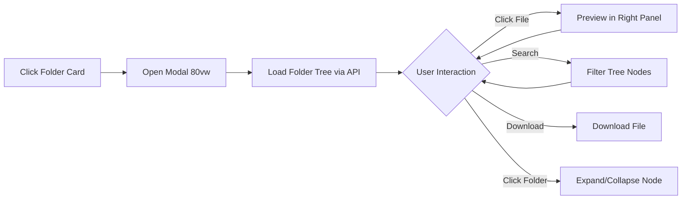

# Idea Summary

> Idea ID: IDEA-026
> Folder: 026. CR-Modal Window - Workflow-Deliverable Folder
> Version: v1
> Created: 2026-02-22
> Status: Refined

## Overview

Replace the inline folder tree expansion in workflow deliverable cards with a dedicated **Folder Browser Modal** — a two-panel file explorer that opens when clicking a folder deliverable. Additionally, visually distinguish folder cards from file cards with a different background color.

## Problem Statement

The current inline folder tree has several UX issues:
1. **Visual confusion** — Folder and file deliverable cards share the same background, making it hard to distinguish them at a glance
2. **Cramped inline tree** — Expanding a folder tree within a small deliverable card creates a cluttered, hard-to-navigate layout
3. **Limited preview space** — Inline file previews compete for space with the tree structure, reducing readability
4. **Inconsistent pattern** — The compose-idea modal already uses a clean two-panel tree+preview pattern (LinkExistingPanel), but deliverables use a different, inferior approach

## Target Users

- **Developers/Engineers** using X-IPE workflow to review deliverables produced by workflow actions
- **Project Managers** browsing folder-type deliverables (refined ideas, mockups, specifications) for review

## Proposed Solution

A three-part change:

### Part 1: Visual Distinction — Folder Card Background
Differentiate folder-type deliverable cards from file-type cards using a distinct background color (e.g., subtle warm tint vs. the default card background).

### Part 2: Remove Inline Folder Tree
Remove all code related to the expandable inline folder tree:
- `_expandFolderTree()` method
- Expand/collapse toggle (▸/▾) button
- `.deliverable-tree` container and nested tree CSS
- Inline preview backdrop

### Part 3: Folder Browser Modal
When a user clicks a folder deliverable card, open a modal window with:



**Modal Layout:**

```
┌─ Breadcrumb: ideas / 026-CR-Modal / refined-idea / ──────────────┐
├─ [🔍 Search files...]                                            ┤
├─ Tree Panel (left, 30%)  ─────── Preview Panel (right, 70%) ─────┤
│ 📁 refined-idea              │                                    │
│   📝 idea-summary-v1.md  ←   │  # Idea Summary                   │
│   🖼️ mockup.png              │  > Idea ID: IDEA-026              │
│   📄 notes.txt               │  > Version: v1                    │
│ 📁 mockups                   │  ...rendered markdown...           │
│   📄 wireframe.html          │                                    │
│                              │  [⬇ Download]                      │
└──────────────────────────────────────────────────────────────────┘
```

**Key Features:**
- **Breadcrumb** — Shows full path context above tree/preview panels
- **Search bar** — Filters files within the folder tree in real-time
- **Typed file icons** — 📝 for `.md`, 🖼️ for images, 💻 for code files, 📄 for others
- **Rich preview** — Markdown rendered via marked.js, images displayed inline, code with syntax hints, plain text in `<pre>`
- **Download button** — Download the currently previewed file
- **80vw width** — Consistent with other content modals (compose, toolbox, tracing)

## Key Features

- **Folder Card Redesign** — distinct background color, folder icon, click opens modal
- **Breadcrumb Navigation** — shows full path context (e.g., `ideas / 026 / refined-idea /`)
- **Search/Filter Bar** — filters file and folder names recursively across all expanded levels; match is case-insensitive on name only
- **Tree Panel (left 30%)** — recursive folder tree with expand/collapse; folders loaded eagerly (full tree from API on modal open)
- **Preview Panel (right 70%)** — auto-detects file type:
  - Markdown → rendered HTML (via marked.js)
  - Images (.png, .jpg, .svg) → inline `` rendering
  - Code files → preformatted `<pre>` display
  - Plain text → `<pre>` display
  - Binary/unsupported (.pdf, .zip) → show file name + size + download prompt
- **Download Button** — download the currently previewed individual file (folder-level zip download is **out of scope**)
- **Typed File Icons** — 📝 `.md`, 🖼️ images, 💻 code, 📄 other
- **Modal Lifecycle** — opens with loading spinner while tree API is in-flight; closes via close button, Escape key, or backdrop click
- **Keyboard Support** — Escape to close, Tab between panels, arrow keys for tree navigation

## Component Architecture

```architecture-dsl
@startuml module-view
title "Folder Browser Modal — Component Architecture"
theme "theme-default"
direction top-to-bottom
grid 12 x 5

layer "Presentation Layer" {
  color "#E3F2FD"
  border-color "#90CAF9"
  rows 2

  module "Deliverable Cards" {
    cols 4
    rows 2
    grid 2 x 1
    align center center
    gap 8px
    component "File Card" { cols 1, rows 1 }
    component "Folder Card\n(new bg)" { cols 1, rows 1 }
  }

  module "Folder Browser Modal" {
    cols 8
    rows 2
    grid 3 x 2
    align center center
    gap 8px
    component "Breadcrumb" { cols 1, rows 1 }
    component "Search Bar" { cols 1, rows 1 }
    component "Close Btn" { cols 1, rows 1 }
    component "Tree Panel" { cols 1, rows 1 }
    component "Preview Panel" { cols 1, rows 1 }
    component "Download Btn" { cols 1, rows 1 }
  }
}

layer "Logic Layer" {
  color "#E8F5E9"
  border-color "#A5D6A7"
  rows 2

  module "Tree Manager" {
    cols 6
    rows 2
    grid 2 x 2
    align center center
    gap 8px
    component "Tree Renderer" { cols 1, rows 1 }
    component "Node Expander" { cols 1, rows 1 }
    component "Search Filter" { cols 1, rows 1 }
    component "Icon Resolver" { cols 1, rows 1 }
  }

  module "Preview Engine" {
    cols 6
    rows 2
    grid 2 x 2
    align center center
    gap 8px
    component "Markdown\nRenderer" { cols 1, rows 1 }
    component "Image\nRenderer" { cols 1, rows 1 }
    component "Code\nRenderer" { cols 1, rows 1 }
    component "Download\nHandler" { cols 1, rows 1 }
  }
}

layer "API Layer" {
  color "#FFF3E0"
  border-color "#FFCC80"
  rows 1

  module "Backend Endpoints" {
    cols 12
    rows 1
    grid 3 x 1
    align center center
    gap 8px
    component "GET /api/workflow/{wf}\n/deliverables/tree" { cols 1, rows 1 }
    component "GET /api/ideas/file" { cols 1, rows 1 }
    component "GET /api/ideas/file\n(download)" { cols 1, rows 1 }
  }
}

@enduml
```

## Success Criteria

- [ ] Folder cards have visually distinct background from file cards
- [ ] Inline folder tree code completely removed (no dead code)
- [ ] Clicking folder card opens modal with tree panel (left) and preview panel (right)
- [ ] Breadcrumb shows current folder path
- [ ] Search bar filters file/folder names recursively (case-insensitive)
- [ ] Files show type-specific icons (📝 .md, 🖼️ images, 💻 code, 📄 other)
- [ ] Markdown files render as HTML in preview
- [ ] Image files render inline in preview
- [ ] Binary/unsupported files show download prompt instead of preview
- [ ] Download button works for any file
- [ ] Modal is 80vw wide, consistent with other content modals
- [ ] Modal closes via close button, Escape key, or backdrop click
- [ ] Loading spinner shown while folder tree API call is in-flight
- [ ] Empty folder shows "No files found" empty state
- [ ] File load failure shows error state with retry option
- [ ] Reuses existing API endpoints (no new backend work needed)
- [ ] Pattern follows LinkExistingPanel UX from compose-idea-modal

## Edge Cases

| Scenario | Expected Behavior |
|----------|-------------------|
| Empty folder | Show "This folder is empty" message in tree panel |
| File fails to load | Show error message in preview panel with "Retry" button |
| Large files (>1MB text) | Truncate preview with "File too large to preview — download instead" |
| Binary files (.pdf, .zip, .exe) | Show file icon, name, size + "Download" button (no inline preview) |
| Deeply nested folders (>5 levels) | Tree supports unlimited nesting; breadcrumb truncates with "..." |
| Special characters in filenames | URL-encode paths in API calls |

## Not in Scope

- Downloading entire folders as ZIP archive
- Editing files from the modal
- Creating/deleting files from the modal
- Drag-and-drop file operations

## Constraints & Considerations

- **No new backend endpoints required** — existing `/api/workflow/{wf}/deliverables/tree` and `/api/ideas/file` endpoints are sufficient
- **Reuse pattern from LinkExistingPanel** — tree rendering, file selection, and preview logic follow the same architecture. LinkExistingPanel already supports markdown and plain text preview; image rendering will be a new addition to the preview engine
- **80vw modal** — follows established pattern for content modals
- **Dead code removal** — inline tree code must be cleanly removed, not just hidden. The list of methods/elements to remove (in Part 2) will be confirmed during technical design via code audit
- **CSS cascade** — folder card background change must not break existing file card styling. Background color should use a CSS variable (e.g., `--deliverable-folder-bg`) for themability
- **Tree loading strategy** — full tree loaded eagerly on modal open (API returns complete recursive structure); this matches the existing endpoint behavior
- **Keyboard accessibility** — modal must support Escape, Tab, and arrow key navigation; ARIA roles for modal (`role="dialog"`) and tree (`role="tree"`, `role="treeitem"`)

## Brainstorming Notes

- The compose-idea modal's `LinkExistingPanel` already implements a mature tree+preview pattern — this CR essentially adapts that pattern for deliverable folder browsing
- User confirmed: search bar, breadcrumb navigation, typed file icons, image preview, and download button all in scope
- Key insight: this is a **refactor**, not a new feature — replacing inline tree with a better modal pattern
- The modal approach gives more screen real estate for both tree navigation and file preview
- Breadcrumb helps users maintain orientation when browsing deep folder structures

## Source Files

- Feedback-20260222-110609/feedback.md
- Feedback-20260222-110609/page-screenshot.png

## Next Steps

- [ ] Proceed to Requirement Gathering (this is a CR to an existing feature)

## References & Common Principles

### Applied Principles
- **Explorer/Miller Columns Pattern:** Two-panel layout (tree + preview) — industry standard for file browsing (macOS Finder, VS Code, GitHub)
- **Progressive Disclosure:** Show folder structure first, load file content on demand (lazy loading)
- **Responsive Preview:** Auto-detect file type for appropriate rendering (markdown→HTML, images→inline, code→preformatted)
- **Visual Hierarchy:** Distinct card styling creates clear affordances for different deliverable types
- **DRY (Don't Repeat Yourself):** Reuse the LinkExistingPanel pattern rather than building from scratch
