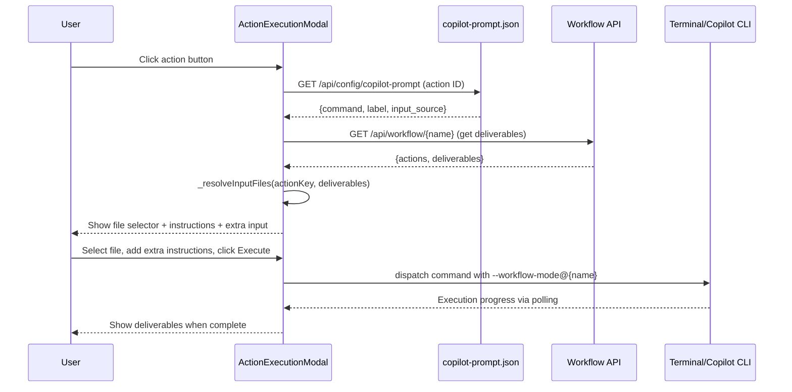
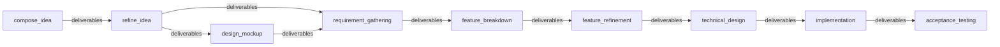
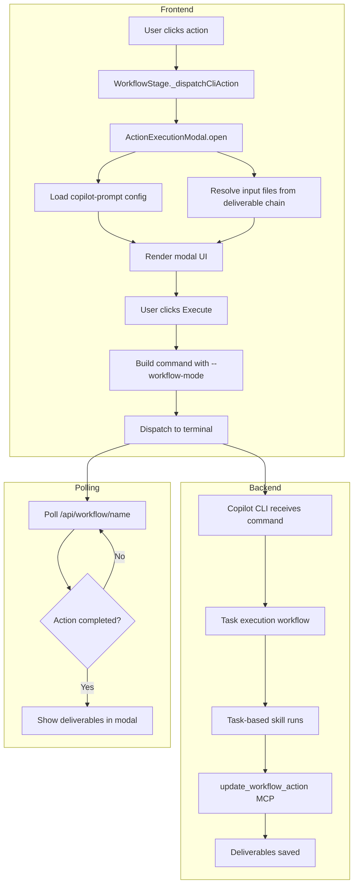

# Idea Summary

> Idea ID: IDEA-027
> Folder: 027. CR-Optimize-Idea Mokcup, Requirement Gathering and other actions
> Version: v1
> Created: 2026-02-22
> Status: Refined

## Overview

Generalize the Action Execution Modal — currently only wired for "Refine Idea" — so that **every CLI-based workflow action** (Design Mockup, Requirement Gathering, Feature Breakdown, Feature Refinement, Technical Design, Implementation, Acceptance Testing, Change Request) gets the same first-class modal UX: auto-resolved input files, instruction display, extra-instructions textarea, terminal dispatch, status polling, and deliverable rendering.

## Problem Statement

The Refine Idea action is the only workflow action with a fully working modal experience. All other CLI actions in the workflow (12+ actions across 5 stages) lack:

1. **No copilot-prompt configs** — clicking them has no instruction text to display
2. **No input file resolution** — the modal's `_resolveIdeaFiles()` is hardcoded for idea files; other actions need requirement docs, feature specs, technical designs, etc.
3. **No per-action file discovery** — there's no generic way to resolve "what file does this action need?" from the workflow's deliverable chain
4. **Inconsistent UX** — users must manually type commands for non-Refine-Idea actions, breaking the visual workflow experience

## Target Users

- **Product owners / Developers** using the X-IPE Workflow UI to manage idea-to-implementation pipelines
- **AI agents** that receive commands dispatched from the modal

## Proposed Solution

A three-layer approach: **generalize the frontend modal**, **complete the prompt configuration**, and **update skills for workflow-mode integration**.



### Core Design Principle: Deliverable Chain Resolution

Instead of hardcoding per-action file resolution logic, use a **deliverable chain** pattern:



Each action declares its **input source action(s)** in the copilot-prompt config. The modal resolves input files by looking at the deliverables of the declared source action(s) within the current workflow.

## Key Features

### Feature 1: Generalized Input File Resolution

Replace the hardcoded `_resolveIdeaFiles()` with a generic `_resolveInputFiles(actionKey)` that:

- Reads the action's `input_source` field from copilot-prompt.json (e.g., `"input_source": ["refine_idea", "compose_idea"]`)
- Fetches deliverables from those source actions in the current workflow
- Filters by file extension (`.md` by default, configurable)
- Falls back to manual path input if no deliverables are found
- Uses existing `/api/workflow/{name}/deliverables/tree` for folder exploration

### Feature 2: Complete Copilot-Prompt Configuration

Add prompt entries for all CLI actions with consistent structure:

| Action | Config ID | Command Template | Input Source |
|--------|-----------|-----------------|--------------|
| `design_mockup` | `generate-mockup` | (exists) | `refine_idea`, `compose_idea` |
| `requirement_gathering` | `requirement-gathering` | `gather requirements from <input-file>` | `refine_idea`, `design_mockup` |
| `feature_breakdown` | `feature-breakdown` | `break down features from <input-file>` | `requirement_gathering` |
| `feature_refinement` | `feature-refinement` | `refine feature from <input-file>` | `feature_breakdown` |
| `technical_design` | `technical-design` | `create technical design from <input-file>` | `feature_refinement` |
| `implementation` | `implementation` | `implement feature from <input-file>` | `technical_design` |
| `acceptance_testing` | `acceptance-testing` | `run acceptance tests from <input-file>` | `implementation` |
| `change_request` | `change-request` | `process change request from <input-file>` | `user-selected` (manual path input — CR can target any stage) |
| `quality_evaluation` | `quality-evaluation` | `evaluate quality of <input-file>` | `implementation`, `acceptance_testing` (deferred — placeholder only) |

### Feature 3: Consistent Modal UX for All Actions

Every CLI action gets the same modal layout:

```
┌────────────────────────────────────────────┐
│  [Icon] Action Label                    [X]│
├────────────────────────────────────────────┤
│  📄 Target Input:                          │
│  ┌──────────────────────────────────────┐  │
│  │ [dropdown: auto-resolved files]      │  │
│  └──────────────────────────────────────┘  │
│                                            │
│  📝 Instructions:                          │
│  ┌──────────────────────────────────────┐  │
│  │ {command from copilot-prompt.json}   │  │
│  └──────────────────────────────────────┘  │
│                                            │
│  ✏️ Extra Instructions (optional):         │
│  ┌──────────────────────────────────────┐  │
│  │                                      │  │
│  └──────────────────────────────────────┘  │
│                                            │
│  [Execute with Copilot]                    │
└────────────────────────────────────────────┘
```

### Feature 4: Skill Workflow-Mode Updates

Ensure all task-based skills properly handle `--workflow-mode@{name}`:
- Accept `execution_mode` and `workflow.name` input parameters
- Call `update_workflow_action` MCP tool on completion
- Declare `workflow_action` in their output YAML

**Skill Readiness Assessment:**

| Skill | Workflow-Mode Ready? | Needs Update? |
|-------|---------------------|---------------|
| `x-ipe-task-based-ideation-v2` | ✅ Yes (EPIC-038) | No |
| `x-ipe-task-based-idea-mockup` | ⚠️ Partial | Add `workflow_action` output |
| `x-ipe-task-based-requirement-gathering` | ❌ No | Add execution_mode input + workflow_action output |
| `x-ipe-task-based-feature-breakdown` | ❌ No | Add execution_mode input + workflow_action output |
| `x-ipe-task-based-feature-refinement` | ❌ No | Add execution_mode input + workflow_action output |
| `x-ipe-task-based-technical-design` | ❌ No | Add execution_mode input + workflow_action output |
| `x-ipe-task-based-code-implementation` | ❌ No | Add execution_mode input + workflow_action output |
| `x-ipe-task-based-feature-acceptance-test` | ❌ No | Add execution_mode input + workflow_action output |
| `x-ipe-task-based-change-request` | ❌ No | Add execution_mode input + workflow_action output |

### Feature 5: Multi-Source & Per-Feature Resolution

**Multi-source resolution:** When an action has multiple `input_source` actions (e.g., `requirement_gathering` sources from both `refine_idea` and `design_mockup`), deliverables are **merged and grouped by source action** in the dropdown:

```
┌─ From refine_idea ──────────────────┐
│  idea-summary-v1.md                 │
├─ From design_mockup ────────────────┤
│  mockup-v1.html                     │
└─────────────────────────────────────┘
```

**Per-feature resolution:** For actions in the `implement` stage (feature_refinement, technical_design, implementation), the modal must resolve deliverables scoped to a **specific feature lane**. The workflow API already tracks per-feature deliverables via `feature_id`. The modal will:
1. Detect if the action is per-feature (check stage type)
2. Show a feature selector dropdown first
3. Then resolve deliverables for that feature only

## Architecture Overview

```architecture-dsl
---
title: CR-027 Generalized Action Execution Architecture
type: module-view
---

layer "Frontend (Browser)" {
  module "ActionExecutionModal" {
    desc "Generalized modal — dispatches ANY cli action"
    tags [modified]
  }
  module "WorkflowStage" {
    desc "Routes action clicks to modal or custom UI"
    tags [unchanged]
  }
}

layer "Configuration" {
  module "copilot-prompt.json" {
    desc "Per-action command templates + input_source declarations"
    tags [modified]
  }
  module "tools.json" {
    desc "Stage-level toolbox configuration"
    tags [unchanged]
  }
}

layer "Backend API" {
  module "Workflow Routes" {
    desc "Serves workflow state, deliverables, action updates"
    tags [minor-change]
  }
  module "Workflow Manager" {
    desc "Manages workflow lifecycle and action state machine"
    tags [unchanged]
  }
}

layer "Agent Layer" {
  module "Copilot CLI" {
    desc "Receives --workflow-mode commands, dispatches to skills"
    tags [unchanged]
  }
  module "Task-Based Skills" {
    desc "Individual skills — may need workflow_action output updates"
    tags [minor-change]
  }
}
```

## Data Flow



## Success Criteria

- [ ] All CLI actions in ACTION_MAP have corresponding copilot-prompt.json entries
- [ ] `_resolveInputFiles()` replaces `_resolveIdeaFiles()` with generic deliverable chain resolution
- [ ] Clicking any CLI action opens the modal with correct input files auto-resolved
- [ ] Extra instructions textarea available for all actions
- [ ] Command dispatched with `--workflow-mode@{name}` prefix for all actions
- [ ] Action status updates and deliverable rendering work for all actions
- [ ] Existing Refine Idea flow continues to work (no regression)
- [ ] Skills declare `workflow_action` in their output for status tracking

## Constraints & Considerations

| Constraint | Impact |
|-----------|--------|
| Backward compatibility | Existing Refine Idea flow must not break |
| copilot-prompt.json schema | Adding `input_source` field is a schema extension — ensure backward compat |
| Skill readiness | Not all skills may be workflow-mode ready; modal should gracefully handle missing configs |
| Placeholder commands | Some actions may have placeholder commands until skills are fully tested |
| Quality Evaluation action | Marked as `deferred: true` — placeholder config only, not functional |

## Phased Rollout

| Phase | Scope | Actions Covered |
|-------|-------|----------------|
| **Phase 1: Modal Generalization** | Refactor `_resolveIdeaFiles()` → `_resolveInputFiles()`, add `input_source` to copilot-prompt schema, test with existing Refine Idea | `refine_idea` (regression test) |
| **Phase 2: Core Actions** | Add prompt configs + test for 3 primary actions from feedback | `design_mockup`, `requirement_gathering`, `feature_breakdown` |
| **Phase 3: Implement Stage** | Add prompt configs + per-feature resolution | `feature_refinement`, `technical_design`, `implementation` |
| **Phase 4: Validation & Feedback** | Add remaining actions | `acceptance_testing`, `change_request` |
| **Phase 5: Skill Updates** | Update skills for workflow-mode compliance | All skills in readiness table above |

## Non-Functional Requirements

- **Performance:** Deliverable chain resolution may trigger 1-3 API calls per modal open (one per source action). This is acceptable given API calls are local (< 50ms each). No lazy loading needed.
- **Testing Strategy:** Each phase includes manual acceptance testing via the workflow UI. Existing unit tests for `ActionExecutionModal` must be updated to cover the new `_resolveInputFiles()` path.
- **Graceful Degradation:** If copilot-prompt config is missing for an action, the modal shows "Configuration not yet available" with the execute button disabled. If no deliverables are found, show a manual file path input as fallback.

## Failure Modes & Error Handling

| Scenario | Behavior |
|----------|----------|
| No copilot-prompt config for action | Show "Configuration missing" message, disable execute button |
| No deliverables from source action | Show empty file selector with manual path input fallback |
| Skill not workflow-mode ready | Command still dispatches; skill handles gracefully |
| Terminal session not idle | Queue command or show "waiting for terminal" message |
| Action already completed | Show deliverables directly, allow re-execution |

## Brainstorming Notes

### Key Decisions
1. **Scope: All CLI actions** — future-proof by covering every action in ACTION_MAP, not just the 3 mentioned
2. **Auto-resolve from previous action deliverables** — follows the natural workflow flow; each action picks up where the previous left off
3. **Consistent UX** — all actions get instruction display + extra instructions textarea
4. **Terminal dispatch pattern** — all actions use the same Copilot CLI terminal dispatch
5. **Placeholder prompts for all** — add copilot-prompt entries even for not-yet-tested actions to enable the modal
6. **Change Request uses manual path** — since CRs can target any stage, `input_source` is `user-selected` with manual path input
7. **Multi-source grouped display** — when multiple source actions, group deliverables by source in dropdown
8. **Per-feature scoping** — implement stage actions use feature selector before file selector
9. **Phased rollout** — 5 phases from modal generalization to skill updates

### Critique Feedback Addressed
- ✅ `change_request` input_source clarified as `user-selected` (manual path)
- ✅ Phased rollout plan added (5 phases)
- ✅ Skill readiness table added (Feature 4)
- ✅ Non-functional requirements added (performance, testing, degradation)
- ✅ Multi-source resolution strategy documented (Feature 5)
- ✅ Per-feature resolution for implement stage documented (Feature 5)
- ✅ Quality Evaluation included as deferred placeholder in prompt config table

## Source Files
- x-ipe-docs/uiux-feedback/Feedback-20260222-132751-1/feedback.md
- x-ipe-docs/ideas/027. CR-Optimize-Idea Mokcup, Requirement Gathering and other actions/new idea.md

## Next Steps
- [ ] Proceed to Idea Mockup or Requirement Gathering
- [ ] Create EPIC for this CR
- [ ] Break down into features (Frontend Modal Generalization, Prompt Config Completion, Skill Updates)

## References & Common Principles

### Applied Principles
- **Strategy Pattern** — Different actions use different input resolution strategies, selected at runtime based on config
- **Open-Closed Principle** — Modal is open for extension (new actions) but closed for modification (core logic unchanged)
- **Convention over Configuration** — Actions follow a naming convention (`action_key` → `action-key` in config), reducing boilerplate
- **Deliverable Chain Pattern** — Each action's output becomes the next action's input, creating a natural data flow through the workflow pipeline
