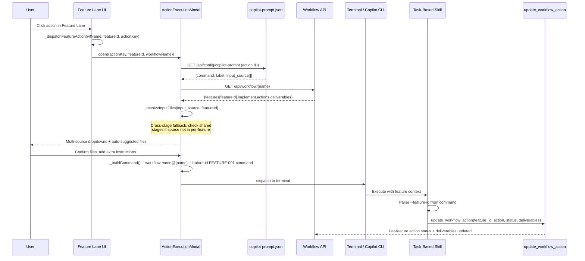
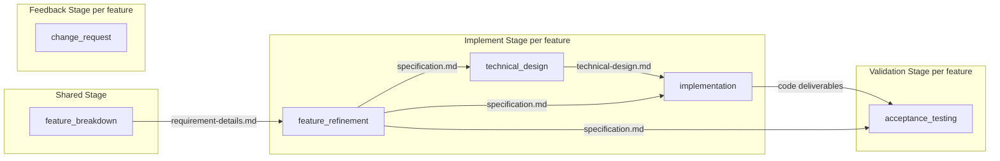
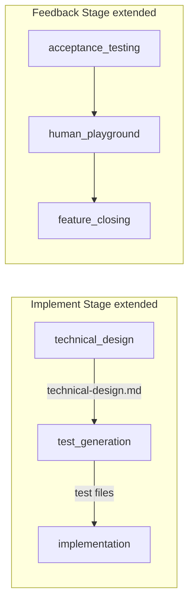
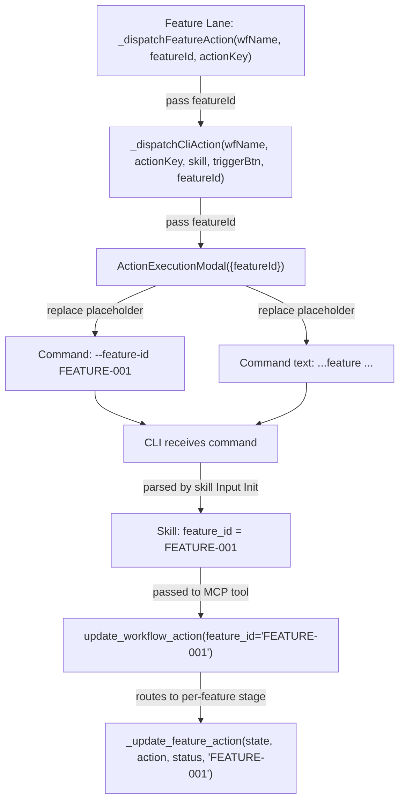

# Idea Summary

> Idea ID: IDEA-028
> Folder: 028. CR-Optimize Feature Implementation Level Actions
> Version: v1
> Created: 2026-02-25
> Status: Refined

## Overview

Extend the Action Execution Modal and copilot-prompt configuration to fully support all **per-feature workflow actions**. There are two categories of work:

- **Existing actions** (already in workflow template + ACTION_MAP): `feature_refinement`, `technical_design`, `implementation`, `acceptance_testing`, `change_request` — these exist in the UI but show "No instructions available" when clicked because they lack prompt configs and per-feature resolution
- **New actions** to add to the workflow template: `test_generation`, `human_playground`, `feature_closing` — these are documented intentions in `app_agent_interaction.py` but not yet wired into the workflow system

Note: `quality_evaluation` exists in the workflow template (optional, deferred) with `skill: null` — it is **out of scope** for this CR since it has no skill implementation.

## Problem Statement

IDEA-027 generalized the Action Execution Modal for **shared-level actions** (refine_idea, requirement_gathering, feature_breakdown). However, **per-feature actions** in the implement, validation, and feedback stages remain broken:

1. **No copilot-prompt.json entries** — 5 existing per-feature actions have no config → modal shows "No instructions available"
2. **No per-feature deliverable resolution** — `_resolveInputFiles()` only scans `data.stages || data.shared` (shared stages), not `features[FEATURE-ID].implement|validation|feedback.actions[...]`
3. **Feature ID not propagated** — `_dispatchFeatureAction()` (line 902 in workflow-stage.js) calls `_dispatchCliAction(wfName, actionKey, skill)` dropping `featureId`; the CLI command has no way to tell the agent which feature to work on
4. **Multi-source input not supported** — Some actions (e.g. `implementation`) need files from multiple upstream actions (specification, technical design), but the modal only shows a single file dropdown
5. **Skills missing workflow.action** — Per-feature skills lack the hardcoded `workflow.action` value (unlike `requirement_gathering` and `feature_breakdown` which already have it), so they can't call `update_workflow_action` with the correct action key
6. **No auto-suggest rules** — When deliverables exist, the modal doesn't intelligently pre-select the most relevant file
7. **Missing workflow actions** — `test_generation`, `human_playground`, `feature_closing` are planned but not in the workflow template, ACTION_MAP, or stage gating logic

## Target Users

- **Developers** using the X-IPE Workflow UI to execute the full idea-to-implementation pipeline per feature
- **AI agents** receiving per-feature commands from the modal that need feature context (ID, input files)

## Proposed Solution

A four-layer approach: **add prompt configs** for all per-feature actions, **extend deliverable resolution** to support per-feature + multi-source inputs, **propagate feature ID** through modal → command → skill → workflow update, and **update skills** with hardcoded `workflow.action` values.



### Core Design Principles

1. **Deliverable Chain per Feature** — Each per-feature action resolves input files from the SAME feature's upstream actions, not shared stages
2. **Multi-Source Input** — Actions like `implementation` declare multiple `input_source` entries, each rendered as a separate labeled dropdown
3. **Feature ID as First-Class Parameter** — Included in both the command template (`<feature-id>`) and as a flag (`--feature-id`); skills accept either
4. **Auto-Suggest by File Pattern** — Each `input_source` entry can declare a `file_pattern` (e.g. `specification.md`) to auto-select the best match
5. **Consistent UX** — Same modal layout as shared actions, just with feature-scoped resolution

## Key Features

### Feature 1: Per-Feature Copilot-Prompt Configuration

Add entries to `copilot-prompt.json` for per-feature actions under a new `"feature"` section (with a `"prompts"` array so the existing `_getConfigEntry()` lookup works automatically). Each entry declares `input_source` with `file_pattern` fields for auto-suggestion.

**Note on schema extension:** The `file_pattern` field is a NEW optional property on each `input_source` entry. Existing config loaders that don't know about it will simply ignore it (backward compatible). The new `"feature"` section follows the same `{prompts: [...]}` structure as `"ideation"` and `"workflow"`.

**Existing per-feature action dependency flow:**



**New actions to add to the workflow template (Phase 5):**



**Proposed configuration for existing actions (Phase 1):**

| Action Key | Config ID | Input Sources | File Patterns | Command Template |
|-----------|-----------|--------------|---------------|------------------|
| `feature_refinement` | `feature-refinement` | `feature_breakdown` | `*.md` | `refine feature <feature-id> from <input-file> with feature refinement skill` |
| `technical_design` | `technical-design` | `feature_refinement` | `specification.md` | `create technical design for feature <feature-id> based on <input-file> with technical design skill` |
| `implementation` | `implementation` | `technical_design`, `feature_refinement` | `technical-design.md`, `specification.md` | `implement feature <feature-id> based on <input-file> with code implementation skill` |
| `acceptance_testing` | `acceptance-testing` | `feature_refinement`, `implementation` | `specification.md`, `*` | `run acceptance tests for feature <feature-id> based on <input-file> with feature acceptance test skill` |
| `change_request` | `change-request` | *(manual path input)* | *(N/A)* | `process change request for feature <feature-id> from <input-file> with change request skill` |

**Proposed configuration for new actions (Phase 5, after workflow template update):**

| Action Key | Config ID | Input Sources | File Patterns | Command Template |
|-----------|-----------|--------------|---------------|------------------|
| `test_generation` | `test-generation` | `technical_design`, `feature_refinement` | `technical-design.md`, `specification.md` | `generate tests for feature <feature-id> based on <input-file> with test generation skill` |
| `human_playground` | `human-playground` | `implementation` | `*` | `create playground for feature <feature-id> based on <input-file> with human playground skill` |
| `feature_closing` | `feature-closing` | `acceptance_testing`, `feature_refinement` | `*`, `specification.md` | `close feature <feature-id> based on <input-file> with feature closing skill` |

All command templates use `<input-file>` exclusively (NOT `<current-idea-file>`, which is for ideation-stage actions only) and include the `<feature-id>` placeholder.

### Feature 2: Per-Feature Deliverable Resolution

Extend `_resolveInputFiles()` to accept an optional `featureId` parameter. When present, resolve files from `features[featureId].stages[*].actions[sourceAction].deliverables` instead of shared stages.

**Resolution algorithm:**
1. Fetch workflow state via GET `/api/workflow/{name}`
2. Find the feature object matching `featureId`
3. For each `input_source` entry, scan the feature's per-feature stages (`implement`, `validation`, `feedback`) for the source action
4. Collect deliverables from matched actions
5. Apply `file_pattern` matching for auto-suggestion (first match = pre-selected)
6. Fall back to shared stages if source action not found in per-feature stages (for cross-stage inputs like `feature_breakdown` deliverables)

**Cross-stage fallback** is critical: `feature_refinement` depends on `feature_breakdown` which is a shared-level action. The resolver must check shared stages when per-feature lookup yields no results.

### Feature 3: Multi-Source Input UI

When an action has multiple `input_source` entries, the modal renders **one labeled dropdown per source** instead of a single flat list:

```
┌────────────────────────────────────────────┐
│  📐 Feature Refinement — FEATURE-001    [X]│
├────────────────────────────────────────────┤
│  🏷️ Feature: FEATURE-001                   │
│                                            │
│  📄 From feature_breakdown:                │
│  ┌──────────────────────────────────────┐  │
│  │ [▼ requirement-details-part-N.md   ] │  │
│  └──────────────────────────────────────┘  │
│                                            │
│  📝 Instructions:                          │
│  ┌──────────────────────────────────────┐  │
│  │ refine feature FEATURE-001 from ...  │  │
│  └──────────────────────────────────────┘  │
│                                            │
│  ✏️ Extra Instructions (optional):         │
│  ┌──────────────────────────────────────┐  │
│  │                                      │  │
│  └──────────────────────────────────────┘  │
│                                            │
│  [Cancel]                  [🤖 Copilot]    │
└────────────────────────────────────────────┘
```

For actions with multiple sources (e.g. `implementation`):

```
┌────────────────────────────────────────────┐
│  💻 Implementation — FEATURE-001        [X]│
├────────────────────────────────────────────┤
│  🏷️ Feature: FEATURE-001                   │
│                                            │
│  📄 From technical_design:                 │
│  ┌──────────────────────────────────────┐  │
│  │ [▼ technical-design.md ✨ (auto)   ] │  │
│  └──────────────────────────────────────┘  │
│                                            │
│  📄 From feature_refinement:               │
│  ┌──────────────────────────────────────┐  │
│  │ [▼ specification.md ✨ (auto)      ] │  │
│  └──────────────────────────────────────┘  │
│                                            │
│  📄 From test_generation:                  │
│  ┌──────────────────────────────────────┐  │
│  │ [▼ test-feature-001.py             ] │  │
│  └──────────────────────────────────────┘  │
│                                            │
│  📝 Instructions:                          │
│  ┌──────────────────────────────────────┐  │
│  │ implement feature FEATURE-001 ...    │  │
│  └──────────────────────────────────────┘  │
│                                            │
│  ✏️ Extra Instructions (optional):         │
│  ┌──────────────────────────────────────┐  │
│  │                                      │  │
│  └──────────────────────────────────────┘  │
│                                            │
│  [Cancel]                  [🤖 Copilot]    │
└────────────────────────────────────────────┘
```

The `✨ (auto)` indicator shows which files were auto-suggested by pattern matching.

### Feature 4: Feature ID Propagation

The feature ID flows through the entire chain:



**Three call sites that need modification:**

1. **`_dispatchFeatureAction()` (workflow-stage.js, line 902):** Currently calls `_dispatchCliAction(wfName, actionKey, skill)` — must add `featureId` parameter: `_dispatchCliAction(wfName, actionKey, skill, null, featureId)`

2. **`_dispatchCliAction()` (workflow-stage.js, line 515):** Currently accepts `(wfName, actionKey, skillName, triggerBtn)` — must add `featureId` parameter and pass it to the ActionExecutionModal constructor

3. **`ActionExecutionModal` constructor (action-execution-modal.js, line 9):** Currently accepts `{actionKey, workflowName, skillName, onComplete, status, triggerBtn}` — must add `featureId` property

4. **`_buildCommand()` (action-execution-modal.js, line 298):** Currently builds `--workflow-mode@{name} {prompt}` — must inject `--feature-id {featureId}` when featureId is present:
   ```javascript
   let cmd = `--workflow-mode${wfSuffix} ${prompt}`;
   if (this.featureId) {
       cmd = `--workflow-mode${wfSuffix} --feature-id ${this.featureId} ${prompt}`;
   }
   ```

5. **`_loadInstructions()` (action-execution-modal.js):** Must replace `<feature-id>` placeholder in command template with the actual feature ID value

Each skill's Input Initialization resolves `feature_id` from the command:
```yaml
feature_id:
  steps:
    1. IF --feature-id flag present in command → use flag value
    2. ELSE IF <feature-id> placeholder was replaced in command text → extract value
    3. ELSE → "N/A" (free-mode, no feature context)
```

### Feature 5: Skill Workflow Action Updates

Update per-feature skills to add hardcoded `workflow.action` values matching their action keys in the workflow JSON. This mirrors how `requirement_gathering` and `feature_breakdown` skills already work.

**Existing actions — skills to update now:**

| Skill | `workflow.action` Value | Exists in Workflow Template |
|-------|------------------------|-----------------------------|
| `x-ipe-task-based-feature-refinement` | `"feature_refinement"` | ✅ Yes (implement stage) |
| `x-ipe-task-based-technical-design` | `"technical_design"` | ✅ Yes (implement stage) |
| `x-ipe-task-based-code-implementation` | `"implementation"` | ✅ Yes (implement stage) |
| `x-ipe-task-based-feature-acceptance-test` | `"acceptance_testing"` | ✅ Yes (validation stage) |
| `x-ipe-task-based-change-request` | `"change_request"` | ✅ Yes (feedback stage) |

**New actions — skills to update after workflow template is extended (Phase 5):**

| Skill | `workflow.action` Value | Needs Workflow Template Update |
|-------|------------------------|-------------------------------|
| `x-ipe-task-based-test-generation` | `"test_generation"` | ⚠️ Must add to implement stage |
| `x-ipe-task-based-human-playground` | `"human_playground"` | ⚠️ Must add to feedback stage |
| `x-ipe-task-based-feature-closing` | `"feature_closing"` | ⚠️ Must add to feedback stage |

**Note on `quality_evaluation`**: Exists in workflow template (validation stage, optional) but has `skill: null, deferred: true` in ACTION_MAP. Out of scope — no skill to update.

Each skill also needs `feature_id` in its Input Initialization and must pass it to `update_workflow_action` on completion:
```yaml
input:
  workflow:
    name: "N/A"
    action: "feature_refinement"  # hardcoded — matches workflow JSON action key
  feature_id: "N/A"  # resolved from --feature-id flag or command text
```

### Feature 6: Auto-Suggest Rules

Each `input_source` entry in copilot-prompt.json can include a `file_pattern` field. The modal uses glob-style matching to auto-select the best file from each source's deliverables:

**Rule precedence:**
1. Exact filename match (e.g. `specification.md`)
2. Glob pattern match (e.g. `*test*`)
3. First `.md` file if no pattern matches
4. First file of any type as last resort

**Example auto-suggest mapping:**

| Source Action | File Pattern | Auto-Selects |
|--------------|-------------|--------------|
| `feature_refinement` | `specification.md` | `x-ipe-docs/.../FEATURE-001/specification.md` |
| `technical_design` | `technical-design.md` | `x-ipe-docs/.../FEATURE-001/technical-design.md` |
| `test_generation` | `*test*` | `tests/test_feature_001.py` |
| `feature_breakdown` | `*.md` | `requirement-details-part-N.md` |

## Architecture Overview

```architecture-dsl
@startuml module-view
title "IDEA-028: Per-Feature Action Execution Architecture"
theme "theme-default"
direction top-to-bottom
grid 12 x 7

layer "Frontend — Feature Lane UI" {
  color "#E3F2FD"
  border-color "#1565C0"
  rows 1

  module "Feature Lane" {
    cols 4
    rows 1
    grid 1 x 1
    align center center
    component "Per-Feature Action Buttons" { cols 1, rows 1 }
  }
  module "ActionExecutionModal" {
    cols 4
    rows 1
    grid 1 x 1
    align center center
    component "Multi-Source Input UI + Feature ID" { cols 1, rows 1 }
  }
  module "WorkflowStage" {
    cols 4
    rows 1
    grid 1 x 1
    align center center
    component "dispatchFeatureAction (+ featureId)" { cols 1, rows 1 }
  }
}

layer "Configuration" {
  color "#FFF3E0"
  border-color "#E65100"
  rows 1

  module "copilot-prompt.json" {
    cols 6
    rows 1
    grid 1 x 1
    align center center
    component "Per-Feature Action Configs + input_source + file_pattern" { cols 1, rows 1 }
  }
  module "Placeholders" {
    cols 6
    rows 1
    grid 1 x 1
    align center center
    component "<feature-id> + <input-file> templates" { cols 1, rows 1 }
  }
}

layer "Deliverable Resolution" {
  color "#E8F5E9"
  border-color "#2E7D32"
  rows 1

  module "Per-Feature Resolver" {
    cols 6
    rows 1
    grid 1 x 1
    align center center
    component "features[id].stages[*].actions[src].deliverables" { cols 1, rows 1 }
  }
  module "Auto-Suggest Engine" {
    cols 6
    rows 1
    grid 1 x 1
    align center center
    component "File pattern matching + pre-selection" { cols 1, rows 1 }
  }
}

layer "Backend API" {
  color "#F3E5F5"
  border-color "#6A1B9A"
  rows 1

  module "Workflow Routes" {
    cols 6
    rows 1
    grid 1 x 1
    align center center
    component "GET /api/workflow/{name} (returns features[])" { cols 1, rows 1 }
  }
  module "Workflow Manager" {
    cols 6
    rows 1
    grid 1 x 1
    align center center
    component "update_action_status(feature_id)" { cols 1, rows 1 }
  }
}

layer "Agent Layer" {
  color "#FFFDE7"
  border-color "#F57F17"
  rows 1

  module "CLI Command" {
    cols 4
    rows 1
    grid 1 x 1
    align center center
    component "--workflow-mode + --feature-id flags" { cols 1, rows 1 }
  }
  module "Task Execution" {
    cols 4
    rows 1
    grid 1 x 1
    align center center
    component "x-ipe-workflow-task-execution delegator" { cols 1, rows 1 }
  }
  module "Task Skills" {
    cols 4
    rows 1
    grid 1 x 1
    align center center
    component "7 skills with workflow.action + feature_id" { cols 1, rows 1 }
  }
}

layer "MCP Tools" {
  color "#FCE4EC"
  border-color "#AD1457"
  rows 1

  module "update_workflow_action" {
    cols 12
    rows 1
    grid 1 x 1
    align center center
    component "update_workflow_action(feature_id, action, status, deliverables)" { cols 1, rows 1 }
  }
}

@enduml
```

## Data Flow

```mermaid
flowchart TD
    subgraph "User Interaction"
        A[Click action in Feature Lane] --> B["_dispatchFeatureAction(wfName, featureId, actionKey)"]
        B --> C["ActionExecutionModal.open({featureId})"]
    end

    subgraph "Config & Resolution"
        C --> D[Load copilot-prompt config for action]
        C --> E["resolvePerFeatureInputFiles(featureId, input_source[])"]
        E --> E1{Source action in per-feature stages?}
        E1 -->|Yes| E2[Get features.featureId.stages.actions.deliverables]
        E1 -->|No| E3[Fallback to shared stages]
        E2 --> F[Apply file_pattern auto-suggest]
        E3 --> F
        D --> G[Render multi-source dropdowns]
        F --> G
    end

    subgraph "Command Construction"
        G --> H[User confirms files + extra instructions]
        H --> I["Build: --workflow-mode@{name} --feature-id FEATURE-001 command <files>"]
        I --> J[Replace <feature-id> and <input-file> placeholders]
    end

    subgraph "Execution"
        J --> K[Dispatch to terminal]
        K --> L[Skill parses --feature-id from command]
        L --> M[Skill executes task for feature]
        M --> N["update_workflow_action(feature_id, action, done, deliverables)"]
        N --> O[Per-feature deliverables tracked in workflow]
    end
```



## Success Criteria

- [ ] 5 existing per-feature actions have copilot-prompt.json entries with `input_source` and `file_pattern`
- [ ] `_resolveInputFiles()` supports per-feature deliverable resolution via optional `featureId` parameter
- [ ] Cross-stage fallback works (feature_refinement resolves from shared feature_breakdown deliverables)
- [ ] Multi-source input renders one labeled dropdown per input_source
- [ ] Auto-suggest pre-selects files matching `file_pattern` with ✨ indicator
- [ ] Feature ID included in command as both `<feature-id>` text and `--feature-id` flag
- [ ] `_dispatchFeatureAction()` passes featureId through `_dispatchCliAction()` to ActionExecutionModal
- [ ] `_buildCommand()` injects `--feature-id` flag when featureId is present
- [ ] 5 existing-action skills have hardcoded `workflow.action` values
- [ ] All updated skills parse `feature_id` from command (flag or text)
- [ ] Skills pass `feature_id` to `update_workflow_action` on completion
- [ ] Existing shared-level actions (refine_idea, requirement_gathering, feature_breakdown) unaffected
- [ ] Modal title shows action name + feature ID (e.g. "Technical Design — FEATURE-001")
- [ ] New `"feature"` section in copilot-prompt.json follows `{prompts: [...]}` schema (works with existing `_getConfigEntry()` lookup)

## Constraints & Considerations

| Constraint | Impact |
|-----------|--------|
| Backward compatibility | Shared-level actions must continue to work unchanged; `_getConfigEntry()` must find configs in new `"feature"` section |
| `quality_evaluation` | Exists in workflow template (optional, deferred) with `skill: null` — out of scope |
| `change_request` | Uses manual path input (can target any stage), still gets copilot-prompt config but no auto-resolved input_source |
| New action keys (Phase 5) | `test_generation`, `human_playground`, `feature_closing` require changes to `workflow_manager_service.py` (_stage_config, next_actions_map, _deliverable_categories), ACTION_MAP in workflow-stage.js, and stage gating logic |
| `file_pattern` schema | New optional field in copilot-prompt.json — config loaders that don't know about it will ignore it |
| Skill update scope | 5 SKILL.md files need `workflow.action` + `feature_id` handling in initial scope; 3 more in Phase 5 |
| Performance | Per-feature resolution reuses the full workflow GET response — no extra API calls needed |

## Phased Rollout

| Phase | Scope | Changes |
|-------|-------|---------|
| **Phase 1: Config + Feature ID** | Add prompt configs for 5 existing actions + wire featureId through modal | copilot-prompt.json (new "feature" section), _dispatchFeatureAction, _dispatchCliAction (add featureId param), ActionExecutionModal constructor + _buildCommand + _loadInstructions |
| **Phase 2: Per-Feature Resolution** | Extend _resolveInputFiles with featureId + cross-stage fallback | ActionExecutionModal._resolveInputFiles (scan features[id].implement/validation/feedback) |
| **Phase 3: Multi-Source UI** | Render one dropdown per input_source with auto-suggest | ActionExecutionModal._createDOM (multi-dropdown rendering), file_pattern matching logic |
| **Phase 4: Skill Updates** | Add workflow.action + feature_id to 5 existing-action skills | x-ipe-task-based-feature-refinement, technical-design, code-implementation, feature-acceptance-test, change-request SKILL.md |
| **Phase 5: New Workflow Actions** | Add test_generation, human_playground, feature_closing to workflow template + ACTION_MAP + copilot-prompt config + skills | workflow_manager_service.py (_stage_config, next_actions_map, _deliverable_categories), workflow-stage.js (ACTION_MAP), copilot-prompt.json, 3 x SKILL.md |

## Failure Modes & Error Handling

| Scenario | Behavior |
|----------|----------|
| No deliverables from source action | Show empty dropdown with manual path input fallback |
| Feature not found in workflow | Show error "Feature not found" and disable execute |
| Source action is shared-level | Fallback to shared stage resolution (cross-stage) |
| File pattern matches nothing | Show all deliverables without auto-selection |
| Skill receives no feature_id | Treat as free-mode execution (no per-feature update) |
| Action key missing from workflow template | Log warning, still dispatch command |

## Brainstorming Notes

### Key Decisions
1. **Scope: All per-feature actions** — 5 existing (feature_refinement, technical_design, implementation, acceptance_testing, change_request) + 3 new (test_generation, human_playground, feature_closing) in Phase 5
2. **Feature ID dual propagation** — both `<feature-id>` placeholder in command text AND `--feature-id` flag; skill accepts either
3. **Multi-source dropdowns** — one labeled dropdown per input_source, not a single flat list
4. **Auto-suggest by file pattern** — each input_source entry can specify a `file_pattern` for intelligent pre-selection
5. **Cross-stage fallback** — per-feature actions can depend on shared-stage actions (e.g. feature_refinement → feature_breakdown)
6. **Skills handle feature_id individually** — each skill's Input Initialization parses feature_id, not the delegator
7. **Hardcoded workflow.action in skills** — matches the action key in workflow JSON (like requirement_gathering and feature_breakdown already do)
8. **`--action` flag retired** — each skill knows its own action from the hardcoded workflow.action value
9. **`update_workflow_action` already supports feature_id** — `_update_feature_action()` in workflow_manager_service.py routes correctly; no backend changes needed
10. **`quality_evaluation` excluded** — deferred action with no skill implementation
11. **New "feature" section in copilot-prompt.json** — uses `{prompts: [...]}` format so existing `_getConfigEntry()` lookup finds entries automatically

### Open Questions (Resolved)
- **`test_generation` placement:** Will be added to implement stage between `technical_design` and `implementation` in next_actions_map. Requires `workflow_manager_service.py` update (Phase 5).
- **`human_playground` and `feature_closing` placement:** Will be added to feedback stage alongside `change_request`. Requires `_stage_config`, `_deliverable_categories`, and `next_actions_map` updates (Phase 5).
- **`<current-idea-file>` vs `<input-file>`:** Per-feature configs use `<input-file>` exclusively. The `<current-idea-file>` placeholder is only for ideation-stage actions. No conflict.

## Source Files
- x-ipe-docs/uiux-feedback/Feedback-20260225-160442/feedback.md
- x-ipe-docs/ideas/028. CR-Optimize Feature Implementation Level Actions/new idea.md
- x-ipe-docs/ideas/027. CR-Optimize-Idea Mokcup, Requirement Gathering and other actions/refined-idea/idea-summary-v1.md (predecessor)

## Next Steps
- [ ] Proceed to Requirement Gathering
- [ ] Create EPIC for this CR
- [ ] Break down into features (Prompt Config, Per-Feature Resolution, Multi-Source UI, Feature ID Propagation, Skill Updates)

## References & Common Principles

### Applied Principles
- **Deliverable Chain Pattern** — Each action's output becomes the next action's input, scoped per-feature
- **Strategy Pattern** — Per-feature vs shared resolution selected at runtime based on featureId presence
- **Open-Closed Principle** — Adding new per-feature actions requires only config changes, not modal code changes
- **Convention over Configuration** — Action keys map to config IDs via `_` → `-` convention; file patterns follow naming conventions
- **Graceful Degradation** — Missing configs show informative messages; missing deliverables fall back to manual input; missing feature_id defaults to free-mode
