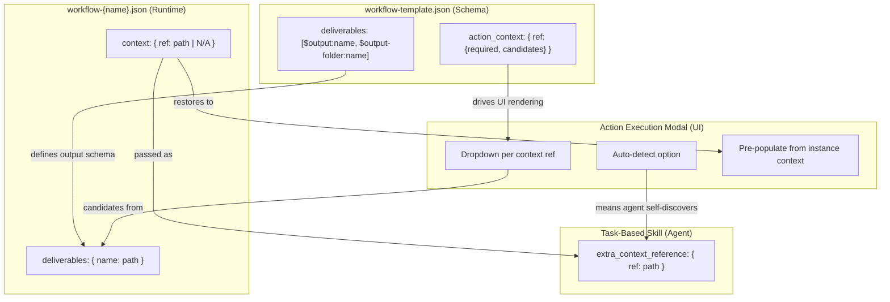

# Idea Summary

> Idea ID: IDEA-029
> Folder: 029. CR-Optimize Feature Implementation-Part 2
> Version: v1
> Created: 2026-02-26
> Status: Refined

## Overview

Change Request to extend the X-IPE workflow system with **Action Context**, a mechanism for actions to declare, resolve, and persist multi-source context inputs. This replaces the current simple `deliverable_category` string with a rich deliverable tagging system (`$output:name`, `$output-folder:name`) in `workflow-template.json`, adds per-action `action_context` definitions to control what inputs each action needs, and records the user's context selections in the workflow instance JSON so that reopening an action restores previous choices. Skills are updated to receive explicit context file paths via a new `extra_context_reference` input parameter.

## Problem Statement

Currently, the workflow system has a flat `deliverable_category` field per action that only categorizes outputs (e.g., "ideas", "requirements") without expressing _which specific output_ an action produces. Downstream actions cannot declare what inputs they need from prior actions, and there is no way to:

1. **Tag deliverables** — distinguish between a file output and a folder output from the same action
2. **Declare action context** — specify that "refine_idea needs raw-idea (required) and uiux-reference (optional)"
3. **Resolve candidates** — auto-populate dropdowns from prior action deliverables
4. **Persist context choices** — remember what the user selected so reopening shows previous values
5. **Pass context to skills** — provide explicit file paths to skills in workflow mode instead of relying on auto-discovery

This forces the Action Execution Modal to use ad-hoc logic per action type, and skills have no standard way to receive workflow context.

## Target Users

- **AI Agents (Copilot)** — receive explicit context paths instead of guessing file locations
- **X-IPE Developers** — unified template-driven approach reduces custom modal logic
- **End Users** — clearer UI showing what context each action uses, with persistent selections

## Proposed Solution

A three-layer architecture change spanning the workflow template, workflow instance, and skill input contract:



### Layer 1: Deliverable Tagging in workflow-template.json

Replace `deliverable_category: "ideas"` with a `deliverables` array using tagged syntax:

```json
"compose_idea": {
  "optional": false,
  "deliverables": ["$output:raw-idea", "$output-folder:ideas-folder"],
  "next_actions_suggested": ["refine_idea", "reference_uiux"]
}
```

**Tagging Syntax:**
- `$output:name` → Single file deliverable (e.g., the main idea markdown)
- `$output-folder:name` → Folder deliverable (e.g., the ideas folder containing all related files)

Every action across all stages MUST use this syntax.

**Cardinality Rule:** `$output:name` always resolves to exactly ONE file path string. If an action produces multiple files, use `$output-folder:name` to reference the containing folder. The single-file `$output:name` is the "primary" deliverable — for example, the main specification file, the main test report, etc.

**`copilot-prompt.json` Migration:** The existing `input_source` field in `copilot-prompt.json` (e.g., `"input_source": ["compose_idea"]`) is **deprecated** once `action_context` is available. During transition:
1. If the action has `action_context` in the template → use `action_context` exclusively
2. If the action has NO `action_context` (e.g., `compose_idea`) → fall back to legacy `input_source`
3. After all actions migrate → remove `input_source` from `copilot-prompt.json` entirely

### Layer 2: Action Context Definition in workflow-template.json

New `action_context` block per action declaring what inputs it needs:

```json
"refine_idea": {
  "optional": false,
  "action_context": {
    "raw-idea": { "required": true, "candidates": "ideas-folder" },
    "uiux-reference": { "required": false }
  },
  "deliverables": ["$output:refined-idea", "$output-folder:refined-ideas-folder"],
  "next_actions_suggested": ["design_mockup", "requirement_gathering"]
}
```

**Context Reference Rules:**
- `candidates` references a `$output-folder:name` from ANY prior action in the workflow
- When `candidates` is specified, the dropdown lists: the specific `$output` file + all files within the `$output-folder`
- When `candidates` is NOT specified (e.g., `uiux-reference`), the dropdown lists outputs from prior actions matching that name
- Every dropdown includes an **"auto-detect"** option — meaning no explicit path is provided; the AI agent discovers context within the project autonomously
- `required: true` means the user MUST select a value (or auto-detect); `required: false` allows N/A

**Candidate Resolution Algorithm:**
1. Parse `candidates` value (e.g., `"ideas-folder"`)
2. Walk `stage_order` from first stage to current stage, scanning all actions
3. For each action, check if its `deliverables` array contains `$output-folder:{candidates}` or `$output:{candidates}`
4. Collect ALL matches (multiple actions may produce same-named deliverables)
5. **Precedence:** Later stage > earlier stage; within same stage, later action order > earlier
6. Resolve the matched deliverable name against the workflow instance to get the actual path
7. **Per-feature scoping:** When resolving within a per_feature stage, ONLY look at the current feature's action deliverables first; fall back to shared-stage deliverables if no match in current feature lane
8. List the `$output` file from the producing action + all files within the `$output-folder` path

**Unique Naming Rule:** `$output-folder:name` names MUST be unique within each stage. Cross-stage duplicates are permitted since the resolution algorithm applies stage precedence. Example: `requirements-folder` in the `requirement` stage is different from `feature-docs-folder` in the `implement` stage.

### Layer 3: Workflow Instance Updates

The workflow instance JSON changes from arrays to objects for deliverables, and adds a `context` field:

```json
"compose_idea": {
  "status": "done",
  "deliverables": {
    "raw-idea": "x-ipe-docs/ideas/wf-001-greedy-snake/new idea.md",
    "ideas-folder": "x-ipe-docs/ideas/wf-001-greedy-snake"
  },
  "next_actions_suggested": ["refine_idea", "reference_uiux"]
},
"refine_idea": {
  "status": "done",
  "context": {
    "raw-idea": "x-ipe-docs/ideas/wf-001-greedy-snake/new idea.md",
    "uiux-reference": "N/A"
  },
  "deliverables": {
    "refined-idea": "x-ipe-docs/ideas/wf-001-greedy-snake/refined-idea/idea-summary-v2.md",
    "refined-ideas-folder": "x-ipe-docs/ideas/wf-001-greedy-snake/refined-idea"
  },
  "next_actions_suggested": ["design_mockup", "requirement_gathering"]
}
```

**Key behaviors:**
- `context` records the user's selection from each dropdown
- When reopening an action, the modal reads `context` to pre-populate dropdowns
- `deliverables` is now a keyed object matching the template's `$output:name` tags
- Feature-level actions (e.g., `feature_refinement` for FEATURE-041-A) follow the same pattern and support reopen
- `"auto-detect"` is a valid context value — it persists until the action completes, at which point the skill may resolve it to an actual path or keep it as-is

**Per-Feature Instance Example:**

```json
"features": [
  {
    "id": "FEATURE-041-A",
    "name": "Per-Feature Config & Core Resolution (MVP)",
    "status": "in_progress",
    "implement": {
      "feature_refinement": {
        "status": "done",
        "context": {
          "requirement-doc": "x-ipe-docs/requirements/EPIC-041/requirement-details-part-13.md",
          "features-list": "auto-detect"
        },
        "deliverables": {
          "specification": "x-ipe-docs/requirements/EPIC-041/FEATURE-041-A/specification.md",
          "feature-docs-folder": "x-ipe-docs/requirements/EPIC-041/FEATURE-041-A"
        },
        "next_actions_suggested": ["technical_design"]
      },
      "technical_design": {
        "status": "done",
        "context": {
          "specification": "x-ipe-docs/requirements/EPIC-041/FEATURE-041-A/specification.md"
        },
        "deliverables": {
          "tech-design": "x-ipe-docs/requirements/EPIC-041/FEATURE-041-A/technical-design.md",
          "feature-docs-folder": "x-ipe-docs/requirements/EPIC-041/FEATURE-041-A"
        },
        "next_actions_suggested": ["implementation"]
      }
    }
  }
]
```

**Action Reopen State Machine:**

When a user reopens a completed action:
1. **Status:** Remains `done` until re-execution starts; then transitions to `in_progress`
2. **Context:** Previous selections shown in dropdowns (pre-populated from `context` field)
3. **Deliverables:** Old deliverables are preserved until new execution completes and overwrites them
4. **Downstream impact:** No automatic cascade — downstream actions keep their existing context/deliverables. The user must manually re-execute downstream actions if the reopened action produces different outputs

### Layer 4: Skill Input Contract Update

Skills receive context file paths as explicit input via `extra_context_reference`:

```yaml
input:
  workflow:
    name: "N/A"
    action: "refine_idea"
    extra_context_reference:
      raw-idea: "x-ipe-docs/ideas/wf-001-greedy-snake/new idea.md"
      uiux-reference: "N/A"
```

**Behavior:**
- In workflow mode, the skill reads `extra_context_reference` from the workflow instance's `context` field
- Skill MUST have steps (existing or new) to use these context paths as input
- When a context value is "N/A", the skill skips that input
- When a context value is "auto-detect", the skill uses its own discovery logic to find relevant files

## Key Features

```mermaid
flowchart LR
    subgraph F1["Deliverable Tagging"]
        F1A["$output:name syntax"]
        F1B["$output-folder:name syntax"]
        F1C["All actions use tagged deliverables"]
    end

    subgraph F2["Action Context"]
        F2A["Template defines context schema"]
        F2B["required/optional context refs"]
        F2C["candidates from prior action folders"]
    end

    subgraph F3["Modal UI"]
        F3A["Dropdown per context input"]
        F3B["Auto-detect option"]
        F3C["Pre-populate from instance"]
        F3D["Feature-level action reopen"]
    end

    subgraph F4["Instance Updates"]
        F4A["Deliverables as keyed objects"]
        F4B["Context field per action"]
        F4C["Persistent selections"]
    end

    subgraph F5["Skill Updates"]
        F5A["extra_context_reference input"]
        F5B["Explicit context file paths"]
        F5C["N/A and auto-detect handling"]
    end

    F1 --> F2
    F2 --> F3
    F3 --> F4
    F4 --> F5
```



### Feature 1: Deliverable Tagging System
- New `$output:name` and `$output-folder:name` syntax in workflow-template.json
- Replaces flat `deliverable_category` string
- All actions across ALL stages must migrate to tagged format

### Feature 2: Action Context Schema
- New `action_context` block in workflow-template.json per action
- Defines required/optional context references with candidate sources
- Candidates resolve from `$output-folder` deliverables of prior actions

### Feature 3: Action Execution Modal — Context UI
- Modal "Action Context" section (renamed from "Input Files")
- Renders one dropdown per `action_context` entry from the template
- Dropdown lists: specific `$output` file + files within `$output-folder` candidates
- "Auto-detect" option in every dropdown (agent discovers context autonomously)
- Feature-level actions support reopen with context restoration

### Feature 4: Workflow Instance Schema Update
- `deliverables` changes from `string[]` to `{ name: path }` object
- New `context` field per action recording user selections
- Reopening an action reads `context` to pre-populate dropdowns

### Feature 5: Skill Extra Context Reference
- Skills receive `extra_context_reference` map in workflow mode
- Explicit file paths from workflow instance `context` field
- Skills use these paths as direct input (not hints)
- N/A → skip; auto-detect → skill's own discovery logic

## Complete Workflow Template (Proposed)

Below is the full proposed `workflow-template.json` with all actions tagged:

```json
{
  "stage_order": ["ideation", "requirement", "implement", "validation", "feedback"],
  "stages": {
    "ideation": {
      "type": "shared",
      "next_stage": "requirement",
      "actions": {
        "compose_idea": {
          "optional": false,
          "deliverables": ["$output:raw-idea", "$output-folder:ideas-folder"],
          "next_actions_suggested": ["refine_idea", "reference_uiux"]
        },
        "reference_uiux": {
          "optional": true,
          "deliverables": ["$output:uiux-reference"],
          "next_actions_suggested": ["design_mockup", "refine_idea"]
        },
        "refine_idea": {
          "optional": false,
          "action_context": {
            "raw-idea": { "required": true, "candidates": "ideas-folder" },
            "uiux-reference": { "required": false }
          },
          "deliverables": ["$output:refined-idea", "$output-folder:refined-ideas-folder"],
          "next_actions_suggested": ["design_mockup", "requirement_gathering"]
        },
        "design_mockup": {
          "optional": true,
          "action_context": {
            "refined-idea": { "required": true, "candidates": "refined-ideas-folder" },
            "uiux-reference": { "required": false }
          },
          "deliverables": ["$output:mockup-html", "$output-folder:mockups-folder"],
          "next_actions_suggested": ["requirement_gathering"]
        }
      }
    },
    "requirement": {
      "type": "shared",
      "next_stage": "implement",
      "actions": {
        "requirement_gathering": {
          "optional": false,
          "action_context": {
            "refined-idea": { "required": true, "candidates": "refined-ideas-folder" },
            "mockup-html": { "required": false }
          },
          "deliverables": ["$output:requirement-doc", "$output-folder:requirements-folder"],
          "next_actions_suggested": ["feature_breakdown"]
        },
        "feature_breakdown": {
          "optional": false,
          "action_context": {
            "requirement-doc": { "required": true, "candidates": "requirements-folder" }
          },
          "deliverables": ["$output:features-list", "$output-folder:breakdown-folder"],
          "next_actions_suggested": []
        }
      }
    },
    "implement": {
      "type": "per_feature",
      "next_stage": "validation",
      "actions": {
        "feature_refinement": {
          "optional": false,
          "action_context": {
            "requirement-doc": { "required": true, "candidates": "requirements-folder" },
            "features-list": { "required": true }
          },
          "deliverables": ["$output:specification", "$output-folder:feature-docs-folder"],
          "next_actions_suggested": ["technical_design"]
        },
        "technical_design": {
          "optional": false,
          "action_context": {
            "specification": { "required": true, "candidates": "feature-docs-folder" }
          },
          "deliverables": ["$output:tech-design", "$output-folder:feature-docs-folder"],
          "next_actions_suggested": ["implementation"]
        },
        "implementation": {
          "optional": false,
          "action_context": {
            "tech-design": { "required": true, "candidates": "feature-docs-folder" },
            "specification": { "required": true, "candidates": "feature-docs-folder" }
          },
          "deliverables": ["$output:impl-files", "$output-folder:impl-folder"],
          "next_actions_suggested": ["acceptance_testing"]
        }
      }
    },
    "validation": {
      "type": "per_feature",
      "next_stage": "feedback",
      "actions": {
        "acceptance_testing": {
          "optional": false,
          "action_context": {
            "specification": { "required": true, "candidates": "feature-docs-folder" },
            "impl-files": { "required": true, "candidates": "impl-folder" }
          },
          "deliverables": ["$output:test-report", "$output-folder:test-folder"],
          "next_actions_suggested": ["quality_evaluation"]
        },
        "quality_evaluation": {
          "optional": true,
          "action_context": {
            "test-report": { "required": true, "candidates": "test-folder" }
          },
          "deliverables": ["$output:eval-report"],
          "next_actions_suggested": ["change_request"]
        }
      }
    },
    "feedback": {
      "type": "per_feature",
      "next_stage": null,
      "actions": {
        "change_request": {
          "optional": true,
          "action_context": {
            "eval-report": { "required": false },
            "specification": { "required": true, "candidates": "feature-docs-folder" }
          },
          "deliverables": ["$output:cr-doc", "$output-folder:cr-folder"],
          "next_actions_suggested": []
        }
      }
    }
  }
}
```

## Success Criteria

- [ ] All actions in workflow-template.json use `$output:name` / `$output-folder:name` tagged deliverables
- [ ] `action_context` defined for every action that depends on prior action outputs
- [ ] Workflow instance JSON stores `deliverables` as `{ name: path }` objects and `context` as `{ ref: path | N/A }`
- [ ] Action Execution Modal renders "Action Context" section with dropdowns from template schema
- [ ] Dropdowns list: specific `$output` file + `$output-folder` contents from prior actions
- [ ] Every dropdown includes "auto-detect" option
- [ ] Reopening an action pre-populates dropdowns from instance `context` field
- [ ] Feature-level actions (per_feature stage type) support reopen with context restoration
- [ ] Skills receive `extra_context_reference` map with resolved file paths in workflow mode
- [ ] Skills handle `N/A` (skip) and `auto-detect` (self-discover) context values
- [ ] Backward-compatible migration path for existing workflow instances

## Constraints & Considerations

- **Migration:** Existing workflow instances use `deliverables: []` arrays — need migration logic to convert to keyed objects, or support both formats during transition
- **Cross-stage resolution:** `candidates` references can span stages (e.g., implementation action referencing a requirement-stage folder deliverable)
- **Feature-level isolation:** Per-feature actions must scope context within their feature lane, not bleed across features
- **Backend API changes:** The workflow manager service and routes need updates to handle the new deliverables/context structure
- **MCP tool update:** `update_workflow_action` tool needs to accept keyed deliverables and context
- **No UI display of context in action panels** — context is only shown/edited in the modal, not in the workflow stage view
- **`idea_folder` field** — the existing `idea_folder` field in workflow instance JSON is NOT subsumed by deliverable tagging; it remains for backward compatibility and quick access to the idea folder root
- **File type filtering** — dropdown should list ALL files (not just `.md`), removing the current `.md`-only limitation in `_resolveInputFiles()`

### Migration Strategy (Deliverables Format)

Support both formats during transition using duck-typing:
```
if isinstance(deliverables, list):   # legacy format
    convert_to_keyed_object(deliverables, template_deliverables)
elif isinstance(deliverables, dict):  # new format
    use_directly(deliverables)
```

The `update_workflow_action` MCP tool accepts BOTH list and keyed-object formats:
- If a list is provided → convert using the template's `$output:name` tags as keys (in order)
- If an object is provided → use directly
- Schema version bump: `"schema_version": "3.0"` for instances using keyed deliverables

### Template Validation Rules

**Static validation (at template load time):**
1. Every `$output:name` and `$output-folder:name` must be unique within a stage
2. Every `action_context.*.candidates` value must reference an existing `$output-folder:name` from a prior action in stage_order
3. Actions without `action_context` are valid (e.g., `compose_idea` — the first action has no prior context)

**Runtime validation (at action completion):**
1. Every key in the action's template `deliverables` array must have a corresponding key in the instance `deliverables` object
2. Required context values must not be `"N/A"` at execution time (they can be `"auto-detect"` or an explicit path)

### Affected Files (Impact Analysis)

**Backend:**
- `src/x_ipe/services/workflow_manager_service.py` — deliverables parsing, context storage/retrieval
- `src/x_ipe/routes/workflow_routes.py` — API endpoints for action execution
- `src/x_ipe/services/app_agent_interaction.py` — `update_workflow_action` MCP tool

**Frontend:**
- `src/x_ipe/static/js/features/action-execution-modal.js` — context UI, dropdown rendering, `_resolveInputFiles()` rewrite
- `src/x_ipe/static/js/features/workflow-stage.js` — feature-level action reopen support

**Config:**
- `x-ipe-docs/config/workflow-template.json` — new schema with deliverables + action_context
- `x-ipe-docs/config/copilot-prompt.json` — `input_source` deprecation

**Tests (need updates):**
- `tests/frontend-js/action-execution-modal-040a.test.js` — modal behavior tests
- `tests/test_workflow_manager.py` — backend workflow tests
- `tests/test_workflow_feature_lanes.py` — per-feature action tests

## Brainstorming Notes

Key insights from the brainstorming session:

1. **"Input Files" → "Action Context"** — rename reflects that these are not just files but semantic context references
2. **Auto-detect = agent autonomy** — "auto-detect" means the AI agent discovers context within the project without explicit file paths, not that the system auto-resolves from deliverables
3. **All stages, all actions** — action_context applies to ALL actions across ALL stages including feature-level per_feature actions
4. **Feature-level reopen** — feature-level actions (feature_refinement, technical_design, etc.) also support reopening with previous context restored
5. **Skills receive paths, not hints** — `extra_context_reference` provides explicit file paths that skills use directly as input, not as advisory metadata
6. **Dropdown = $output + $output-folder contents** — when `candidates` is specified, the dropdown shows both the specific output file and all files within the output folder

## Ideation Artifacts

- Proposed workflow-template.json: See "Complete Workflow Template (Proposed)" section above
- Workflow instance example: See "Layer 3: Workflow Instance Updates" section
- Skill input contract: See "Layer 4: Skill Input Contract Update" section

## Source Files

- new idea.md (original idea notes)

## Next Steps

- [ ] Proceed to Requirement Gathering (recommended — this is a structural CR best suited for direct requirements)
- [ ] Alternatively: Idea to Architecture (to visualize the template → instance → modal → skill data flow)

## References & Common Principles

### Applied Principles

- **Template-Instance Separation** — Schema (what's possible) lives in the template; runtime state (what was chosen) lives in the instance. This mirrors database schema vs data patterns.
- **Explicit Dependencies over Convention** — `action_context` makes input dependencies explicit and machine-readable, following the Dependency Inversion Principle.
- **Progressive Disclosure** — Modal shows context only when executing; action panels stay clean. Follows UI/UX principle of showing information when needed.

### Further Reading

- Workflow Template JSON: `x-ipe-docs/config/workflow-template.json`
- Workflow Instance: `x-ipe-docs/engineering-workflow/workflow-hello.json`
- Action Execution Modal: `src/x_ipe/static/js/features/action-execution-modal.js`
- Copilot Prompt Config: `x-ipe-docs/config/copilot-prompt.json`
