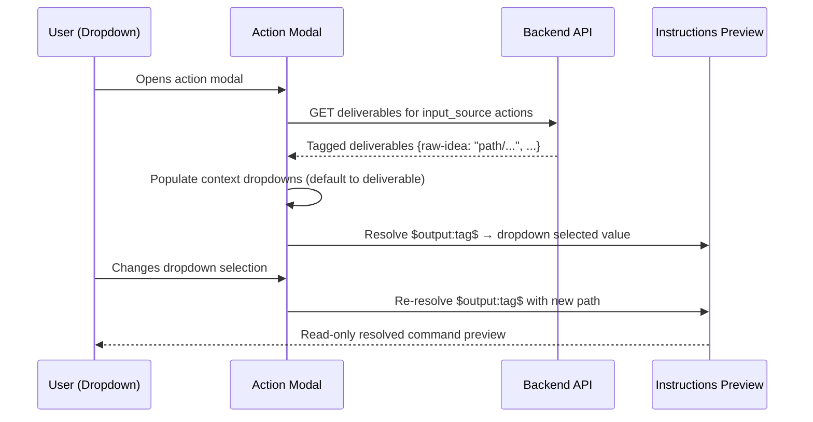
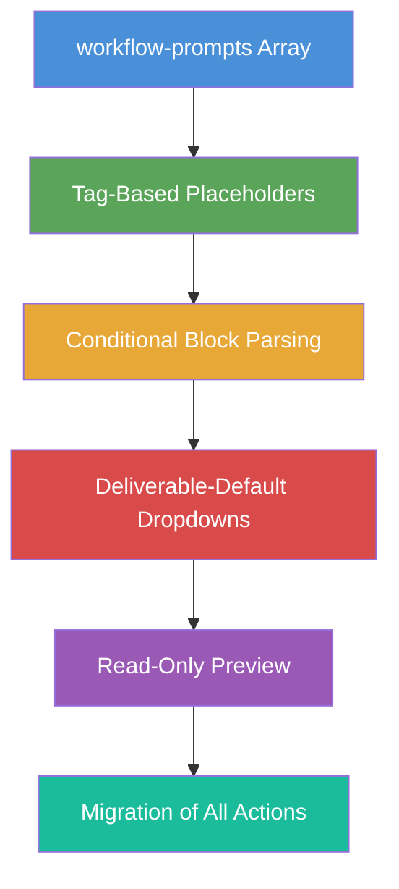

# Idea Summary

> Idea ID: IDEA-030
> Folder: 030. CR-Optimize Feature Implementation - Part 3
> Version: v1
> Created: 2026-02-26
> Status: Refined

## Overview

A change request to introduce a dedicated **`workflow-prompts`** array in `copilot-prompt.json`, replace legacy placeholders (`<input-file>`, `<current-idea-file>`) with **tag-based `$output:` syntax**, add **conditional `<>` block parsing**, default context dropdowns to **prior deliverables** instead of auto-detect, and provide a **read-only resolved preview** in the instructions text box.

## Problem Statement

The current Action Execution Modal has several pain points in workflow mode:

1. **Mixed prompt definitions** — Free-mode and workflow-mode prompts share the same structure in `copilot-prompt.json`. Workflow-mode prompts need `$output:tag` references and conditional blocks, but the current `<input-file>` placeholder system wasn't designed for this.
2. **Auto-detect as default** — Context dropdowns default to "auto-detect" even when prior action deliverables are available, requiring extra user clicks.
3. **Opaque instructions** — The instructions box shows raw placeholder text (e.g., `<current-idea-file>`) instead of the resolved file path, so users can't verify what will be sent to Copilot.
4. **No conditional blocks** — If an optional context ref (like `uiux-reference`) is N/A, the prompt still includes the surrounding literal text, producing awkward commands.

## Target Users

- **Developers** using the X-IPE workflow mode for end-to-end project delivery
- **AI Agents** (Copilot CLI, OpenCode) consuming prompts from the Action Execution Modal

## Proposed Solution

### 1. New `workflow-prompts` Array in copilot-prompt.json

Add a top-level `"workflow-prompts"` field that cleanly separates workflow-mode prompt definitions from free-mode prompts.

```json
{
  "workflow-prompts": [
    {
      "id": "refine-idea",
      "action": "refine_idea",
      "icon": "bi-stars",
      "input_source": ["compose_idea"],
      "prompt-details": [
        {
          "language": "en",
          "label": "Refine Idea",
          "command": "refine the idea $output:raw-idea$ <and uiux reference: $output:uiux-reference$> with ideation skill"
        },
        {
          "language": "zh",
          "label": "完善创意",
          "command": "使用创意技能, 完善创意 $output:raw-idea$"
        }
      ]
    }
  ]
}
```

**Key properties:**
- `id` — unique identifier (matches existing prompt ids)
- `action` — maps 1:1 to a workflow action key (e.g., `refine_idea`)
- `icon` — Bootstrap icon class for UI display
- `input_source` — array of prior action names whose deliverables feed into this action
- `prompt-details` — multi-language command templates using `$output:tag$` syntax

### 2. `$output:tag$` Placeholder Syntax

Replace legacy placeholders with tag-based references that link directly to the backend's deliverable tagging system.

#### Variable Types

There are three distinct variable types in workflow prompt templates:

| Variable Type | Syntax | Source | Example |
|--------------|--------|--------|---------|
| **Deliverable file** | `$output:tag-name$` | Backend deliverable tagged with `$output:tag-name` | `$output:raw-idea$` → `x-ipe-docs/ideas/.../idea.md` |
| **Deliverable folder** | `$output-folder:tag-name$` | Backend deliverable tagged with `$output-folder:tag-name` | `$output-folder:ideas-folder$` → `x-ipe-docs/ideas/.../` |
| **Modal context** | `$context-var$` | Modal runtime context (feature ID, etc.) | `$feature-id$` → `FEATURE-041-A` |

**Note:** All context refs from `action_context` (e.g., `uiux-reference`) are resolved as `$output:uiux-reference$` using the `$output:` prefix. There is no separate syntax for non-deliverable context refs — everything flows through the deliverable system.

#### Placeholder Migration Table

| Old Placeholder | New Syntax | Resolves To |
|----------------|------------|-------------|
| `<current-idea-file>` | `$output:raw-idea$` | File path from `compose_idea` deliverable tagged `raw-idea` |
| `<input-file>` | `$output:refined-idea$` | File path from `refine_idea` deliverable tagged `refined-idea` |
| `<feature-id>` | `$feature-id$` | Feature ID from modal context (unchanged concept, new syntax) |

#### Resolution Mapping

The frontend template resolver maps `$output:tag$` → dropdown value using the existing `action_context` system:

1. `$output:raw-idea$` in prompt → find `action_context` ref with name `raw-idea` → use its dropdown's selected value
2. The `action_context` in `workflow-template.json` remains the **authoritative source** for what context refs an action needs and where candidates come from
3. `input_source` in `workflow-prompts` is **informational only** — it tells the frontend which prior actions to query for pre-populating defaults, but `action_context` defines the actual ref structure



### 3. Conditional `<>` Block Parsing

Template syntax for optional blocks:

```
<literal text $variable$>
```

**Rules:**
- Content within `<>` contains a mix of **literal text** and **`$variable$`** references
- If **any** `$variable$` inside `<>` resolves to `N/A` or is empty → the **entire `<>` block** is skipped (not rendered)
- If **all** `$variable$` references resolve to real values → the `<>` delimiters are stripped and the content is included
- **Nesting is NOT allowed** — `<>` blocks cannot contain other `<>` blocks. The parser treats `<` and `>` as flat delimiters (first `<` pairs with first `>`). This keeps the parser simple and avoids ambiguity.

**Example:**

```
Template:  "refine the idea $output:raw-idea$ <and uiux reference: $output:uiux-reference$> with ideation skill"
                                                     ↓
Case 1 (uiux-reference = "path/to/ref.md"):
  → "refine the idea x-ipe-docs/.../idea.md and uiux reference: path/to/ref.md with ideation skill"

Case 2 (uiux-reference = N/A):
  → "refine the idea x-ipe-docs/.../idea.md with ideation skill"
```

### 4. Context Dropdown Default to Deliverables

**Current behavior:** All context dropdowns default to "auto-detect"
**New behavior:**
1. Query prior action deliverables (from `input_source`)
2. If deliverables exist for a context ref → default dropdown to the deliverable file
3. If no deliverables exist → fall back to "auto-detect"
4. User can always override the selection

### 5. Read-Only Instructions Preview

The INSTRUCTIONS text box becomes a **read-only resolved preview**:
- Shows the fully resolved command with `$output:tag$` replaced by actual file paths
- Updates live as user changes context dropdown selections
- Conditional `<>` blocks are evaluated in real-time
- User cannot edit the preview (removes risk of broken commands)
- EXTRA INSTRUCTIONS text box remains editable for user additions

**Command Composition:** The final command sent to the agent is:
```
{resolved_instructions}
```
If EXTRA INSTRUCTIONS is non-empty, it is appended:
```
{resolved_instructions}

{extra_instructions}
```
EXTRA INSTRUCTIONS does **not** support `$output:tag$` substitution — it is sent as-is (plain text from the user).

### 6. Edge Cases & Error Handling

| Scenario | Behavior |
|----------|----------|
| **Deliverable tag not found** (action hasn't run yet) | Dropdown shows "auto-detect" as default; preview shows `$output:tag$` as raw placeholder with a subtle warning style |
| **Deliverable file deleted** (stale reference) | Backend returns the path; frontend shows it. If file is missing at agent runtime, agent handles gracefully |
| **Multiple deliverables for one tag** | Backend returns the latest (most recent update); dropdown shows it as default but user can browse alternatives |
| **All `<>` block variables are N/A** | Entire block skipped silently; no trailing/leading whitespace artifacts |
| **`$feature-id$` in non-per-feature stage** | Modal context provides N/A; prompt includes raw `$feature-id$` (should not happen in practice since feature actions are per-feature) |

### 7. Legacy Migration & Deprecation

**During migration:**
1. Add `workflow-prompts` array with all 9 action entries
2. Keep existing free-mode prompts (`ideation.prompts`, `workflow.prompts`, `feature.prompts`) **unchanged**
3. In the modal logic: if workflow mode → look up `workflow-prompts` by action key; if free mode → use existing prompt sections

**After migration:**
- Old workflow-mode entries in `ideation.prompts` (e.g., `refine-idea` with `<current-idea-file>`) become **dead code for workflow mode** but remain functional for free mode
- No immediate deletion — deprecate with a comment in copilot-prompt.json
- Future cleanup (separate task): remove old entries that are fully replaced by `workflow-prompts`

### 8. Migration Plan

Migrate all existing workflow-mode prompts into the `workflow-prompts` array:

| Action Key | Prompt ID | Tags Used |
|------------|-----------|-----------|
| `refine_idea` | refine-idea | `$output:raw-idea$`, `$output:uiux-reference$` |
| `design_mockup` | design-mockup | `$output:refined-idea$`, `$output:uiux-reference$` |
| `requirement_gathering` | requirement-gathering | `$output:refined-idea$`, `$output:mockup-html$` |
| `feature_breakdown` | feature-breakdown | `$output:requirement-doc$` |
| `feature_refinement` | feature-refinement | `$feature-id$`, `$output:requirement-doc$` |
| `technical_design` | technical-design | `$feature-id$`, `$output:specification$` |
| `test_generation` | test-generation | `$feature-id$`, `$output:tech-design$` |
| `implementation` | implementation | `$feature-id$`, `$output:tech-design$`, `$output:specification$` |
| `acceptance_testing` | acceptance-testing | `$feature-id$`, `$output:specification$` |

Existing free-mode prompts remain untouched.

## Key Features



## System Architecture

```architecture-dsl
@startuml module-view
title "CR-030: Workflow Prompts Architecture"
theme "theme-default"
direction top-to-bottom
grid 12 x 8

layer "Configuration Layer" {
  color "#E8F4FD"
  border-color "#4a90d9"
  rows 2

  module "Prompt Config" {
    cols 6
    rows 2
    grid 2 x 1
    align center center
    gap 8px
    component "copilot-prompt.json\n(workflow-prompts[])" { cols 1, rows 1 }
    component "copilot-prompt.json\n(free-mode prompts)" { cols 1, rows 1 }
  }

  module "Workflow Template" {
    cols 6
    rows 2
    grid 2 x 1
    align center center
    gap 8px
    component "workflow-template.json\n(action_context)" { cols 1, rows 1 }
    component "workflow-template.json\n(deliverables / tags)" { cols 1, rows 1 }
  }
}

layer "Frontend Layer" {
  color "#E8F8E8"
  border-color "#5ba55b"
  rows 3

  module "Action Modal" {
    cols 8
    rows 3
    grid 2 x 2
    align center center
    gap 8px
    component "Context Dropdowns\n(deliverable-default)" { cols 1, rows 1 }
    component "Template Resolver\n($output:tag$ + <>)" { cols 1, rows 1 }
    component "Instructions Preview\n(read-only)" { cols 1, rows 1 }
    component "Extra Instructions\n(editable)" { cols 1, rows 1 }
  }

  module "Prompt Selection" {
    cols 4
    rows 3
    grid 1 x 2
    align center center
    gap 8px
    component "Workflow Prompt\nPicker" { cols 1, rows 1 }
    component "Free-Mode Prompt\nPicker" { cols 1, rows 1 }
  }
}

layer "Backend Layer" {
  color "#FFF3E0"
  border-color "#e8a838"
  rows 3

  module "Deliverable Service" {
    cols 6
    rows 3
    grid 2 x 2
    align center center
    gap 8px
    component "Tag Resolution\n($output:tag)" { cols 1, rows 1 }
    component "Cross-Stage\nLookup" { cols 1, rows 1 }
    component "Per-Feature\nScoping" { cols 1, rows 1 }
    component "Candidate\nResolution" { cols 1, rows 1 }
  }

  module "Workflow API" {
    cols 6
    rows 3
    grid 1 x 2
    align center center
    gap 8px
    component "GET /deliverables\n(tagged dict)" { cols 1, rows 1 }
    component "POST /execute\n(resolved command)" { cols 1, rows 1 }
  }
}

@enduml
```

## Success Criteria

- [ ] `workflow-prompts` array added to copilot-prompt.json with all 9 action entries
- [ ] `$output:tag$` placeholders resolve to actual file paths from deliverables
- [ ] Conditional `<>` blocks are skipped when any `$variable$` is N/A
- [ ] Context dropdowns default to prior deliverables (auto-detect as fallback)
- [ ] Instructions preview shows read-only resolved command
- [ ] Instructions preview updates live on dropdown change
- [ ] Free-mode prompts remain unchanged and functional
- [ ] All 9 workflow actions migrated to `workflow-prompts`
- [ ] Multi-language support (en, zh) preserved in `workflow-prompts`

## Constraints & Considerations

- **Backward compatibility** — Free-mode prompts must continue working unchanged
- **`action_context` is authoritative** — The `action_context` field in `workflow-template.json` remains the single source of truth for what context refs an action needs and where candidates come from. `input_source` in `workflow-prompts` is informational for default pre-population only.
- **Existing `action_context` system** — The new `$output:tag$` syntax integrates with the existing deliverable tagging and action_context candidate resolution systems (from CR-002/EPIC-041)
- **Template parser scope** — The `<>` conditional parser is frontend-only (resolves before sending to agent). No nesting.
- **Performance** — Deliverable resolution should be cached per modal open, not re-fetched on every dropdown change
- **i18n** — All `workflow-prompts` entries must include `prompt-details` in both English and Chinese
- **No breaking changes** — The `copilot-prompt.json` structure must be additive (new `workflow-prompts` field, not replacing existing ones)

## Brainstorming Notes

### Key Insights from Discussion

1. **1:1 mapping** — Each `workflow-prompts` entry maps to exactly one workflow action. This simplifies lookup: `action key → prompt entry`.
2. **Full file paths** — When a context ref resolves to a file, the preview shows the full path (e.g., `x-ipe-docs/ideas/.../idea-summary-v1.md`), giving users full visibility.
3. **Read-only preview** — Making INSTRUCTIONS read-only prevents broken commands from manual edits. EXTRA INSTRUCTIONS provides the escape hatch for customization.
4. **Context-to-tag linkage** — Action context ref names (e.g., `raw-idea`) directly map to `$output:raw-idea$` in the prompt template. Selecting a file in the `raw-idea` dropdown resolves `$output:raw-idea$` in the preview.
5. **Free-mode untouched** — Existing free-mode prompts stay as-is. The modal detects workflow mode and uses `workflow-prompts` instead.

### Conditional Block Design Decision

The `<>` block syntax was chosen over alternatives:
- **`{{ }}` template syntax** — Conflicts with Jinja/Mustache; could confuse agents
- **`[[ ]]` optional markers** — Conflicts with markdown links
- **`< >` angle brackets** — Clean, distinct, and the feedback explicitly used this syntax

### Migration Scope

All 9 workflow actions with prompts will be migrated. Two actions (`compose_idea`, `reference_uiux`) don't need prompts since they use dedicated modals. `quality_evaluation` and `change_request` may be added later.

## Ideation Artifacts

- Architecture diagram: embedded architecture-dsl module view above
- Sequence diagram: embedded mermaid sequence diagram above
- Feature flow: embedded mermaid flowchart above

## Source Files

- x-ipe-docs/ideas/030. CR-Optimize Feature Implementation - Part 3/new idea.md
- x-ipe-docs/uiux-feedback/Feedback-20260226-232440/feedback.md
- x-ipe-docs/uiux-feedback/Feedback-20260226-232440/page-screenshot.png

## Next Steps

- [ ] Proceed to Requirement Gathering (convert this idea into structured requirements)
- [ ] Or proceed to Idea Mockup (if UI visualization needed first)

## References & Common Principles

### Applied Principles

- **Template Pattern** — Prompt templates with variable substitution follow established template engine patterns (Mustache, Handlebars), adapted for simplicity with `$...$` delimiters
- **Progressive Enhancement** — The system adds workflow-prompts without modifying existing free-mode behavior, following the open-closed principle
- **Convention over Configuration** — Context ref names match deliverable tag names by convention, reducing explicit mapping configuration
- **Principle of Least Surprise** — Dropdowns default to the most likely selection (prior deliverables), not a generic fallback

### Further Reading

- [Mustache Template Spec](https://mustache.github.io/) — Inspiration for conditional block syntax
- [Open-Closed Principle](https://en.wikipedia.org/wiki/Open%E2%80%93closed_principle) — Additive changes without modifying existing structure
