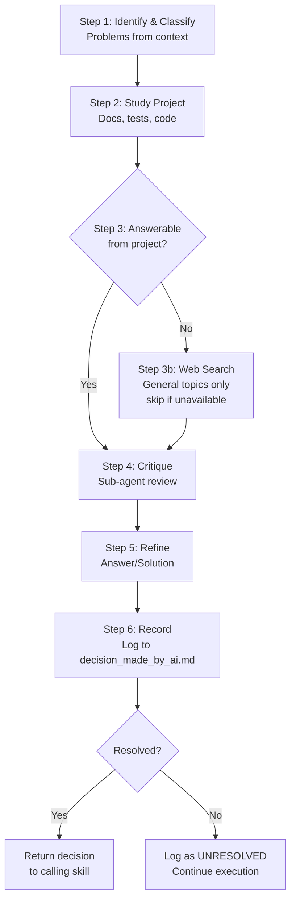
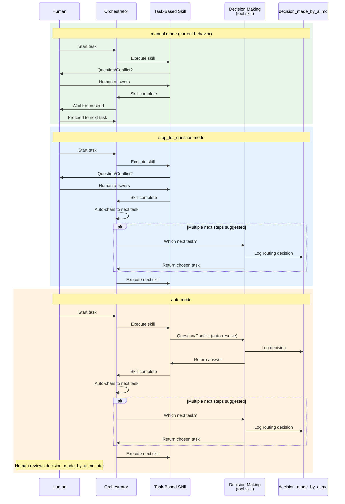

# Idea Summary

> Idea ID: IDEA-031
> Folder: 031. CR-Adding Auto Proceed option to workflow mode
> Version: v1
> Created: 2026-03-04
> Status: Refined
> Type: Change Request (CR)

## Overview

Add a **3-mode execution preference** to all task-based skills, replacing the current boolean flags.

- **Unified `process_preference.auto_proceed`** (`manual | auto | stop_for_question`) replaces both `auto_proceed` (bool) and `require_human_review` (bool) across all 22 task-based skills, the workflow orchestrator, and the skill-creator template.
- **New `x-ipe-tool-decision-making`** — a lightweight tool skill that AI agents invoke inline to resolve questions/conflicts autonomously.
- **Shared decision log** (`x-ipe-docs/decision_made_by_ai.md`) — audit trail for all AI-made decisions, reviewable by humans asynchronously.

## Problem Statement

Today, task-based skills carry two separate boolean flags (`auto_proceed` and `require_human_review`) that are loosely coupled and inconsistently interpreted:

- Some skills treat `require_human_review: yes` as a hard stop, others as advisory.
- `auto_proceed: true` simply means "chain to next task" but doesn't address **within-skill** decision points (e.g., resolving ambiguities, choosing between alternatives).
- There is no mechanism for AI to autonomously resolve questions or conflicts — every decision point blocks on human input.
- The workflow UI has no runtime toggle to switch execution modes.

**Concrete examples of within-skill decision points:**
- During `x-ipe-task-based-ideation`, the agent encounters two competing user personas in uploaded files — currently it blocks and asks human; in `auto` mode it calls decision_making_skill.
- During `x-ipe-task-based-technical-design`, the agent must choose between two valid architectural patterns — currently it stops; in `stop_for_question` mode, it still stops for this question (human decides), but auto-proceeds to the next task after completion.
- During `x-ipe-task-based-code-implementation`, the agent hits a test failure with multiple possible fixes — currently blocks; in `auto` mode, it evaluates options, picks one, and logs the decision.

This limits autonomous agent productivity and creates friction in long-running workflows.

## Target Users

- **AI Agents** — can operate with greater autonomy when configured to do so
- **Human Developers** — retain full control with `manual` mode (default), gain flexibility with `stop_for_question` and `auto` modes
- **Project Managers** — can review AI-made decisions asynchronously via the decision log

## Proposed Solution

### 1. Unified Process Preference

Replace the two booleans with a single enum input parameter on every task-based skill:

```yaml
process_preference:
  auto_proceed: "manual | auto | stop_for_question"  # default: manual
```

**Mode Behavior Matrix:**

| Behavior | `manual` | `stop_for_question` | `auto` |
|----------|----------|---------------------|--------|
| Inter-task flow (between skills) | ⏸ Wait for human | ▶️ Auto-proceed (🤖 decision skill if multiple next steps) | ▶️ Auto-proceed (🤖 decision skill if multiple next steps) |
| Within-skill questions/conflicts | ⏸ Wait for human | ⏸ Wait for human | 🤖 Call decision_making skill |
| Decision logging | N/A (human decides) | ✅ Logged (inter-task decisions only) | ✅ Logged (all decisions) |

### 2. Decision Making Tool Skill (`x-ipe-tool-decision-making`)

A new **tool skill** (lightweight, no task board entry) invoked inline by any task-based skill when `auto_proceed` is `auto`.

**Input:**

```yaml
input:
  decision_context:
    calling_skill: "{skill name}"
    task_id: "{TASK-XXX}"
    feature_id: "{FEATURE-XXX | N/A}"  # optional
    workflow_name: "{name | N/A}"
    problems:  # supports multiple problems in a single call
      - problem_id: "P1"
        description: "{what needs to be decided}"
        type: "question | conflict | routing"
        options: ["option A", "option B", ...]  # if known, optional
        related_files: ["path1", "path2"]  # optional
      - problem_id: "P2"
        description: "{another decision needed}"
        type: "question"
        options: []
        related_files: []
```

**6-Step Decision Process:**



**Unresolvable Conflicts:** When the skill cannot resolve a question (no project context, no web results, no reasonable inference), it logs the item as `UNRESOLVED` in `decision_made_by_ai.md` and returns control to the calling skill to continue. Human can review later.

### 3. Decision Log (`x-ipe-docs/decision_made_by_ai.md`)

A single shared file per project with a structured template:

```markdown
# AI Decision Log

## Decision Registry

| # | Date | Task ID | Skill | Workflow | Problem Type | Status | Section |
|---|------|---------|-------|----------|--------------|--------|---------|
| 1 | 2026-03-04 | TASK-714 | Ideation | my-workflow | Question | ✅ Resolved | [D-001](#d-001) |
| 2 | 2026-03-04 | TASK-715 | Technical Design | my-workflow | Conflict | ⚠️ Unresolved | [D-002](#d-002) |

---

### D-001

> **Task:** TASK-714 | **Skill:** Ideation | **Workflow:** my-workflow
> **Date:** 2026-03-04 08:30:00 | **Status:** ✅ Resolved

**Problem:** {description}
**Type:** Question | Conflict
**Context:** {what the skill was doing when the question arose}

**Analysis:**
- Project docs insight: {what was found}
- Web research: {if applicable}
- Critique feedback: {sub-agent feedback}

**Decision:** {the answer or solution chosen}
**Rationale:** {why this was chosen}
**Follow-up Required:** None | {description of what human should review}

---
```

### 4. Input Resolution — How `auto_proceed` Gets Its Value

```mermaid
flowchart TD
    A[Task Execution Start] --> B{Execution Mode?}
    B -->|workflow-mode| C[Read workflow-name.json\nglobal.process_preference.auto_proceed]
    B -->|free-mode| D{CLI flag provided?}
    D -->|--proceed@auto| E[auto]
    D -->|--proceed@stop-for-question| F[stop_for_question]
    D -->|No flag| G[manual - default]
    C --> H[Map to 3-mode enum]
    H --> I[Pass to skill input]
    E --> I
    F --> I
    G --> I
```

**CLI Flags (free-mode):**
- `--proceed@auto` → `auto`
- `--proceed@stop-for-question` → `stop_for_question`
- No flag → `manual` (default, preserves existing behavior)

**Workflow-mode:** Read from `workflow-{name}.json` global settings section.

### 5. Workflow Template & Runtime Changes

**workflow-template.json** — Add global `process_preference` block:

```json
{
  "global": {
    "process_preference": {
      "auto_proceed": "manual"
    }
  },
  "stage_order": ["ideation", "requirement", "implement", "validation", "feedback"],
  "stages": { ... }
}
```

**workflow-{name}.json** (runtime) — Same structure, value can be changed at runtime via UI toggle.

### 6. Workflow UI Toggle (Workflow-Global)

In the workflow panel header, add a **workflow-global toggle** for execution mode. This applies to all features within the workflow (all features share one setting):

```
┌─────────────────────────────────────────────┐
│  Workflow: my-project                        │
│  ┌────────────────────────────────────────┐  │
│  │ Execution Mode: [Manual ▼]            │  │
│  │   • Manual                             │  │
│  │   • Auto                               │  │
│  │   • Stop for Question                  │  │
│  └────────────────────────────────────────┘  │
│  ...                                         │
└─────────────────────────────────────────────┘
```

Changing the toggle updates `workflow-{name}.json` → `global.process_preference.auto_proceed` via the backend API.

## Key Features

### System Architecture

```architecture-dsl
@startuml module-view
title "Auto-Proceed System Architecture"
theme "theme-default"
direction top-to-bottom
grid 12 x 8

layer "Configuration Layer" {
  color "#E8F5E9"
  border-color "#4CAF50"
  rows 2

  module "Template & Runtime Config" {
    cols 6
    rows 2
    grid 2 x 1
    align center center
    gap 8px
    component "workflow-template.json\n(global default)" { cols 1, rows 1 }
    component "workflow-{name}.json\n(runtime override)" { cols 1, rows 1 }
  }

  module "Input Resolution" {
    cols 6
    rows 2
    grid 2 x 1
    align center center
    gap 8px
    component "CLI Flags\n--proceed@{mode}" { cols 1, rows 1 }
    component "Skill Input\nprocess_preference" { cols 1, rows 1 }
  }
}

layer "Orchestration Layer" {
  color "#E3F2FD"
  border-color "#2196F3"
  rows 2

  module "Workflow Task Execution" {
    cols 6
    rows 2
    grid 2 x 1
    align center center
    gap 8px
    component "Mode Router\n(manual/auto/sfq)" { cols 1, rows 1 }
    component "Task Chainer\n(auto-proceed logic)" { cols 1, rows 1 }
  }

  module "Decision Making" {
    cols 6
    rows 2
    grid 3 x 1
    align center center
    gap 8px
    component "Problem\nClassifier" { cols 1, rows 1 }
    component "Context\nResearcher" { cols 1, rows 1 }
    component "Decision\nRecorder" { cols 1, rows 1 }
  }
}

layer "Skill Layer" {
  color "#FFF3E0"
  border-color "#FF9800"
  rows 2

  module "Task-Based Skills (22)" {
    cols 8
    rows 2
    grid 4 x 2
    align center center
    gap 8px
    component "Ideation" { cols 1, rows 1 }
    component "Requirement\nGathering" { cols 1, rows 1 }
    component "Technical\nDesign" { cols 1, rows 1 }
    component "Code\nImplementation" { cols 1, rows 1 }
    component "Feature\nRefinement" { cols 1, rows 1 }
    component "Bug Fix" { cols 1, rows 1 }
    component "Test\nGeneration" { cols 1, rows 1 }
    component "... 15 more" { cols 1, rows 1 }
  }

  module "Skill Creator Template" {
    cols 4
    rows 2
    grid 1 x 2
    align center center
    gap 8px
    component "x-ipe-task-based\ntemplate.md" { cols 1, rows 1 }
    component "process_preference\nstandard input" { cols 1, rows 1 }
  }
}

layer "Persistence Layer" {
  color "#FCE4EC"
  border-color "#E91E63"
  rows 2

  module "Decision Audit" {
    cols 6
    rows 2
    grid 1 x 1
    align center center
    gap 8px
    component "decision_made_by_ai.md\n(shared project-level log)" { cols 1, rows 1 }
  }

  module "UI Integration" {
    cols 6
    rows 2
    grid 2 x 1
    align center center
    gap 8px
    component "Workflow Panel\nExecution Mode Toggle" { cols 1, rows 1 }
    component "Backend API\n/api/workflow/settings" { cols 1, rows 1 }
  }
}

@enduml
```

## Success Criteria

- [ ] `process_preference.auto_proceed` replaces both `auto_proceed` (bool) and `require_human_review` in all 22 task-based skills
- [ ] `x-ipe-tool-decision-making` skill created with 6-step process
- [ ] `decision_made_by_ai.md` template created with decision registry and detail sections
- [ ] `workflow-template.json` updated with `global.process_preference` block
- [ ] `workflow-{name}.json` runtime files support the new field
- [ ] `x-ipe-workflow-task-execution` updated with 3-mode routing logic
- [ ] Skill creator template updated to include `process_preference` as standard input
- [ ] Workflow UI toggle for execution mode (workflow-global)
- [ ] Backend API endpoint to update workflow process preference
- [ ] `manual` mode preserves 100% backward compatibility with current behavior
- [ ] All 22 skill SKILL.md files updated simultaneously
- [ ] All 22 updated SKILL.md files pass skill-creator validation (structure, required sections, YAML schema)
- [ ] Skill output YAML updated: `require_human_review` removed, `process_preference` added to `task_completion_output`

## Constraints & Considerations

- **Backward Compatibility:** `manual` mode must be the default everywhere, preserving current behavior for all existing workflows
- **Single Big CR:** All 22 skills + orchestrator + template updated in one batch (no phased rollout)
- **Decision Skill is a Tool:** `x-ipe-tool-decision-making` is a lightweight tool skill, NOT a task-based skill — no task board entry needed
- **Unresolved Decisions:** When decision_making_skill cannot resolve, it logs as `UNRESOLVED` and continues — never blocks indefinitely
- **Web Search Optional:** Step 3 of decision_making_skill uses web search only for general topics; skipped for project-specific questions
- **Global Scope:** The mode applies at workflow level (all features share one setting), stored in `workflow-{name}.json` global section. No per-feature override — this is an explicit design decision to keep the model simple.
- **Free-mode Support:** CLI flags (`--proceed@auto`, `--proceed@stop-for-question`) for non-workflow execution
- **Orchestrator Simplification:** All flow-control decisions in `x-ipe-workflow-task-execution` must route through `process_preference.auto_proceed` — no other flags or conditions should gate task continuation. Remove/consolidate any other stopping logic.
- **Multiple Next Steps:** When the orchestrator faces multiple `next_actions_suggested` options: in `auto` and `stop_for_question` modes, it calls `x-ipe-tool-decision-making` to choose one (decision is logged); in `manual` mode, it asks the human.
- **Decision Log Concurrency:** In multi-agent scenarios, each agent appends atomically. Decision IDs (D-001, D-002, ...) must be globally unique per project — use auto-increment on existing registry.

### End-to-End Execution Flow (by Mode)



### Skill Update Pattern (Before/After)

Each of the 22 task-based skills needs these changes:

**Input Parameters — Before:**
```yaml
input:
  auto_proceed: false
  # ...
  category: feature-stage
  require_human_review: yes
```

**Input Parameters — After:**
```yaml
input:
  process_preference:
    auto_proceed: "manual | auto | stop_for_question"  # default: manual
  # ...
  category: feature-stage
  # require_human_review: REMOVED (derived from auto_proceed mode)
```

**Execution Procedure — Before (human review block):**
```xml
<step_N>
  <name>Request Human Review</name>
  <action>
    1. Present results to human
    2. Wait for human approval
    3. IF human rejects → revise
  </action>
  <constraints>
    - BLOCKING: Human MUST approve before proceeding
  </constraints>
</step_N>
```

**Execution Procedure — After (mode-aware block):**
```xml
<step_N>
  <name>Review & Decision Gate</name>
  <action>
    1. IF process_preference.auto_proceed == "manual" OR "stop_for_question":
       → Present results to human
       → Wait for human approval
       → IF human rejects → revise
    2. ELIF process_preference.auto_proceed == "auto":
       → Skip human review (decisions already resolved via decision_making_skill)
       → Log completion to decision_made_by_ai.md if any decisions were made
  </action>
</step_N>
```

**Within-Skill Decision Points — Before:**
```xml
<action>
  1. ...analyze options...
  2. Ask human: "Which approach do you prefer? A or B?"
  3. Wait for human response
  4. Apply chosen approach
</action>
```

**Within-Skill Decision Points — After:**
```xml
<action>
  1. ...analyze options...
  2. IF process_preference.auto_proceed IN ["manual", "stop_for_question"]:
     → Ask human: "Which approach do you prefer? A or B?"
     → Wait for human response
  3. ELIF process_preference.auto_proceed == "auto":
     → CALL x-ipe-tool-decision-making with decision_context:
       { calling_skill, task_id, problem_description, options: ["A", "B"] }
     → Use returned decision
  4. Apply chosen approach
</action>
```

**Output Result — Before:**
```yaml
task_completion_output:
  require_human_review: yes
  auto_proceed: false
```

**Output Result — After:**
```yaml
task_completion_output:
  process_preference:
    auto_proceed: "{from input}"  # pass through for orchestrator routing
  # require_human_review: REMOVED
```

## Brainstorming Notes

### Key Design Decisions

1. **3-mode enum vs boolean:** The `manual | auto | stop_for_question` enum provides a meaningful middle ground between "always stop" and "fully autonomous" — the `stop_for_question` mode auto-proceeds between tasks but still stops for human input on within-skill questions, while `auto` mode handles everything autonomously via the decision_making_skill.

2. **Tool skill vs task-based skill for decision making:** Chosen as tool skill because decision-making is an inline helper invoked by other skills mid-execution, not an independent task with its own lifecycle.

3. **Single decision log:** One `decision_made_by_ai.md` per project (not per-workflow or per-feature) provides a centralized audit trail. The registry table format with task/skill/workflow columns makes filtering easy.

4. **Config cascade:** `workflow-template.json` (default) → `workflow-{name}.json` (runtime) → CLI flag (free-mode). Skills always read from their input parameter, which the orchestrator resolves from the appropriate source.

5. **Unresolvable conflicts:** Rather than forcing bad decisions, unresolvable items are logged and execution continues. This prevents workflow deadlocks while maintaining transparency.

### Impact Assessment

| Component | Files Affected | Change Type |
|-----------|---------------|-------------|
| Task-based skills | 22 SKILL.md files | Input params, execution procedure, output |
| Workflow orchestrator | 1 SKILL.md | Routing logic, mode resolution |
| Skill creator template | 1 template file | New standard input |
| Workflow template | 1 JSON file | New global section |
| Backend service | workflow_manager_service.py | API for settings update |
| Frontend | workflow panel JS/CSS | Execution mode toggle |
| New tool skill | 1 new SKILL.md | x-ipe-tool-decision-making |
| New template | 1 new .md | decision_made_by_ai.md template |
| Copilot instructions | .github/copilot-instructions.md | Update auto_proceed references |

### Mode Behavior Detail

**`manual` (default):**
- Identical to current behavior
- Agent stops between tasks, stops for any question within a skill
- Human controls everything

**`stop_for_question`:**
- Agent auto-chains to next task after completion (no waiting between tasks)
- If multiple next steps are suggested, calls `x-ipe-tool-decision-making` to choose (logged)
- Within a skill: if agent hits a question/conflict, it **stops and asks the human** (same as manual for within-skill behavior)
- Name reflects the behavior: "stop for questions, but auto-proceed otherwise"

**`auto`:**
- Agent auto-chains to next task without waiting
- If multiple next steps are suggested, calls `x-ipe-tool-decision-making` to choose (logged)
- Within a skill: calls `x-ipe-tool-decision-making` for any question/conflict (no human interaction)
- Everything is logged to `decision_made_by_ai.md` for async human review

## Source Files

- x-ipe-docs/ideas/031. CR-Adding Auto Proceed option to workflow mode/new idea.md

## Next Steps

- [ ] Proceed to Requirement Gathering (this is a CR modifying existing skills/features)

## References & Common Principles

### Applied Principles

- **Autonomous Agent Execution Modes** — Common pattern in AI agent frameworks (AutoGPT, CrewAI, LangGraph) where agents have configurable autonomy levels. Our 3-mode approach maps to: `manual` = human-in-the-loop, `stop_for_question` = semi-autonomous (auto-proceed but human resolves questions), `auto` = fully autonomous.
- **Decision Audit Trail** — Enterprise decision management pattern. Every automated decision is logged with context, rationale, and status for compliance and review.
- **Configuration Cascade** — Standard pattern in build tools (npm, webpack, eslint). Default → project → runtime override. Our cascade: template → workflow JSON → CLI flag.
- **Graceful Degradation** — When the decision-making skill cannot resolve, it gracefully degrades by logging and continuing rather than blocking the entire workflow.

### Further Reading

- [LangGraph Human-in-the-Loop](https://langchain-ai.github.io/langgraph/how-tos/#human-in-the-loop) — Patterns for human oversight in agent workflows
- [CrewAI Process Types](https://docs.crewai.com/concepts/processes) — Sequential vs hierarchical agent process modes
- [Decision Log Pattern](https://adr.github.io/) — Architecture Decision Records (ADR) as inspiration for decision_made_by_ai.md format
