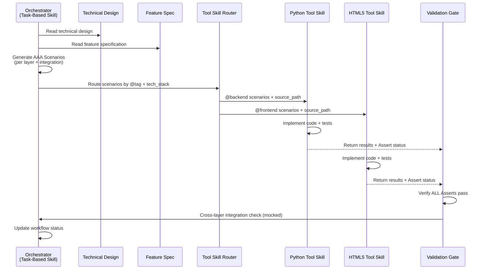
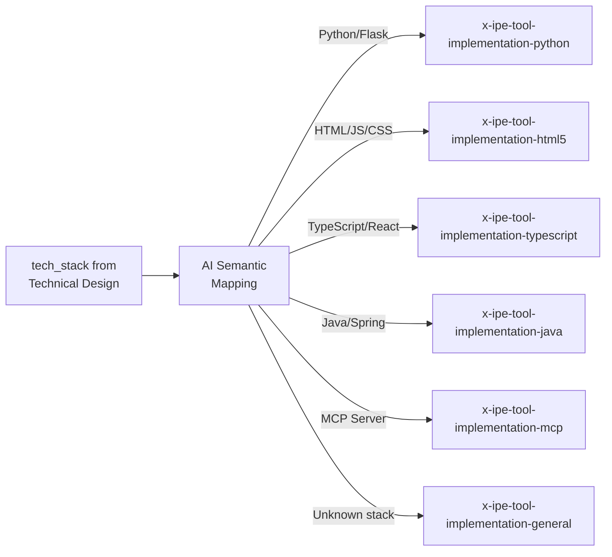
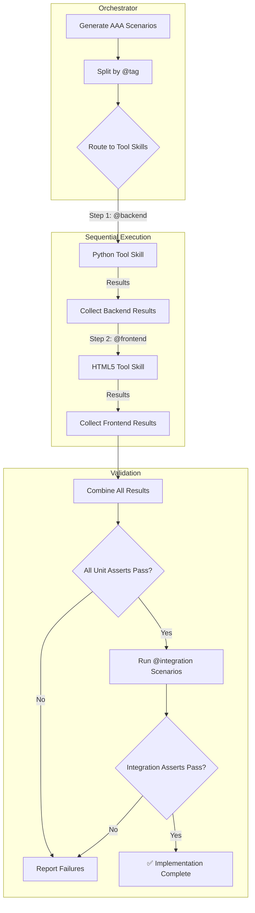

# Idea Summary

> Idea ID: IDEA-032
> Folder: 032. CR-Update implementation skill
> Version: v1
> Created: 2026-03-05
> Status: Refined

## Overview

Restructure `x-ipe-task-based-code-implementation` from a monolithic skill that handles all coding inline into a **lightweight orchestrator** that delegates actual implementation to **language/purpose-specific tool skills** (`x-ipe-tool-implementation-{language/purpose}`). The orchestrator generates **language-agnostic AAA (Arrange/Act/Assert) test scenarios** from feature specifications and technical designs, then passes them to the appropriate tool skills as validation contracts. This follows the **Strategy Pattern** — enabling Separation of Concerns, Abstraction, and Loose Coupling while making the implementation framework extensible to any language or purpose.

## Problem Statement

The current `x-ipe-task-based-code-implementation` skill has several architectural limitations:

1. **Monolithic Implementation** — All coding logic (frontend, backend, fullstack) is handled within a single skill's Step 5, making it bloated and hard to maintain
2. **Tightly Coupled Test Generation** — `x-ipe-tool-test-generation` exists as a separate tool skill but is tightly bound to the implementation flow, creating an unnecessary abstraction layer that doesn't align with how AI agents naturally work
3. **No Language-Specific Best Practices** — The skill tries to be everything for every tech stack, resulting in generic guidance rather than deep, language-specific expertise
4. **Translation Loss** — The current TDD flow (spec → code tests → implementation) loses information during the spec-to-test-code translation, especially when AI can understand natural language specifications directly
5. **Poor Extensibility** — Adding support for a new language or framework requires modifying the core implementation skill rather than adding a new independent tool skill

## Target Users

- **AI Agents** (primary) — Agents executing the X-IPE engineering workflow for code implementation
- **Human Developers** — Who review and approve implementation output produced by AI agents
- **X-IPE Framework Maintainers** — Who extend the framework with new language-specific implementation capabilities

## Proposed Solution

Transform the implementation architecture into a **two-tier orchestrator + tool skill** design:

### Tier 1: Orchestrator (`x-ipe-task-based-code-implementation`)

The task-based skill becomes a workflow coordinator that:
1. Queries feature board and reads technical design (unchanged)
2. **NEW**: Generates natural-language AAA test scenarios from spec + technical design
3. **NEW**: Uses AI semantic mapping to select appropriate tool skills based on `tech_stack`
4. **NEW**: Passes AAA scenarios + source paths to each tool skill
5. **NEW**: Validates that all tool skills satisfy their AAA contract
6. Runs cross-layer integration verification (with mocking)
7. Updates workflow status (unchanged)

### Tier 2: Implementation Tool Skills (`x-ipe-tool-implementation-{name}`)

Each tool skill is a self-contained implementation expert that:
1. Receives AAA scenarios + source code path from orchestrator
2. Learns existing code structure in the source path
3. Implements code following language-specific best practices
4. Writes code-level tests that map to the AAA scenarios
5. Runs tests and returns results to orchestrator as validation gate

### Architecture Overview

```architecture-dsl
@startuml module-view
title "Implementation Skill Architecture"
theme "theme-default"
direction top-to-bottom
grid 12 x 10

layer "Orchestrator Layer" {
  color "#E8F5E9"
  border-color "#4CAF50"
  rows 3

  module "Task-Based Implementation Skill" {
    cols 12
    rows 3
    grid 4 x 1
    align center center
    gap 8px
    component "Feature\nBoard Query" { cols 1, rows 1 }
    component "AAA Scenario\nGenerator" { cols 1, rows 1 }
    component "Tool Skill\nRouter" { cols 1, rows 1 }
    component "Validation\nGate" { cols 1, rows 1 }
  }
}

layer "Tool Skill Layer" {
  color "#E3F2FD"
  border-color "#2196F3"
  rows 3

  module "Language-Specific Skills" {
    cols 8
    rows 3
    grid 4 x 1
    align center center
    gap 8px
    component "Python\nImplementation" { cols 1, rows 1 }
    component "HTML5\nImplementation" { cols 1, rows 1 }
    component "TypeScript\nImplementation" { cols 1, rows 1 }
    component "Java\nImplementation" { cols 1, rows 1 }
  }

  module "Special Purpose Skills" {
    cols 4
    rows 3
    grid 2 x 1
    align center center
    gap 8px
    component "MCP\nImplementation" { cols 1, rows 1 }
    component "General Purpose\nFallback" { cols 1, rows 1 }
  }
}

layer "Input Layer" {
  color "#FFF3E0"
  border-color "#FF9800"
  rows 2

  module "Feature Artifacts" {
    cols 6
    rows 2
    grid 2 x 1
    align center center
    gap 8px
    component "Feature\nSpecification" { cols 1, rows 1 }
    component "Technical\nDesign" { cols 1, rows 1 }
  }

  module "Project Context" {
    cols 6
    rows 2
    grid 2 x 1
    align center center
    gap 8px
    component "Source Code\nStructure" { cols 1, rows 1 }
    component "Tech Stack\nConfig" { cols 1, rows 1 }
  }
}

layer "Output Layer" {
  color "#F3E5F5"
  border-color "#9C27B0"
  rows 2

  module "Deliverables" {
    cols 12
    rows 2
    grid 3 x 1
    align center center
    gap 8px
    component "Implementation\nCode" { cols 1, rows 1 }
    component "Test\nSuites" { cols 1, rows 1 }
    component "Validation\nReport" { cols 1, rows 1 }
  }
}

@enduml
```

### Orchestrator Flow



## Key Features

### 1. Natural Language AAA Test Scenarios

The orchestrator generates **language-agnostic** test scenarios in YAML-like AAA format:

```yaml
@backend
Test Scenario: Create a new project via API
  Arrange:
    - User is authenticated with valid credentials
    - No project with name "Test Project" exists in the system
  Act:
    - User sends POST /api/projects with body { name: "Test Project" }
  Assert:
    - Response status is 201
    - Response body contains the new project ID
    - Project "Test Project" is persisted in the database

@frontend
Test Scenario: Display project creation form
  Arrange:
    - User is on the projects page
    - Projects page is fully loaded
  Act:
    - User clicks "New Project" button
  Assert:
    - A form appears with fields: name, description
    - "Create" button is disabled until name field has content

@integration
Test Scenario: End-to-end project creation
  Arrange:
    - User is on the projects page
    - Backend API is mocked/simulated
  Act:
    - User fills in "Test Project" name and clicks Create
  Assert:
    - Project appears in the projects list on the page
    - Mock backend received correct POST request with project data
```

**Scenario granularity by layer:**
- `@backend` → **Unit-level**: test individual functions, methods, endpoints in isolation
- `@frontend` → **Unit-level**: test individual components, event handlers, DOM behavior
- `@integration` → **Functional-level**: test cross-layer workflows with mocking/simulation

**Note:** Real end-to-end acceptance testing (with browser automation) occurs in the separate **Feature Acceptance Test** skill.

#### AAA Scenario Generation Algorithm

The orchestrator derives AAA scenarios from specification + technical design using this mapping:

| Source | Mapping Rule | Target Layer |
|--------|-------------|--------------|
| Each **acceptance criterion** in specification.md | Maps to at least one `@integration` functional scenario | `@integration` |
| Each **API endpoint / service method** in technical design | Maps to `@backend` unit scenarios (happy + error) | `@backend` |
| Each **UI component / event handler** in technical design | Maps to `@frontend` unit scenarios (happy + error) | `@frontend` |
| Each **error condition / edge case** in technical design | Maps to a sad-path scenario in the relevant layer | `@backend` / `@frontend` |
| Each **data model / validation rule** | Maps to `@backend` unit scenarios for input validation | `@backend` |

**Generation steps:**
1. Parse specification.md acceptance criteria → create `@integration` scenarios
2. Parse technical design Part 2 (Implementation Guide) → extract endpoints, components, models
3. For each endpoint/component: create happy-path `@backend`/`@frontend` unit scenario
4. For each error condition: create sad-path scenario in matching layer
5. Tag each scenario with the appropriate layer (`@backend`, `@frontend`, `@integration`)
6. Validate coverage: every acceptance criterion has at least one scenario; every technical design component has both happy and sad path scenarios

### 2. AI Semantic Tool Skill Mapping

The orchestrator uses the AI agent's LLM capability to semantically map `tech_stack` entries from the Technical Design to the appropriate implementation tool skills. No hardcoded registry — the agent discovers available `x-ipe-tool-implementation-*` skills and matches based on understanding.



### 3. Language-Specific Best Practices

Each tool skill encapsulates deep expertise for its language/framework:

| Tool Skill | Scope | Best Practices |
|-----------|-------|---------------|
| `x-ipe-tool-implementation-python` | Python (Flask, FastAPI, Django, CLI, libs) | PEP 8, type hints, pytest patterns, virtual envs, poetry/uv |
| `x-ipe-tool-implementation-html5` | HTML5, CSS3, JavaScript (vanilla, frameworks) | Semantic HTML, BEM/utility CSS, ES6+, accessibility, responsive design |
| `x-ipe-tool-implementation-typescript` | TypeScript (React, Vue, Angular, Node.js) | Strict mode, interface-first, component patterns, vitest/jest |
| `x-ipe-tool-implementation-java` | Java (Spring Boot, Maven, Gradle) | Clean architecture, JUnit 5, dependency injection, SOLID |
| `x-ipe-tool-implementation-mcp` | MCP servers (based on existing mcp-builder) | Protocol compliance, tool schemas, transport types, error handling |
| `x-ipe-tool-implementation-general` | Any unlisted language/framework (fallback) | Language-agnostic principles, research-driven best practices |

### 4. Source Code Path Management

The Technical Design defines source paths per tech layer. Tool skills operate within their assigned paths:

```yaml
# From Technical Design
source_paths:
  backend: "src/my_app/"
  frontend: "src/my_app/static/js/"
  tests_backend: "tests/"
  tests_frontend: "tests/frontend-js/"
```

**Behavior:**
- If Technical Design specifies paths → tool skills use them directly
- If existing code exists at the path → tool skills learn the structure first
- If no paths specified → tool skills suggest based on context and best practices

### 5. Sequential Multi-Skill Coordination

For features requiring multiple tech stacks, the orchestrator invokes tool skills **sequentially** (AI agents process one skill at a time) and collects results for final validation:



### 6. Elimination of Standalone Test Generation

The current `x-ipe-tool-test-generation` is replaced by:
1. **AAA Scenario Generation** (in orchestrator) — produces natural language test contracts
2. **Code-Level Test Implementation** (in each tool skill) — writes actual test code that maps to AAA scenarios

This eliminates the translation layer and keeps testing tightly coupled with the code it validates, within each language-specific tool skill.

#### Migration Plan for `x-ipe-tool-test-generation` Deprecation

| Phase | Description | State |
|-------|-------------|-------|
| **Phase 1: Coexistence** | Orchestrator generates AAA scenarios AND still invokes `x-ipe-tool-test-generation` as a fallback when no matching implementation tool skill exists | Both approaches active |
| **Phase 2: Adapter** | `x-ipe-tool-test-generation` is refactored to consume AAA scenarios as input (adapter pattern), so it can serve tool skills that don't have built-in test generation | Legacy wrapped |
| **Phase 3: Removal** | Once all initial tool skills are implemented and stable, remove `x-ipe-tool-test-generation`; update all referencing files | Fully deprecated |

**Files/skills referencing `x-ipe-tool-test-generation` that need updating:**
- `.github/skills/x-ipe-task-based-code-implementation/SKILL.md` (Steps 4, execution flow)
- `.github/skills/x-ipe-task-based-code-implementation/references/implementation-guidelines.md`
- `x-ipe-docs/config/workflow-template.json` (test_generation action)
- `.github/copilot-instructions.md` (if any references)
- Any workflow state files referencing the test_generation action

### 7. Failure Handling & Retry Strategy

The multi-tool model introduces failure modes that the current single-tool approach doesn't have:

| Failure Scenario | Response |
|-----------------|----------|
| **Single tool skill fails** | Retry once with error context included in the prompt; if retry fails, report to human with specific failure details |
| **Partial multi-tool failure** (e.g., Python passes, HTML5 fails) | Preserve passing results; re-invoke only the failed tool skill with error context |
| **AAA scenario generation fails** (spec too ambiguous) | Fall back to current `x-ipe-tool-test-generation` approach (Phase 1 coexistence) |
| **No matching tool skill found AND general fallback insufficient** | Signal to human: "This feature requires a new tool skill. Create `x-ipe-tool-implementation-{name}` first." |
| **Integration scenarios fail after unit scenarios pass** | Investigate cross-layer contract mismatch; provide both tool skill outputs to human for diagnosis |

### 8. Context Budget Management

For complex features with many components, AAA scenario generation could exceed agent context limits. Mitigation strategies:

- **Per-layer generation** — Generate `@backend` scenarios first, pass to tool skill, then generate `@frontend` scenarios, rather than all at once
- **Chunking by component** — For large technical designs, generate scenarios per component group rather than for the entire feature
- **Summary pass-through** — Tool skills receive the full AAA scenario list but also a summary of the overall feature scope for context

## Success Criteria

- [ ] Orchestrator skill generates correct AAA scenarios from spec + technical design using the defined mapping algorithm
- [ ] AAA scenarios cover both happy and sad (error) paths at correct granularity per layer
- [ ] AI semantic mapping correctly routes tech_stack entries to tool skills
- [ ] Each tool skill implements code AND tests that satisfy its AAA contract
- [ ] Multi-tool features (e.g., Python + HTML5) work seamlessly in sequential execution
- [ ] General-purpose fallback handles unmapped technology stacks
- [ ] No regression in existing workflow — all current implementation capabilities preserved
- [ ] Tool skills respect source paths from Technical Design
- [ ] Integration scenarios use mocking/simulation (not real browser testing)
- [ ] `x-ipe-meta-skill-creator` remains a special-case delegation (with documented justification)
- [ ] Failure handling correctly retries failed tool skills and reports partial failures
- [ ] Migration from `x-ipe-tool-test-generation` follows the phased deprecation plan
- [ ] New AAA-driven tests coexist with existing test suites without conflicts

## Constraints & Considerations

- **Backward Compatibility** — The orchestrator must still support all current implementation capabilities; this is a refactoring, not a rewrite
- **Skill Naming Convention** — All implementation tool skills follow `x-ipe-tool-implementation-{language/purpose}` pattern
- **MCP Builder Migration** — The existing `mcp-builder` skill needs to be adapted into `x-ipe-tool-implementation-mcp` while preserving its protocol compliance expertise
- **Test Generation Deprecation** — `x-ipe-tool-test-generation` should be deprecated gradually; existing references need updating
- **Feature Acceptance Tests** — Integration test scenarios in AAA format use mocking; real end-to-end testing remains in `x-ipe-task-based-feature-acceptance-test`
- **Tracing Instrumentation** — Remains as a post-implementation step in the orchestrator (not delegated to tool skills)
- **Skill Creator Exception** — `x-ipe-meta-skill-creator` is NOT converted to an implementation tool skill because skill creation follows a fundamentally different lifecycle than code implementation: skills require candidate/production staging, cross-skill validation, and template compliance checks that cannot be expressed as AAA contracts. The orchestrator delegates to it as a special case, explicitly documented.
- **Test Code Coexistence** — Projects with existing test suites generated by the old `x-ipe-tool-test-generation` approach will coexist with new AAA-driven tests. Tool skills should follow existing test file naming conventions and placement. If conflicts arise, tool skills create a clearly-named subfolder (e.g., `tests/feature-{id}/`) to isolate new tests.

## Brainstorming Notes

### Key Design Decisions

1. **AAA over Gherkin/BDD** — Chose AAA format for test scenarios because:
   - More direct mapping to implementation actions (Arrange=setup, Act=execute, Assert=verify)
   - Less ceremony than full Gherkin syntax
   - YAML-like structure is easily parseable by AI agents
   - While Gherkin has more AI training data coverage, AAA's simplicity better suits the AI-to-AI handoff use case

2. **AI Semantic Mapping over Registry** — No hardcoded tool skill registry:
   - AI agents scan `.github/skills/x-ipe-tool-implementation-*/` and semantically match
   - New tool skills are auto-discovered without orchestrator changes
   - Follows Open-Closed Principle — open for extension, closed for modification

3. **Unit-level per layer, Functional-level for integration** — Matches the Test Pyramid:
   - Many unit-level scenarios per layer (base of pyramid)
   - Fewer integration scenarios across layers (middle of pyramid)
   - Acceptance tests in separate skill (top of pyramid)

4. **Source Path from Technical Design** — Technical Design is the single source of truth for project structure, making the orchestrator and tool skills independent of project conventions

### Patterns Applied

- **Strategy Pattern** — Tool skills are interchangeable strategies selected at runtime by the orchestrator
- **Specification by Example** — AAA scenarios are executable specifications in natural language
- **Open-Closed Principle** — New tool skills extend capability without modifying the orchestrator
- **Separation of Concerns** — Orchestrator owns workflow; tool skills own implementation expertise
- **Composition over Inheritance** — Tool skills are composed, not derived from a base implementation

## Ideation Artifacts

- Architecture diagram: Embedded architecture-dsl module view (above)
- Sequence diagram: Mermaid orchestrator flow (above)
- Routing diagram: Mermaid AI semantic mapping flow (above)
- Coordination diagram: Mermaid multi-tool validation flow (above)

## Source Files

- `x-ipe-docs/ideas/032. CR-Update implementation skill/new idea.md`

## Next Steps

- [ ] Proceed to Requirement Gathering — break this CR into structured requirements
- [ ] Or proceed to Idea to Architecture — create detailed system architecture

## References & Common Principles

### Applied Principles

- **Strategy Pattern** (Gang of Four) — Behavioral pattern enabling runtime algorithm selection; the orchestrator selects tool skills based on tech_stack context
- **Specification by Example** (Martin Fowler) — Using concrete examples (AAA scenarios) as executable specifications that bridge the gap between requirements and tests
- **Test Pyramid** (Mike Cohn, "Succeeding with Agile") — Write lots of small unit tests, some integration tests, very few E2E tests; our layer mapping (unit per tech, functional for integration, acceptance in separate skill) follows this shape
- **Open-Closed Principle** (Bertrand Meyer) — Software entities should be open for extension but closed for modification; new tool skills extend without changing the orchestrator
- **Separation of Concerns** (Dijkstra) — Each tool skill is responsible for one language domain's implementation expertise
- **Composition over Inheritance** — Tool skills are composed by the orchestrator rather than inheriting from a base implementation skill

### Further Reading

- [Martin Fowler - Specification by Example](https://martinfowler.com/bliki/SpecificationByExample.html)
- [Martin Fowler - Practical Test Pyramid](https://martinfowler.com/articles/practical-test-pyramid.html)
- [Martin Fowler - Given-When-Then](https://martinfowler.com/bliki/GivenWhenThen.html) — Background on BDD format (reference for why AAA was chosen instead)
- [Wikipedia - Strategy Pattern](https://en.wikipedia.org/wiki/Strategy_pattern)
- [Cucumber - Gherkin Reference](https://cucumber.io/docs/gherkin/reference/) — Reference for structured specification formats
