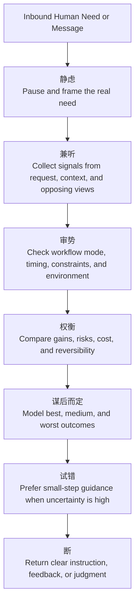

# Idea Summary

> Idea ID: IDEA-033
> Folder: 033. Feature-'道' for x-ipe
> Version: v1
> Created: 2026-03-06
> Status: Refined

## Overview

Create a new top-level X-IPE skill type, **DAO (`道`)**, represented first by `x-ipe-dao-end-user`: a digital-human proxy skill that can provide the kinds of instructions, judgments, clarifications, priorities, critiques, and feedback that currently require a human. The goal is **not** to expand task scope or let DAO do arbitrary implementation work itself; the goal is to replace human-required decision points with a stronger human-like skill interface while preserving existing task boundaries and workflow semantics. Because DAO represents a human proxy rather than a fixed answer engine, it must also be able to **pass through**, **redirect**, or **reframe** a human message instead of always answering it itself.

This idea fully supersedes `x-ipe-tool-decision-making` and broadens it from a narrow auto-mode decision helper into a reusable “human-presence” layer for X-IPE. DAO becomes the first receiver of human input, and later may evolve memory/experience capabilities, but **v1 defers reusable memory** and focuses on the contract, behavior model, logging model, migration path, and skill-template support.

## Problem Statement

The current `x-ipe-tool-decision-making` skill solves only a narrow part of the human-in-the-loop problem:

- It is limited to autonomous decision resolution in `auto` mode.
- It models only **decision points**, not broader human-originated acts such as clarifying intent, shaping feedback, prioritizing options, critiquing outputs, or expressing acceptance-style guidance.
- It writes all results to a single shared file, which does not scale well for task-level traceability.
- It does not establish a reusable abstraction for a “digital human” that can stand in for human responses where the workflow currently pauses.

At the same time, X-IPE already has a valid 3-mode execution model from IDEA-031. This new idea should **extend** that system rather than replace it: DAO should step in where human feedback is required, but inter-task and within-task behavior must still obey existing `process_preference.auto_proceed` semantics.

## Target Users

- **AI agents in X-IPE workflows** that currently stop for human clarification, review, prioritization, or judgment.
- **Skill authors** who need a standard way to model human-required touchpoints without inventing ad hoc logic.
- **Human operators** who want autonomy by default, but still need an optional “human-shadow” fallback path.
- **X-IPE maintainers** who need a cleaner migration target than the current decision-only tool skill.

## Proposed Solution

### 1. Introduce a New Skill Type: DAO

Add a new skill type named **DAO (`道`)** to the skill-creator system.

**Meaning in X-IPE:**
- DAO is a digital-human control layer.
- It represents the human side of guidance inside AI-agent workflows.
- It is broader than “decision making”: it can produce instructions, feedback, clarifications, critique, prioritization, and approval-like direction.
- It should be defined as a skill family, beginning with `x-ipe-dao-end-user`.

**V1 scope boundary:**
- DAO replaces places that require human input.
- DAO does **not** change the scope of downstream tasks.
- DAO does **not** become a general implementation skill.
- DAO may later gain reusable memory/experience, but v1 only defines extension points for that future work.

### 2. Define `x-ipe-dao-end-user` as the First DAO Skill

`x-ipe-dao-end-user` acts like a standalone sub-agent with its own bounded reasoning space. It should synthesize what a capable human would provide at a blocked point, while returning only the resulting guidance to the calling agent.

Core characteristics:
- **Always-on first interception for human messages:** initial human input is interpreted through DAO.
- **Human-substitution behavior:** DAO is invoked where existing skills/workflows would otherwise require human feedback.
- **Autonomous by default:** if no explicit DAO mode is specified, DAO answers on its own.
- **Human-shadow mode optional:** when enabled, DAO can ask the real human for feedback if confidence is low or ambiguity remains.
- **Disposition choice instead of forced answering:** DAO may answer directly, ask a rhetorical/clarifying follow-up, reframe the request as an instruction, or pass the original question to the downstream AI agent if DAO itself lacks the needed context.
- **Bounded output:** DAO returns guidance, not its full inner chain-of-thought.

### 3. Preserve Existing `auto_proceed` Semantics

DAO should not break IDEA-031.

- The initial human message always flows through DAO.
- For **inter-task routing** and **within-task human-required steps**, DAO participation still respects the existing `process_preference.auto_proceed` behavior already defined in workflows and task-based skills.
- DAO broadens *what* can be synthesized in place of a human, but it does not override workflow execution policy.

**Behavior matrix:**

| Situation | Manual | Stop for Question | Auto |
|----------|--------|-------------------|------|
| Initial human message interpretation | DAO intercepts and may answer / redirect / pass through | DAO intercepts and may answer / redirect / pass through | DAO intercepts and may answer / redirect / pass through |
| Inter-task routing | Human-driven unless workflow routes | Auto-proceed with explicit question stops | Auto-proceed |
| Within-task human-required touchpoint | Human answers directly | Human answers directly | DAO answers autonomously |
| DAO human-shadow fallback | Only if enabled | Only if enabled | Only if enabled |

### 4. Expand from Decision Skill to Human-Origin Guidance Skill

Compared with `x-ipe-tool-decision-making`, DAO should support multiple output modes:

- **Clarification output** — restate or sharpen user intent.
- **Judgment output** — choose between alternatives.
- **Critique output** — challenge weak assumptions or incomplete proposals.
- **Instruction output** — tell an agent which skill/tool/step to use next.
- **Feedback output** — provide human-style comments or direction to continue work.
- **Approval-like output** — provide structured guidance equivalent to human go/no-go feedback where policy allows.
- **Pass-through / delegation output** — forward the user’s original question or intent to the downstream AI agent when DAO determines the best human-like behavior is “let the specialist answer this directly.”

This makes DAO a higher-level human-proxy layer, not just a decision resolver.

### 5. Use a Chinese 7-Step Backbone for DAO Reasoning

DAO should be inspired by the proposed Chinese decision methodology:

1. **静虑** — pause before committing
2. **兼听** — gather multiple viewpoints
3. **审势** — judge timing, trend, and environment
4. **权衡** — weigh benefits and harms
5. **谋后而定** — examine best / middle / worst outcomes
6. **试错** — prefer small tests before full commitment
7. **断** — once decided, stop oscillating

This backbone should shape the DAO template and result structure.



### 6. Replace Monolithic Decision Logging with Semantic DAO Log Files

Instead of writing everything into `x-ipe-docs/decision_made_by_ai.md`, DAO should write DAO-grouped semantic logs under a new folder:

- Root folder: `x-ipe-docs/dao/`
- Grouping: **semantic task type / DAO-understood work grouping**
- File naming rule: `decisions_made_{semantic_task_type}.md`
- Constraint: semantic file name should stay within **100 words or fewer**

**Recommended structure:**
- `x-ipe-docs/dao/decisions_made_{semantic_task_type}.md`

DAO should decide whether a new instruction belongs in an existing file or a new one:
- if DAO understands the new work as belonging to an existing semantic task type, it may merge into the existing file
- if DAO judges the work as meaningfully different, it should create a different file with a different semantic name

Each file should capture:
- task / interaction metadata
- calling skill / workflow context
- DAO mode (autonomous or human-shadow)
- the human-required trigger that caused DAO invocation
- options considered
- guidance returned
- rationale summarized by the 7-step backbone
- follow-up needed, if any

### 7. Add DAO Support to Skill Creator

`x-ipe-meta-skill-creator` should gain:

- a new **DAO skill type**
- a dedicated template for DAO-style skills
- guidance for modeling:
  - human-proxy scope
  - bounded-reasoning outputs
  - autonomous default behavior
  - optional human-shadow fallback
  - semantic-task-type DAO logging
  - future extension hooks for memory/experience

### 8. Migrate Existing Decision-Skill Call Sites

Migration target for v1:

- **Fully deprecate** `x-ipe-tool-decision-making`
- replace its call sites with `x-ipe-dao-end-user`
- update instruction documents so human-facing guidance is intercepted through DAO where appropriate
- update the packaged instruction resources shipped with X-IPE as well

This migration should preserve current workflow behavior while broadening the semantic role of the substituted human layer.

## Key Features

- **New DAO skill family** with `x-ipe-dao-end-user` as the first concrete skill
- **Autonomous-by-default digital-human proxy**
- **Optional human-shadow fallback**
- **Compatibility with IDEA-031 auto-proceed model**
- **Semantic-task-type DAO logging under `x-ipe-docs/dao/`**
- **Full deprecation path for `x-ipe-tool-decision-making`**
- **Skill-creator support for new DAO templates**
- **Future-ready extension points for experiential memory**

## System Architecture

```architecture-dsl
@startuml module-view
title "DAO End-User Skill Architecture"
theme "theme-default"
direction top-to-bottom
grid 12 x 8

layer "Interaction Layer" {
  color "#F3E8FF"
  border-color "#8B5CF6"
  rows 2

  module "Inbound Human Interface" {
    cols 6
    rows 2
    grid 2 x 1
    align center center
    gap 8px
    component "CLI Message\nInterceptor" { cols 1, rows 1 }
    component "Human Shadow\nBridge" { cols 1, rows 1 }
  }

  module "Calling Skill Boundary" {
    cols 6
    rows 2
    grid 2 x 1
    align center center
    gap 8px
    component "Human-Required\nTouchpoint Adapter" { cols 1, rows 1 }
    component "Bounded Guidance\nReturn" { cols 1, rows 1 }
  }
}

layer "DAO Cognition Layer" {
  color "#DBEAFE"
  border-color "#2563EB"
  rows 2

  module "Interpretation" {
    cols 4
    rows 2
    grid 2 x 1
    align center center
    gap 8px
    component "Intent\nSynthesizer" { cols 1, rows 1 }
    component "Context\nBoundary Guard" { cols 1, rows 1 }
  }

  module "Seven-Step Reasoning" {
    cols 4
    rows 2
    grid 2 x 1
    align center center
    gap 8px
    component "Chinese 7-Step\nReasoner" { cols 1, rows 1 }
    component "Outcome\nEvaluator" { cols 1, rows 1 }
  }

  module "Directive Output" {
    cols 4
    rows 2
    grid 2 x 1
    align center center
    gap 8px
    component "Instruction / Feedback\nGenerator" { cols 1, rows 1 }
    component "Approval-like\nResponse Policy" { cols 1, rows 1 }
  }
}

layer "Execution Governance Layer" {
  color "#ECFCCB"
  border-color "#65A30D"
  rows 2

  module "Workflow Policy Alignment" {
    cols 6
    rows 2
    grid 2 x 1
    align center center
    gap 8px
    component "Auto-Proceed\nPolicy Mapper" { cols 1, rows 1 }
    component "Migration\nCompatibility" { cols 1, rows 1 }
  }

  module "Agent Coordination" {
    cols 6
    rows 2
    grid 2 x 1
    align center center
    gap 8px
    component "Skill / Tool\nRecommendation" { cols 1, rows 1 }
    component "Escalation\nController" { cols 1, rows 1 }
  }
}

layer "DAO Persistence Layer" {
  color "#FCE7F3"
  border-color "#DB2777"
  rows 2

  module "Task-Level Logs" {
    cols 6
    rows 2
    grid 2 x 1
    align center center
    gap 8px
    component "x-ipe-docs/dao\nTask Folders" { cols 1, rows 1 }
    component "decisions_made_{task}\nMarkdown Files" { cols 1, rows 1 }
  }

  module "Future Experience Hooks" {
    cols 6
    rows 2
    grid 2 x 1
    align center center
    gap 8px
    component "Experience\nAbstraction" { cols 1, rows 1 }
    component "Memory Extension\nPoint" { cols 1, rows 1 }
  }
}

@enduml
```

## Success Criteria

- [ ] A new DAO skill type is defined in the skill creator process.
- [ ] `x-ipe-dao-end-user` is specified as the first DAO skill.
- [ ] DAO scope is clearly bounded to human-required touchpoints, not arbitrary task execution.
- [ ] DAO is autonomous by default, with optional human-shadow fallback.
- [ ] DAO preserves IDEA-031 `process_preference.auto_proceed` semantics.
- [ ] `x-ipe-tool-decision-making` is explicitly deprecated and migration targets are identified.
- [ ] DAO logging is redesigned under `x-ipe-docs/dao/` with DAO-chosen semantic task-type grouping.
- [ ] Reusable memory is explicitly deferred from v1 but left as an extension point.

## Constraints & Considerations

- DAO must not silently redefine downstream skill scope.
- DAO should return bounded outputs, not leak full inner reasoning into the main agent context.
- DAO must not assume every human-style input should be answered by DAO itself; sometimes the most human-like behavior is to pass the question through to the agent that has the actual context.
- Human-shadow mode affects whether DAO asks the human for backup feedback; it does not remove DAO from initial message interception.
- Migration should avoid breaking current auto/manual/stop_for_question behavior.
- Logging granularity must remain human-auditable and task-scoped.
- Logging granularity must remain human-auditable while allowing DAO to merge similar work into shared semantic log files.
- The DAO skill type should be philosophically grounded, but still concrete enough for implementation.

## Brainstorming Notes

### Confirmed by User
- DAO is **not** only about decision-and-guidance; it should act like a human-origin instruction layer.
- DAO should replace only places that currently require human input; downstream work scope stays the same.
- DAO has future potential for memory/experience, but that is **not** part of v1.
- DAO logging should move into `x-ipe-docs/dao/` and be grouped at task level.
- DAO logging should move into `x-ipe-docs/dao/` and be grouped by DAO-understood semantic task type, not by per-task folders.
- `x-ipe-tool-decision-making` should be **fully deprecated** and migrated to DAO.
- Autonomous should be the default DAO behavior.
- Human-shadow mode only affects whether DAO falls back to the real human.
- DAO should behave like a real human proxy: if the incoming message is a question such as “where are we?”, DAO may pass it directly to the AI agent instead of forcing DAO itself to answer.
- IDEA-031 `auto_proceed` behavior remains valid and should stay intact.

### Critique Incorporated
- **Accepted:** keep DAO bounded to human-required substitution, not full general execution.
- **Accepted:** preserve compatibility with existing workflow policy instead of bypassing it.
- **Accepted:** separate DAO logs by task rather than using one monolithic file.
- **Deferred:** reusable cross-task experiential memory, to keep v1 focused.

## Ideation Artifacts (If Tools Used)

- Mermaid reasoning flow embedded in this document.
- Architecture DSL module view embedded in this document.

## Source Files

- `x-ipe-docs/ideas/033. Feature-'道' for x-ipe/new idea.md`
- `.github/skills/x-ipe-tool-decision-making/SKILL.md`
- `x-ipe-docs/ideas/031. CR-Adding Auto Proceed option to workflow mode/refined-idea/idea-summary-v1.md`
- `.github/skills/x-ipe-meta-skill-creator/templates/x-ipe-task-based.md`
- `src/x_ipe/resources/copilot-instructions-zh.md`
- `src/x_ipe/resources/templates/instructions-template.md`

## Next Steps

- [ ] Proceed to Requirement Gathering to turn DAO into implementable requirements and migration work.
- [ ] Optionally create an architecture-focused follow-up for DAO/runtime integration boundaries.
- [ ] Optionally create mockups only if a workflow UI or human-shadow UX surface is needed.

## References & Common Principles

### Applied Principles
- **DAO / 道 as guiding principle:** use “the way” as a framing concept for a higher-order human-proxy control layer, not merely a point decision utility. - [Source](https://en.wikipedia.org/wiki/Tao)
- **Agentic autonomy with tool use:** autonomous agents are characterized by goal-directed action, tool integration, and orchestration; DAO adapts this idea to a bounded digital-human layer. - [Source](https://en.wikipedia.org/wiki/Agentic_AI)
- **Feedback-loop decision agility:** OODA contributes the idea of continuous observation, orientation, decision, and action loops, which supports DAO’s bounded iterative guidance. - [Source](https://en.wikipedia.org/wiki/OODA_loop)
- **Chinese 7-step methodology:** DAO reasoning should follow 静虑、兼听、审势、权衡、谋后而定、试错、断 as provided in the original idea notes. - [Source](x-ipe-docs/ideas/033. Feature-'道' for x-ipe/new idea.md)

### Further Reading
- [https://en.wikipedia.org/wiki/Tao](https://en.wikipedia.org/wiki/Tao) - background on the “Dao / Tao” concept as “the way”.
- [https://en.wikipedia.org/wiki/Agentic_AI](https://en.wikipedia.org/wiki/Agentic_AI) - summary of agentic AI characteristics and orchestration ideas.
- [https://en.wikipedia.org/wiki/OODA_loop](https://en.wikipedia.org/wiki/OODA_loop) - iterative decision loop background relevant to adaptive guidance.
