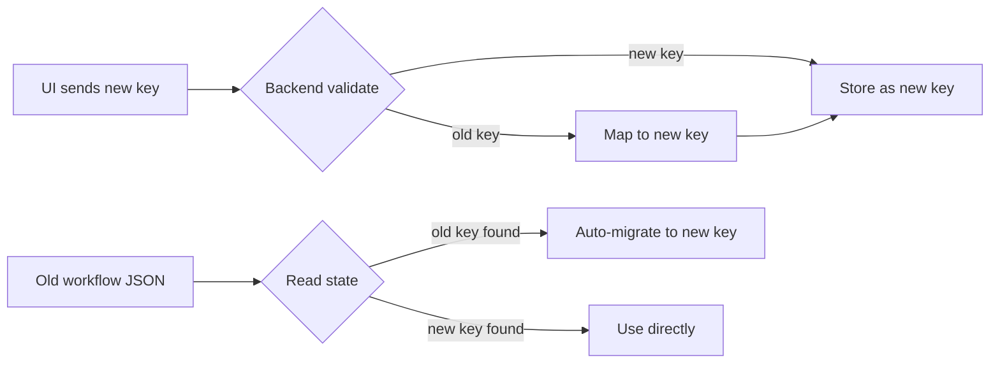
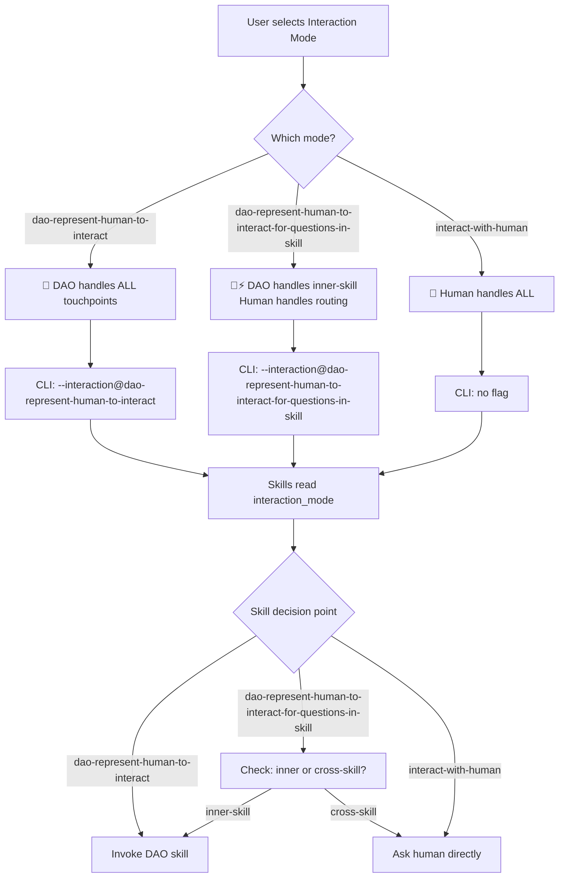

# Idea Summary

> Idea ID: IDEA-034
> Folder: 034. CR-'道' for x-ipe
> Version: v1
> Created: 2026-03-09
> Status: Refined
> Parent: IDEA-033 (Feature-'道' for x-ipe)

## Overview

Rename the existing `auto_proceed` mode system to **Interaction Mode** — explicitly surfacing that the three modes control *who represents the human* at decision points: the DAO skill (`x-ipe-assistant-user-representative-Engineer`), DAO for inner-skill feedback only, or the human directly. This CR updates terminology, enum values, UI labels, backend validation, skill templates, CLI execution flags, and copilot instructions to align the naming with the DAO-first architecture established in IDEA-033.

## Problem Statement

The current naming (`auto_proceed` with values `auto | stop_for_question | manual`) was designed before the DAO skill existed. Now that `x-ipe-assistant-user-representative-Engineer` is the actual mechanism behind "auto" mode, the terminology is misleading:

1. **"Auto" suggests automation** — but the real behavior is *DAO representing the human*, not generic automation.
2. **"Stop for Question" is vague** — it doesn't clarify that DAO still handles inner-skill feedback; only cross-skill routing questions go to the human.
3. **"Manual" undersells itself** — it's really "interact directly with human" mode.
4. **No UI label** — the dropdown has no descriptive label, making it unclear what it controls (see screenshot).
5. **Scattered references** — the `auto_proceed` key appears in 19+ skill templates, backend validation, frontend JS, CLI flags, and copilot-instructions.md — all using the old naming.

## Target Users

- **Human operators** who need to understand at a glance what the dropdown controls
- **Skill authors** who reference `process_preference` in SKILL.md templates
- **AI agents** that read `process_preference` to decide whether to invoke DAO or ask the human
- **New X-IPE users** who haven't seen IDEA-033 and need self-explanatory UI

## Proposed Solution

### 1. Rename the Conceptual Model

| Aspect | Current | Proposed |
|--------|---------|----------|
| Concept name | Auto-Proceed Mode | **Interaction Mode** |
| Config key | `process_preference.auto_proceed` | `process_preference.interaction_mode` |
| UI label | *(none)* | **"Interaction Mode"** label above/beside dropdown |

### 2. New Enum Values

| Current Value | New Internal Key | UI Display Label | Meaning |
|---------------|-----------------|------------------|---------|
| `auto` | `dao-represent-human-to-interact` | 🤖 DAO Represents Human | DAO represents the human at ALL touchpoints — both inner-skill feedback and cross-skill routing decisions |
| `stop_for_question` | `dao-represent-human-to-interact-for-questions-in-skill` | 🤖⚡ DAO Inner-Skill Only | DAO represents the human for inner-skill questions only; human answers cross-skill routing and strategic questions directly |
| `manual` | `interact-with-human` | 👤 Human Direct | Human handles all touchpoints directly — no DAO involvement at decision points |

**Design rationale for semantic keys:** AI agents parse these keys to determine behavior at every decision point. Keys like `dao-represent-human-to-interact` read as a natural sentence (subject-verb-object) — an agent immediately understands *who* acts, *what* they do, and *why*. The pattern is consistent: DAO-prefixed keys signal DAO involvement, `interact-with-human` signals direct human control. Since these keys appear in YAML configs, JSON state, and CLI flags (not tight inner loops), **meaningful is over simplicity**.

### 3. Backward Compatibility Strategy

During transition, the backend MUST accept both old and new values:



**Migration map:**
- `auto` → `dao-represent-human-to-interact`
- `stop_for_question` → `dao-represent-human-to-interact-for-questions-in-skill`
- `manual` → `interact-with-human`

### 4. UI Changes

#### Current UI (from screenshot)
The dropdown is a small button with a colored badge (`Auto` in green), no label, positioned in the workflow panel header beside the 3-dots menu.

#### Proposed UI

```
┌─────────────────────────────────────────────────────┐
│ hello                                               │
│ Created Feb 21, 2026 · 0 features · requirement     │
│                                                     │
│                    Interaction Mode ▾               │
│                    ┌──────────────────────────────┐ │
│                    │ 🤖  DAO Represents Human     │ │
│                    │ 🤖⚡ DAO Inner-Skill Only  ✓ │ │
│                    │ 👤  Human Direct             │ │
│                    └──────────────────────────────┘ │
│                                                     │
│ ● Ideation › ② Requirement › ③ Implement › ...     │
└─────────────────────────────────────────────────────┘
```

**Changes:**
1. Add a **"Interaction Mode"** label text before/above the dropdown button
2. Replace short labels (`Auto`, `Manual`, `Stop for Q`) with descriptive labels
3. Use emoji prefixes for quick visual scanning (🤖 for DAO modes, 👤 for human)
4. Keep the badge color system: green for `dao-represent-human-to-interact`, yellow for `dao-represent-human-to-interact-for-questions-in-skill`, gray for `interact-with-human`

### 5. CLI Execution Flag Changes

| Current Flag | New Flag |
|-------------|----------|
| `--execute@keep-running-forever` | `--interaction@dao-represent-human-to-interact` |
| `--execute@keep-running-forever-stop-only-on-question` | `--interaction@dao-represent-human-to-interact-for-questions-in-skill` |
| *(no flag for manual)* | *(no flag for interact-with-human)* |

### 6. Skill Template Changes

All 19 task-based skills need updated references:

**Before:**
```yaml
process_preference:
  auto_proceed: "{from input process_preference.auto_proceed}"
```

**After:**
```yaml
process_preference:
  interaction_mode: "{from input process_preference.interaction_mode}"
```

**Conditional branching update:**

Before:
```
IF process_preference.auto_proceed == "auto":
  → Resolve via x-ipe-assistant-user-representative-Engineer
ELSE (manual/stop_for_question):
  → Ask human for decision
```

After:
```
IF process_preference.interaction_mode == "dao-represent-human-to-interact":
  → Resolve via x-ipe-assistant-user-representative-Engineer
ELIF process_preference.interaction_mode == "dao-represent-human-to-interact-for-questions-in-skill":
  → Inner-skill feedback via DAO; cross-skill routing via human
ELSE (interact-with-human):
  → Ask human for decision
```

### 7. Backend Validation Changes

```python
# Before
valid_modes = ("manual", "auto", "stop_for_question")
ap = pp.get("auto_proceed")

# After
VALID_MODES = ("interact-with-human", "dao-represent-human-to-interact", "dao-represent-human-to-interact-for-questions-in-skill")
LEGACY_MAP = {"manual": "interact-with-human", "auto": "dao-represent-human-to-interact", "stop_for_question": "dao-represent-human-to-interact-for-questions-in-skill"}

im = pp.get("interaction_mode") or pp.get("auto_proceed")  # backward compat
if im in LEGACY_MAP:
    im = LEGACY_MAP[im]
if im and im not in VALID_MODES:
    return {"success": False, "error": "INVALID_VALUE", ...}
```

### 8. Copilot Instructions Update

Update `.github/copilot-instructions.md` references:
- Replace `process_preference.auto_proceed` → `process_preference.interaction_mode`
- Replace enum `manual | auto | stop_for_question` → `interact-with-human | dao-represent-human-to-interact | dao-represent-human-to-interact-for-questions-in-skill`
- Update behavioral descriptions to reference DAO explicitly

## Key Features



## Success Criteria

- [ ] Dropdown displays "Interaction Mode" label in the UI
- [ ] Three new enum values work end-to-end (UI → API → storage → skill execution)
- [ ] Old enum values are auto-migrated on read (backward compatible)
- [ ] All 19 task-based skills reference `interaction_mode` instead of `auto_proceed`
- [ ] CLI flags use `--interaction@{mode}` format
- [ ] `copilot-instructions.md` updated with new terminology
- [ ] Existing tests updated and passing
- [ ] No regression: workflows created with old values still work

## Constraints & Considerations

1. **Backward compatibility is non-negotiable** — existing workflow JSON files with `auto_proceed` must auto-migrate silently
2. **Skill template bulk update** — 19+ files need identical find-and-replace; use scripted approach to avoid human error
3. **Test coverage** — existing tests in `action-execution-modal-cr001.test.js`, `workflow-panel-actions.test.js`, and `test_workflow_settings.py` all reference old values and need updating
4. **PyPI package** — the copilot instructions are also packed in the `x-ipe` PyPI package; the package must be rebuilt after changes
5. **DAO skill itself** — `x-ipe-assistant-user-representative-Engineer` SKILL.md references `auto_proceed` in its execution_strategy output; update to `interaction_mode`

## Brainstorming Notes

**Key insights from ideation:**

1. **Naming philosophy:** The shift from "auto_proceed" to "interaction_mode" reflects IDEA-033's core insight — DAO is not automation, it's *human representation*. The name should telegraph this.

2. **Why semantic keys over terse keys?** AI agents parse these keys to decide behavior at every skill decision point. A key like `dao-represent-human-to-interact` reads as a natural sentence (subject-verb-object): *DAO represents human to interact*. The agent immediately understands who acts, what they do, and why. The pattern is consistent: `dao-`prefixed keys signal DAO involvement; `interact-with-human` signals direct human control. Since these keys appear in YAML configs, JSON state, and CLI flags (not tight inner loops), **meaningful is over simplicity**.

3. **Why "Interaction Mode" and not "Representative Mode"?** "Interaction Mode" is broader and self-explanatory — it describes what the dropdown controls (how the system interacts at decision points). "Representative Mode" would confuse users who pick "interact-with-human" — they're not choosing a representative, they're choosing *no* representative.

4. **Migration path:** Auto-migration on read means no manual migration step. When the backend reads an old key, it maps it to the new key and writes it back. Over time, all workflow JSON files converge to new keys organically.

## Affected Files

| File | Change Type | Description |
|------|------------|-------------|
| `src/x_ipe/static/js/features/workflow.js` | UI | Dropdown labels, enum values, add "Interaction Mode" label |
| `src/x_ipe/static/js/features/action-execution-modal.js` | Logic | `_loadAutoProceed` → `_loadInteractionMode`, `_buildExecutionFlag` update |
| `src/x_ipe/static/css/workflow.css` | Style | Label styling for "Interaction Mode" text |
| `src/x_ipe/services/workflow_manager_service.py` | Backend | Validation, migration map, key rename |
| `src/x_ipe/routes/workflow_routes.py` | Backend | Possibly minor (settings route delegates to service) |
| `.github/skills/x-ipe-task-based-*/SKILL.md` | Skills (×19) | `auto_proceed` → `interaction_mode` references |
| `.github/skills/x-ipe-assistant-user-representative-Engineer/SKILL.md` | Skill | execution_strategy output key |
| `.github/copilot-instructions.md` | Instructions | All `auto_proceed` references |
| `tests/frontend-js/action-execution-modal-cr001.test.js` | Tests | Update test values and flag assertions |
| `tests/frontend-js/workflow-panel-actions.test.js` | Tests | Update dropdown option assertions |
| `tests/test_workflow_settings.py` | Tests | Update valid_modes, migration tests |

## Source Files

- `x-ipe-docs/ideas/034. CR-'道' for x-ipe/new idea.md`
- `x-ipe-docs/uiux-feedback/Feedback-20260309-111628/feedback.md`
- `x-ipe-docs/ideas/033. Feature-'道' for x-ipe/refined-idea/idea-summary-v1.md` (parent idea)

## Next Steps

- [ ] Proceed to Requirement Gathering → Feature Breakdown
- [ ] Or proceed directly to Change Request skill (since this is a CR on existing feature)

## References & Common Principles

### Applied Principles

- **Naming reflects purpose (IDEA-033):** DAO is human representation, not automation — naming should reflect this
- **Backward compatibility (Postel's Law):** Be conservative in what you send, liberal in what you accept — accept old values, emit new ones
- **Progressive migration:** Auto-migrate on read; no big-bang migration needed

### Related Ideas

- [IDEA-033: Feature-'道' for x-ipe](../033.%20Feature-'道'%20for%20x-ipe/refined-idea/idea-summary-v1.md) — Established DAO architecture
- [IDEA-031: CR-Adding Auto Proceed option](../031.%20CR-Adding%20Auto%20Proceed%20option%20to%20workflow%20mode/) — Original auto_proceed feature
