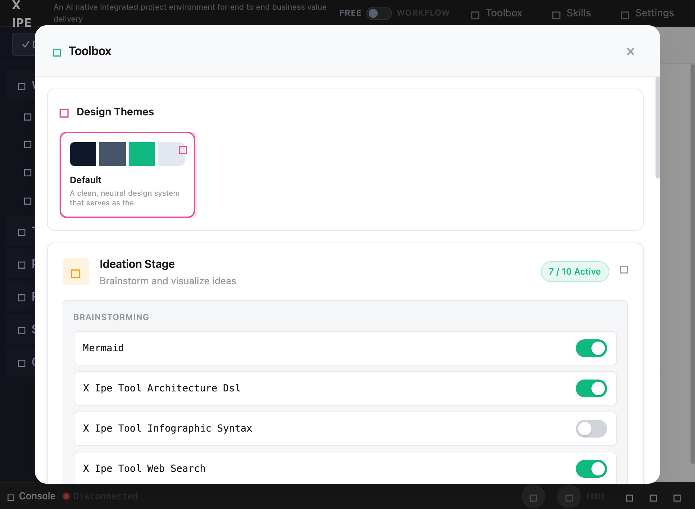

# UI/UX Feedback

**ID:** Feedback-20260309-184047
**URL:** http://127.0.0.1:5858/
**Date:** 2026-03-09 18:43:33

## Selected Elements

- `{'selector': 'div.toolbox-phase:nth-of-type(1)', 'parents': ['div#toolbox-stages-container', 'div.toolbox-accordion.expanded', 'div.toolbox-accordion-content', 'div.toolbox-accordion-body']}`

## Feedback

for code-implementation in feature stage, let's also like brainstoming in ideation stage that, since we have many tool-implementation-* skills, let's having can be enable or disabled in the toolbox config, so when task-based-code-implementation been called, just like ideation skill it can choose the best enabled tools for it's work.

## Screenshot

