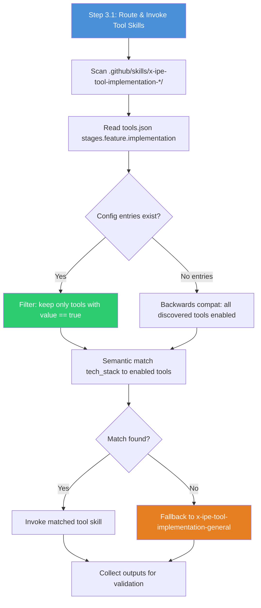
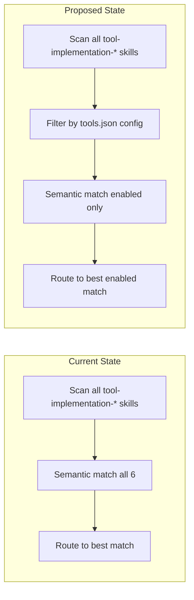

# Idea Summary

> Idea ID: IDEA-035
> Folder: 035. Code-Implementation-Tool-Config
> Version: v1
> Created: 2026-03-10
> Status: Refined

## Overview

Extend the `tools.json` enable/disable configuration pattern (already used by ideation stage) to the feature/implementation stage, so that `tool-implementation-*` skills can be individually enabled or disabled. When `x-ipe-task-based-code-implementation` is invoked, it should only route to **enabled** tool-implementation skills — just like the ideation skill selects from its enabled tools.

## Problem Statement

Currently, `x-ipe-task-based-code-implementation` discovers all `x-ipe-tool-implementation-*` skills by scanning the `.github/skills/` directory at Step 3.1 and routes via semantic matching. There is **no way to control which tool-implementation skills are available** — all 6 are always candidates. This means:

- Users cannot disable tools for stacks they don't use (e.g., Java in a Python-only project)
- No governance over which implementation tools participate in routing
- Inconsistency with ideation stage, which already has fine-grained tool control via `tools.json`

## Target Users

- X-IPE users who work with specific tech stacks and want to limit routing to relevant tools
- Project teams that want consistent, governed tool selection across their workflow

## Proposed Solution

### 1. Config Structure Extension

Add tool entries under `stages.feature.implementation` in `x-ipe-docs/config/tools.json`:

```json
"feature": {
  "design": {
    "_order": 1
  },
  "implementation": {
    "_order": 2,
    "_extra_instruction": "prefer python for CLI tools, html5 for web frontends",
    "x-ipe-tool-implementation-python": true,
    "x-ipe-tool-implementation-html5": true,
    "x-ipe-tool-implementation-java": false,
    "x-ipe-tool-implementation-typescript": true,
    "x-ipe-tool-implementation-mcp": true,
    "x-ipe-tool-implementation-general": true
  }
}
```

### 2. Code-Implementation Skill Update

Modify `x-ipe-task-based-code-implementation` Step 3.1 (Route & Invoke Tool Skills) to:



### 3. Key Rules

| Rule | Description |
|------|-------------|
| **Invisible when disabled** | Disabled tools are not attempted during routing — no error, no warning |
| **General always on** | `x-ipe-tool-implementation-general` stays enabled regardless of config (safety net) |
| **Diagnostic logging** | Log "skipped x-ipe-tool-implementation-{name} (disabled)" for traceability |
| **Undeclared = disabled** | New tool-implementation skills not yet in tools.json default to `false` (explicit opt-in) |
| **Empty config = all enabled** | If no tool entries exist under `implementation`, all discovered tools are enabled (backwards compatible) |
| **`_extra_instruction` support** | Optional field for routing hints (e.g., "prefer python for CLI tools") |
| **Validation** | Enforce `general` is always `true`; warn if user tries to disable it |

## Key Features



**Feature list:**
- **F1: Config entries** — Add tool-implementation-* entries to tools.json `stages.feature.implementation`
- **F2: Config-aware routing** — Update code-implementation Step 3.1 to filter by enabled tools before semantic matching
- **F3: General safety net** — Enforce `general` always enabled, validate at load time
- **F4: Backwards compatibility** — Empty config = all tools enabled (no breaking change)
- **F5: Diagnostic logging** — Log skipped (disabled) tools for traceability
- **F6: Extra instruction support** — Add `_extra_instruction` field for implementation-stage routing hints

## Success Criteria

- [ ] tools.json has `stages.feature.implementation` with entries for all 6 tool-implementation skills
- [ ] code-implementation skill loads and filters tools based on config before routing
- [ ] Disabled tools are never invoked (invisible routing)
- [ ] `x-ipe-tool-implementation-general` cannot be disabled
- [ ] Existing setups without config entries continue to work (all tools enabled)
- [ ] Diagnostic output shows which tools were skipped

## Constraints & Considerations

- **Scope:** Implementation stage only — design stage and other stages are future extensions
- **Migration:** No breaking changes to existing tools.json files
- **Skill creation:** Adding entries for new tool-implementation skills to tools.json is manual (future: auto-add via skill-creator)
- **Interaction mode override:** Not in scope — config is static per project, not overridable per-run

## Brainstorming Notes

**Key insight:** The ideation skill already has a proven pattern at Step 1.1 — load tools.json, filter enabled, build enabled list. Code-implementation's Step 3.1 should adopt the same pattern with minimal adaptation.

**Existing 6 tool-implementation-* skills:**
| Skill | Stack Coverage |
|-------|---------------|
| `x-ipe-tool-implementation-python` | Python, Flask, FastAPI, Django, CLI |
| `x-ipe-tool-implementation-html5` | HTML5, CSS3, vanilla JS, Alpine.js, HTMX |
| `x-ipe-tool-implementation-java` | Spring Boot, Quarkus, Micronaut, Java |
| `x-ipe-tool-implementation-typescript` | TypeScript, React, Vue, Angular, Next.js, NestJS |
| `x-ipe-tool-implementation-mcp` | MCP servers (Python FastMCP, TypeScript SDK) |
| `x-ipe-tool-implementation-general` | Fallback for any unmatched stack |

**Critique feedback addressed:**
- ✅ Discovery vs config flow clarified (scan → filter → match)
- ✅ `_extra_instruction` field added
- ✅ Design stage noted as future extension
- ✅ All-disabled edge case handled (general always on)
- ✅ Backwards compatibility specified (empty = all enabled)
- ✅ Diagnostic logging for skipped tools
- Deferred: auto-add entries on skill creation (manual for now)

## Ideation Artifacts (If Tools Used)

- Mermaid flow diagrams embedded above (routing flow + before/after comparison)
- Source feedback: `x-ipe-docs/uiux-feedback/Feedback-20260309-184047/feedback.md`
- Screenshot: `x-ipe-docs/uiux-feedback/Feedback-20260309-184047/page-screenshot.png`

## Source Files

- `x-ipe-docs/uiux-feedback/Feedback-20260309-184047/feedback.md`
- `x-ipe-docs/uiux-feedback/Feedback-20260309-184047/page-screenshot.png`

## Next Steps

- [ ] Proceed to Change Request — this modifies an existing skill (`x-ipe-task-based-code-implementation`) and config structure

## References & Common Principles

### Applied Principles

- **Ideation Toolbox Pattern:** Established in `x-ipe-task-based-ideation` Step 1.1 — load `tools.json`, filter enabled, build list
- **Explicit Opt-in:** Undeclared tools default to disabled, matching ideation's strict config model
- **Safety Net Fallback:** `general` always stays enabled, similar to ideation's behavior with core tools

### Internal References

- `x-ipe-docs/config/tools.json` — existing config structure
- `.github/skills/x-ipe-task-based-code-implementation/SKILL.md` — skill to be updated
- `.github/skills/x-ipe-task-based-ideation/SKILL.md` — pattern reference (Step 1.1)
