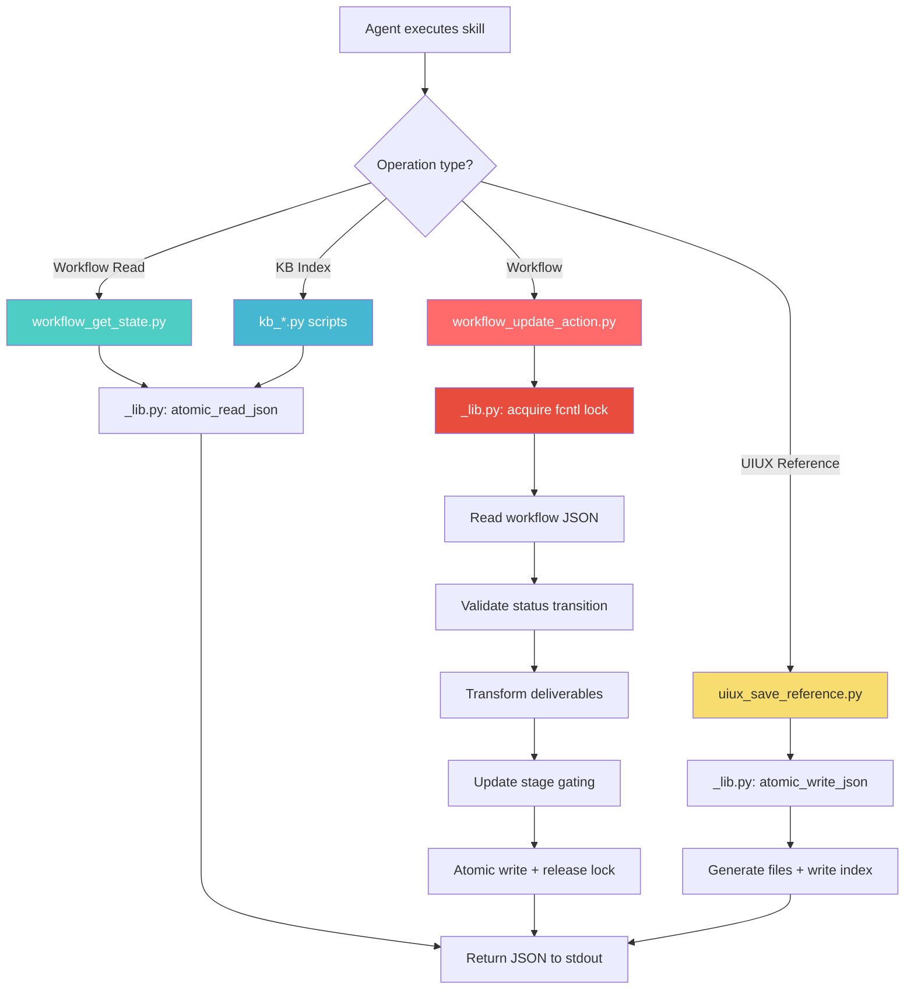
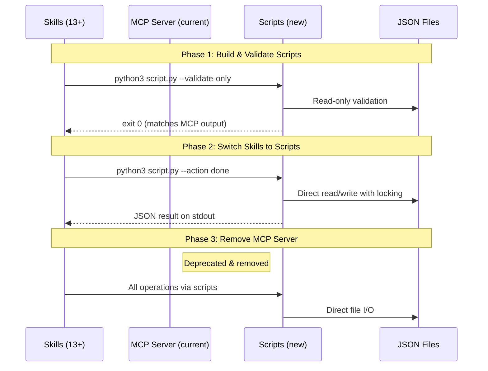

# Idea Summary

> Idea ID: IDEA-036
> Folder: 036. CR-Replace existing mcp function
> Version: v1
> Created: 2026-03-30
> Status: Refined

## Overview

Replace the `x-ipe-app-and-agent-interaction` MCP server (6 tools, FastMCP/stdio → HTTP → Flask → Service → JSON) with a single lightweight skill `x-ipe-tool-x-ipe-app-interactor` containing standalone Python scripts that directly read/write JSON files — eliminating the MCP protocol overhead, Flask backend dependency, and HTTP round-trip for agent-to-application interactions.

## Problem Statement

The current `x-ipe-app-and-agent-interaction` MCP server introduces unnecessary architectural weight for what are fundamentally JSON file operations:

1. **Heavy dependency chain**: Agent → MCP stdio transport → FastMCP server → HTTP POST → Flask API route → Service layer → JSON file I/O. That's 6 layers for updating a JSON property.
2. **Server dependency**: All 6 tools require the X-IPE Flask backend to be running. If the server is down, skills cannot update workflow state, manage KB metadata, or save UIUX references — even though the underlying data is just JSON files on disk.
3. **Startup & latency overhead**: MCP server initialization, HTTP connection establishment, and JSON serialization/deserialization at each boundary add latency to every tool call.
4. **Debugging complexity**: Errors must be traced through MCP protocol → HTTP layer → Flask routing → service logic — making diagnosis difficult compared to a simple script with a clear exit code.
5. **Proven lighter-weight pattern exists**: The `x-ipe-tool-architecture-dsl` skill already demonstrates that skill-level scripts (`lint_dsl.py`) can perform complex validation via `python3 script.py <args>` with zero external dependencies.

## Target Users

- **AI Agents (CLI-based)**: 13+ task-based skills that call `update_workflow_action` on every task completion, plus `x-ipe-tool-uiux-reference` and `x-ipe-tool-kb-librarian`
- **X-IPE Developers**: Simpler architecture to maintain — scripts are self-contained, testable, and debuggable
- **Offline/Headless Workflows**: Agents can update workflow state and KB metadata without the Flask backend running

## Proposed Solution

Create a new skill **`x-ipe-tool-x-ipe-app-interactor`** with a `scripts/` folder containing standalone Python scripts that replicate the business logic currently in the MCP server + Flask backend services.

### Architecture Comparison

**Before (MCP-heavy):**
```
Agent ──MCP stdio──▶ FastMCP Server ──HTTP──▶ Flask API ──▶ Service Layer ──▶ JSON file
                     (app_agent_interaction.py)          (workflow_routes.py) (workflow_manager_service.py)
```

**After (Script-light):**
```
Agent ──subprocess──▶ python3 script.py <args> ──▶ JSON file
                      (direct file I/O with fcntl locking)
```

### Script Inventory (6 scripts replacing 6 MCP tools)

| MCP Tool | Replacement Script | Complexity | Used By |
|----------|-------------------|------------|---------|
| `update_workflow_action` | `workflow_update_action.py` | High | 13 task-based skills |
| `get_workflow_state` | `workflow_get_state.py` | Low | 1 skill (workflow-task-execution) |
| `save_uiux_reference` | `uiux_save_reference.py` | High | 1 skill (uiux-reference) |
| `get_kb_index` | `kb_get_index.py` | Low | 1 skill (kb-librarian) |
| `set_kb_index_entry` | `kb_set_entry.py` | Low | 1 skill (kb-librarian) |
| `remove_kb_index_entry` | `kb_remove_entry.py` | Low | 1 skill (kb-librarian) |

### Shared Utility Module

A `_lib.py` utility module provides common patterns:

```python
# .github/skills/x-ipe-tool-x-ipe-app-interactor/scripts/_lib.py
- atomic_read_json(path)       # JSON read with corruption fallback
- atomic_write_json(path, data) # Temp file + os.fsync + os.replace
- with_file_lock(path, fn)     # fcntl.flock exclusive locking
- resolve_project_root()        # Find project root from .git or .x-ipe.yaml
- resolve_workflow_dir()        # Locate x-ipe-docs/engineering-workflow/
- resolve_kb_root()             # Locate x-ipe-docs/knowledge-base/
- output_result(data, format)   # JSON or text stdout output
- exit_with_error(code, msg)    # Structured error exit
```

### CLI Interface Pattern (following lint_dsl.py model)

Each script follows a consistent pattern:

```bash
# Workflow operations
python3 .github/skills/x-ipe-tool-x-ipe-app-interactor/scripts/workflow_update_action.py \
  --workflow "Knowledge-Base-Implementation" \
  --action "implementation" \
  --status "done" \
  --feature-id "FEATURE-049-A" \
  --deliverables '{"impl-code": "src/module.py"}' \
  --format json

python3 .github/skills/x-ipe-tool-x-ipe-app-interactor/scripts/workflow_get_state.py \
  --workflow "Knowledge-Base-Implementation" \
  --format json

# KB operations
python3 .github/skills/x-ipe-tool-x-ipe-app-interactor/scripts/kb_set_entry.py \
  --folder "guides" \
  --name "setup.md" \
  --entry '{"title": "Setup Guide", "type": "markdown", "tags": {"domain": ["setup"]}}' \
  --format json

# UIUX reference
python3 .github/skills/x-ipe-tool-x-ipe-app-interactor/scripts/uiux_save_reference.py \
  --data-file /tmp/uiux-data.json \
  --format json
```

**Exit codes:** `0` = success, `1` = validation error, `2` = file not found, `3` = lock timeout

## Key Features



### Critical Business Logic to Preserve

The scripts must replicate these exact behaviors from the current service layer:

1. **Atomic writes**: `tempfile.mkstemp()` → write → `os.fsync()` → `os.replace()` — crash-safe persistence
2. **File locking**: `fcntl.flock(LOCK_EX)` on `.lock` file — prevents concurrent write corruption
3. **Schema versioning**: Detect keyed dict → `3.0`, array values → `4.0`, upward-only migration
4. **Deliverable format**: Accept both legacy list and keyed dict; auto-convert list → dict via template tags
5. **Stage gating**: When action completes, evaluate if next stage/actions should unlock
6. **Feature breakdown**: `feature_breakdown` + `status=done` + `features` list → populate per-feature lane structures
7. **KB index normalization**: Auto-detect flat vs canonical `.kb-index.json` format on read
8. **UIUX pipeline**: Base64 decode screenshots → merge/enrich elements → generate HTML/CSS/MD files → write mimic-strategy.md

### Migration Strategy



**Phase 1 — Build & Validate** (no breaking changes):
- Implement all 6 scripts in `x-ipe-tool-x-ipe-app-interactor/scripts/`
- Add `--validate-only` flag that reads state and validates without writing
- Compare script output vs MCP output for identical inputs → ensure parity
- Unit tests for each script covering edge cases (corruption, missing files, concurrent access)

**Phase 2 — Switch Skills** (update 15 skills):
- Update all 13 task-based skills + 2 tool skills to call scripts instead of MCP tools
- Skills replace `call update_workflow_action MCP tool` with `python3 workflow_update_action.py`
- MCP server remains available as fallback during transition

**Phase 3 — Remove MCP Server** (clean break):
- Remove `x-ipe-app-and-agent-interaction` MCP server (`src/x_ipe/mcp/app_agent_interaction.py`)
- Remove `x-ipe-mcp` entry point from `pyproject.toml`
- Flask API routes remain (they serve the web UI, not just MCP)
- Update documentation

## Success Criteria

- [ ] All 6 MCP tool behaviors are exactly replicated in standalone scripts
- [ ] Scripts work without Flask backend running (direct JSON file I/O)
- [ ] Atomic write + fcntl locking preserves data integrity under concurrent access
- [ ] All 15 consuming skills successfully updated to use scripts
- [ ] Zero regression in workflow state management (stage gating, deliverables, features)
- [ ] Script execution is measurably faster than MCP→HTTP→Flask chain
- [ ] `--format json` output is parseable and matches current MCP tool response structure
- [ ] UIUX reference pipeline generates identical output files (HTML, CSS, MD)
- [ ] KB index operations preserve format normalization (flat → canonical)

## Constraints & Considerations

- **Platform dependency**: `fcntl.flock()` is Unix/macOS only — if Windows support is ever needed, must add `msvcrt` fallback
- **No external dependencies**: Scripts must use only Python standard library (json, os, tempfile, fcntl, argparse, pathlib) — no pip installs required
- **Backward compatibility**: During Phase 2, both MCP and scripts must be able to coexist reading/writing the same JSON files
- **UIUX complexity**: `save_uiux_reference` is the most complex script (~400-500 lines) due to the multi-file generation pipeline (screenshot decoding, element enrichment, markdown generation, mimic strategy)
- **Template dependency**: `workflow_update_action.py` needs access to `workflow-template.json` for deliverable tag resolution and feature structure initialization
- **Lock file cleanup**: Scripts must handle stale `.lock` files from crashed processes (timeout-based fallback)

## Brainstorming Notes

### Key Insight: MCP is Overkill for File Operations

The web research confirms industry consensus: **"Prototype with scripts, productize with MCP."** In X-IPE's case, the MCP server was the right initial choice for standardization, but the tools turned out to be thin HTTP proxies to file operations — the exact scenario where lightweight scripts excel. MCP's strengths (dynamic tool discovery, session state, cross-agent reuse) aren't needed here because:
- Tools are invoked from skill instructions (statically known, not discovered)
- No session state across calls (each call is independent)
- All consumers are X-IPE's own skills (no cross-project reuse)

### Reference Pattern: lint_dsl.py

The existing `x-ipe-tool-architecture-dsl/scripts/lint_dsl.py` (481 lines) proves the pattern works:
- Clean argparse CLI with `--format json` for machine-readable output
- Exit codes for success/failure
- No external dependencies
- Invoked from SKILL.md as: `python3 .github/skills/.../scripts/lint_dsl.py {file} --format json`
- Agents parse stdout JSON and act on results

### Complexity Tiers

| Tier | Scripts | Lines (est.) | Risk |
|------|---------|-------------|------|
| **Simple** | `workflow_get_state.py`, `kb_get_index.py`, `kb_set_entry.py`, `kb_remove_entry.py` | 50-100 each | Low |
| **Medium** | `workflow_update_action.py` | 300-400 | Medium — stage gating + deliverable validation logic |
| **Complex** | `uiux_save_reference.py` | 400-500 | High — multi-file generation pipeline |

### Shared _lib.py Reduces Duplication

Common patterns (atomic I/O, locking, path resolution, output formatting) are factored into `_lib.py` (~150 lines), keeping individual scripts focused on their business logic. This follows DRY while keeping each script independently invocable.

## Source Files

- `x-ipe-docs/ideas/036. CR-Replace existing mcp function/new idea.md`

## Next Steps

- [ ] Proceed to Requirement Gathering → Feature Breakdown → Implementation

## References & Common Principles

### Applied Principles

- **KISS (Keep It Simple, Stupid)**: Direct file I/O instead of 6-layer indirection — [Martin Fowler](https://martinfowler.com/bliki/Yagni.html)
- **YAGNI (You Aren't Gonna Need It)**: MCP protocol features (discovery, session state, streaming) unused by these tools — remove the abstraction
- **DRY (Don't Repeat Yourself)**: Shared `_lib.py` utility module for atomic I/O, locking, path resolution across all 6 scripts
- **Crash-Safe JSON at Scale**: Atomic writes with temp file + fsync + rename pattern — [DEV Community](https://dev.to/constanta/crash-safe-json-at-scale-atomic-writes-recovery-without-a-db-3aic)
- **Prototype with Scripts, Productize with MCP**: Industry best practice 2025/2026 — in X-IPE's case, the "production" use case turned out to be simpler than expected, making scripts the right permanent choice — [Anthropic Engineering](https://www.anthropic.com/engineering/code-execution-with-mcp)

### Further Reading

- [Anthropic: Code execution with MCP](https://www.anthropic.com/engineering/code-execution-with-mcp) — When MCP adds value vs. when direct execution is better
- [IBM: MCP Architecture Patterns](https://developer.ibm.com/articles/mcp-architecture-patterns-ai-systems/) — Multi-agent MCP patterns (validates that X-IPE's use case doesn't need them)
- [Python docs: fcntl](https://docs.python.org/3/library/fcntl.html) — File locking for concurrent access safety
- [atomicwrites](https://python-atomicwrites.readthedocs.io/en/latest/) — Reference for atomic file write patterns (we implement manually to avoid dependencies)
