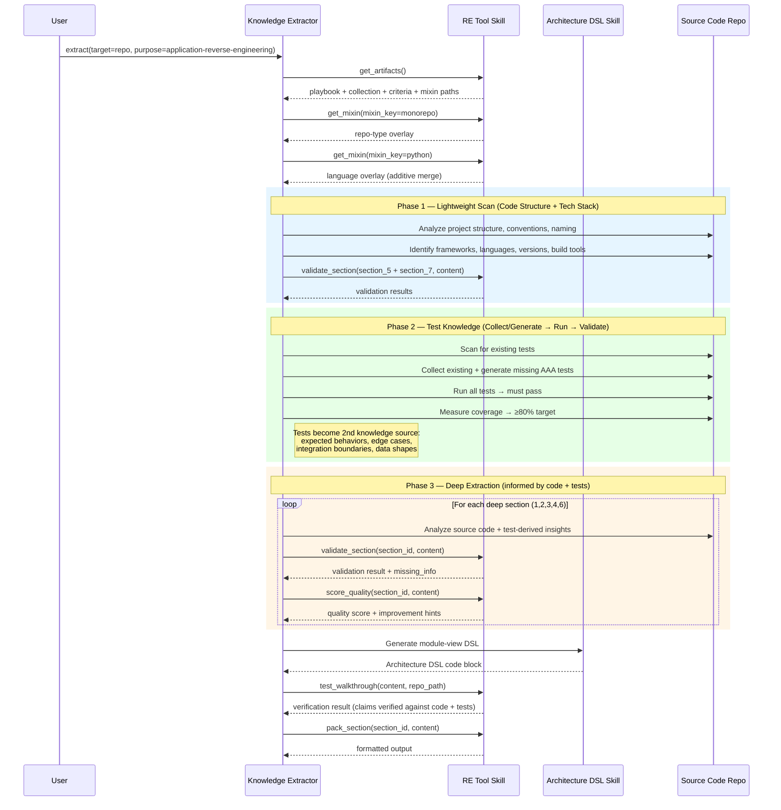
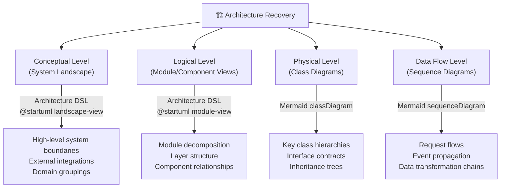
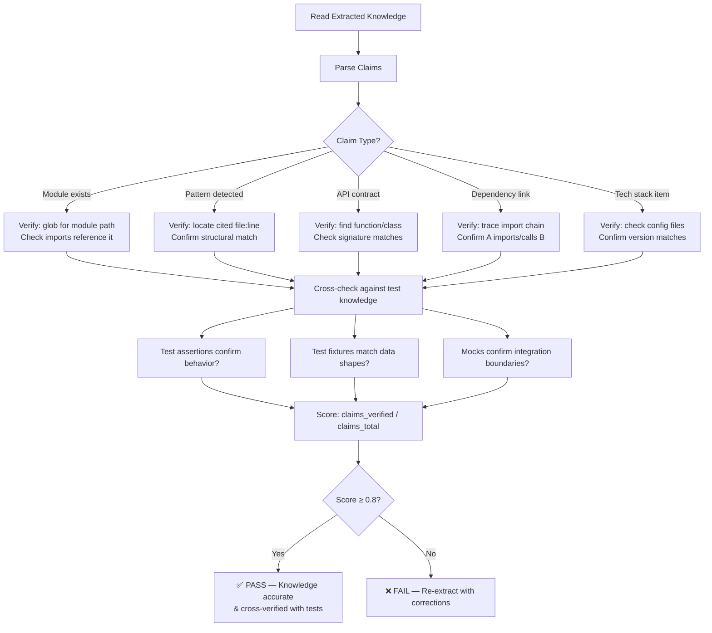
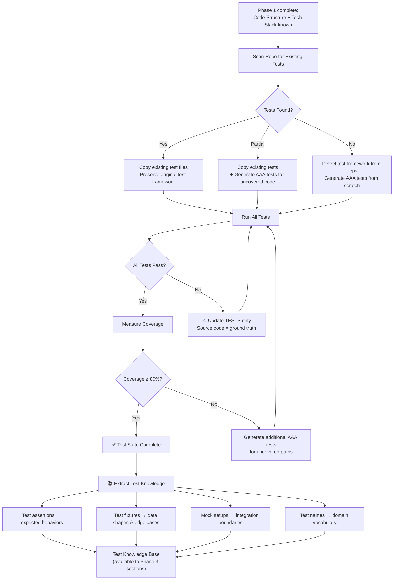

# Idea Summary

> Idea ID: IDEA-037
> Folder: 037. Feature-Application Reverse Engineering
> Version: v1.1
> Created: 2026-03-31
> Updated: 2026-03-31
> Status: Refined

## Overview

Create a new X-IPE tool skill `x-ipe-tool-knowledge-extraction-application-reverse-engineering` that enables the Application Knowledge Extractor to reverse-engineer source code repositories. The skill provides playbook templates, collection prompts, validation criteria, and platform-specific mixins — mirroring the existing `x-ipe-tool-knowledge-extraction-user-manual` pattern but focused on extracting architectural knowledge from code.

## Problem Statement

When developers inherit, maintain, or migrate codebases, they face a common challenge: **the code has no documentation, or the documentation is outdated**. Understanding a codebase's architecture, design patterns, API surface, and technology stack requires significant manual effort — reading code, tracing dependencies, reverse-engineering data flows.

Currently, the X-IPE Knowledge Extractor only supports `user-manual` extraction. There is no automated way to reverse-engineer a codebase and produce structured architectural knowledge. This skill fills that gap by guiding the extractor through a systematic reverse engineering process.

## Target Users

- **Developers inheriting codebases** — need to understand architecture quickly
- **Tech leads onboarding to new projects** — need dependency maps and pattern inventories
- **Migration/modernization teams** — need comprehensive architecture views before refactoring
- **Documentation teams** — need to produce architecture docs from undocumented code

## Proposed Solution

A tool skill that plugs into the existing Knowledge Extractor pipeline, providing:

1. **8-section playbook** covering all major reverse engineering areas
2. **Collection templates** with source-code-specific extraction prompts
3. **Multi-level architecture output** using Architecture DSL + Mermaid
4. **Two-dimension mixin system** (repo-type × language-type) for platform-specific analysis
5. **Accuracy-focused quality scoring** with evidence-backed validation
6. **Verification walkthrough** that validates extracted knowledge against actual code

### How It Fits — Extractor Integration



## Key Features

### 1. Eight-Section Playbook (Phased Extraction)

The playbook defines the complete reverse engineering extraction scope, executed in **three phases**. Phase 2 tests become a **second knowledge source** that informs all Phase 3 deep-extraction sections.

| Phase | # | Section | Output Type | Visualization Tool | Description |
|-------|---|---------|-------------|-------------------|-------------|
| **1 — Scan** | 5 | Code Structure Analysis | Inline | Markdown tables | Project layout, conventions, naming patterns |
| **1 — Scan** | 7 | Technology Stack Identification | Inline | Markdown tables | Frameworks, languages, versions, build tools |
| **2 — Tests** | 8 | Source Code Tests | **Subfolder** | Executable test files | Collect/generate AAA-structured tests → run → validate → ≥80% coverage; becomes knowledge source for Phase 3 |
| **3 — Deep** | 1 | Architecture Recovery | **Subfolder** | Architecture DSL | Multi-level architecture: conceptual (landscape), logical (module), physical (class) |
| **3 — Deep** | 2 | Design Pattern Detection | **Subfolder** | Mermaid | Pattern inventory with confidence scoring and evidence citations |
| **3 — Deep** | 3 | API Contract Extraction | **Subfolder** | Mermaid | Internal/external interface documentation — per-API-group files |
| **3 — Deep** | 4 | Dependency Analysis | **Subfolder** | Mermaid + Architecture DSL | Inter-module + external library dependency maps — per-module files |
| **3 — Deep** | 6 | Data Flow / Protocol Analysis | **Subfolder** | Mermaid | Component communication patterns and sequence flows |

**Extraction Order Rationale:**
- **Phase 1** gathers structural context (directory layout, tech stack) needed to select mixins and frame deeper analysis
- **Phase 2** collects or generates runnable **AAA tests** (Arrange/Act/Assert), runs them, and validates ≥80% coverage. Test insights — expected behaviors, edge cases, integration boundaries, data shapes — become a **second knowledge source** alongside source code
- **Phase 3** performs deep extraction with **two knowledge inputs**: source code + test-derived insights. For example, test assertions reveal that "module A calls B with payload X" — informing Dependency Analysis without guessing from imports alone

### 2. Multi-Level Architecture Output

Architecture is classified into levels, each using the best-fit visualization tool:



### 3. Two-Dimension Mixin System

Mixins are auto-detected from project files and applied in layers:

**Repo-Type Mixins** (primary — detected from project structure):
| Mixin | Detection Signals | Additional Prompts |
|-------|------------------|--------------------|
| `monorepo` | `lerna.json`, `pnpm-workspace.yaml`, `nx.json`, multiple `package.json` | Cross-package dependency analysis, shared module identification |
| `multi-module` | `pom.xml` with modules, `settings.gradle`, workspace `Cargo.toml` | Module boundary analysis, inter-module API contracts |
| `single-module` | Single `package.json`, single `pyproject.toml` | Internal layering, package structure |
| `microservices` | `docker-compose.yml`, multiple Dockerfiles, k8s manifests | Service boundary analysis, inter-service communication |

**Language-Type Mixins** (additive overlay — detected from file extensions):
| Mixin | Detection Signals | Additional Prompts |
|-------|------------------|--------------------|
| `python` | `*.py`, `pyproject.toml`, `requirements.txt` | Module/package patterns, decorator usage, metaclass patterns |
| `java` | `*.java`, `pom.xml`, `build.gradle` | Spring patterns, annotation-driven config, interface hierarchies |
| `javascript` | `*.js`, `*.jsx`, `package.json` | Module system (CJS/ESM), React patterns, event-driven patterns |
| `typescript` | `*.ts`, `*.tsx`, `tsconfig.json` | Type hierarchy analysis, generic patterns, decorator metadata |
| `go` | `*.go`, `go.mod` | Interface satisfaction, goroutine patterns, package layout |

### 4. Accuracy-Focused Quality Scoring

Six quality dimensions (adapted from user-manual, replacing followability with accuracy, adding coverage):

| Dimension | Weight (Arch/Patterns/DataFlow) | Weight (Tests Section) | Weight (Other Sections) | Description |
|-----------|-------------------------------|----------------------|------------------------|-------------|
| **Completeness** | 0.20 | 0.10 | 0.30 | Ratio of required criteria satisfied |
| **Structure** | 0.10 | 0.05 | 0.20 | Proper heading hierarchy, diagrams, tables |
| **Clarity** | 0.15 | 0.10 | 0.20 | Clear explanations, concrete examples |
| **Accuracy** | 0.35 | 0.15 | 0.15 | Evidence-backed claims, verified against code |
| **Freshness** | 0.10 | 0.10 | 0.10 | References current versions, no stale info |
| **Coverage** | 0.10 | 0.50 | 0.05 | Test coverage ratio — ≥80% target for tests section; code-evidence breadth for other sections |

Key differences from user-manual:
- **Accuracy** is weighted highest for architectural sections because extracted architecture MUST match the actual code.
- **Coverage** is weighted highest (0.50) for the Source Code Tests section — the primary purpose of that section is achieving ≥80% test coverage. For other sections, coverage measures how broadly the extraction covers the codebase (e.g., % of modules with architecture diagrams).

### 5. Evidence-Based Pattern Detection

Every detected pattern includes a confidence assessment:

| Confidence | Criteria | Example |
|-----------|----------|---------|
| 🟢 **High** | Pattern explicitly implemented, matches canonical form | `SingletonMeta.__call__` in `src/config.py:15` |
| 🟡 **Medium** | Pattern partially matches, may be variant | Factory-like creation in `src/builders.py:42` but no abstract factory interface |
| 🔴 **Low** | Structural similarity but uncertain intent | `__init__.py` re-exports suggest Facade but may be convenience only |

### 6. Verification Walkthrough (test_walkthrough)

Validates extracted knowledge against actual codebase. **Because tests were already collected and validated in Phase 2, the walkthrough has two verification sources available: source code AND test-derived knowledge.**



**Key difference from v1**: Tests are no longer "learned from" during walkthrough — they were already collected, validated, and used as a knowledge source in Phase 2. The walkthrough now **cross-checks** extracted claims against both source code and the existing test knowledge base.

### 7. Source Code Tests — Phase 2 Knowledge Source (Section 8)

Executable test suite that serves **dual purposes**: (1) validates understanding of the codebase through runnable tests, and (2) **produces a knowledge base** that informs all subsequent Phase 3 extraction sections.

**This section executes in Phase 2** — before Architecture Recovery, Pattern Detection, API Contracts, Dependencies, and Data Flow. Test-derived knowledge feeds into those deep sections.



**Key Rules:**
- **Source code is ground truth** — NEVER modify source code to make tests pass. If a test fails, the test is wrong or misunderstands the code.
- **AAA structure mandatory** — All collected or generated tests must follow **Arrange/Act/Assert** structure. This makes tests self-documenting knowledge artifacts: Arrange reveals preconditions, Act reveals the operation, Assert reveals expected behavior.
- **Framework matching** — Detect the project's test framework (pytest, vitest, jest, JUnit, go test, etc.) from `package.json`, `pyproject.toml`, `pom.xml`, or existing test files. Generated tests MUST use the same framework.
- **Copy-first strategy** — Prefer copying existing tests over generating new ones. Existing tests encode the original developer's intent and edge case knowledge.
- **Coverage target** — ≥80% line coverage measured by the project's native coverage tool (coverage.py, c8/istanbul, jacoco, etc.)
- **Test-as-Knowledge** — Tests are a form of executable knowledge. They document expected behavior, edge cases, error handling, and integration contracts. After validation, test insights are extracted and made available as a **second knowledge source** for Phase 3 deep-extraction sections.
- **Runnable requirement** — Tests must execute successfully in the target project's environment. Non-runnable tests provide no knowledge value.

**Knowledge Extracted from Tests (feeds Phase 3):**

| Knowledge Type | Source in Tests | Informs Phase 3 Section |
|---------------|----------------|------------------------|
| Expected behaviors | Assertions (`assertEqual`, `expect().toBe()`) | Architecture (module responsibilities), API Contracts |
| Data shapes & edge cases | Fixtures, test data, parametrized inputs | Data Flow, API Contracts |
| Integration boundaries | Mock/stub setups, dependency injection | Dependency Analysis, Architecture |
| Domain vocabulary | Test names, describe blocks | All sections (naming alignment) |
| Error handling contracts | Exception assertions, error code checks | API Contracts, Data Flow |
| Concurrency assumptions | Async test patterns, race condition tests | Data Flow, Architecture |

**Output Structure (subfolder):**
```
section-08-source-code-tests/
├── _index.md              # Test suite overview, framework, coverage report
├── screenshots/           # Coverage report screenshots
├── tests/                 # Executable test files (copied or generated)
│   ├── test_module_a.py   # Matches original naming convention
│   ├── test_module_b.py
│   └── ...
└── coverage-report.md     # Coverage summary with per-module breakdown
```

### 8. Minimum Complexity Gate

Before running full reverse engineering, check if the codebase is complex enough to warrant it:

| Metric | Threshold | Below Threshold |
|--------|-----------|-----------------|
| Total files | ≥ 10 source files | Skip — too small for RE |
| Total LOC | ≥ 500 lines | Skip — readable without RE |
| Directories | ≥ 3 source directories | Skip — flat structure needs no architecture recovery |
| Entry points | ≥ 2 entry points | Optional — single-entry may still benefit from pattern analysis |

## Success Criteria

- [ ] Skill follows same 7-operation contract as `x-ipe-tool-knowledge-extraction-user-manual`
- [ ] Extractor discovers skill via glob pattern and `categories: ["application-reverse-engineering"]`
- [ ] All 8 playbook sections have collection templates with source-code-specific extraction prompts
- [ ] **Phased extraction order** is enforced: Phase 1 (Scan: sections 5, 7) → Phase 2 (Tests: section 8) → Phase 3 (Deep: sections 1, 2, 3, 4, 6)
- [ ] Phase 2 tests are AAA-structured (Arrange/Act/Assert), runnable, and all pass before Phase 3 begins
- [ ] Phase 2 test knowledge (behaviors, data shapes, boundaries, vocabulary) is made available to Phase 3 sections as a second knowledge source
- [ ] Multi-level architecture output produces valid Architecture DSL and Mermaid diagrams
- [ ] Two-dimension mixin system auto-detects repo-type and language-type
- [ ] Quality scoring uses 6 dimensions with accuracy weighted highest for architectural sections and coverage weighted highest for tests section
- [ ] test_walkthrough cross-verifies ≥80% of extracted claims against source code AND test knowledge
- [ ] Source Code Tests section achieves ≥80% coverage with all tests passing
- [ ] Tests match original project's test framework; source code is never modified to fix failing tests
- [ ] Skill has >80% unit test coverage with AAA-structured, runnable tests
- [ ] Pattern detection includes confidence levels (high/medium/low) with file:line evidence

## Constraints & Considerations

- **Extractor update required**: The Knowledge Extractor currently only supports `purpose: "user-manual"` (v1 blocking rule). A dependency task must update the extractor to accept `application-reverse-engineering` as a valid category.
- **Source-code only**: No binary analysis, decompilation, or disassembly. Requires readable source code.
- **Architecture DSL delegation**: This skill produces textual architecture knowledge; diagram rendering is delegated to `x-ipe-tool-architecture-dsl` to avoid duplicating DSL grammar.
- **No PlantUML**: Physical-level class diagrams use Mermaid `classDiagram` (not PlantUML) to stay within configured tools.
- **Mixin composition**: Repo-type mixin is primary; language-type is additive overlay. Merged sequentially, not combinatorially.
- **Pattern detection uncertainty**: Design pattern detection is inherently imprecise. Confidence scoring with evidence citations mitigates false positives.
- **Source code is ground truth**: When collecting or generating tests, if a test fails, the TEST must be updated — NEVER the source code. The source code being reverse-engineered is assumed to be the authoritative truth.
- **Minimum complexity**: Codebases below threshold (< 10 files, < 500 LOC) skip full RE.

## Brainstorming Notes

### Key Insights from Brainstorming

1. **Source-code-only scope** aligns perfectly with X-IPE agent workflow (reading repos/files)
2. **All 8 extraction areas** included for comprehensive coverage; 5 complex sections (Architecture, Patterns, Data Flow, API Contracts, Dependencies) use subfolder output, plus Source Code Tests as executable subfolder
3. **Multi-level architecture** (conceptual → logical → physical → data flow) was user-driven; each level uses best-fit tool
4. **Mixin auto-detection** preferred over manual specification — detects from `package.json`, `pom.xml`, file extensions, etc.
5. **Accuracy replaces followability** — RE output is analytical, not instructional
6. **Phased extraction order** (v1.1): Phase 1 (Code Structure + Tech Stack) → Phase 2 (Tests as knowledge source) → Phase 3 (Deep extraction informed by code + tests). Tests move from late-stage verification to early-stage knowledge generation.
7. **AAA test structure mandatory** (v1.1): Arrange/Act/Assert makes tests self-documenting — Arrange reveals preconditions, Act reveals operation, Assert reveals expected behavior. This structure maximizes knowledge extraction value.
8. **Tests as dual-purpose artifacts** (v1.1): Tests validate code AND serve as a knowledge source. Test assertions reveal behaviors, fixtures reveal data shapes, mocks reveal integration boundaries — all feeding Phase 3 deep extraction.
9. **Source code = ground truth** — failing tests are fixed by updating tests, never source code
10. **Verification walkthrough cross-checks** against both source code and test knowledge (v1.1)

### Critique Integration

The sub-agent critique surfaced 9 improvements. All were addressed:
- ✅ Extractor v1 blocking rule → documented as constraint + dependency task
- ✅ Mixin interface → layered approach (repo-type primary, language overlay additive)
- ✅ PlantUML → replaced with Mermaid classDiagram
- ✅ Unit test scope → clarified: tests for skill itself AND Section 8 provides executable tests for target app understanding
- ✅ 6th quality dimension → coverage added as standalone dimension (highest weight for tests section)
- ✅ Source Code Tests → added as Section 8 with executable test suite, framework matching, and ground-truth constraint
- ✅ File naming → explicit per section
- ✅ Confidence scoring → high/medium/low with evidence
- ✅ Architecture DSL delegation → delegate to existing skill
- ✅ Collection template prompts → included examples in playbook section
- ✅ API/Deps subfolder → promoted to subfolder output (per user decision)

### v1.1 Changes (Phased Extraction + Tests as Knowledge Source)

User feedback: Tests should be collected/generated early and used as a knowledge source for deep extraction, not just as late-stage verification.

Changes applied:
- ✅ **Phased extraction order**: Phase 1 (lightweight scan) → Phase 2 (tests) → Phase 3 (deep extraction)
- ✅ **Tests move to Phase 2**: Executed after Code Structure + Tech Stack, before all deep sections
- ✅ **AAA structure mandatory**: All tests must follow Arrange/Act/Assert for maximum knowledge value
- ✅ **Runnable requirement**: Tests must execute and pass — non-runnable tests provide no knowledge value
- ✅ **Test knowledge feeds Phase 3**: Expected behaviors, data shapes, integration boundaries, domain vocabulary extracted from tests and available to Architecture Recovery, Pattern Detection, API Contracts, Dependency Analysis, Data Flow
- ✅ **Verification walkthrough simplified**: No longer "learns from tests" (Phase 2 already did that); now cross-checks extracted claims against both code and test knowledge
- ✅ **Knowledge-type mapping table**: Documents exactly which test knowledge types inform which Phase 3 sections
- ✅ **Sequence diagram updated**: Shows 3-phase flow with test knowledge as second input to Phase 3
- ✅ **Success criteria expanded**: 3 new criteria for phased order, AAA structure, and test-as-knowledge-source

## Ideation Artifacts

- Extractor integration flow: Mermaid sequence diagram (embedded above)
- Architecture levels: Mermaid flowchart (embedded above)
- Verification walkthrough: Mermaid flowchart (embedded above)

## Source Files

- [new idea.md](x-ipe-docs/ideas/037. Feature-Application Reverse Engineering/new idea.md)

## Next Steps

- [ ] **Dependency**: Update `x-ipe-task-based-application-knowledge-extractor` to support `application-reverse-engineering` category
- [ ] Proceed to **Requirement Gathering** to formalize requirements
- [ ] Create skill structure with templates, mixins, and test cases

## References & Common Principles

### Applied Principles

- **Architecture Recovery**: Reconstruct module/component/layer diagrams from code — systematic abstraction from implementation to design level
- **Static Analysis**: Examine source code structure, dependencies, and patterns without execution
- **Design Pattern Cataloging**: Identify GoF and domain-specific patterns with confidence scoring and evidence citation
- **Multi-Level Architecture Documentation**: Conceptual (business context), Logical (modules/components), Physical (classes/interfaces) — [4+1 View Model](https://en.wikipedia.org/wiki/4%2B1_architectural_view_model)

### Further Reading

- [Reverse Engineering - GeeksforGeeks](https://www.geeksforgeeks.org/software-engineering/software-engineering-reverse-engineering/) — Overview of RE process and methodologies
- [Architecture Recovery Best Practices - Swimm](https://swimm.io/learn/mainframe-modernization/reverse-engineering-in-software-engineering-process-and-best-practices) — Process and best practices for software RE
- [Reverse Engineering Tools and Techniques - EPAM](https://solutionshub.epam.com/blog/post/what-is-reverse-engineering-in-software-engineering) — Tools and techniques overview
