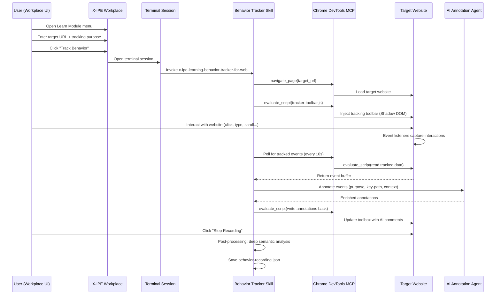
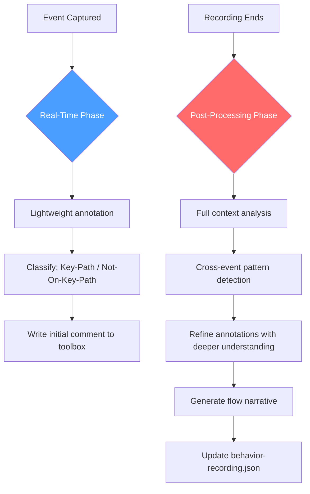

# Idea Summary

> Idea ID: IDEA-038
> Folder: 038. Feature-Learn module
> Version: v1
> Created: 2026-04-02
> Status: Refined

## Overview

A **Learning Module** within X-IPE's Workplace ideation area that enables users to track and record their behavior on external websites, with AI-assisted real-time annotation. The module captures user interaction events (clicks, drags, typing, scrolling, right-clicks), enriches them with element metadata and accessibility information, and produces structured behavior recordings that feed into X-IPE's downstream pipeline for AI agent training and knowledge capture.

## Problem Statement

When building AI-assisted workflows or training AI agents to operate web applications, there is no structured way to capture *how* a human navigates and interacts with a website. Existing session recording tools (Hotjar, FullStory, LogRocket) focus on UX analytics — heatmaps, funnels, replay videos — rather than producing machine-readable, semantically annotated interaction data that AI agents can learn from.

X-IPE needs a way to:
1. **Observe** human behavior on any external website
2. **Annotate** each interaction with AI-generated context (purpose, relevance, key-path status)
3. **Export** structured behavior data as evidence for requirement gathering or as automation patterns for code implementation

## Target Users

- **X-IPE workflow designers** who want to capture domain expert behavior as input for building automated workflows
- **AI agent trainers** who need structured interaction data to teach agents how to navigate web applications
- **Product teams** using X-IPE to document existing application workflows before redesign or automation

## Proposed Solution

A new **standalone skill** (`x-ipe-learning-behavior-tracker-for-web`) that leverages Chrome DevTools MCP for script injection — sharing the injection infrastructure with the existing UIUX reference skill (DRY) but maintaining a separate data model and output format.

### High-Level Flow



## Key Features

### 1. Workplace GUI Entry Point
- New **"Learn"** menu item under Workplace ideation
- **Target URL input** — user enters the website to track
- **Tracking Purpose** — freeform text box with placeholder examples (e.g., "Learn checkout flow", "Map navigation patterns"). AI uses this as the primary goal context for annotation

### 2. Chrome DevTools Script Injection
- Reuse `navigate_page` + `evaluate_script` infrastructure from UIUX reference skill
- Inject `tracker-toolbar.js` as IIFE via `evaluate_script` (bypasses CSP)
- Guard against double injection: `window.__xipeBehaviorTrackerInjected`
- **Shadow DOM isolation** for injected toolbox to prevent CSS conflicts with target site

### 3. Event Recording Engine
Captures the following user interaction types:

| Event Type | Listener | Data Captured |
|---|---|---|
| Click | `click` (capture phase) | x, y, target selector, element text, a11y role/name |
| Double Click | `dblclick` | Same as click + double-click flag |
| Right Click | `contextmenu` | x, y, target selector, context menu trigger |
| Drag | `mousedown` → `mousemove` → `mouseup` | Start/end positions, delta, duration, target |
| Typing | `input` event | Field selector, masked value (PII protection), field type |
| Scrolling | `scroll` (throttled 200ms) | scrollX, scrollY, viewport dimensions |
| Navigation | `beforeunload` + page monitor | Source URL, destination URL, trigger element |

### 4. Cross-Page Persistence
- **Primary**: DevTools page lifecycle monitoring — skill detects `navigate_page` events and reinjects script automatically via `evaluate_script`
- **Secondary**: LocalStorage backup for tracked data recovery if reinject has brief gap
- **Session ID** correlates events across pages into a single coherent flow
- **Page transitions** are recorded as explicit navigation events linking the cross-page narrative

### 5. Injected Toolbox (In-Page, Shadow DOM)
- Rendered inside target website using Shadow DOM for CSS isolation
- Chronological list of tracked events
- **Comment textbox** beside each event — editable by both user and AI
- **Recording controls**: Start/Stop/Pause buttons
- **Event status indicators**: Key-Path (highlighted) vs. Not-On-Key-Path (greyed out, collapsed by default, user can expand/override)
- **Session info**: Tracking purpose, page count, event count, elapsed time

### 6. Hybrid AI Annotation



**Real-Time Phase** (during recording):
- Sub-agent polls tracked event list every 10 seconds
- Takes page screenshot for visual context
- Writes lightweight comments: event purpose, relevance to tracking goal
- Marks meaningless events as "Not-On-Key-Path"
- Comments update as AI gains better understanding of the behavior flow

**Post-Processing Phase** (after recording ends):
- Deep semantic analysis with full event sequence context
- Cross-event pattern detection (repeated actions, back-and-forth, hesitation)
- Flow narrative generation summarizing the user journey
- Final key-path refinement

### 7. PII Protection
- **Default-on masking**: Typed content in input fields is captured as `[MASKED]` by default
- **Password fields**: Never captured (detected via `type="password"` and autocomplete attributes)
- **Opt-in reveal**: User can explicitly mark specific non-sensitive fields for full capture
- **Element metadata only**: Selectors, a11y tags, and element structure are always captured (no PII risk)

### 8. Session Lifecycle
- **Start**: User clicks "Track Behavior" in Workplace UI → terminal opens → skill invoked
- **Incremental Save**: Events are buffered and persisted to LocalStorage every 30 seconds for crash recovery
- **Pause/Resume**: User can pause recording without losing state
- **Stop**: User clicks "Stop Recording" → post-processing begins → `behavior-recording.json` saved
- **Crash Recovery**: On skill restart, check LocalStorage for incomplete session → offer to resume or discard

## Data Model: behavior-recording.json

The primary output artifact consumed by downstream skills:

```json
{
  "version": "1.0",
  "session": {
    "id": "uuid-v4",
    "tracking_purpose": "Learn checkout flow for e-commerce platform",
    "start_time": "2026-04-02T10:30:00Z",
    "end_time": "2026-04-02T10:45:00Z",
    "total_pages_visited": 4,
    "total_events": 47
  },
  "pages": [
    {
      "page_id": "page-1",
      "url": "https://example.com/products",
      "title": "Products - Example Store",
      "entered_at": "2026-04-02T10:30:00Z",
      "left_at": "2026-04-02T10:33:15Z",
      "navigation_trigger": "direct_url"
    }
  ],
  "events": [
    {
      "event_id": "evt-001",
      "timestamp": "2026-04-02T10:30:05Z",
      "relative_time_ms": 5000,
      "page_id": "page-1",
      "type": "click",
      "target": {
        "selector": "button.add-to-cart[data-product-id='123']",
        "tag": "button",
        "text": "Add to Cart",
        "a11y_role": "button",
        "a11y_name": "Add to Cart - Blue Widget",
        "classes": ["add-to-cart", "btn-primary"],
        "bounding_box": { "x": 450, "y": 320, "width": 120, "height": 40 }
      },
      "coordinates": { "x": 510, "y": 340 },
      "annotation": {
        "comment": "User adds Blue Widget to cart — primary conversion action on product listing page",
        "is_key_path": true,
        "intent_category": "conversion_action",
        "confidence": 0.92
      }
    }
  ],
  "flow_narrative": "User browsed the product listing, filtered by category, added Blue Widget to cart, proceeded to checkout, filled shipping info, and completed purchase. Key path: product browse → add to cart → checkout → payment → confirmation.",
  "key_path_summary": [
    { "step": 1, "event_id": "evt-001", "description": "Add product to cart" },
    { "step": 2, "event_id": "evt-012", "description": "Navigate to checkout" },
    { "step": 3, "event_id": "evt-025", "description": "Fill shipping form" },
    { "step": 4, "event_id": "evt-038", "description": "Complete payment" }
  ],
  "pain_points": [
    {
      "type": "repeated_action",
      "event_ids": ["evt-007", "evt-008", "evt-009"],
      "description": "User scrolled back and forth between shipping options 3 times — possible confusion"
    }
  ]
}
```

## System Architecture

```architecture-dsl
@startuml module-view
title "IDEA-038: Learn Module Architecture"
theme "theme-default"
direction top-to-bottom
grid 12 x 8

layer "Workplace UI Layer" {
  color "#E8F5E9"
  border-color "#4CAF50"
  rows 2

  module "Learn Module GUI" {
    cols 6
    rows 2
    grid 2x2
    align center center
    gap 8px
    component "Target URL Input" { cols 1, rows 1 }
    component "Tracking Purpose" { cols 1, rows 1 }
    component "Track Button" { cols 1, rows 1 }
    component "Session Status" { cols 1, rows 1 }
  }

  module "Existing Workplace" {
    cols 6
    rows 2
    grid 2x1
    align center center
    gap 8px
    component "Ideas Browser" { cols 1, rows 1 }
    component "UIUX Reference" { cols 1, rows 1 }
  }
}

layer "Skill Execution Layer" {
  color "#E3F2FD"
  border-color "#2196F3"
  rows 2

  module "Behavior Tracker Skill" {
    cols 8
    rows 2
    grid 3x2
    align center center
    gap 8px
    component "Event Recording Engine" { cols 1, rows 1 }
    component "AI Annotation Agent" { cols 1, rows 1 }
    component "Session Manager" { cols 1, rows 1 }
    component "Post-Processor" { cols 1, rows 1 }
    component "PII Masker" { cols 1, rows 1 }
    component "Flow Narrator" { cols 1, rows 1 }
  }

  module "Shared Infrastructure" {
    cols 4
    rows 2
    grid 1x2
    align center center
    gap 8px
    component "DevTools Injection Util" { cols 1, rows 1 }
    component "Page Lifecycle Monitor" { cols 1, rows 1 }
  }
}

layer "Browser Integration Layer" {
  color "#FFF3E0"
  border-color "#FF9800"
  rows 2

  module "Chrome DevTools MCP" {
    cols 6
    rows 2
    grid 2x2
    align center center
    gap 8px
    component "navigate_page" { cols 1, rows 1 }
    component "evaluate_script" { cols 1, rows 1 }
    component "take_screenshot" { cols 1, rows 1 }
    component "take_snapshot" { cols 1, rows 1 }
  }

  module "Injected Components" {
    cols 6
    rows 2
    grid 2x2
    align center center
    gap 8px
    component "Tracker Toolbar (Shadow DOM)" { cols 1, rows 1 }
    component "Event Listeners" { cols 1, rows 1 }
    component "Event Buffer" { cols 1, rows 1 }
    component "LocalStorage Persistence" { cols 1, rows 1 }
  }
}

layer "Output Layer" {
  color "#F3E5F5"
  border-color "#9C27B0"
  rows 2

  module "Data Outputs" {
    cols 6
    rows 2
    grid 2x1
    align center center
    gap 8px
    component "behavior-recording.json" { cols 1, rows 1 }
    component "Flow Narrative Report" { cols 1, rows 1 }
  }

  module "Pipeline Integration" {
    cols 6
    rows 2
    grid 2x1
    align center center
    gap 8px
    component "Requirement Gathering (Evidence)" { cols 1, rows 1 }
    component "Code Implementation (Patterns)" { cols 1, rows 1 }
  }
}

@enduml
```

## tools.json Integration

The Learn module requires a new entry in `x-ipe-docs/config/tools.json`:

```json
{
  "stages": {
    "ideation": {
      "learning": {
        "_order": 5,
        "x-ipe-learning-behavior-tracker-for-web": true,
        "x-ipe-tool-web-search": false
      }
    }
  }
}
```

## Success Criteria

- [ ] User can enter a target URL and tracking purpose in Workplace UI
- [ ] Behavior tracker skill injects toolbar via Chrome DevTools evaluate_script
- [ ] All 7 event types (click, dblclick, right-click, drag, type, scroll, navigation) are captured with element metadata
- [ ] Events persist across page navigations via DevTools reinject + LocalStorage backup
- [ ] Injected toolbox (Shadow DOM) displays event list with comment textboxes
- [ ] AI annotation runs in real-time during recording, producing comments and key-path classification
- [ ] Post-processing generates flow narrative and key-path summary
- [ ] PII masking is on by default; password fields never captured
- [ ] Output `behavior-recording.json` follows the defined schema
- [ ] behavior-recording.json can be consumed by requirement gathering and code implementation skills

## Constraints & Considerations

- **CSP Bypass**: Script injection via `evaluate_script` bypasses Content Security Policy — this is by design (same as UIUX reference)
- **Shadow DOM**: Injected toolbox must use Shadow DOM to prevent style leakage to/from target site
- **Performance**: Event listeners should use throttling (scroll: 200ms, mousemove during drag: 50ms) to avoid overwhelming the event buffer
- **Storage Limits**: LocalStorage has ~5MB limit — implement circular buffer pruning for long sessions
- **Cross-Origin**: OAuth redirects or cross-origin navigations may require re-authentication handling (similar to UIUX reference's --auth-url pattern)
- **Single Tab**: Behavior tracking operates on one browser tab at a time (v1 limitation)

## Brainstorming Notes

### Key Decisions (via DAO guidance)
1. **Primary purpose**: AI agent training data + knowledge capture (not UX analytics)
2. **Architecture**: New standalone skill, share DevTools injection infra as reusable utility (DRY)
3. **Scope**: Web behavior tracking only for v1 — CLI/API tracking deferred (YAGNI)
4. **Output format**: Structured event log with AI annotations — no visual replay for v1 (YAGNI)
5. **AI annotation**: Hybrid approach — lightweight real-time + deeper post-processing
6. **PII**: Automatic masking by default, opt-in for non-sensitive fields
7. **Tracking purpose**: Freeform text with placeholder examples (KISS)
8. **Not-On-Key-Path**: Visible but de-emphasized — greyed out, collapsed, user overridable

### Critique Feedback Incorporated
- Clarified Chrome DevTools injection model scope (navigate_page + evaluate_script only)
- Replaced pure LocalStorage persistence with DevTools lifecycle hooks + LocalStorage backup
- Defined explicit data model schema (behavior-recording.json)
- Added tools.json stage entry specification
- Specified Shadow DOM for injected toolbox CSS isolation
- Defined session lifecycle (start, pause, stop, crash recovery)
- Defined cross-page flow correlation via session ID + page transitions
- Specified concrete output artifact for downstream skill consumption

### Research Insights
- Session recording tools (rrweb, Hotjar, FullStory) use MutationObserver + event listeners + circular buffers
- Event buffering with size limits prevents memory issues in long sessions
- Hybrid storage (sessionStorage + IndexedDB) recommended for large datasets — simplified to LocalStorage for v1 (sufficient for event metadata)
- AI-ready event data needs normalized targets (selector, role, text) + temporal features (relative time, sequence position)
- Privacy-first design (GDPR/CCPA compliance) requires default masking and consent awareness

## Ideation Artifacts

- Architecture diagram: Embedded `architecture-dsl` module view above
- Sequence diagram: Embedded `mermaid` sequence diagram above
- Annotation flow: Embedded `mermaid` flowchart above

## Source Files

- [new idea.md](x-ipe-docs/ideas/038.%20Feature-Learn%20module/new%20idea.md)

## Next Steps

- [ ] Proceed to Idea Mockup — create visual mockup of the Workplace Learn Module GUI and the injected tracker toolbox
- [ ] Proceed to Idea to Architecture — detail the module view and interaction architecture
- [ ] Proceed to Requirement Gathering — formalize as EPIC with features

## Mockups & Prototypes

Two interactive HTML mockups were created to visualize the Learn module's key interfaces:

### 1. Learn Module Panel (`mockups/learn-panel-v1.html`)
- **Type**: Workplace integration panel (sidebar + main content)
- **Shows**: New recording session setup (URL input, tracking purpose, quick-hint chips), recent session list with live status indicators (recording/paused/completed), event timeline with AI annotations and key-path badges
- **Design**: Three-column layout — icon sidebar, Learn panel, event timeline. DM Sans/DM Mono typography. Emerald accent on slate palette. Animated timeline entries with green key-path indicators vs. dimmed non-key events

### 2. Injected Tracker Toolbox (`mockups/tracker-toolbox-v1.html`)
- **Type**: Floating overlay on target website (via Chrome DevTools injection)
- **Shows**: Live stats dashboard (time, events, pages, key-path count), recording controls (pause/stop/annotate), chronological event list with AI badges and inline annotations, PII masking indicator, element highlight overlay on tracked DOM nodes
- **Design**: Dark glass-morphism panel with backdrop blur, positioned over a simulated e-commerce site. Red recording border + top status bar. Draggable/collapsible. Color-coded event types (click=blue, input=amber, scroll=indigo, nav=pink, hover=purple)

## References & Common Principles

### Applied Principles
- **Session Recording Architecture** (rrweb pattern): DOM snapshot at start → incremental event capture → replay from events — [rrweb GitHub](https://github.com/rrweb-io/rrweb)
- **Event Buffering**: Circular buffer with size/time limits prevents memory exhaustion in long sessions — [UXCam Best Practices](https://uxcam.com/blog/user-behavior-tracking/)
- **Privacy-First Design**: Default masking, never capture passwords, opt-in for sensitive fields — [Mouseflow Guide](https://mouseflow.com/blog/best-session-replay-and-heatmap-tools/)
- **Shadow DOM Isolation**: Injected UI components use Shadow DOM to prevent style conflicts with host page — Web Components standard
- **CSP Bypass via CDP**: Chrome DevTools Protocol's Runtime.evaluate bypasses page CSP entirely — used by existing UIUX reference skill

### Further Reading
- [FullStory Session Replay Architecture](https://www.fullsession.io/blog/session-recording-replay-tools/) — Tool comparison and architectural patterns
- [User Behavior Tracking Best Practices](https://uxcam.com/blog/user-behavior-tracking/) — Techniques, tools, and privacy considerations
- [Session Recording Tools Review 2026](https://vwo.com/blog/session-recording-tools/) — Industry tool landscape
