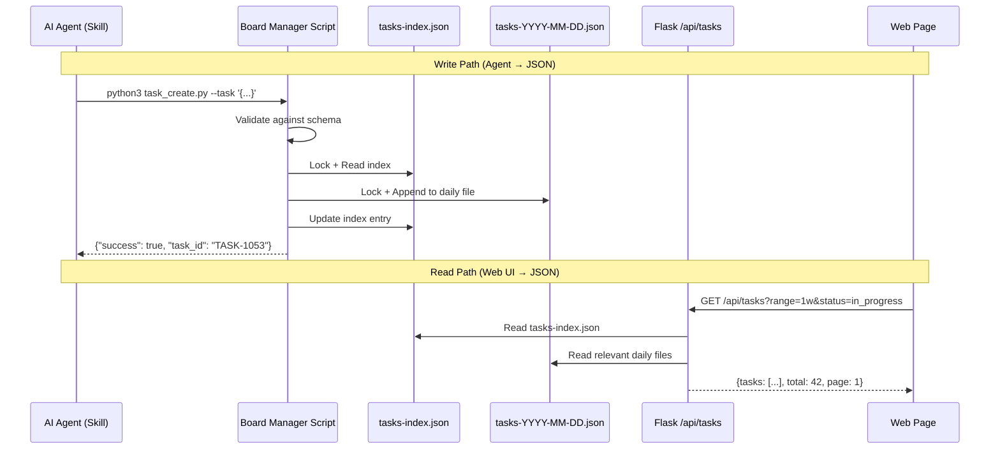
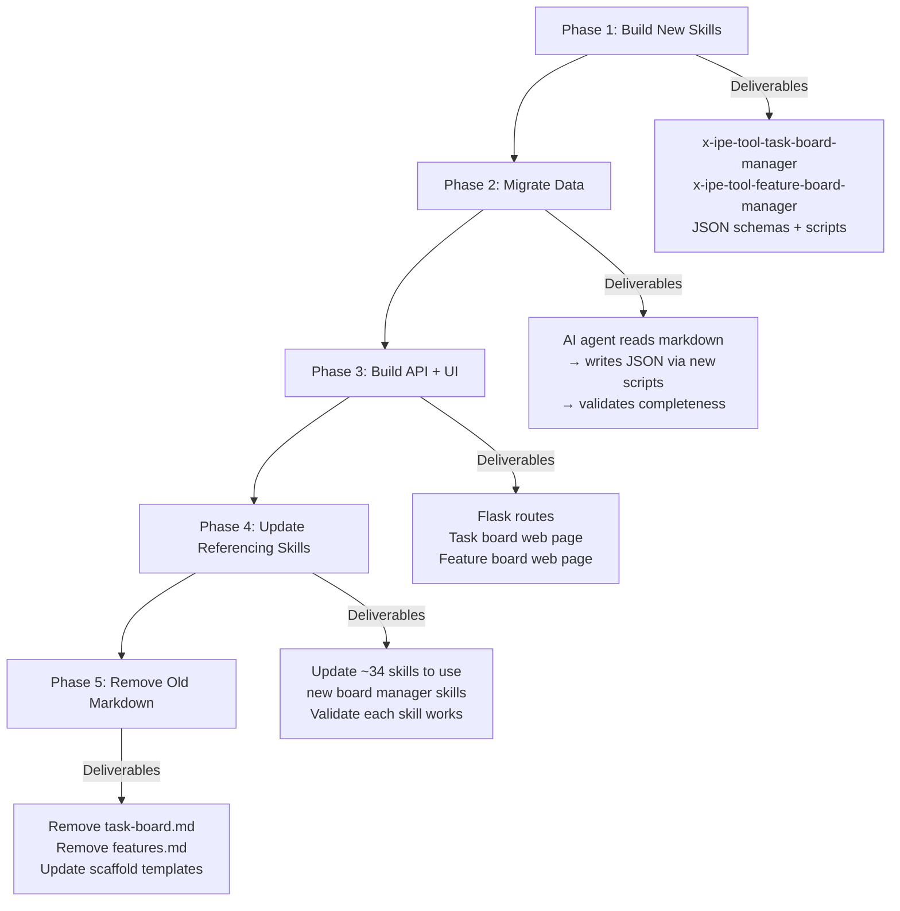

# Idea Summary

> Idea ID: IDEA-039
> Folder: 039. CR-Feature and Task Board
> Version: v1
> Created: 2026-04-03
> Status: Refined

## Overview

Separate data and UI concerns for the X-IPE task board and features board. Replace the current markdown-only approach (where `.md` files serve as both data store and display) with **JSON data files** managed by dedicated skill scripts and **web pages** for human browsing with search, filtering, and pagination.

## Problem Statement

The current `task-board.md` and `features.md` files serve dual roles — structured data store for AI agents AND human-readable display. As the project scales (50+ tasks, 69+ features), this creates compounding issues:

1. **AI agents struggle** — parsing/editing markdown tables is error-prone, especially with multi-line descriptions and special characters
2. **Humans struggle** — no filtering, search, or pagination; must scroll through hundreds of rows
3. **Concurrency issues** — two agents editing the same markdown simultaneously risk merge conflicts
4. **No query capability** — finding "all in-progress tasks this week" requires reading the entire file
5. **Coupling** — changing the display format (adding a column) breaks data parsing, and vice versa

## Target Users

- **AI Agents** — read/write task and feature data programmatically via scripts (primary data consumers/producers)
- **Human developers** — browse tasks and features via web UI (view-only consumers)
- **Project managers** — track progress, filter by time range, search by keyword

## Proposed Solution

### Architecture Overview

```architecture-dsl
@startuml module-view
title "IDEA-039: Task & Feature Board — Data/UI Separation"
theme "theme-default"
direction top-to-bottom
grid 12 x 7

layer "Skill Layer (AI Agent Interface)" {
  color "#E8F5E9"
  border-color "#4CAF50"
  rows 2

  module "Task Board Manager" {
    cols 6
    rows 2
    grid 2x2
    align center center
    gap 8px
    component "task_create.py" { cols 1, rows 1 }
    component "task_update.py" { cols 1, rows 1 }
    component "task_query.py" { cols 1, rows 1 }
    component "task_delete.py" { cols 1, rows 1 }
  }

  module "Feature Board Manager" {
    cols 6
    rows 2
    grid 2x2
    align center center
    gap 8px
    component "feature_create.py" { cols 1, rows 1 }
    component "feature_update.py" { cols 1, rows 1 }
    component "feature_query.py" { cols 1, rows 1 }
    component "feature_delete.py" { cols 1, rows 1 }
  }
}

layer "Shared Utilities" {
  color "#E3F2FD"
  border-color "#2196F3"
  rows 1

  module "Common Library" {
    cols 12
    rows 1
    grid 4x1
    align center center
    gap 8px
    component "_board_lib.py" { cols 1, rows 1 }
    component "atomic JSON I/O" { cols 1, rows 1 }
    component "file locking" { cols 1, rows 1 }
    component "schema validation" { cols 1, rows 1 }
  }
}

layer "Data Layer (JSON Files)" {
  color "#FFF3E0"
  border-color "#FF9800"
  rows 1

  module "Task Data" {
    cols 6
    rows 1
    grid 2x1
    align center center
    gap 8px
    component "tasks-YYYY-MM-DD.json" { cols 1, rows 1 }
    component "tasks-index.json" { cols 1, rows 1 }
  }

  module "Feature Data" {
    cols 6
    rows 1
    grid 1x1
    align center center
    gap 8px
    component "features.json" { cols 1, rows 1 }
  }
}

layer "API Layer (Flask Routes)" {
  color "#F3E5F5"
  border-color "#9C27B0"
  rows 1

  module "REST Endpoints" {
    cols 12
    rows 1
    grid 3x1
    align center center
    gap 8px
    component "GET /api/tasks" { cols 1, rows 1 }
    component "GET /api/features" { cols 1, rows 1 }
    component "GET /api/tasks/<id>" { cols 1, rows 1 }
  }
}

layer "UI Layer (Web Pages)" {
  color "#FFEBEE"
  border-color "#F44336"
  rows 2

  module "Task Board Page" {
    cols 6
    rows 2
    grid 2x2
    align center center
    gap 8px
    component "Time Filter (1w/1m/all)" { cols 1, rows 1 }
    component "Status Filter" { cols 1, rows 1 }
    component "Search Bar" { cols 1, rows 1 }
    component "Paginated Table" { cols 1, rows 1 }
  }

  module "Feature Board Page" {
    cols 6
    rows 2
    grid 2x2
    align center center
    gap 8px
    component "Epic Grouping" { cols 1, rows 1 }
    component "Status Filter" { cols 1, rows 1 }
    component "Search Bar" { cols 1, rows 1 }
    component "Feature Table" { cols 1, rows 1 }
  }
}

@enduml
```

### Data Flow



## Key Features

### 1. JSON Data Layer

**Task Storage** — Daily JSON files with an index for fast lookups:

```
x-ipe-docs/planning/tasks/
├── tasks-index.json           # Maps task ID → daily file + status (fast lookup)
├── tasks-2026-04-01.json      # Tasks created/updated on April 1
├── tasks-2026-04-02.json      # Tasks created/updated on April 2
└── tasks-2026-04-03.json      # Today's tasks
```

**Task JSON Schema (per task entry):**
```json
{
  "task_id": "TASK-1052",
  "task_type": "Ideation",
  "description": "Refine idea 039: CR-Feature and Task Board...",
  "role": "Drift 🌊",
  "status": "in_progress",
  "created_at": "2026-04-03T03:10:00Z",
  "last_updated": "2026-04-03T03:45:00Z",
  "output_links": [],
  "next_task": "x-ipe-task-based-requirement-gathering"
}
```

**Index JSON Schema:**
```json
{
  "version": "1.0",
  "entries": {
    "TASK-1052": {
      "file": "tasks-2026-04-03.json",
      "status": "in_progress",
      "last_updated": "2026-04-03T03:45:00Z"
    }
  }
}
```

**Feature Storage** — Single file with Epic grouping:

```
x-ipe-docs/planning/features/
└── features.json
```

**Feature JSON Schema (per feature entry):**
```json
{
  "epic_id": "EPIC-054",
  "feature_id": "FEATURE-054-A",
  "title": "Learn Panel UI",
  "version": "v0.6",
  "status": "Completed",
  "specification_link": "x-ipe-docs/requirements/EPIC-054/FEATURE-054-A/specification.md",
  "technical_design_link": "x-ipe-docs/requirements/EPIC-054/FEATURE-054-A/technical-design.md",
  "created_at": "2026-04-02T00:00:00Z",
  "last_updated": "2026-04-03T00:00:00Z"
}
```

### 2. Skill Scripts (CRUD Operations)

Two new skills following the established `x-ipe-tool-x-ipe-app-interactor/scripts/` pattern:

| Skill | Scripts | Purpose |
|-------|---------|---------|
| `x-ipe-tool-task-board-manager` | `task_create.py`, `task_update.py`, `task_query.py`, `task_delete.py`, `_board_lib.py` | CRUD on task JSON + index |
| `x-ipe-tool-feature-board-manager` | `feature_create.py`, `feature_update.py`, `feature_query.py`, `feature_delete.py`, `_board_lib.py` | CRUD on features JSON |

**Script Design Principles:**
- Standalone Python scripts (stdlib only, zero external deps)
- CLI interface via argparse
- Atomic JSON I/O (tempfile → fsync → os.replace)
- File locking (fcntl.flock) — lock-per-daily-file for tasks, single lock for features
- Structured JSON output with `{"success": true/false, "data": {...}, "error": "..."}`
- Exit codes: 0=success, 1=validation error, 2=not found, 3=lock timeout
- Schema validation on every write

### 3. Flask API Endpoints

| Endpoint | Method | Parameters | Description |
|----------|--------|------------|-------------|
| `/api/tasks` | GET | `range` (1w/1m/all), `status`, `search`, `page`, `page_size` | List tasks with filtering |
| `/api/tasks/<task_id>` | GET | — | Get single task by ID |
| `/api/features` | GET | `epic_id`, `status`, `search`, `page`, `page_size` | List features with filtering |
| `/api/features/<feature_id>` | GET | — | Get single feature by ID |

**Default behavior:**
- `/api/tasks` → returns last 1 week of tasks (by last_updated), page_size=50
- `/api/features` → returns all features grouped by Epic, no default time filter

### 4. Web UI Pages (View-Only)

**Task Board Page:**
- Time range toggle: **1 week** (default) | 1 month | All
- Status filter dropdown: All / In Progress / Completed / Blocked / Pending
- Search bar: free-text search across task ID, description, role
- Status color coding: 🟢 done, 🔵 in_progress, 🟡 pending, 🔴 blocked, ⚪ deferred
- Clickable output links (open in preview modal)
- Pagination: 50 items/page (configurable via `?page_size=`)

**Feature Board Page:**
- Epic grouping: collapsible accordion per EPIC
- Status filter: All / Planned / Refined / Designed / Implemented / Tested / Completed
- Search bar: search by feature ID, title, Epic ID
- Clickable specification and design links
- Status badges with color coding

### 5. Migration Strategy



**Migration validation:** After data migration, compare JSON task count vs markdown row count. Every task ID in markdown must exist in JSON.

## Success Criteria

- [ ] Task CRUD operations work via scripts (create, read, update, delete)
- [ ] Feature CRUD operations work via scripts
- [ ] tasks-index.json provides O(1) task lookup by ID
- [ ] Schema validation prevents invalid data on every write
- [ ] Web UI displays tasks with 1w/1m/all time filter
- [ ] Web UI displays features grouped by Epic
- [ ] Search works across task descriptions and feature titles
- [ ] Pagination works at 50 items/page for large datasets
- [ ] All ~34 referencing skills updated to use new board managers
- [ ] Existing data fully migrated from markdown to JSON
- [ ] Old markdown files removed

## Constraints & Considerations

- **Zero external dependencies** — scripts must use Python stdlib only (consistent with existing pattern)
- **Backward compatibility during migration** — phased rollout to reduce risk
- **Concurrency safety** — file locking per daily task file, single lock for features
- **ISO 8601 dates** — `tasks-YYYY-MM-DD.json` for sortable filenames
- **Cross-board coordination** — feature-stage task completion must trigger feature status update (via script call chain)
- **Git friendliness** — JSON with `indent=2` for readable diffs
- **Scaffold update** — `src/x_ipe/core/scaffold.py` must initialize JSON structure instead of markdown templates

## Brainstorming Notes

### Key Insights from Brainstorming Session

1. **Daily files + index = best of both worlds** — daily files provide natural time partitioning; index provides fast lookup without scanning all files
2. **Features as single file** — features are longer-lived, change less frequently, so a single file is simpler and sufficient
3. **View-only web UI** — avoids two-way sync complexity; agents remain the primary data managers
4. **Filter by last_updated** — most useful for seeing "recently active" work, not just "recently created"
5. **Configurable pagination** — default 50/page but allow override via query parameter

### Critic Feedback Incorporated

| Feedback | Action Taken |
|----------|-------------|
| Daily files create O(n) query complexity | Added `tasks-index.json` for O(1) lookups |
| MM-DD-YYYY not sortable | Changed to ISO 8601 `YYYY-MM-DD` format |
| 34-skill migration is high-risk | Added phased migration strategy with validation |
| Missing JSON schema | Added schema definitions for tasks and features |
| Concurrency model undefined | Defined lock-per-daily-file for tasks, single lock for features |
| Pagination may be insufficient | Made page_size configurable via query parameter |
| Feature grouping needed | Added Epic-based grouping in UI and data structure |

## Mockups & Prototypes

| Mockup | Type | Path | Tool Used |
|--------|------|------|-----------|
| Task Board Page | HTML | [task-board-v1.html](x-ipe-docs/ideas/039.%20CR-Feature%20and%20Task%20Board/mockups/task-board-v1.html) | frontend-design |
| Feature Board Page | HTML | [feature-board-v1.html](x-ipe-docs/ideas/039.%20CR-Feature%20and%20Task%20Board/mockups/feature-board-v1.html) | frontend-design |

### Preview Instructions
- Open HTML files in browser to view interactive mockups
- Task Board: demonstrates time filter toggles, status badges, search, paginated table
- Feature Board: demonstrates Epic accordion grouping, progress bar, status badges

## Ideation Artifacts

- Architecture diagram: embedded `architecture-dsl` above (rendered natively by IPE)
- Data flow: embedded `mermaid` sequence diagram above
- Migration flow: embedded `mermaid` flowchart above
- UI Mockups: see Mockups & Prototypes section above

## Source Files

- [new idea.md](x-ipe-docs/ideas/039.%20CR-Feature%20and%20Task%20Board/new%20idea.md)

## Next Steps

- [ ] Proceed to Requirement Gathering (define EPIC and break into features)
- [ ] Consider Idea Mockup for web UI wireframes

## References & Common Principles

### Applied Principles

- **Separation of Concerns** — data (JSON) decoupled from presentation (web UI), each optimized independently
- **Atomic I/O Pattern** — proven in X-IPE codebase via `_lib.py` (tempfile → fsync → os.replace)
- **Index + Data Pattern** — common in databases (B-tree index over data pages); adapted here as JSON index over daily files
- **Progressive Enhancement** — start with essential filtering (time, status), add search and pagination

### Existing Codebase References

- [_lib.py (atomic I/O)](.github/skills/x-ipe-tool-x-ipe-app-interactor/scripts/_lib.py) — shared utilities pattern
- [workflow_update_action.py](.github/skills/x-ipe-tool-x-ipe-app-interactor/scripts/workflow_update_action.py) — complex state management example
- [kb_set_entry.py](.github/skills/x-ipe-tool-x-ipe-app-interactor/scripts/kb_set_entry.py) — JSON index CRUD example
- [workflow_routes.py](src/x_ipe/routes/workflow_routes.py) — Flask API pattern reference
- [x-ipe+all+task-board-management](.github/skills/x-ipe+all+task-board-management/SKILL.md) — current task board skill (to be replaced)
- [x-ipe+feature+feature-board-management](.github/skills/x-ipe+feature+feature-board-management/SKILL.md) — current feature board skill (to be replaced)
