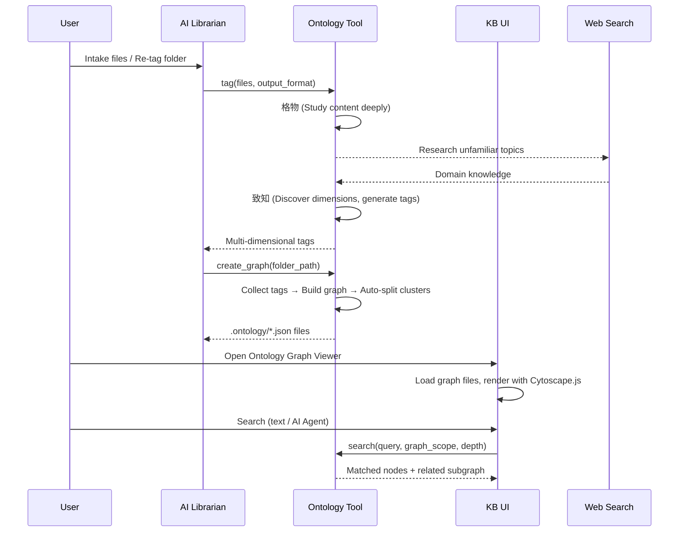
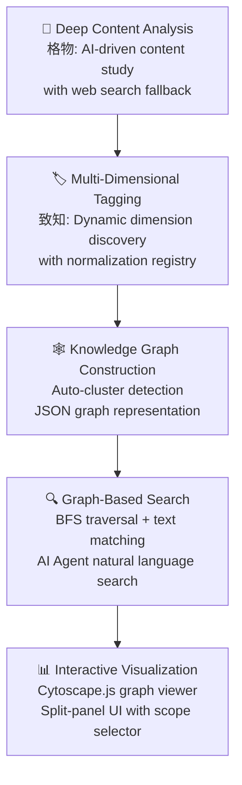

# Idea Summary

> Idea ID: IDEA-040
> Folder: 40. Feature-Ontology For Knowledgebase
> Version: v1
> Created: 2026-04-08
> Status: Refined

## Overview

Replace the basic 2-dimensional knowledge tagging system (lifecycle × domain) in X-IPE's knowledge base with an **ontology-based, multi-dimensional knowledge graph system**. This introduces a new `x-ipe-tool-ontology` skill for deep content analysis, dynamic dimension discovery, knowledge graph construction, and graph-based semantic search — backed by an interactive Cytoscape.js graph viewer in the KB UI.

## Problem Statement

The current KB tagging system offers only **2 dimensions** — lifecycle (4 values: draft, active, deprecated, archived) and domain (5 values: backend, frontend, devops, testing, design). This is too coarse for meaningful knowledge discovery:

- A document about "JWT authentication patterns for Python Flask APIs" gets tagged merely as `active` + `backend` — losing all semantic richness
- No relationships between knowledge pieces are captured (e.g., "this auth guide depends on the OAuth2 spec")
- No ability to browse knowledge by conceptual structure or discover related content
- Search is limited to text matching within flat file lists — no graph-based traversal

## Target Users

- **Developers** using X-IPE who want to quickly find related knowledge across their KB
- **AI Agents** operating within X-IPE skills that need to discover contextually relevant knowledge
- **Knowledge authors** who want their content properly categorized with rich, multi-dimensional metadata

## Proposed Solution

A 4-component solution following the X-IPE skill architecture:



### Component 1: `x-ipe-tool-ontology` (New Skill)

Three operations:

**Operation A — Knowledge Tagging (格物 → 致知)**
- **格物 (Study Broadly):** Read file content, understand its domain, concepts, and relationships. If content is unfamiliar, call `x-ipe-tool-web-search` for context.
- **致知 (Generate Tags):** Dynamically discover tagging dimensions based on content analysis. No predefined dimension set — the AI determines relevant dimensions per knowledge piece.
- **Dimension normalization:** Maintain a running dimension registry (`.ontology/.dimension-registry.json`) to ensure consistent naming across files (e.g., avoid both "target-audience" and "audience" as separate dimensions).
- **Supports:** File-level tagging (single file) and folder-level tagging (recursive)

**Operation B — Knowledge Graph Creation/Recreation**
- Collect all ontology tags under a caller-specified folder path (recursive)
- Build graph-centric ontology graphs: nodes = concepts/entities, edges = typed relationships
- Auto-detect disconnected clusters → split into separate graph files
- Validate referenced file paths still exist (prune stale references)
- Save to `knowledge-base/.ontology/{root-node-name}.json`
- Root node naming: highest-degree node (most connections) in each cluster

**Operation C — Knowledge Search**
- Match query to nodes via label/metadata text matching
- BFS traversal from matched nodes with configurable depth parameter
- Return matched nodes + related subgraph with full metadata (tags, descriptions, source paths)

### Component 2: Updated `x-ipe-tool-kb-librarian`

- During intake: call ontology tool for tagging (replaces basic lifecycle+domain for domain dimensions)
- **Lifecycle tags remain** in `.kb-index.json` as operational metadata (draft→active→deprecated→archived)
- Domain classification migrates into the ontology as one dynamically discovered dimension
- After tagging batch: always recreate affected graphs in one batch call
- Supports both file-level and folder-level recursive tagging
- New UI action: "Re-tag with Ontology" for folders

### Component 3: Ontology Graph Viewer (Frontend)

- **Split panel layout:** Left = ontology graph file list, Right = interactive graph visualization
- **Cytoscape.js** for rendering (force-directed + hierarchical layouts)
- **Search bar area** above the graph:
  - (a) Search scope selector — expandable multi-select dropdown of graph files
  - (b) Wildcard text search bar under selected graph scope
  - (c) "Search with AI Agent" button → opens X-IPE terminal, auto-types prompt template with selected graph scope, waits for user's natural language query
- Search results: highlighted nodes on the graph + info panel

### Component 4: Graph JSON Representation

**Schema (`.ontology/{graph-name}.json`):**
```json
{
  "schema_version": "1.0",
  "root": "concept-name",
  "created_at": "2026-04-08T00:00:00Z",
  "source_folder": "knowledge-base/collection-name",
  "nodes": [
    {
      "id": "node-uuid",
      "label": "Concept Name",
      "type": "concept",
      "metadata": {
        "description": "Brief description",
        "dimensions": {
          "topic": ["authentication", "security"],
          "abstraction": "pattern",
          "technology": ["Flask", "JWT"]
        },
        "source_files": ["path/to/file1.md", "path/to/file2.md"],
        "weight": 5
      }
    }
  ],
  "edges": [
    {
      "source": "node-uuid-1",
      "target": "node-uuid-2",
      "relationship": "depends-on",
      "weight": 0.8,
      "label": "requires"
    }
  ]
}
```

**Dimension Registry (`.ontology/.dimension-registry.json`):**
```json
{
  "dimensions": {
    "topic": { "type": "multi-value", "examples": ["authentication", "graph-theory", "CI/CD"] },
    "abstraction": { "type": "single-value", "examples": ["tutorial", "reference", "architecture", "pattern"] },
    "technology": { "type": "multi-value", "examples": ["Flask", "JWT", "Python"] },
    "audience": { "type": "single-value", "examples": ["developer", "architect", "end-user"] }
  },
  "aliases": {
    "target-audience": "audience",
    "tech-stack": "technology"
  }
}
```

## Key Features



## Success Criteria

- [ ] `x-ipe-tool-ontology` skill created with 3 operations (tag, graph create, search)
- [ ] Dynamic dimension discovery produces richer tags than the current 2-dimension system
- [ ] Dimension registry prevents duplicate/inconsistent dimension names
- [ ] Knowledge graphs auto-generated as `.ontology/*.json` with valid graph-centric JSON
- [ ] Disconnected clusters auto-split into separate graph files
- [ ] Stale file references pruned during graph recreation
- [ ] AI Librarian updated to call ontology tool for tagging
- [ ] Both file-level and folder-level tagging work correctly
- [ ] Graph recreation triggered automatically after tagging batch
- [ ] Ontology Graph Viewer renders graphs interactively with Cytoscape.js
- [ ] Search scope selector allows multi-graph search
- [ ] Wildcard text search highlights matching nodes
- [ ] "Search with AI Agent" button opens terminal with pre-typed prompt
- [ ] Lifecycle tags preserved in `.kb-index.json` (not moved to ontology)

## Constraints & Considerations

- **Scale ceiling:** Designed for KBs up to ~200 files per collection. For larger KBs, an incremental graph update path should be considered (future enhancement)
- **Graph recreation is full rebuild:** No incremental patching — entire graph is rebuilt from tags each time. Simpler but slower at scale
- **Dimension consistency:** The running dimension registry is critical — without it, the same concept could be tagged differently across files
- **G6 coexistence:** The project currently uses G6 (AntV) for the tracing DAG viewer. Cytoscape.js is a separate dependency for ontology graphs. If G6 is no longer used for tracing, it should be removed
- **AI Agent terminal integration:** Depends on the X-IPE terminal being available and a CLI agent being active
- **Web search during tagging:** The 格物 phase may call `x-ipe-tool-web-search`, which requires the agent to have web capability

## Brainstorming Notes

### Key Decisions

| Decision | Choice | Rationale |
|---|---|---|
| Tagging dimensions | Dynamic discovery | Content is too diverse for predefined dimensions; AI determines relevant dimensions per file |
| Graph scope | Caller-specified folder + auto-split | Maximum flexibility; auto-split prevents monolithic graphs |
| Graph structure | Graph-centric (nodes=concepts, edges=relationships) | Natural for cross-document queries; avoids per-document adjacency maintenance |
| Visualization library | Cytoscape.js | Rich plugin ecosystem for ontology features; force-directed + hierarchical layouts built-in |
| AI search UX | Terminal with pre-typed prompt | Consistent with X-IPE's existing terminal interaction pattern |
| Tagging granularity | File-level + folder-level recursive | File-level for intake; folder-level for bulk re-tagging |
| Graph recreation | Batch after all tagging | Avoids error-prone incremental patching |
| Lifecycle tags | Stay in `.kb-index.json` | Operational metadata separate from semantic ontology |

### Critique Feedback Addressed

| Feedback | Action |
|---|---|
| Define JSON schema explicitly | ✅ Schema specified with `schema_version`, nodes, edges, metadata |
| Clarify `.kb-index.json` vs `.ontology/` | ✅ Lifecycle stays in kb-index; domain migrates to ontology |
| Define search algorithm | ✅ BFS traversal from matched nodes with depth parameter |
| Address graph staleness | ✅ Path validation during recreation; prune dead references |
| Document scale boundaries | ✅ ~200 files/collection ceiling documented |
| Dimension discovery specification | ✅ Dimension registry + normalization strategy defined |
| `.ontology/` location | ✅ At KB root: `knowledge-base/.ontology/` |
| Root node naming | ✅ Highest-degree node in each disconnected cluster |

## Ideation Artifacts

- Architecture flow: Mermaid sequence diagram embedded above (AI Librarian → Ontology Tool → KB UI flow)
- Feature flow: Mermaid flowchart embedded above (Analysis → Tagging → Graph → Search → Visualization pipeline)

## Architecture Overview

```architecture-dsl
@startuml module-view
title "Feature-Ontology for Knowledgebase"
theme "theme-default"
direction top-to-bottom
grid 12 x 8

layer "Presentation Layer" {
  color "#E3F2FD"
  border-color "#1565C0"
  rows 2

  module "KB Frontend" {
    cols 12
    rows 2
    grid 3 x 1
    align center center
    gap 8px
    component "Ontology\nGraph Viewer" { cols 1, rows 1 }
    component "Search &\nScope Selector" { cols 1, rows 1 }
    component "AI Agent\nTerminal Integration" { cols 1, rows 1 }
  }
}

layer "Skill Layer" {
  color "#E8F5E9"
  border-color "#2E7D32"
  rows 3

  module "Ontology Tool" {
    cols 6
    rows 3
    grid 1 x 3
    align center center
    gap 8px
    component "Knowledge Tagging\n(格物 → 致知)" { cols 1, rows 1 }
    component "Graph Creation\n& Recreation" { cols 1, rows 1 }
    component "Knowledge Search\n(BFS + Text)" { cols 1, rows 1 }
  }

  module "Supporting Skills" {
    cols 6
    rows 3
    grid 1 x 3
    align center center
    gap 8px
    component "KB AI Librarian\n(Updated)" { cols 1, rows 1 }
    component "Web Search\n(格物 fallback)" { cols 1, rows 1 }
    component "Dimension\nRegistry" { cols 1, rows 1 }
  }
}

layer "Data Layer" {
  color "#FFF3E0"
  border-color "#E65100"
  rows 3

  module "Knowledge Store" {
    cols 6
    rows 3
    grid 1 x 3
    align center center
    gap 8px
    component ".kb-index.json\n(Lifecycle Tags)" { cols 1, rows 1 }
    component ".ontology/*.json\n(Knowledge Graphs)" { cols 1, rows 1 }
    component ".dimension-registry.json\n(Normalization)" { cols 1, rows 1 }
  }

  module "Content" {
    cols 6
    rows 3
    grid 1 x 2
    align center center
    gap 8px
    component "KB Files\n(Markdown, PDF, etc.)" { cols 1, rows 1 }
    component "Intake Folder\n(.intake/)" { cols 1, rows 1 }
  }
}

@enduml
```

## Source Files

- [x-ipe-docs/ideas/40. Feature-Ontology For Knowledgebase/new idea.md](x-ipe-docs/ideas/40. Feature-Ontology For Knowledgebase/new idea.md)

## Next Steps

- [ ] Proceed to **Idea Mockup** — Create visual mockup of the Ontology Graph Viewer UI
- [ ] Proceed to **Idea to Architecture** — Create detailed architecture diagrams
- [ ] Proceed to **Requirement Gathering** — Break this into epics and features

## References & Common Principles

### Applied Principles

- **Modular Ontology Design:** Start with clear domain scope, use hierarchical and typed modeling — [Best Practices for Ontology Development](https://knowledgegraph.dev/article/Best_Practices_for_Ontology_Development_in_Knowledge_Graphs.html)
- **Graph-Centric Representation:** Nodes with metadata + typed edges for cross-document relationship queries — [Ontology-Structured Knowledge Graphs](https://www.emergentmind.com/topics/ontology-structured-knowledge-graphs)
- **Contextual Metadata:** Annotate nodes with provenance, version, dimensions for change tracking — [Fundamentals of Ontology Design](https://boroprogram.org/fundamentals-of-ontology-design-for-knowledge-systems/)
- **Dimension Normalization:** Maintain running registry to prevent concept drift — [Procedure Model for Knowledge Graphs](https://arxiv.org/html/2409.13425v1)

### Graph Visualization Research

- **Cytoscape.js** — Best-in-class open-source graph library: 100k+ elements, CSS-style selectors, rich layouts — [sqlpey.com comparison](https://sqlpey.com/javascript/best-javascript-libraries-for-interactive-graph-visualization/)
- **Sigma.js** — WebGL-optimized alternative for very large networks — [GetFocal Top 10](https://www.getfocal.co/post/top-10-javascript-libraries-for-knowledge-graph-visualization)
- **D3.js** — Maximum flexibility but more custom code needed — [GeeksforGeeks comparison](https://www.geeksforgeeks.org/javascript/javascript-libraries-for-data-visualization/)

### Further Reading

- [How to Build a Knowledge Graph in 7 Steps (Neo4j)](https://neo4j.com/blog/knowledge-graph/how-to-build-knowledge-graph/)
- [Modeling Semantics: Knowledge Graphs and Ontologies (Blindata)](https://blindata.io/blog/2024/ontologies-for-semantic-modeling/)
- [Knowledge Graphs & Ontologies (Digital Bricks)](https://www.digitalbricks.ai/build-innovate/knowledge-graphs-ontologies)
