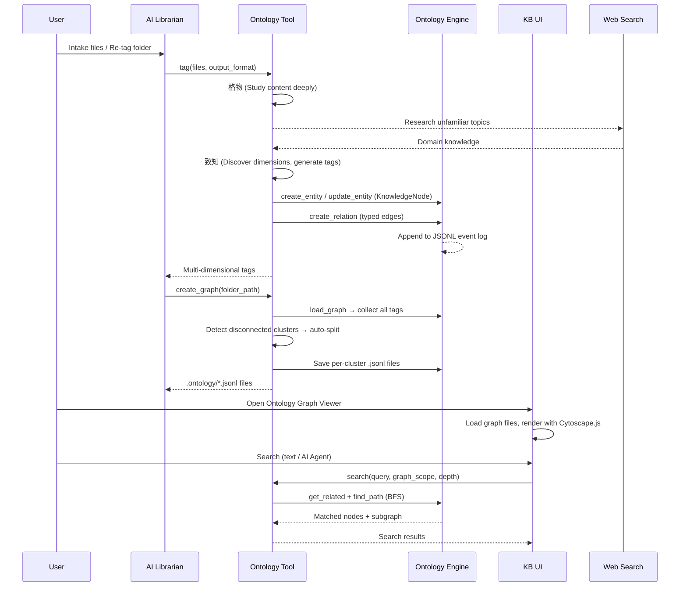
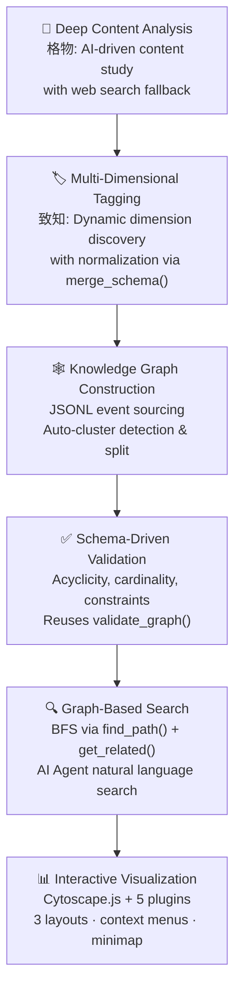

# Idea Summary

> Idea ID: IDEA-040
> Folder: 40. Feature-Ontology For Knowledgebase
> Version: v2
> Created: 2026-04-08
> Status: Refined

## Overview

Replace the basic 2-dimensional knowledge tagging system (lifecycle × domain) in X-IPE's knowledge base with an **ontology-based, multi-dimensional knowledge graph system** — built on top of the proven **ontology-1.0.4** data engine. This introduces a new `x-ipe-tool-ontology` skill for deep content analysis (格物→致知), dynamic dimension discovery, knowledge graph construction with auto-split clustering, and graph-based semantic search — backed by an interactive Cytoscape.js graph viewer in the KB UI.

## Problem Statement

The current KB tagging system offers only **2 dimensions** — lifecycle (4 values: draft, active, deprecated, archived) and domain (5 values: backend, frontend, devops, testing, design). This is too coarse for meaningful knowledge discovery:

- A document about "JWT authentication patterns for Python Flask APIs" gets tagged merely as `active` + `backend` — losing all semantic richness
- No relationships between knowledge pieces are captured (e.g., "this auth guide depends on the OAuth2 spec")
- No ability to browse knowledge by conceptual structure or discover related content
- Search is limited to text matching within flat file lists — no graph-based traversal

## Target Users

- **Developers** using X-IPE who want to quickly find related knowledge across their KB
- **AI Agents** operating within X-IPE skills that need to discover contextually relevant knowledge
- **Knowledge authors** who want their content properly categorized with rich, multi-dimensional metadata

## Proposed Solution

A 4-component solution extending the existing **ontology-1.0.4** data engine with KB-specific intelligence:



---

### Component 1: `x-ipe-tool-ontology` (New Skill — extends ontology-1.0.4)

The new skill wraps and extends the existing `ontology.py` engine (581-line Python script) with three KB-specific operations. It reuses the engine's entity CRUD, relation management, schema validation, BFS traversal, and JSONL event sourcing — adding AI-driven tagging, graph clustering, and semantic search on top.

**Operation A — Knowledge Tagging (格物 → 致知)**

- **格物 (Study Broadly):** Read file content, understand its domain, concepts, and relationships. If content is unfamiliar, call `x-ipe-tool-web-search` for context.
- **致知 (Generate Tags):** Dynamically discover tagging dimensions based on content analysis. No predefined dimension set — the AI determines relevant dimensions per knowledge piece.
- **Dimension normalization:** New dimensions are appended to the YAML schema via `merge_schema()` (ontology-1.0.4's deep merge). A `.dimension-registry.json` maps aliases to canonical names (e.g., "target-audience" → "audience") to prevent concept drift.
- **Storage:** Each tagged file becomes a `KnowledgeNode` entity in the JSONL event log via `create_entity()` / `update_entity()`. Relationships between knowledge pieces are stored as typed relations via `create_relation()`.
- **Supports:** File-level tagging (single file) and folder-level tagging (recursive).

**Operation B — Knowledge Graph Creation/Recreation**

- Collect all `KnowledgeNode` entities under a caller-specified folder path (recursive) via `load_graph()` + `query_entities()`.
- Build graph-centric ontology graphs from collected entities and relations.
- Auto-detect disconnected clusters (new logic) → split into separate `.jsonl` files.
- Validate referenced file paths still exist — prune stale references via `update_entity()` / `delete_entity()`.
- Validate graph integrity via `validate_graph()` with KB-specific schema constraints.
- Save to `knowledge-base/.ontology/{root-node-name}.jsonl`.
- Root node naming: highest-degree node (most connections) in each cluster.

**Operation C — Knowledge Search**

- Match query to `KnowledgeNode` entities via label/metadata text matching using `query_entities()`.
- BFS traversal from matched nodes via existing `find_path()` + `get_related()` with configurable depth parameter.
- Return matched nodes + related subgraph with full metadata (dimensions, descriptions, source file paths).

---

### Component 2: Updated `x-ipe-tool-kb-librarian`

- During intake: call ontology tool for tagging (replaces basic domain assignment).
- **Lifecycle tags remain** in `.kb-index.json` as operational metadata (draft→active→deprecated→archived).
- Domain classification migrates into the ontology as one dynamically discovered dimension.
- After tagging batch: always recreate affected graphs in one batch call.
- Supports both file-level and folder-level recursive tagging.
- New UI action: "Re-tag with Ontology" for folders.
- Declares skill contract:
  ```yaml
  ontology:
    reads: [KnowledgeNode]
    writes: [KnowledgeNode]
    preconditions:
      - "Files exist in intake or KB folder"
    postconditions:
      - "All processed files have KnowledgeNode entities with dimensions"
  ```

---

### Component 3: Ontology Graph Viewer (Frontend)

- **Split panel layout:** Left = ontology graph file list (with Select All), Right = interactive graph visualization.
- **Cytoscape.js** for rendering with **5 plugins:**
  - `cytoscape-fcose` — Force-directed layout (default), cluster-aware with quality tuning
  - `cytoscape-dagre` — Hierarchical/layered layout (top-to-bottom DAG)
  - `cytoscape-cxtmenu` — Radial context menus on nodes (Details/Expand/Pin/Unpin) and canvas (Fit/Reset/Force/Hierarchy/Radial)
  - `cytoscape-navigator` — Minimap overview panel (bottom-left corner)
  - `tippy.js` — Rich tooltips on node hover with type, weight, and description
- **3-option layout picker** (floating panel, top-left of graph canvas):
  - Force-Directed (fcose, default) · Hierarchical (dagre) · Radial (concentric, built-in)
- **Search bar area** above the graph:
  - (a) Search scope selector — expandable multi-select dropdown of graph files
  - (b) Wildcard text search bar under selected graph scope
  - (c) "Search with AI Agent" button → opens X-IPE terminal, auto-types prompt template with selected graph scope, waits for user's natural language query
- Search results: highlighted nodes on the graph + info panel.
- **Zoom controls** (bottom-right): zoom in/out/fit buttons.

---

### Component 4: Data Layer (extends ontology-1.0.4)

#### Entity Model

Extends ontology-1.0.4's typed entity system with a `KnowledgeNode` type:

```yaml
# Added to schema.yaml via merge_schema()
types:
  KnowledgeNode:
    required: [label, type]
    properties:
      label: string                    # Human-readable name
      type: enum(concept, entity, document)
      description: string?             # Brief summary
      dimensions: object               # Dynamic multi-dimensional tags
      source_files: string[]?          # KB file paths this node represents
      weight: number?                  # Importance/centrality score

  KnowledgeDimension:
    required: [name, type]
    properties:
      name: string                     # e.g., "topic", "abstraction", "technology"
      type: enum(single-value, multi-value)
      examples: string[]?              # Known values for this dimension

relations:
  related_to:
    from_types: [KnowledgeNode]
    to_types: [KnowledgeNode]
    cardinality: many_to_many

  depends_on:
    from_types: [KnowledgeNode]
    to_types: [KnowledgeNode]
    acyclic: true
    cardinality: many_to_many

  is_type_of:
    from_types: [KnowledgeNode]
    to_types: [KnowledgeNode]
    cardinality: many_to_one

  part_of:
    from_types: [KnowledgeNode]
    to_types: [KnowledgeNode]
    cardinality: many_to_one

  described_by:
    from_types: [KnowledgeNode]
    to_types: [KnowledgeNode]
    cardinality: many_to_many
```

#### Storage Model

Reuses ontology-1.0.4's **JSONL append-only event log**:

```jsonl
{"op":"create","entity":{"id":"know_a1b2c3d4","type":"KnowledgeNode","properties":{"label":"JWT Authentication","type":"concept","dimensions":{"topic":["authentication","security"],"abstraction":"pattern","technology":["Flask","JWT"]},"source_files":["path/to/auth-guide.md"],"weight":5}},"timestamp":"2026-04-08T00:00:00+00:00"}
{"op":"create","entity":{"id":"know_e5f6g7h8","type":"KnowledgeNode","properties":{"label":"OAuth2 Specification","type":"concept","dimensions":{"topic":["authentication","authorization"],"abstraction":"reference","technology":["OAuth2"]},"source_files":["path/to/oauth2-spec.md"]}},"timestamp":"2026-04-08T00:00:01+00:00"}
{"op":"relate","from":"know_a1b2c3d4","rel":"depends_on","to":"know_e5f6g7h8","properties":{},"timestamp":"2026-04-08T00:00:02+00:00"}
```

**Benefits over static JSON:**
- Full mutation **audit trail** — who added what tag, when
- **Crash recovery** — replay from any point
- **Incremental updates** — append new ops instead of rewriting entire file
- Natural support for **re-tagging** — just append `update` ops

#### Dimension Registry (`.ontology/.dimension-registry.json`)

```json
{
  "dimensions": {
    "topic": { "type": "multi-value", "examples": ["authentication", "graph-theory", "CI/CD"] },
    "abstraction": { "type": "single-value", "examples": ["tutorial", "reference", "architecture", "pattern"] },
    "technology": { "type": "multi-value", "examples": ["Flask", "JWT", "Python"] },
    "audience": { "type": "single-value", "examples": ["developer", "architect", "end-user"] }
  },
  "aliases": {
    "target-audience": "audience",
    "tech-stack": "technology"
  }
}
```

New dimensions discovered during 致知 phase are appended via `merge_schema()` deep merge — never overwriting existing definitions.

#### Reused Infrastructure from ontology-1.0.4

| Function | Purpose | Reuse Type |
|---|---|---|
| `create_entity()` | Create KnowledgeNode from tagged file | Direct reuse |
| `update_entity()` | Re-tag or prune stale references | Direct reuse |
| `delete_entity()` | Remove deleted file's node | Direct reuse |
| `query_entities()` | Find nodes by type/properties | Direct reuse |
| `get_related()` | Traverse relations with direction | Direct reuse |
| `find_path()` | BFS search with depth limit | Direct reuse |
| `create_relation()` | Link related knowledge nodes | Direct reuse |
| `validate_graph()` | Schema-driven validation (acyclicity, cardinality, constraints) | Extended with KB rules |
| `load_graph()` | Replay JSONL to reconstruct state | Direct reuse |
| `append_op()` | Append mutations to event log | Direct reuse |
| `merge_schema()` | Evolve schema as dimensions grow | Direct reuse |
| `generate_id()` | `know_{uuid_hex[:8]}` readable IDs | Direct reuse |
| `resolve_safe_path()` | Path traversal security | Direct reuse |
| **Auto-split clusters** | Detect disconnected subgraphs | **New** |
| **AI tagging (格物→致知)** | Content analysis + dimension discovery | **New** |
| **Cytoscape.js graph viewer** | Interactive visualization + search | **New** |
| **AI Agent search terminal** | Terminal prompt integration | **New** |

---

## Key Features



## Success Criteria

- [ ] `x-ipe-tool-ontology` skill created with 3 operations (tag, graph create, search)
- [ ] Skill extends ontology-1.0.4 engine — reuses CRUD, relations, validation, traversal
- [ ] Dynamic dimension discovery produces richer tags than the current 2-dimension system
- [ ] New dimensions appended via `merge_schema()` without overwriting existing schema
- [ ] Dimension registry prevents duplicate/inconsistent dimension names via aliases
- [ ] Knowledge graphs stored as JSONL event logs with full mutation history
- [ ] Disconnected clusters auto-split into separate `.jsonl` graph files
- [ ] Stale file references pruned during graph recreation via `update_entity()` / `delete_entity()`
- [ ] `validate_graph()` enforces KB-specific schema (KnowledgeNode type, relation constraints)
- [ ] AI Librarian updated to call ontology tool for tagging with skill contract declaration
- [ ] Both file-level and folder-level recursive tagging work correctly
- [ ] Graph recreation triggered automatically after tagging batch
- [ ] Ontology Graph Viewer renders graphs interactively with Cytoscape.js + 5 plugins (fcose, dagre, cxtmenu, navigator, tippy)
- [ ] 3-option layout picker switches between force-directed, hierarchical, and radial layouts
- [ ] Radial context menus provide node actions and canvas-level layout/fit controls
- [ ] Navigator minimap shows pan/zoom overview of the full graph
- [ ] Search scope selector allows multi-graph search with Select All toggle
- [ ] Wildcard text search highlights matching nodes on graph
- [ ] BFS search via `find_path()` + `get_related()` returns related subgraphs
- [ ] "Search with AI Agent" button opens terminal with pre-typed prompt
- [ ] Lifecycle tags preserved in `.kb-index.json` (not moved to ontology)

## Constraints & Considerations

- **Scale ceiling:** Designed for KBs up to ~200 files per collection. JSONL full-replay on read is the bottleneck — for larger KBs, a SQLite migration path (noted in ontology-1.0.4 docs) should be considered.
- **Graph recreation is full rebuild:** Disconnected cluster detection requires loading all entities, so recreation is a full rebuild. JSONL append-only storage makes incremental tagging efficient though.
- **Dimension consistency:** The running dimension registry + `merge_schema()` deep merge is critical — without it, the same concept could be tagged differently across files.
- **G6 coexistence:** The project currently uses G6 (AntV) for the tracing DAG viewer. Cytoscape.js (+ fcose, dagre, cxtmenu, navigator, tippy plugins) is a separate dependency for ontology graphs. If G6 is no longer used for tracing in the future, it should be removed.
- **AI Agent terminal integration:** Depends on the X-IPE terminal being available and a CLI agent being active.
- **Web search during tagging:** The 格物 phase may call `x-ipe-tool-web-search`, which requires the agent to have web capability.
- **ontology-1.0.4 dependency:** The skill script (`ontology.py`) must be vendored or imported as a module. It requires Python 3.10+ and optionally PyYAML for schema operations.

## Brainstorming Notes

### Key Decisions

| Decision | Choice | Rationale |
|---|---|---|
| Data engine | Extend ontology-1.0.4 | Proven JSONL storage, CRUD, validation, traversal — avoid reinventing |
| Storage format | JSONL event log (append-only) | Audit trail, crash recovery, incremental updates — richer than static JSON |
| Schema system | YAML schema via `merge_schema()` | Schema-driven validation with deep merge for evolving dimensions |
| Tagging dimensions | Dynamic discovery | Content is too diverse for predefined dimensions; AI determines per file |
| Graph scope | Caller-specified folder + auto-split | Maximum flexibility; auto-split prevents monolithic graphs |
| Graph structure | Graph-centric (KnowledgeNode entities + typed relations) | Natural for cross-document queries; uses proven entity/relation model |
| Visualization library | Cytoscape.js | Rich plugin ecosystem for ontology features; force-directed + hierarchical |
| AI search UX | Terminal with pre-typed prompt | Consistent with X-IPE's existing terminal interaction pattern |
| Tagging granularity | File-level + folder-level recursive | File-level for intake; folder-level for bulk re-tagging |
| Graph recreation | Batch after all tagging | Full rebuild for cluster detection; JSONL makes tagging itself incremental |
| Lifecycle tags | Stay in `.kb-index.json` | Operational metadata separate from semantic ontology |
| ID format | `know_{uuid_hex[:8]}` | Human-readable + unique, follows ontology-1.0.4 convention |
| Skill integration | Skill contract pattern | Librarian declares `ontology: {reads, writes, pre/postconditions}` |

### Critique Feedback Addressed

| Feedback | Action |
|---|---|
| Define JSON schema explicitly | ✅ Extended ontology-1.0.4's entity model with KnowledgeNode type in YAML schema |
| Clarify `.kb-index.json` vs `.ontology/` | ✅ Lifecycle stays in kb-index; domain migrates to ontology dimensions |
| Define search algorithm | ✅ Reuses existing BFS `find_path()` + `get_related()` from ontology-1.0.4 |
| Address graph staleness | ✅ Path validation during recreation; prune via `update_entity()` / `delete_entity()` |
| Document scale boundaries | ✅ ~200 files/collection ceiling; SQLite migration path noted from ontology-1.0.4 |
| Dimension discovery specification | ✅ Dimension registry + `merge_schema()` normalization strategy |
| `.ontology/` location | ✅ At KB root: `knowledge-base/.ontology/` |
| Root node naming | ✅ Highest-degree node in each disconnected cluster |
| Leverage existing ontology-1.0.4 | ✅ v2 redesigned to extend ontology-1.0.4 as data engine |

## Ideation Artifacts

- Architecture flow: Mermaid sequence diagram (Librarian → Ontology Tool → Ontology Engine → KB UI flow)
- Feature flow: Mermaid flowchart (Analysis → Tagging → Graph → Validation → Search → Visualization pipeline)
- Architecture DSL: Module view diagram below

## Architecture Overview

```architecture-dsl
@startuml module-view
title "Feature-Ontology for Knowledgebase (v2)"
theme "theme-default"
direction top-to-bottom
grid 12 x 10

layer "Presentation Layer" {
  color "#E3F2FD"
  border-color "#1565C0"
  rows 2

  module "KB Frontend" {
    cols 12
    rows 2
    grid 3 x 1
    align center center
    gap 8px
    component "Ontology\nGraph Viewer" { cols 1, rows 1 }
    component "Search &\nScope Selector" { cols 1, rows 1 }
    component "AI Agent\nTerminal Integration" { cols 1, rows 1 }
  }
}

layer "Intelligence Layer (New)" {
  color "#F3E5F5"
  border-color "#7B1FA2"
  rows 3

  module "Ontology Tool" {
    cols 6
    rows 3
    grid 1 x 3
    align center center
    gap 8px
    component "Knowledge Tagging\n(格物 → 致知)" { cols 1, rows 1 }
    component "Graph Creation\n& Auto-Split" { cols 1, rows 1 }
    component "Knowledge Search\n(BFS + Text)" { cols 1, rows 1 }
  }

  module "Supporting Skills" {
    cols 6
    rows 3
    grid 1 x 3
    align center center
    gap 8px
    component "KB AI Librarian\n(Updated)" { cols 1, rows 1 }
    component "Web Search\n(格物 fallback)" { cols 1, rows 1 }
    component "Dimension\nRegistry" { cols 1, rows 1 }
  }
}

layer "Engine Layer (ontology-1.0.4)" {
  color "#E8F5E9"
  border-color "#2E7D32"
  rows 2

  module "Entity Operations" {
    cols 4
    rows 2
    grid 2 x 2
    align center center
    gap 8px
    component "create_entity()" { cols 1, rows 1 }
    component "update_entity()" { cols 1, rows 1 }
    component "query_entities()" { cols 1, rows 1 }
    component "get_related()" { cols 1, rows 1 }
  }

  module "Graph Operations" {
    cols 4
    rows 2
    grid 2 x 2
    align center center
    gap 8px
    component "load_graph()" { cols 1, rows 1 }
    component "find_path()" { cols 1, rows 1 }
    component "validate_graph()" { cols 1, rows 1 }
    component "create_relation()" { cols 1, rows 1 }
  }

  module "Schema & Security" {
    cols 4
    rows 2
    grid 2 x 2
    align center center
    gap 8px
    component "merge_schema()" { cols 1, rows 1 }
    component "resolve_safe_path()" { cols 1, rows 1 }
    component "generate_id()" { cols 1, rows 1 }
    component "append_op()" { cols 1, rows 1 }
  }
}

layer "Data Layer" {
  color "#FFF3E0"
  border-color "#E65100"
  rows 3

  module "Ontology Store" {
    cols 6
    rows 3
    grid 1 x 3
    align center center
    gap 8px
    component ".ontology/*.jsonl\n(JSONL Event Logs)" { cols 1, rows 1 }
    component "schema.yaml\n(Type Constraints)" { cols 1, rows 1 }
    component ".dimension-registry.json\n(Alias Normalization)" { cols 1, rows 1 }
  }

  module "KB Content" {
    cols 6
    rows 3
    grid 1 x 3
    align center center
    gap 8px
    component ".kb-index.json\n(Lifecycle Tags)" { cols 1, rows 1 }
    component "KB Files\n(Markdown, PDF, etc.)" { cols 1, rows 1 }
    component "Intake Folder\n(.intake/)" { cols 1, rows 1 }
  }
}

@enduml
```

## Mockups & Prototypes

| Mockup | Type | Path | Tool Used |
|--------|------|------|-----------|
| Ontology Graph Viewer | HTML | [mockups/ontology-graph-viewer-v1.html](x-ipe-docs/ideas/40.%20Feature-Ontology%20For%20Knowledgebase/mockups/ontology-graph-viewer-v1.html) | frontend-design |

### Preview Instructions
- Open the HTML file in a browser to view the interactive mockup
- **Sidebar**: Click checkboxes to add/remove graphs from scope; use Select All to toggle all
- **Layout picker**: Top-left floating panel — switch between Force-Directed (fcose), Hierarchical (dagre), and Radial (concentric)
- **Search**: Type in the search bar to filter & highlight matching nodes
- **Node details**: Click any node to open the right slide-out panel
- **Context menus**: Right-click (or long-press) a node for actions; right-click canvas for layout/fit options
- **Navigator minimap**: Bottom-left corner shows a pan/zoom overview
- **AI Agent**: Click "Search with AI Agent" to see the terminal overlay
- **Zoom controls**: Bottom-right buttons for zoom in/out/fit
- **Keyboard**: Press `/` to focus search, `Esc` to close panels

### Cytoscape.js Plugin Stack

| Plugin | CDN | Purpose |
|--------|-----|---------|
| `cytoscape-fcose` | unpkg.com/cytoscape-fcose@2.2.0 | Force-directed layout (default) |
| `cytoscape-dagre` | unpkg.com/cytoscape-dagre@2.5.0 | Hierarchical/layered layout |
| `cytoscape-cxtmenu` | unpkg.com/cytoscape-cxtmenu@3.5.0 | Radial context menus |
| `cytoscape-navigator` | unpkg.com/cytoscape-navigator@2.0.2 | Minimap overview |
| `tippy.js` | unpkg.com/tippy.js@6.3.7 | Rich hover tooltips |

## Source Files

- [x-ipe-docs/ideas/40. Feature-Ontology For Knowledgebase/new idea.md](new%20idea.md) — Original idea
- [x-ipe-docs/ideas/103. Research-Ontology/ontology-1.0.4/](../../103.%20Research-Ontology/ontology-1.0.4/) — ontology-1.0.4 data engine (foundation)
- [x-ipe-docs/knowledge-base/.intake/ontology-application-reverse-engineering/](../../knowledge-base/.intake/ontology-application-reverse-engineering/) — Reverse-engineered knowledge of ontology-1.0.4

## Next Steps

- [x] ~~Proceed to **Idea Mockup** — Create visual mockup of the Ontology Graph Viewer UI~~ ✅ Done
- [ ] Proceed to **Idea to Architecture** — Create detailed architecture diagrams
- [ ] Proceed to **Requirement Gathering** — Break this into epics and features

## References & Common Principles

### Applied Principles

- **Event Sourcing:** Append-only JSONL log preserves full mutation history with crash recovery — [ontology-1.0.4 Architecture](../../103.%20Research-Ontology/ontology-1.0.4/SKILL.md)
- **Schema-Driven Validation:** YAML schema with typed entities, relation constraints, cardinality, and acyclicity checks — [ontology-1.0.4 Schema Reference](../../103.%20Research-Ontology/ontology-1.0.4/references/schema.md)
- **Deep Merge for Schema Evolution:** `merge_schema()` safely extends schema without overwriting — [ontology-1.0.4 Design Patterns](../../knowledge-base/.intake/ontology-application-reverse-engineering/section-02-design-patterns/index.md)
- **Modular Ontology Design:** Start with clear domain scope, use hierarchical and typed modeling — [Best Practices for Ontology Development](https://knowledgegraph.dev/article/Best_Practices_for_Ontology_Development_in_Knowledge_Graphs.html)
- **Graph-Centric Representation:** Nodes with metadata + typed edges for cross-document relationship queries — [Ontology-Structured Knowledge Graphs](https://www.emergentmind.com/topics/ontology-structured-knowledge-graphs)
- **Dimension Normalization:** Registry + deep merge to prevent concept drift — [Procedure Model for Knowledge Graphs](https://arxiv.org/html/2409.13425v1)

### Graph Visualization Research

- **Cytoscape.js** — Best-in-class open-source graph library: 100k+ elements, CSS-style selectors, rich layouts — [sqlpey.com comparison](https://sqlpey.com/javascript/best-javascript-libraries-for-interactive-graph-visualization/)
- **Sigma.js** — WebGL-optimized alternative for very large networks — [GetFocal Top 10](https://www.getfocal.co/post/top-10-javascript-libraries-for-knowledge-graph-visualization)
- **D3.js** — Maximum flexibility but more custom code needed — [GeeksforGeeks comparison](https://www.geeksforgeeks.org/javascript/javascript-libraries-for-data-visualization/)

### Further Reading

- [How to Build a Knowledge Graph in 7 Steps (Neo4j)](https://neo4j.com/blog/knowledge-graph/how-to-build-knowledge-graph/)
- [Modeling Semantics: Knowledge Graphs and Ontologies (Blindata)](https://blindata.io/blog/2024/ontologies-for-semantic-modeling/)
- [Knowledge Graphs & Ontologies (Digital Bricks)](https://www.digitalbricks.ai/build-innovate/knowledge-graphs-ontologies)
