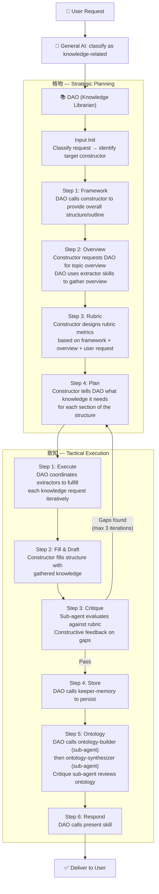
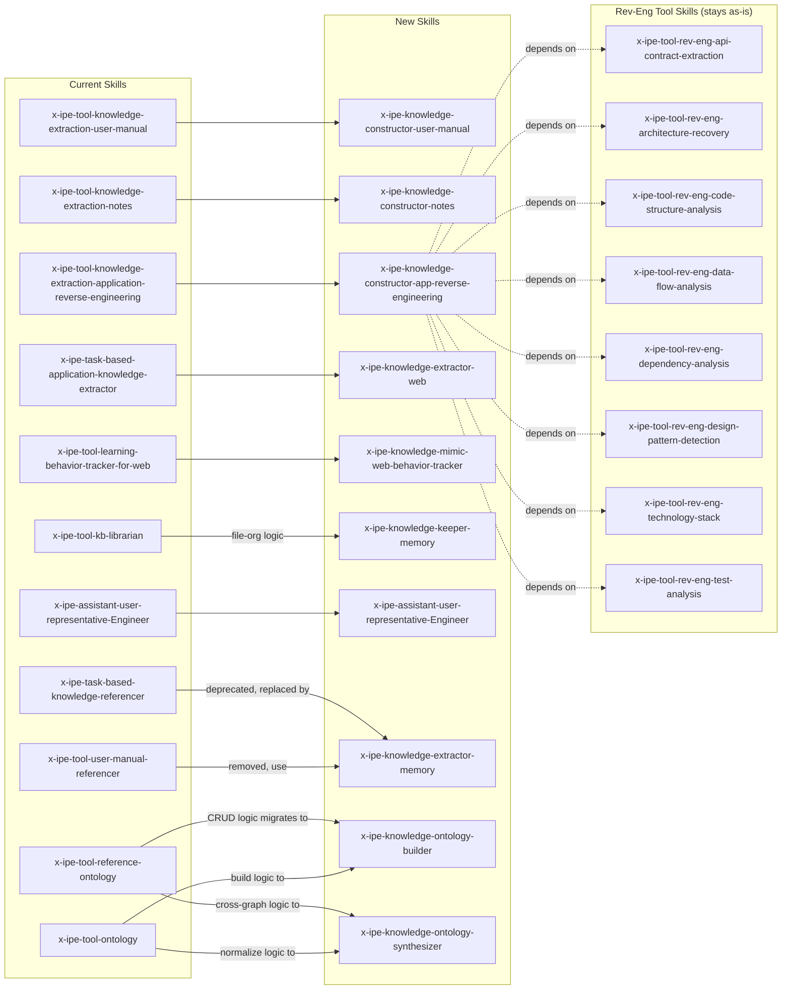

# Idea Summary

> Idea ID: IDEA-041
> Folder: 041. CR-Rebuild Knowledge Skills
> Version: v5
> Created: 2026-04-14
> Updated: 2026-04-16
> Status: Refined (v5: add synthesize_id and synthesize_message to ontology class meta and instance data)

## Overview

A comprehensive restructuring of all knowledge-related skills in X-IPE, introducing two new skill namespaces (`x-ipe-knowledge-*` and `x-ipe-assistant-*`) that replace the current scattered knowledge tooling with a systematic, pipeline-oriented architecture. The design follows an ETL-inspired pattern: **extract** (source) → **construct** (synthesize) → **keep** (store) → **present** (output), with **mimic** (track) running in parallel for dynamic knowledge. All coordinated by a Knowledge Librarian assistant using a 格物致知 (investigate things to extend knowledge) methodology with iterative replanning support. "Memory" becomes the unified term covering context window, working memory, and long-term storage.

## Problem Statement

Knowledge-related capabilities in X-IPE have grown organically across multiple skill types (task-based, tool, dao) without a cohesive organizational principle. This leads to:

1. **Scattered responsibilities** — extraction logic lives in `x-ipe-task-based-application-knowledge-extractor`, formatting in `x-ipe-tool-knowledge-extraction-*`, storage in `x-ipe-tool-kb-librarian`, retrieval in `x-ipe-tool-ontology` / `x-ipe-task-based-knowledge-referencer`, and user-manual lookup in `x-ipe-tool-user-manual-referencer`
2. **No central coordinator** — no single skill understands the full knowledge lifecycle to plan multi-step knowledge operations
3. **Naming inconsistency** — "knowledge base" is used interchangeably with internal storage; no clear mental model for developers
4. **Missing capabilities** — no structured way to track dynamic/procedural knowledge, no flexible output targeting, no unified memory model with different tiers

## Target Users

- **X-IPE Agent Framework** — agents executing knowledge-related tasks benefit from clearer skill routing
- **X-IPE Developers** — contributors can more easily find and extend knowledge skills
- **End Users** — users get more intelligent knowledge workflows orchestrated by the librarian-DAO
- **Knowledge Librarian (DAO assistant)** — the new coordinator skill that needs well-defined tools to call

## Proposed Solution

### 1. New `x-ipe-knowledge-*` Namespace (5 Sub-Categories)

Introduce "knowledge" as a new skill type in `x-ipe-meta-skill-creator` that uses an **Operations + Steps** structure — each skill defines named operations with typed input/output contracts, callable individually by the DAO orchestrator. This differs from task-based skills (linear phase backbone) and bare tool skills (scripts). See **Section 1c** for the full operation catalog.

| Sub-Category | Pipeline Order | Purpose | Skills |
|---|---|---|---|
| **extractor** | 1st | Extract raw knowledge from target sources | `web`, `memory` |
| **constructor** | 2nd | Synthesize extracted inputs into structured, holistic representations | `user-manual`, `notes`, `app-reverse-engineering` |
| **mimic** | (parallel) | Track dynamic/procedural knowledge over time, consolidate into static views | `web-behavior-tracker` |
| **keeper** | 3rd | Persist knowledge to storage tiers | `memory` (supports `memory_type`: working / episodic / semantic / procedural) |
| **present** | 4th | Output knowledge to target endpoints | `to-user`, `to-knowledge-graph` (read/visualize: generates ontology graph for UI from content + tags) |

### 1b. New `x-ipe-knowledge-ontology-*` Sub-Namespace

Introduce "ontology" as a new skill namespace for ontology graph construction and cross-graph synthesis. These skills manage the `.ontology/` folder — building, normalizing, and linking knowledge graph nodes.

| Skill | Purpose |
|---|---|
| **builder** | Discover and build the ontology structure from constructed knowledge. 5-step process: discover nodes → discover properties (web search + context analysis) → create instances → critique & validate → register vocabulary. Uses iterative breadth-first strategy with sub-agents |
| **synthesizer** | Cross-graph integration: (1) discover related ontology graphs, (2) normalize/wash tags and terms for consistency, (3) link nodes across graphs. Bumps `synthesis_version` on merged classes |

> **Builder strategy — 5-step discovery process:**
> 1. **Discover nodes** — Breadth-first scan of constructed knowledge to identify top-level classes, create meta entries with description, source_files, parent hierarchy
> 2. **Discover properties** — For each class: (a) web search for general attributes of this class type, (b) analyze knowledge context to design project-specific attributes, (c) propose property schema with kind/range/cardinality
> 3. **Create instances** — Fill out data instances per class, applying discovered properties (null for N/A attributes)
> 4. **Critique & validate** — Sub-agent reviews property accuracy, term consistency with vocabulary, completeness. Constructive feedback loop
> 5. **Register vocabulary** — Add newly discovered terms to vocabulary schemes with proper broader/narrower hierarchy
>
> Sub-agents can parallelize step 2 across different classes. Step 4-5 may loop back to step 2-3 if critique reveals schema gaps.

> **Synthesizer workflow — 3-phase integration:**
> 1. **Discover** — Find related ontology graphs (other knowledge domains, imported graphs, or previously built sub-graphs) that may share concepts
> 2. **Wash** — Normalize tags, terms, and labels across graphs to ensure consistent vocabulary (e.g., "user-manual" vs "user_manual" vs "User Manual" → single canonical term)
> 3. **Link** — Connect matching nodes across graphs, establishing cross-domain relationships and resolving duplicates

> **Pipeline order clarification:** The actual data flow is **extract → construct → keep → present**. Extractors gather raw material, constructors synthesize it into structured knowledge, keepers persist it, and presenters deliver it. Mimic skills run in parallel during extraction when tracking dynamic/procedural knowledge is needed.

> **Note on "mimic" sub-category:** Currently contains only `web-behavior-tracker`. This sub-category is justified because behavioral tracking is fundamentally different from point-in-time extraction — it requires session-spanning observation, event correlation, and temporal consolidation. Future candidates include `cli-behavior-tracker` and `api-interaction-tracker`. If no second mimic skill materializes within 2 releases, consider folding into extractor with a `--track` mode.

#### Skill Catalog (by sub-category)

**Extractor** — Extract raw knowledge from sources

| Full Skill Name | Purpose |
|---|---|
| `x-ipe-knowledge-extractor-web` | Extract raw knowledge from web sources by controlling a browser via Chrome DevTools MCP — navigates pages, reads content, captures structured data |
| `x-ipe-knowledge-extractor-memory` | Retrieve and search existing knowledge from persistent memory storage |

**Constructor** — Synthesize into structured representations

| Full Skill Name | Purpose |
|---|---|
| `x-ipe-knowledge-constructor-user-manual` | Synthesize extracted inputs into structured user manual documentation |
| `x-ipe-knowledge-constructor-notes` | Synthesize extracted inputs into structured notes (meeting notes, braindumps, etc.) |
| `x-ipe-knowledge-constructor-app-reverse-engineering` | Synthesize application analysis into structured knowledge; depends on 8 `x-ipe-tool-rev-eng-*` tool skills |

**Mimic** — Track dynamic/procedural knowledge

| Full Skill Name | Purpose |
|---|---|
| `x-ipe-knowledge-mimic-web-behavior-tracker` | Track web interaction behavior across sessions, consolidate observations into static knowledge views |

**Keeper** — Persist knowledge to storage tiers

| Full Skill Name | Purpose |
|---|---|
| `x-ipe-knowledge-keeper-memory` | Unified knowledge persistence based on Tulving's memory model. Supports 4 `memory_type` tiers: **working** (session-scoped, ephemeral), **episodic** (personal preferences, lessons learned), **semantic** (facts, findings, tagged concepts), **procedural** (behavior patterns, sequences, user manuals) |

#### Memory Folder Structure

```
x-ipe-docs/memory/                          # root — replaces old "knowledge base"
├── .working/                               # working memory (session-scoped, ephemeral)
├── .ontology/                              # ontology — Schema / Instances / Vocabulary model
│   ├── schema/                             #   Schema layer (what CAN exist)
│   │   └── class-registry.jsonl            #     Class definitions: meta + properties per class
│   ├── instances/                          #   Data layer (what DOES exist)
│   │   ├── _index.json                     #     Manifest of all instance files + stats
│   │   ├── instance.001.jsonl              #     Entity instances (chunked, 5000 lines each)
│   │   ├── instance.002.jsonl              #     Auto-created when previous chunk is full
│   │   ├── _relations.001.jsonl            #     Object-property relations (chunked, 5000 lines each)
│   │   ├── _relations.002.jsonl            #     Auto-created when previous chunk is full
│   │   └── _derived/                       #     Auto-generated named graph views (read-only)
│   │       └── {named-graph}.jsonl
│   └── vocabulary/                         #   Controlled terms (what we CALL things)
│       ├── _index.json                     #     Manifest of all vocabulary schemes
│       ├── technology.json                 #     e.g., Python > Flask, JavaScript > React
│       ├── domain.json
│       ├── abstraction.json
│       ├── audience.json
│       ├── lifecycle.json
│       └── content-type.json
├── episodic/                               # personal preferences, lessons learned
├── semantic/                               # facts, findings, tagged concepts
└── procedural/                             # behavior patterns, sequences, user manuals
```

> **Folder conventions:**
> - `.working/` and `.ontology/` are dot-prefixed (hidden) — they are system-managed, not user-facing
> - `.working/` is ephemeral — contents may be cleared between sessions
> - `.ontology/` follows a three-layer model: **Schema** (class definitions), **Instances** (data entities), **Vocabulary** (controlled terms with broader/narrower hierarchy)
> - `episodic/`, `semantic/`, `procedural/` are persistent, user-browsable knowledge stores
> - This structure replaces the current `x-ipe-docs/knowledge-base/` directory
>
> **Scalability strategy:**
> - **Relations** use chunked files (`_relations.001.jsonl`, `_relations.002.jsonl`, ...) — max **5000 records per chunk**. Write appends to the highest-numbered chunk; a new chunk is auto-created when the current one is full. Relations grow O(n²) with entities, so chunking is applied here proactively.
> - **Instances** use the same chunking pattern (`instance.001.jsonl`, `instance.002.jsonl`, ...) — max **5000 records per chunk**. Each JSONL line self-describes via its `"class"` field, so class routing is in the data, not the filesystem. The `_index.json` manifest tracks which instances are in which chunk.
> - **Schema files** stay as single files (no chunking) — unlikely to exceed thousands of records. Chunking can be added later as a non-breaking change if needed.

#### Ontology Model — Schema / Instances / Vocabulary

**Schema — Class Registry** (`schema/class-registry.jsonl`)

Each line defines one class. A class has two sections:
- **`meta`** — X-IPE system metadata (description, lineage, versioning)
- **`properties`** — domain-specific attributes discovered by the ontology-builder

```jsonl
{"class":"knowledge-artifact","meta":{"parent":null,"abstract":true,"description":"Root class for all knowledge entities","source_files":["x-ipe-docs/memory/"],"synthesis_version":"1.0","synthesize_id":"2026-04-10T07:00:00Z","synthesize_message":"Initial ontology build","synthesized_with":[],"created":"2026-04-10T07:00:00Z","updated":"2026-04-10T07:00:00Z"},"properties":{"label":{"kind":"datatype","range":"string","cardinality":"single","required":true},"description":{"kind":"datatype","range":"string","cardinality":"single"},"weight":{"kind":"datatype","range":"integer","cardinality":"single","constraints":{"min":1,"max":10,"default":5}},"source_files":{"kind":"datatype","range":"string","cardinality":"multi","required":true},"hasTechnology":{"kind":"vocabulary","range":"vocabulary:technology","cardinality":"multi"},"hasDomain":{"kind":"vocabulary","range":"vocabulary:domain","cardinality":"multi"},"hasAbstraction":{"kind":"vocabulary","range":"vocabulary:abstraction","cardinality":"single"},"hasAudience":{"kind":"vocabulary","range":"vocabulary:audience","cardinality":"multi"},"hasLifecycle":{"kind":"vocabulary","range":"vocabulary:lifecycle","cardinality":"single"},"hasContentType":{"kind":"vocabulary","range":"vocabulary:content-type","cardinality":"single"},"dependsOn":{"kind":"object","range":"knowledge-artifact","cardinality":"multi","constraints":{"acyclic":true}},"partOf":{"kind":"object","range":"knowledge-artifact","cardinality":"multi"},"relatedTo":{"kind":"object","range":"knowledge-artifact","cardinality":"multi"}}}
{"class":"document","meta":{"parent":"knowledge-artifact","abstract":false,"description":"Structured written knowledge","source_files":[],"synthesis_version":"1.0","synthesize_id":"2026-04-10T07:00:00Z","synthesize_message":"Initial ontology build","synthesized_with":[],"created":"2026-04-10T07:00:00Z","updated":"2026-04-10T07:00:00Z"},"properties":{"format":{"kind":"datatype","range":"string","cardinality":"single"},"sections":{"kind":"datatype","range":"string","cardinality":"multi"}}}
{"class":"user-manual","meta":{"parent":"document","description":"Step-by-step user documentation","source_files":["x-ipe-docs/memory/procedural/"],"synthesis_version":"1.0","synthesize_id":"2026-04-10T07:00:00Z","synthesize_message":"Initial ontology build","synthesized_with":[],"created":"2026-04-10T07:00:00Z","updated":"2026-04-10T07:00:00Z"},"properties":{"target_application":{"kind":"datatype","range":"string","cardinality":"single"},"version":{"kind":"datatype","range":"string","cardinality":"single"}}}
```

> **Meta fields:**
> - `parent` — class hierarchy (walk up for property inheritance; child overrides parent if same key)
> - `abstract` — if true, cannot have direct instances (only subclasses can)
> - `description` — what this class represents
> - `source_files` — which knowledge files informed this class definition
> - `synthesis_version` — version counter, bumped each time ontology-synthesizer merges/links this class with others
> - `synthesize_id` — ISO 8601 timestamp of when the ontology-synthesizer last ran on this class; used to determine whether a re-synthesis is needed (e.g., if source content changed after this timestamp)
> - `synthesize_message` — human-readable description of the synthesis run's purpose (e.g., "Initial ontology build", "Cross-graph merge with Project-B auth domain", "Vocabulary normalization pass")
> - `synthesized_with` — list of class names from other graphs this was synthesized with (audit trail)
> - `created` / `updated` — timestamps
>
> **Properties** are the domain-specific attributes the ontology-builder discovers for each class. See "Builder Discovery Process" below for how these are generated.

**Instances — Data Entities** (`instances/instance.NNN.jsonl`)

Each line is one entity instance. Properties are flat (no nested `dimensions` bag):

```jsonl
{"id":"know_001","class":"user-manual","label":"X-IPE Workflow Mode User Manual","description":"Complete user manual...","weight":8,"source_files":["x-ipe-docs/memory/procedural/x-ipe-workflow-mode/index.md"],"hasTechnology":["Flask","Python"],"hasDomain":["frontend","backend"],"hasAbstraction":"overview","hasAudience":["end-users","developers"],"hasLifecycle":"active","hasContentType":"reference","target_application":"X-IPE","version":"1.0","synthesize_id":"2026-04-10T07:19:03Z","synthesize_message":"Initial ontology build","created":"2026-04-10T07:19:03Z","updated":"2026-04-10T07:19:03Z"}
```

> - Instances use sequentially numbered chunk files (`instance.001.jsonl`, `instance.002.jsonl`, ...) — max **5000 records per chunk**, same pattern as relations. Each line self-describes via its `"class"` field, so class filtering is done at query time, not file organization time
> - Object-property relations (dependsOn, partOf, relatedTo) live in chunked `_relations.NNN.jsonl` files (max 5000 records per chunk; append to highest-numbered chunk, auto-split when full)
> - `_derived/` holds auto-generated named graph views (read-only, rebuilt by graph operations)
> - Attributes can be `null` or omitted if not applicable for a particular instance (e.g., a Feature doesn't need `target_application`)
> - `synthesize_id` and `synthesize_message` are present on each instance — same semantics as the class meta fields. When the synthesizer touches an instance (e.g., re-tagging, relinking), it updates these fields so the instance records when and why it was last synthesized

**Vocabulary — Controlled Concept Schemes** (`vocabulary/{scheme}.json`)

Each file is one concept scheme with broader/narrower hierarchy (SKOS-inspired):

```json
{
  "scheme": "technology",
  "version": "1.0",
  "description": "Programming languages, frameworks, and tools",
  "concepts": {
    "Python": {
      "label": "Python",
      "description": "Python programming language",
      "narrower": ["Flask", "FastAPI", "uv"]
    },
    "Flask": {
      "label": "Flask",
      "broader": "Python",
      "description": "Python web microframework",
      "related": ["Jinja2"]
    }
  }
}
```

> - `broader` / `narrower` / `related` enable smart queries ("find all Python knowledge" catches Flask too)
> - New terms are added by the ontology-builder during property discovery (step 5 below)
> - The ontology-synthesizer normalizes/washes terms during cross-graph integration

#### Skill → Memory Folder Mapping

| Skill | Reads From | Writes To |
|---|---|---|
| `x-ipe-knowledge-extractor-web` | *(web via Chrome DevTools MCP)* | `.working/` |
| `x-ipe-knowledge-extractor-memory` | `episodic/`, `semantic/`, `procedural/`, `.ontology/` | *(read-only)* |
| `x-ipe-knowledge-constructor-user-manual` | `.working/` | `.working/` |
| `x-ipe-knowledge-constructor-notes` | `.working/` | `.working/` |
| `x-ipe-knowledge-constructor-app-reverse-engineering` | `.working/` + rev-eng tools | `.working/` |
| `x-ipe-knowledge-mimic-web-behavior-tracker` | *(browser sessions)* | `.working/` |
| `x-ipe-knowledge-keeper-memory` | `.working/` | `episodic/`, `semantic/`, `procedural/` |
| `x-ipe-knowledge-present-to-user` | `episodic/`, `semantic/`, `procedural/` | *(output to user)* |
| `x-ipe-knowledge-present-to-knowledge-graph` | `semantic/`, `procedural/`, `.ontology/` | *(output to UI)* |
| `x-ipe-knowledge-ontology-builder` | `semantic/`, `procedural/` | `.ontology/` |
| `x-ipe-knowledge-ontology-synthesizer` | `.ontology/` (multiple graphs) | `.ontology/` (normalized + linked) |
| `x-ipe-assistant-knowledge-librarian-DAO` | *(all folders — orchestrator)* | *(delegates to keeper-memory)* |

> **Write discipline:** Only `keeper-memory` moves knowledge from `.working/` to persistent content folders (`episodic/`, `semantic/`, `procedural/`). Only `ontology-builder` writes entities to `.ontology/`, and only `ontology-synthesizer` writes relationships. All extractors, constructors, and mimic skills write exclusively to `.working/`. This enforces the critique → store gate — nothing persists until the Librarian validates it.
>
> **Separation of concerns:**
> - `keeper-memory` / `memory_ops.py` — **file CRUD only** (write/read/move/delete content `.md` files). Uses meaningful slug filenames derived from title (e.g., `flask-jinja2-templating.md`), not IDs. No separate index file — metadata lives in ontology entities.
> - `ontology-builder` — **registers entities** in `.ontology/instances/instance.NNN.jsonl` (entity per file with label, dimensions, source_files)
> - `ontology-synthesizer` — **builds and maintains relationships** between entities across graphs

**Present** — Output knowledge to endpoints

| Full Skill Name | Purpose |
|---|---|
| `x-ipe-knowledge-present-to-user` | Format and deliver knowledge output to the user |
| `x-ipe-knowledge-present-to-knowledge-graph` | Generate ontology graph visualization for UI from content + tags (read-only, does not write to ontology) |

**Ontology** — Build and integrate knowledge graphs

| Full Skill Name | Purpose |
|---|---|
| `x-ipe-knowledge-ontology-builder` | Discover and build ontology structure from constructed knowledge using iterative breadth-first strategy with sub-agents expanding node-by-node |
| `x-ipe-knowledge-ontology-synthesizer` | Cross-graph integration: discover related graphs → wash/normalize tags and terms → link nodes across graphs |

**Assistant** — Orchestration and human representation

| Full Skill Name | Purpose |
|---|---|
| `x-ipe-assistant-user-representative-Engineer` | Represent human intent at decision points (DAO pattern) |
| `x-ipe-assistant-knowledge-librarian-DAO` | Coordinate all knowledge operations using 格物致知 workflow; orchestrates extractor → constructor → keeper → present pipeline |

### 1c. Knowledge Skill Internal Structure — Operations + Steps

Knowledge skills use an **Operations + Steps** pattern instead of the phase backbone (博学之→笃行之) used by task-based skills. This is because the DAO orchestrator calls individual operations on a knowledge skill at different points during a single workflow — the skill is a **service**, not a linear pipeline.

#### Why Not Phases?

| Aspect | Task-Based (phases) | Knowledge (operations) |
|---|---|---|
| **Invocation** | Called once, runs start-to-finish | Called multiple times for different operations |
| **Caller** | Human / workflow engine | DAO orchestrator (AI) |
| **State** | Internal — skill manages its own state across phases | External — DAO manages state, passes context per operation |
| **Flow control** | Linear: 博学之 → 审问之 → 慎思之 → 明辨之 → 笃行之 | Non-linear: DAO decides which operation to call next |
| **Example** | Bug-fix: study → diagnose → test → fix → verify | Constructor: framework → (DAO extracts) → rubric → (DAO extracts) → fill |

> **Key insight:** In the constructor-driven workflow, the DAO calls `provide_framework` first, then goes away to coordinate extractors, then comes back with results and calls `design_rubric`, then goes away again, then calls `request_knowledge`, etc. The constructor doesn't "run" — it **responds** to operation calls. This is fundamentally a service pattern.

#### Operation Contract Structure

Each operation in a knowledge skill follows this contract:

```yaml
operation:
  name: "operation_name"
  description: "What this operation does"
  input:
    param_1: { type: string, required: true, description: "..." }
    param_2: { type: object, required: false, description: "..." }
  output:
    result_1: { type: object, description: "..." }
  steps:
    - "Step 1: ..."
    - "Step 2: ..."
  writes_to: ".working/{sub-path}/"
  constraints:
    - "BLOCKING: ..."
```

#### Operations by Sub-Category

---

**Extractor** — 2 operations

| Operation | Input | Output | Writes To | Description |
|---|---|---|---|---|
| `extract_overview` | `target`, `depth` (shallow\|medium) | `overview_content`, `source_map` | `.working/overview/` | Lightweight extraction for topic overview — faster, less detailed, used during 格物 phase to give the constructor initial context |
| `extract_details` | `target` (URL/path/query), `scope` (full\|section\|specific), `format_hints` | `extracted_content`, `metadata` | `.working/extracted/` | Detailed extraction from source — navigates, reads, captures structured data for specific knowledge requests from the constructor |

> **Extractor-web** operations use Chrome DevTools MCP internally. **Extractor-memory** operations query persistent memory folders via search/read.
>
> **Two-phase extraction pattern:** The constructor first calls `extract_overview` (via DAO) to understand the landscape, then designs rubric and identifies gaps, then calls `extract_details` (via DAO) for the specific sections/content it needs. This avoids over-extraction — only fetch what the constructor actually requests.

**Steps example — `extractor-web.extract_overview`:**
1. Navigate to target URL via Chrome DevTools MCP
2. Scan page structure (headings, navigation, sitemap)
3. Extract high-level content (titles, summaries, section names)
4. Build source map (what content exists where)
5. Write overview to `.working/overview/`

**Steps example — `extractor-web.extract_details`:**
1. Receive specific knowledge request from constructor (via DAO)
2. Navigate to target page/section via Chrome DevTools MCP
3. Extract detailed content per scope (full page, specific section, or targeted query)
4. Capture metadata (title, date, author, URL, structure context)
5. Write structured output to `.working/extracted/`

---

**Constructor** — 4 operations (the richest — drives the workflow)

| Operation | Input | Output | Writes To | Description |
|---|---|---|---|---|
| `provide_framework` | `request_context`, `output_format` | `framework_document`, `toc_structure` | `.working/framework/` | Provide the overall structure/outline for the target knowledge artifact |
| `design_rubric` | `framework`, `overview`, `user_request` | `rubric_metrics[]`, `acceptance_criteria[]` | `.working/rubric/` | Design measurable evaluation criteria based on framework + overview + user context |
| `request_knowledge` | `framework`, `current_state`, `rubric` | `knowledge_requests[]` | `.working/plan/` | Assess gaps between current state and framework, return prioritized list of what knowledge is needed per section |
| `fill_structure` | `framework`, `gathered_knowledge[]`, `rubric` | `completed_draft` | `.working/draft/` | Map gathered knowledge to framework sections, produce complete draft |

> **Constructor is the domain expert.** It knows what a user manual should look like (`constructor-user-manual`), what notes should contain (`constructor-notes`), or how to structure a reverse-engineering report (`constructor-app-reverse-engineering`). The DAO doesn't have this domain knowledge — it relies on the constructor to tell it what to fetch.

**Steps example — `constructor-user-manual.provide_framework`:**
1. Analyze request context (what repo/app, user's stated goal)
2. Load user-manual domain template (ToC: Overview, Getting Started, Features, API Reference, Troubleshooting, FAQ)
3. Adapt template to request specifics (e.g., CLI app → add Commands section, web app → add UI Walkthrough section)
4. Return framework document with section stubs

**Steps example — `constructor-user-manual.design_rubric`:**
1. For each framework section, define completeness criteria (e.g., "Getting Started has ≥3 steps with code examples")
2. For each framework section, define accuracy criteria (e.g., "API endpoints match actual code")
3. Weight criteria by user request priority (what did they emphasize?)
4. Return rubric with measurable metrics per section

**Steps example — `constructor-user-manual.request_knowledge`:**
1. Walk through framework sections
2. For each section, check `current_state` — what knowledge already exists
3. Identify gaps (empty sections, thin content, missing examples)
4. For each gap, generate a specific knowledge request: "I need the list of CLI commands with their flags" or "I need the authentication flow diagram"
5. Prioritize by rubric weight (high-weight gaps first)
6. Return `knowledge_requests[]` — each with target section, what's needed, suggested extractor

---

**Mimic** — 3 operations

| Operation | Input | Output | Writes To | Description |
|---|---|---|---|---|
| `start_tracking` | `target_app`, `session_config` | `tracking_session_id` | `.working/observations/` | Begin observing user interactions (browser sessions, CLI usage) |
| `stop_tracking` | `tracking_session_id` | `observation_summary`, `raw_events[]` | `.working/observations/` | End observation, consolidate raw events into structured observations |
| `get_observations` | `tracking_session_id`, `filter` | `observations[]` | *(read-only)* | Retrieve current or historical observations for a session |

---

**Keeper** — 2 operations

| Operation | Input | Output | Writes To | Description |
|---|---|---|---|---|
| `store` | `content`, `memory_type` (episodic\|semantic\|procedural), `metadata`, `tags[]` | `stored_path`, `memory_entry_id` | target memory folder | Persist validated knowledge from `.working/` to the specified persistent memory folder |
| `promote` | `working_path`, `memory_type`, `metadata` | `promoted_path` | target memory folder | Move a `.working/` artifact to persistent storage — shorthand for read + store + clean |

> **Gate enforcement:** `store` and `promote` are the ONLY write paths to persistent folders. Both require `memory_type` to route correctly: `episodic/` for personal/lessons, `semantic/` for facts/concepts, `procedural/` for behavior/manuals.

---

**Present** — 2 operations

| Operation | Input | Output | Writes To | Description |
|---|---|---|---|---|
| `render` | `content_path`, `target` (user), `format` | `rendered_output` | *(output only)* | Format knowledge for the user — markdown, structured response, summary |
| `connector` | `content_path`, `graph_data`, `target` (knowledge-graph), `ui_callback_config` | `graph_visualization`, `callback_status` | *(output via UI callback)* | Generate ontology graph for UI — calls UI callback to trigger graph rendering in the frontend |

> **Why `connector` instead of `preview`?** The knowledge graph use case isn't just "render some content" — it requires calling a UI callback to generate an interactive ontology visualization in the frontend. This is a fundamentally different operation: `render` is content-out, `connector` is integration with an external system (the UI graph renderer).

---

**Ontology-Builder** — 5 operations (discovery → schema → instance → critique → vocabulary)

| Operation | Input | Output | Writes To | Description |
|---|---|---|---|---|
| `discover_nodes` | `source_content` (from semantic/procedural), `depth_limit` | `node_tree[]`, `discovery_report` | `.working/ontology/` | Breadth-first scan: identify top-level classes/concepts from constructed knowledge |
| `discover_properties` | `class_meta`, `source_content`, `web_search_template` | `proposed_properties[]`, `search_results` | `.working/ontology/` | For each class: (1) web search general attributes for this type, (2) analyze knowledge context to design specific attributes, then propose property schema |
| `create_instances` | `class_registry`, `source_content`, `property_schema` | `instances[]` | `.working/ontology/instances/` | Create data-level instances — fill out properties for each entity (can be `null` if N/A for a particular instance) |
| `critique_validate` | `class_registry`, `instances[]`, `vocabulary_index` | `critique_report`, `term_issues[]` | `.working/ontology/` | Sub-agent validates: property accuracy, term consistency with vocabulary, completeness. Provides constructive feedback |
| `register_vocabulary` | `new_terms[]`, `target_scheme` | `updated_vocabulary`, `added_terms[]` | `.working/ontology/vocabulary/` | Add newly discovered terms to vocabulary schemes (e.g., new technology, new domain). Maintains broader/narrower hierarchy |

> **Builder Discovery Process (5 steps):**
>
> **Step 1 — Discover nodes** (`discover_nodes`): Breadth-first scan of constructed knowledge to identify top-level classes. For each class, create a `meta` entry with `description`, `source_files`, `parent` hierarchy.
>
> **Step 2 — Discover properties** (`discover_properties`): For each discovered class:
> 1. **General search** — use web search with a template: *"What are the common attributes/properties of a {class_label}? e.g., for UserManual: table of contents, target application, version, audience..."* This provides a baseline of what properties this type of knowledge typically has.
> 2. **Context-specific design** — analyze the actual knowledge content + class meta to identify attributes that are specific to this project's context (e.g., a UserManual for a CLI tool might need `supported_platforms`, while one for a web app needs `browser_support`)
> 3. **Propose schema** — output property definitions with `kind`, `range`, `cardinality`, linking vocabulary properties to the correct scheme
>
> **Step 3 — Create instances** (`create_instances`): For each entity in the source content, create a data instance that fills out the discovered properties. Properties can be `null` if not applicable for a specific instance (e.g., `browser_support` is N/A for a CLI tool manual).
>
> **Step 4 — Critique & validate** (`critique_validate`): Sub-agent reviews:
> - Are property values accurate and consistent?
> - Do vocabulary terms exist in the registry? Flag unknown terms
> - Are there missing properties the class should have?
> - Constructive feedback: suggest additions, corrections, term normalizations
>
> **Step 5 — Register vocabulary** (`register_vocabulary`): For any new terms discovered during steps 2-4 that don't exist in vocabulary schemes — add them with proper `broader`/`narrower` relationships. E.g., discovered "Vite" → add to `technology.json` with `broader: "JavaScript"`.
>
> **Sub-agent pattern:** `discover_nodes` finds top-level classes, then the DAO dispatches parallel sub-agents — each runs `discover_properties` on a different class. After all classes have schemas, `create_instances` and `critique_validate` run. Finally, `register_vocabulary` adds any missing terms.

---

**Ontology-Synthesizer** — 3 operations (mirrors the 3-phase workflow)

| Operation | Input | Output | Writes To | Description |
|---|---|---|---|---|
| `discover_related` | `source_graph`, `search_scope` | `related_graphs[]`, `overlap_candidates[]` | `.working/ontology/` | Find existing ontology graphs that share concepts with the source graph |
| `wash_terms` | `graphs[]`, `overlap_candidates[]` | `canonical_vocabulary`, `normalization_map` | `.working/ontology/` | Normalize tags, terms, labels across graphs to a single canonical vocabulary |
| `link_nodes` | `graphs[]`, `normalization_map`, `canonical_vocabulary` | `linked_graph`, `cross_references[]` | `.working/ontology/` | Connect matching nodes across graphs, establish cross-domain relationships |

> **Synthesis versioning:** When the synthesizer merges or links classes across graphs, it bumps `synthesis_version` in the class meta and records which classes were synthesized in `synthesized_with`. It also sets `synthesize_id` to the current ISO 8601 timestamp and writes a `synthesize_message` describing the run's purpose. This provides a full audit trail: version 1.0 = original builder output, version 1.1 = synthesized with Project-B's matching class, etc. The `synthesize_id` timestamp enables staleness detection — if source content has changed since the last `synthesize_id`, the synthesizer knows a re-run is warranted. Both `synthesize_id` and `synthesize_message` appear on class meta and instance data, so each entity records when and why it was last touched by the synthesizer.

---

#### Skill Type Comparison Summary

| Skill Type | Structure | Caller | State Model | When to Use |
|---|---|---|---|---|
| **task-based** (`x-ipe-task-based-*`) | Phase backbone (博学之→笃行之) | Human / workflow engine | Internal — skill owns state | User-facing workflows (bug-fix, implement, refine) |
| **tool** (`x-ipe-tool-*`) | Scripts + Operations | Any skill / agent | Stateless — caller manages | Utility operations (git, architecture DSL, linting) |
| **knowledge** (`x-ipe-knowledge-*`) | Operations + Steps | DAO orchestrator | External — DAO passes context per call | Knowledge pipeline services (extract, construct, store) |
| **assistant** (`x-ipe-assistant-*`) | Orchestration procedure | General AI / workflow | Manages workflow state | Coordination (librarian-DAO, user-representative) |

> **Design principle:** Knowledge skills are **stateless services** — each operation receives full context as input and returns results as output. The DAO maintains state between calls. This enables the DAO to interleave operations from different skills (e.g., call constructor.provide_framework → extractor.extract_overview → constructor.design_rubric) without the skills needing to know about each other.

### 2. New `x-ipe-assistant-*` Namespace (Replaces `x-ipe-dao-*`)

Replace the "dao" skill type with "assistant" — uses the same DAO SKILL.md template structure, then deprecates the "dao" type.

| Assistant | Purpose | Migrates From |
|---|---|---|
| **user-representative-Engineer (工程师)** | Represent human intent at decision points | `x-ipe-assistant-user-representative-Engineer` |
| **knowledge-librarian-DAO (道)** | Coordinate all knowledge operations using 格物致知 | *New* (not a replacement of `x-ipe-tool-kb-librarian`) |

### 3. Knowledge Librarian Workflow (格物致知)

The librarian (DAO) follows a **constructor-driven** methodology: the constructor skill defines the knowledge structure and iteratively requests what it needs from the DAO, who coordinates extraction and other skills to fulfill each request.



> **Constructor-driven paradigm:** Unlike a traditional ETL pipeline where the orchestrator decides everything upfront, here the **constructor** is the domain expert that knows what knowledge structure looks like. It drives the process by:
> 1. Providing the framework/outline first
> 2. Requesting the DAO to gather an overview of the topic
> 3. Designing rubric metrics based on its domain expertise + the overview + user context
> 4. Iteratively telling the DAO what specific knowledge it needs to fill each section
>
> The **DAO** acts as the coordinator who fulfills these requests by dispatching extractors, managing sub-agents, and routing to keeper/present skills.

> **Ontology phase (致知 Step 5):** After the main content is stored to persistent memory, the DAO dispatches two sub-agents sequentially:
> 1. `ontology-builder` sub-agent — reads from persisted `semantic/` and `procedural/` folders, iteratively builds ontology nodes from the constructed knowledge (breadth-first, node-by-node)
> 2. `ontology-synthesizer` sub-agent — discovers related existing graphs, normalizes vocabulary, links nodes
> 3. A critique sub-agent reviews the ontology construction and synthesis — provides constructive feedback on node accuracy, link quality, and term consistency
>
> Only after ontology critique passes does the workflow proceed to Respond.

#### Workflow Examples

**Example A: "Extract knowledge from this GitHub repo and create a user manual"**

*Prerequisite: Input initialization identifies target constructor as `constructor-user-manual`*

| Phase | Step | Actor | Action | Writes To |
|---|---|---|---|---|
| 格物 | 1. Framework | DAO → `constructor-user-manual` | Constructor provides overall user manual structure (ToC: Overview, Getting Started, Features, API Reference, Troubleshooting, etc.) | `.working/framework/` |
| 格物 | 2. Overview | `constructor-user-manual` → DAO → `extractor-web` | Constructor asks DAO "I need a high-level overview of this repo". DAO uses extractor-web (Chrome DevTools MCP) to browse repo, README, landing page | `.working/overview/` |
| 格物 | 3. Rubric | `constructor-user-manual` | Constructor designs rubric metrics based on framework + overview + user request (e.g., "all ToC sections filled", "code examples for each API endpoint", "step-by-step for Getting Started") | `.working/rubric/` |
| 格物 | 4. Plan | `constructor-user-manual` → DAO | Constructor tells DAO: "For section 1 I need X, for section 2 I need Y..." — iterative knowledge requests per section | `.working/plan/` |
| 致知 | 5. Execute | DAO → `extractor-web` + `rev-eng tools` | DAO coordinates: browse API docs for API Reference section, analyze code structure for Architecture section, etc. — fulfilling each constructor request | `.working/extracted/` |
| 致知 | 6. Fill & Draft | `constructor-user-manual` | Constructor fills each section with gathered knowledge, produces complete draft | `.working/manual-draft/` |
| 致知 | 7. Critique | Sub-agent | Evaluate draft against rubric — are all sections complete? code examples present? accuracy? | — |
| | | *(if gaps)* | Loop back to Step 4: constructor requests missing knowledge → DAO extracts → constructor fills (max 3 iterations) | — |
| 致知 | 8. Store | DAO → `keeper-memory` | Persist manual to `procedural/` (file only) | `procedural/` |
| 致知 | 9. Ontology | DAO → sub-agents | `ontology-builder` reads from persisted content, builds nodes (repo concepts, API entities, feature taxonomy); `ontology-synthesizer` links with existing project graphs; critique sub-agent reviews | `.working/ontology/` |
| 致知 | 10. Respond | DAO → `present-to-user` | Format and deliver the user manual | *(output)* |

**Example B: "What do we know about authentication patterns?"**

*Prerequisite: Input initialization identifies target constructor as `constructor-notes`*

| Phase | Step | Actor | Action | Writes To |
|---|---|---|---|---|
| 格物 | 1. Framework | DAO → `constructor-notes` | Constructor provides notes structure (Definition, Common Patterns, Best Practices, Project-Specific Usage, References) | `.working/framework/` |
| 格物 | 2. Overview | `constructor-notes` → DAO → `extractor-memory` | Constructor asks DAO for topic overview. DAO searches existing memory (`semantic/`, `procedural/`) for auth-related knowledge | `.working/overview/` |
| 格物 | 3. Rubric | `constructor-notes` | Design rubric based on what's in memory + what user asked (e.g., "covers OAuth, JWT, session-based", "includes project-specific patterns if any") | `.working/rubric/` |
| 格物 | 4. Plan | `constructor-notes` → DAO | Constructor requests: "I have enough for Definition from memory. I need web sources for latest OAuth 2.1 changes. I need project-specific examples." | `.working/plan/` |
| 致知 | 5. Execute | DAO → `extractor-web` | DAO browses OAuth 2.1 spec docs via Chrome DevTools MCP for the gap areas only | `.working/extracted/` |
| 致知 | 6. Fill & Draft | `constructor-notes` | Merge memory results + web findings into structured notes per framework | `.working/auth-notes/` |
| 致知 | 7. Critique | Sub-agent | Evaluate against rubric — all pattern types covered? sources cited? | — |
| 致知 | 8. Store | DAO → `keeper-memory` | Persist notes to `semantic/` (file only) | `semantic/` |
| 致知 | 9. Ontology | DAO → sub-agents | `ontology-builder` reads from persisted content, creates auth concept nodes; `ontology-synthesizer` links to existing security/identity graphs; critique reviews | `.working/ontology/` |
| 致知 | 10. Respond | DAO → `present-to-user` | Deliver consolidated answer | *(output)* |

**Example C: "Learn how the admin panel works by watching me use it"**

*Prerequisite: Input initialization identifies target constructor as `constructor-user-manual` (output is a manual), with `mimic-web-behavior-tracker` for data collection*

| Phase | Step | Actor | Action | Writes To |
|---|---|---|---|---|
| 格物 | 1. Framework | DAO → `constructor-user-manual` | Constructor provides admin manual structure (Workflows, UI Components, Navigation Paths, Common Tasks) | `.working/framework/` |
| 格物 | 2. Overview | `constructor-user-manual` → DAO → `mimic-web-behavior-tracker` | Constructor asks for overview. DAO activates mimic to observe user's browser sessions on admin panel | `.working/observations/` |
| 格物 | 3. Rubric | `constructor-user-manual` | Design rubric from observed workflows + framework (e.g., "each observed workflow has step-by-step", "screenshots for key screens", "all navigation paths documented") | `.working/rubric/` |
| 格物 | 4. Plan | `constructor-user-manual` → DAO | Constructor: "I saw 5 workflows. For Workflow 1 I need detailed steps for sub-task X. For Workflow 3 I need the settings page content." | `.working/plan/` |
| 致知 | 5. Execute | DAO → `extractor-web` + `mimic` | DAO browses specific pages via Chrome DevTools MCP to fill gaps, mimic captures additional sessions if needed | `.working/extracted/` |
| 致知 | 6. Fill & Draft | `constructor-user-manual` | Constructor fills manual with observed workflows + extracted details | `.working/admin-manual-draft/` |
| 致知 | 7. Critique | Sub-agent | Are all observed workflows captured? Step descriptions complete? | — |
| 致知 | 8. Store | DAO → `keeper-memory` | Manual to `procedural/`, raw observations to `episodic/` (file only) | `procedural/`, `episodic/` |
| 致知 | 9. Ontology | DAO → sub-agents | `ontology-builder` reads from persisted content, builds admin panel concept nodes; `ontology-synthesizer` links to existing app graphs; critique reviews | `.working/ontology/` |
| 致知 | 10. Respond | DAO → `present-to-user` | Deliver manual + knowledge graph link | *(output)* |

**Example D: "Connect the knowledge from Project A and Project B"**

*Prerequisite: Input initialization — no constructor needed; this is a pure ontology operation*

| Phase | Step | Actor | Action | Writes To |
|---|---|---|---|---|
| 格物 | 1. Inventory | DAO → `extractor-memory` | Load existing ontology graphs for Project A and Project B from `.ontology/` | `.working/graphs/` |
| 格物 | 2. Rubric | DAO | Design rubric: "all shared concepts linked", "no false-positive links", "terms normalized to canonical vocabulary", "no orphaned nodes" | `.working/rubric/` |
| 格物 | 3. Plan | DAO | Plan: synthesizer discover → wash → link; then critique | `.working/plan/` |
| 致知 | 4. Execute | DAO → `ontology-synthesizer` sub-agent | Phase 1: Discover overlapping concepts between the two graphs | `.working/overlap-analysis/` |
| 致知 | 5. Wash | DAO → `ontology-synthesizer` sub-agent | Phase 2: Normalize tags — unify "user-auth" vs "authentication" vs "login" → canonical terms | `.working/normalized-terms/` |
| 致知 | 6. Link | DAO → `ontology-synthesizer` sub-agent | Phase 3: Link matching nodes, establish cross-project relationships | `.working/linked-graph/` |
| 致知 | 7. Critique | Sub-agent | Evaluate: links accurate? false positives? normalization consistent? | — |
| | | *(if gaps)* | Loop back to Step 3: re-plan → re-synthesize (max 3 iterations) | — |
| 致知 | 8. Store | DAO → `keeper-memory` | Persist merged/linked graph to `.ontology/` (synthesizer already wrote it; keeper validates) | `.ontology/` |
| 致知 | 9. Respond | DAO → `present-to-knowledge-graph` | Generate visualization of connected graph for UI | *(output)* |

> **Key patterns in planning:**
> - **Constructor drives, DAO coordinates** — the constructor defines structure and tells the DAO what it needs; the DAO dispatches extractors and sub-agents to fulfill
> - **Rubric is constructor-designed** — based on framework + overview + user context, not generic
> - Plans always route through `.working/` — no skill writes directly to persistent folders
> - `keeper-memory` is the file gatekeeper between `.working/` and persistent content storage; `ontology-builder` and `ontology-synthesizer` handle `.ontology/` writes separately
> - **Store happens immediately after content passes critique** — keeper-memory persists to `semantic/`/`procedural/` first, then ontology-builder reads from persisted content to register entities → synthesizer links them → ontology critique, as a standard phase before Respond
> - The Librarian can branch based on what's already in memory (Example B: skip web extraction if memory is sufficient)
> - Multi-skill chains are valid — each reads the previous output from `.working/`
> - Pure ontology operations (Example D) skip the constructor entirely — DAO drives directly

### 4. Terminology Change

- **"Knowledge Base" → "Memory"** — across all UI, docs, and skill references
- **"DAO" → "Assistant"** — as a skill type namespace (DAO remains as a name for the librarian persona)

### 5. Migration Map



> **Migration principle:**
> New `knowledge-*` skills MUST follow the standard X-IPE skill backbone (博学之 → 审问之 → 慎思之 → 明辨之 → 笃行之 phase structure). The Knowledge Librarian (格物致知) workflow with rubric/critique loop orchestrates *when* and *how* these skills are invoked — but each individual skill's internal structure uses the 博学之 etc. phases. Only cherry-pick useful logic from old skills — do NOT copy structure or patterns that conflict with the new architecture.
>
> **Per-skill migration notes:**
> - `x-ipe-task-based-knowledge-referencer` — **deprecated and removed**; fully replaced by `x-ipe-knowledge-extractor-memory`
> - `x-ipe-tool-user-manual-referencer` — **removed**; callers (e.g., general-purpose-executor) should use `x-ipe-knowledge-extractor-memory` with appropriate knowledge_type filter
> - `x-ipe-tool-reference-ontology` — **migrated**; CRUD logic moves to `x-ipe-knowledge-ontology-builder`, cross-graph logic to `x-ipe-knowledge-ontology-synthesizer`
> - `x-ipe-tool-ontology` — **migrated**; ontology operations absorbed into `x-ipe-knowledge-ontology-builder` (build/write) and `x-ipe-knowledge-ontology-synthesizer` (normalize/link)
> - All `x-ipe-tool-rev-eng-*` skills (8 total) — **stay as-is**; they are low-level tool skills that `x-ipe-knowledge-constructor-app-reverse-engineering` depends on (same pattern as current `x-ipe-tool-knowledge-extraction-application-reverse-engineering`)
> - `x-ipe-knowledge-keeper-staging` — **removed**; folded into `keeper-memory` as `memory_type: working`
>
> **Known conflicts to avoid during migration:**
>
> | Old Skill Pattern | Conflict with New Architecture | Resolution |
> |---|---|---|
> | Old skills embed their own workflow orchestration | New architecture uses the shared Knowledge Librarian (格物致知) workflow with rubric + critique loop | Strip orchestration logic; let the Librarian workflow drive execution |
> | Old extractors write directly to KB files | New architecture separates Critique → Store; only validated knowledge gets persisted | Extract the "what to extract" logic; discard the direct-write-to-KB path |
> | `kb-librarian` mixes file organization with knowledge validation | New architecture splits these: keeper-memory (file org + working/long-term tiers), Librarian workflow (validation) | Take file-org logic only into keeper-memory; validation moves to workflow |
> | Old referencer skills have their own search/retrieval pipelines | New architecture consolidates retrieval into `extractor-memory` | Take any useful query patterns; discard the standalone retrieval pipeline |
> | Some old skills define their own quality criteria inline | New architecture generates rubrics dynamically from inventory + user context | Do not copy hardcoded quality criteria; let rubric step generate them |

### 6. Architecture Overview

```architecture-dsl
@startuml module-view
title "X-IPE Knowledge Architecture"
theme "theme-default"
direction top-to-bottom
grid 12 x 10

layer "Assistants" {
  color "#E8F5E9"
  border-color "#4CAF50"
  rows 2

  module "Human Interface" {
    cols 5
    rows 2
    grid 1 x 1
    align center center
    gap 8px
    component "user-representative\nEngineer (工程师)" { cols 1, rows 1 }
  }

  module "Knowledge Coordinator" {
    cols 7
    rows 2
    grid 1 x 1
    align center center
    gap 8px
    component "knowledge-librarian\nDAO (道)" { cols 1, rows 1 }
  }
}

layer "Knowledge Pipeline" {
  color "#E3F2FD"
  border-color "#2196F3"
  rows 3

  module "Constructor" {
    cols 3
    rows 2
    grid 1 x 3
    align center center
    gap 8px
    component "user-manual" { cols 1, rows 1 }
    component "notes" { cols 1, rows 1 }
    component "app-reverse\nengineering" { cols 1, rows 1 }
  }

  module "Extractor" {
    cols 2
    rows 2
    grid 1 x 2
    align center center
    gap 8px
    component "web" { cols 1, rows 1 }
    component "memory\n(search/retrieve)" { cols 1, rows 1 }
  }

  module "Mimic" {
    cols 2
    rows 2
    grid 1 x 1
    align center center
    gap 8px
    component "web-behavior\ntracker" { cols 1, rows 1 }
  }

  module "Keeper" {
    cols 2
    rows 2
    grid 2 x 2
    align center center
    gap 8px
    component "memory\n(working)" { cols 1, rows 1 }
    component "memory\n(episodic)" { cols 1, rows 1 }
    component "memory\n(semantic)" { cols 1, rows 1 }
    component "memory\n(procedural)" { cols 1, rows 1 }
  }

  module "Present" {
    cols 3
    rows 2
    grid 1 x 2
    align center center
    gap 8px
    component "to-user" { cols 1, rows 1 }
    component "to-knowledge\ngraph (visualize)" { cols 1, rows 1 }
  }
}

layer "Ontology" {
  color "#F3E5F5"
  border-color "#9C27B0"
  rows 2

  module "Ontology Builder" {
    cols 6
    rows 2
    grid 1 x 1
    align center center
    gap 8px
    component "builder\n(breadth-first\nsub-agents)" { cols 1, rows 1 }
  }

  module "Ontology Synthesizer" {
    cols 6
    rows 2
    grid 1 x 1
    align center center
    gap 8px
    component "synthesizer\n(discover → wash → link)" { cols 1, rows 1 }
  }
}

layer "Infrastructure" {
  color "#FFF3E0"
  border-color "#FF9800"
  rows 2

  module "Storage" {
    cols 12
    rows 2
    grid 2 x 1
    align center center
    gap 8px
    component "Memory\n(x-ipe-docs/memory/)" { cols 1, rows 1 }
    component "Rev-Eng Tools\n(8 skills)" { cols 1, rows 1 }
  }
}

@enduml
```

## Key Features

- **Pipeline-oriented knowledge processing** — clear separation of extract → construct → keep → present, with mimic running in parallel
- **Central coordinator (Librarian-DAO)** — intelligent planning and execution of multi-step knowledge operations with iterative replanning (max 3 cycles)
- **Tulving memory model** — 4 memory tiers (working, episodic, semantic, procedural) within a unified `keeper-memory` skill
- **Holistic Memory concept** — "Memory" covers context window, working memory, and long-term storage — a unified abstraction
- **Ontology graph construction** — `ontology-builder` uses iterative breadth-first strategy with sub-agents expanding node-by-node from constructed knowledge
- **Cross-graph synthesis** — `ontology-synthesizer` discovers related graphs, normalizes vocabulary, and links nodes across domains
- **Flexible output targeting** — present knowledge to users or generate knowledge-graph visualizations from content + ontology tags
- **Dynamic knowledge tracking** — mimic skills for procedural/time-series knowledge consolidation
- **格物致知 methodology** — strategic inventory + planning before tactical execution, with iterative refinement
- **Auto-discovery** — Librarian-DAO discovers knowledge skills via glob pattern, consistent with X-IPE conventions

## Success Criteria

- [ ] All existing knowledge-related skills migrated to new namespace — verified by: each old skill has a redirect/alias, all existing tests still pass
- [ ] `x-ipe-meta-skill-creator` updated with "knowledge" and "assistant" skill type templates — verified by: can create a new skill of each type using the creator
- [ ] Knowledge Librarian (DAO) can route a user request through the full pipeline (classify → plan → extract → construct → keep → present) — verified by: end-to-end smoke test with a "learn to use X from Y.com" scenario
- [ ] "Knowledge Base" renamed to "Memory" across UI and documentation — verified by: grep for "knowledge base" returns zero hits outside of migration notes
- [ ] "DAO" type replaced by "assistant" type in skill creator; old type deprecated — verified by: skill creator rejects "dao" type with deprecation message
- [ ] Staging keeper supports session-scope temporary storage — verified by: stage → use → session-end cleanup test; separate test for explicit save-to-memory via keeper-memory
- [ ] `x-ipe-task-based-knowledge-referencer` removed; all memory search/retrieve handled by `extractor-memory` — verified by: old referencer call sites redirected, extractor-memory handles all retrieval scenarios
- [ ] `x-ipe-tool-user-manual-referencer` removed; general-purpose-executor updated to use `extractor-memory` — verified by: general-purpose-executor smoke test passes with extractor-memory

## Constraints & Considerations

- **Backward compatibility**: Existing skill invocations must continue to work during migration (alias/redirect period). Define a dual-routing shim where old skill names forward to new namespace during transition
- **Incremental migration**: Skills should be migrated one at a time, not all at once — each migration is its own CR/feature
- **Rollback strategy**: During migration, both old and new skills coexist. If the Librarian-DAO misbehaves, agents fall back to direct skill invocation (pre-librarian behavior). Each migration PR must be independently revertable
- **Rename blast-radius audit**: Renaming "dao" → "assistant" affects: custom instructions glob patterns, SKILL.md procedure steps referencing `x-ipe-dao-*`, skill-creator templates, and any hardcoded skill names. A dedicated audit task must precede the rename
- **Ontology skills under knowledge namespace**: `x-ipe-knowledge-ontology-builder` and `x-ipe-knowledge-ontology-synthesizer` live under `x-ipe-knowledge-ontology-*` — a sub-namespace within `x-ipe-knowledge-*` dedicated to ontology graph operations. Old `x-ipe-tool-ontology` and `x-ipe-tool-reference-ontology` are migrated into these new skills
- **Template reuse**: Knowledge skills use the task-based SKILL.md structure (phases, DoR, DoD) — no new template format needed, just a new namespace
- **Librarian-DAO ≠ kb-librarian**: The new assistant-knowledge-librarian-DAO is a *coordinator* that calls knowledge skills; the old kb-librarian's *file organization* logic moves to keeper-memory
- **API contract extraction**: `x-ipe-tool-rev-eng-api-contract-extraction` is a sub-section of app-reverse-engineering and migrates with it
- **Direct invocation vs Librarian routing**: Knowledge skills CAN be invoked directly by other task-based skills (e.g., code-implementation calling extractor-memory). The Librarian-DAO is the *preferred* entry point for complex multi-step knowledge tasks, but not a mandatory gateway — this avoids single-point-of-failure and unnecessary latency for simple lookups
- **Unified memory with tiers (Tulving model)**: `keeper-memory` supports 4 `memory_type` tiers following Tulving's memory classification: `working` (session-scoped, ephemeral), `episodic` (personal preferences, lessons learned), `semantic` (facts, findings — tagged and connected to ontology graph), `procedural` (behavior patterns, sequences, user manuals — tagged and connected to ontology graph). The `.ontology/` folder maintains the knowledge graph connecting all semantic and procedural knowledge
- **Memory is holistic**: "Memory" covers the full cognitive spectrum — from ephemeral working memory to persistent long-term stores. The folder structure under `x-ipe-docs/memory/` mirrors this model
- **Iterative replanning with guard**: The Librarian-DAO supports iterative replanning (extract → construct → realize gap → re-plan → extract more), similar to the deep-research option in existing knowledge extractor. Max iterations capped (default: 3 cycles) to prevent infinite loops
- **Skill discovery via glob**: The Librarian-DAO discovers available knowledge skills at runtime via `.github/skills/x-ipe-knowledge-*/` glob pattern, consistent with existing X-IPE auto-discovery mechanism. No separate registry needed

## Brainstorming Notes

### Key Design Decisions

1. **Why "constructor" not "formatter"?** — Constructors do more than format; they synthesize raw inputs into structured knowledge representations with context, relationships, and completeness checks

2. **Why "mimic" not "tracker"?** — Mimic implies learning by observing and replicating behavior patterns, not just recording events. It consolidates dynamic knowledge from beginning to end into a static, holistic view

3. **Why keep DAO as a persona name?** — DAO (道) represents the philosophical concept of "the way" — the librarian who understands the path through all knowledge. It's a persona name, not a type name

4. **Unified memory model (Tulving's classification)** — `keeper-memory` supports 4 `memory_type` tiers based on Endel Tulving's memory model:
   - **working** → `.working/` — session-scoped, ephemeral, for intermediate results during execution
   - **episodic** → `episodic/` — personal preferences, lessons learned, context-bound experiences
   - **semantic** → `semantic/` — facts, findings, tagged concepts connected to ontology graph
   - **procedural** → `procedural/` — behavior patterns, sequences, user manuals
   
   The `.ontology/` folder maintains the knowledge graph linking all semantic and procedural knowledge. Root is `x-ipe-docs/memory/`, replacing the old `knowledge-base` directory

5. **Extractor-memory replaces referencer** — `extractor-memory` fully replaces the current `x-ipe-task-based-knowledge-referencer`. There is no longer a separate referencer skill — all memory access (search, retrieve) goes through extractor-memory. The librarian-DAO coordinates when to search memory vs extract from web

### Resolved Questions (v2)

| # | Question | Answer |
|---|---|---|
| 1 | Should `x-ipe-tool-user-manual-referencer` migrate under knowledge namespace? | **Removed.** Callers should use `extractor-memory` directly with appropriate knowledge_type filter |
| 2 | Should there be a separate `x-ipe-knowledge-constructor-api-contract`? | **No.** API contract extraction stays coupled with `app-reverse-engineering` — always used in that context |
| 3 | How does `present-to-knowledge-graph` interact with `x-ipe-tool-ontology`? | **It's a read/visualization skill.** Reads knowledge content + ontology tags and generates an ontology graph for the knowledge-graph UI. Does NOT write to ontology |
| 4 | How does Librarian-DAO discover available knowledge skills? | **Auto-discovery** via `.github/skills/x-ipe-knowledge-*/` glob, consistent with existing X-IPE pattern |
| 5 | Does Librarian-DAO support iterative replanning? | **Yes**, with max-iterations guard (default: 3 cycles), same pattern as deep-research in existing knowledge extractor |
| 6 | Is "Memory" too overloaded a term? | **Keep "Memory"** — intentionally holistic, covering context window, working memory, and long-term storage |

## Implementation Strategy

### Self-Bootstrapping Principle

Skills are **self-bootstrapping** — each skill's `scripts/` folder includes idempotent initialization that creates required folder structures and seed files on first use. No separate infrastructure setup step is needed.

| Responsibility | Owned By | Script | What It Creates |
|---|---|---|---|
| Memory folder structure | `keeper-memory` | `scripts/init_memory.py` | `x-ipe-docs/memory/` tree: `.working/`, `episodic/`, `semantic/`, `procedural/` |
| Ontology schema + vocabulary | `ontology-builder` | `scripts/init_ontology.py` | `.ontology/schema/class-registry.jsonl`, `.ontology/vocabulary/*.json`, `.ontology/instances/_index.json`, `.ontology/instances/instance.001.jsonl` |
| Ontology relation chunks | `ontology-synthesizer` | `scripts/init_relations.py` | `.ontology/instances/_relations.001.jsonl` |

> **Idempotent init pattern:** Each script checks if folders/files exist before creating. Safe to call repeatedly — skips if already initialized. Every operation in the skill calls `ensure_initialized()` before executing.

### Build Layers

| Layer | Skills / Work Items | Rationale |
|---|---|---|
| **0 — Prerequisites** | Update `x-ipe-meta-skill-creator` with "knowledge" + "assistant" templates; update custom instructions with `x-ipe-knowledge-*` glob | Must exist before any new skill can be created |
| **1 — Core** | `keeper-memory` (bootstraps memory folders), `extractor-web`, `extractor-memory` | No cross-dependencies on other new skills; keeper-memory is the write gatekeeper everything else needs |
| **2 — Domain** | `constructor-user-manual`, `constructor-notes`, `constructor-app-reverse-engineering`, `mimic-web-behavior-tracker`, `ontology-builder` (bootstraps `.ontology/`) | Depend on Layer 1 operation contracts (called via DAO); ontology-builder needs memory structure from keeper-memory |
| **3 — Integration** | `ontology-synthesizer` (bootstraps relations), `present-to-user`, `present-to-knowledge-graph` | Depend on Layer 2 outputs; synthesizer needs builder's ontology data |
| **4 — Orchestrator** | `assistant-knowledge-librarian-DAO`, `assistant-user-representative-Engineer` (migration) | The 格物致知 coordinator — needs all knowledge skills to exist before it can orchestrate them |
| **5 — Web App & Migration** | Rename "Knowledge Base" → "Memory" in UI (~30 hits across `kb_service.py`, `kb_routes.py`, `kb-*.js`, sidebar, templates); update ontology graph viewer to new `.ontology/` structure; `present-to-knowledge-graph` UI callback endpoint; alias/redirect old skill names → new; deprecate & remove old skills (one PR per skill, independently revertable) |

> **Build order rationale:**
> - **Bottom-up:** core services → domain logic → integration → orchestrator → UI
> - **Each layer is testable in isolation** before the next layer starts
> - **Web app changes happen last** — skills work file-based first, UI adapts after
> - **Self-bootstrapping eliminates a separate infra phase** — Layer 1 skills create the foundation as a side-effect of their first operation

### Web Application Updates (Layer 5 Detail)

| Area | Files Affected | Change |
|---|---|---|
| Rename "Knowledge Base" → "Memory" | `kb_service.py`, `kb_routes.py`, `kb-browse.js`, `kb-browse-modal.js`, `kb-reference-picker.js`, `kb-article-editor.js`, `sidebar.js`, `sidebar.css`, `index.html`, `content-renderer.js`, `instructions-template.md`, `instructions-template-no-dao.md` | Update labels, route names, service references |
| Ontology graph viewer | `ontology_graph_service.py`, `ontology_graph_routes.py`, `ontology-graph-viewer.js`, `ontology-graph-canvas.js`, `ontology-graph-socket.js` | Point at new `.ontology/` structure (schema/instances/vocabulary instead of flat JSONL) |
| Present connector endpoint | `ontology_graph_routes.py`, new handler | Add UI callback endpoint for `present-to-knowledge-graph` connector operation |
| Scaffold / project init | `scaffold.py` | Update to reference `x-ipe-docs/memory/` instead of `knowledge-base/` |

## Source Files

- `x-ipe-docs/ideas/041. CR-Rebuild Knowledge Skills/new idea.md`

## Next Steps

- [ ] Proceed to **Requirement Gathering** to break down into implementation CRs per layer
- [ ] Proceed to **Idea to Architecture** for detailed architecture DSL diagrams
- [ ] **Layer 0 first**: Update `x-ipe-meta-skill-creator` templates to support "knowledge" and "assistant" types

## References & Common Principles

### Applied Principles

- **ETL Pipeline Pattern**: Separating extraction, transformation, and loading stages mirrors the established data engineering pattern — applied here as extract → construct → keep
- **Memory Hierarchy (Tulving's Cognitive Architecture)**: Memory tiers (working → episodic → semantic → procedural) within a single `keeper-memory` skill follow Endel Tulving's (1972) memory classification — well-established in cognitive science and AI agent frameworks. The `.ontology/` graph connects semantic and procedural knowledge into a navigable network
- **Coordinator/Orchestrator Pattern**: A central coordinator (Librarian-DAO) that plans and delegates to specialized workers is a proven multi-agent system pattern
- **Separation of Concerns**: Each knowledge sub-category has exactly one responsibility — no overlap between constructors, extractors, keepers, and presenters

### Further Reading

- Knowledge Management in Multi-Agent Systems — agent-based knowledge extraction and coordination patterns
- 格物致知 (Gewu Zhizhi) — Neo-Confucian epistemology: investigate things to extend knowledge, applied as a two-phase planning methodology
