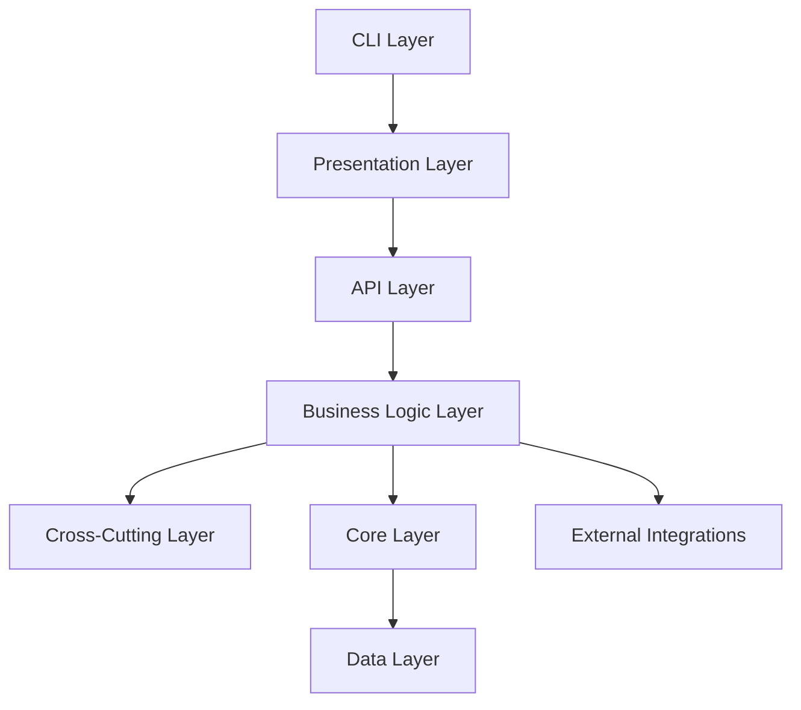
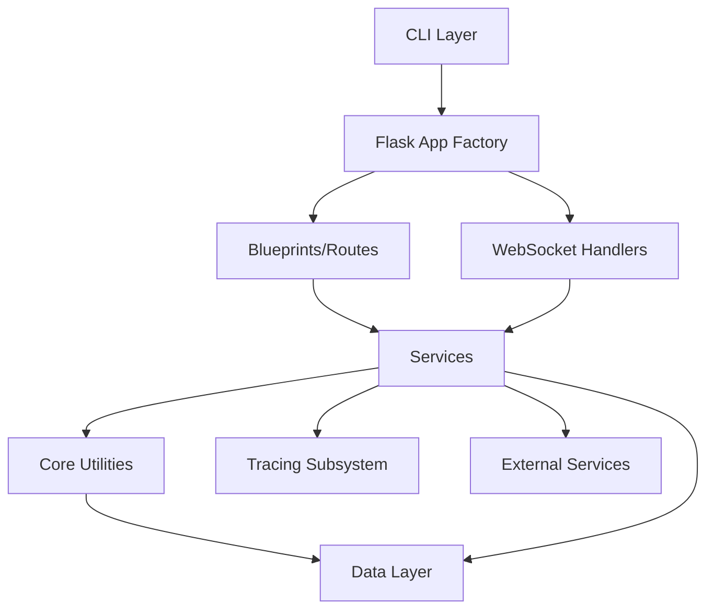

# Idea Summary

> Idea ID: IDEA-020
> Folder: 101. Research-X-IPE Module Architecture
> Version: v1
> Created: 2026-02-11
> Status: Refined

## Overview

A comprehensive module architecture diagram of the X-IPE platform — an AI-native integrated project environment for end-to-end business value delivery. This research idea captures the full system decomposition across 7 architectural layers, 19 services, 11 API blueprints, 16 frontend feature modules, and external integrations.

## Problem Statement

X-IPE has grown organically into a rich platform with CLI, web UI, WebSocket, tracing, knowledge base, voice input, multi-CLI adapter, and skill management capabilities. A clear, up-to-date module architecture diagram is needed to:
- Communicate system structure to new contributors
- Guide future feature placement decisions
- Identify coupling and dependency patterns
- Serve as a living architectural reference

## Target Users

- X-IPE developers and AI agents working on the codebase
- Human reviewers evaluating architectural decisions
- New team members onboarding to the project

## Proposed Solution

Create a comprehensive layered Module View using Architecture DSL, organized into 7 layers by architectural responsibility with services grouped by functional domain. Include external integrations as a separate layer.

## Key Features



## Module Architecture — Module View

```architecture-dsl
@startuml module-view
title "X-IPE Platform — Module Architecture"
theme "theme-default"
direction top-to-bottom
grid 12 x 14

' ===========================================
' Layer 1: CLI (rows 1)
' ===========================================
layer "CLI" {
  color "#f3e8ff"
  border-color "#a855f7"
  rows 1

  module "CLI Commands" {
    cols 12
    rows 1
    grid 5 x 1
    align center center
    gap 8px
    component "init" { cols 1, rows 1 }
    component "serve" { cols 1, rows 1 }
    component "upgrade" { cols 1, rows 1 }
    component "status" { cols 1, rows 1 }
    component "info" { cols 1, rows 1 }
  }
}

' ===========================================
' Layer 2: Presentation (rows 2)
' ===========================================
layer "Presentation" {
  color "#fce7f3"
  border-color "#ec4899"
  rows 2

  module "Jinja2 Templates" {
    cols 3
    rows 2
    grid 2 x 3
    align center center
    gap 8px
    component "base.html" { cols 1, rows 1 }
    component "index.html" { cols 1, rows 1 }
    component "workplace.html" { cols 1, rows 1 }
    component "knowledge-base.html" { cols 1, rows 1 }
    component "settings.html" { cols 1, rows 1 }
    component "uiux-feedbacks.html" { cols 1, rows 1 }
  }

  module "Frontend JS Features" {
    cols 6
    rows 2
    grid 4 x 4
    align center center
    gap 8px
    component "workplace.js" { cols 1, rows 1 }
    component "sidebar.js" { cols 1, rows 1 }
    component "content-editor.js" { cols 1, rows 1 }
    component "folder-view.js" { cols 1, rows 1 }
    component "stage-toolbox.js" { cols 1, rows 1 }
    component "voice-input.js" { cols 1, rows 1 }
    component "tracing-dashboard.js" { cols 1, rows 1 }
    component "tracing-graph.js" { cols 1, rows 1 }
    component "homepage-infinity.js" { cols 1, rows 1 }
    component "kb-core.js" { cols 1, rows 1 }
    component "quality-evaluation.js" { cols 1, rows 1 }
    component "project-switcher.js" { cols 1, rows 1 }
    component "tree-search.js" { cols 1, rows 1 }
    component "tree-drag.js" { cols 1, rows 1 }
    component "live-refresh.js" { cols 1, rows 1 }
    component "confirm-dialog.js" { cols 1, rows 1 }
  }

  module "Core and Renderers" {
    cols 3
    rows 2
    grid 1 x 3
    align center center
    gap 8px
    component "init.js" { cols 1, rows 1 }
    component "content-renderer.js" { cols 1, rows 1 }
    component "architecture-dsl\nrenderer" { cols 1, rows 1 }
  }
}

' ===========================================
' Layer 3: API (rows 2)
' ===========================================
layer "API" {
  color "#fef3c7"
  border-color "#f97316"
  rows 2

  module "REST Blueprints" {
    cols 9
    rows 2
    grid 3 x 3
    align center center
    gap 8px
    component "main_routes\n/ /workplace\n/knowledge-base" { cols 1, rows 1 }
    component "ideas_routes\n/api/ideas/*" { cols 1, rows 1 }
    component "settings_routes\n/api/settings" { cols 1, rows 1 }
    component "project_routes\n/api/projects" { cols 1, rows 1 }
    component "tools_routes\n/api/config/tools\n/api/themes" { cols 1, rows 1 }
    component "proxy_routes\n/api/proxy" { cols 1, rows 1 }
    component "tracing_routes\n/api/tracing/*" { cols 1, rows 1 }
    component "kb_routes\n/api/kb/*" { cols 1, rows 1 }
    component "quality_eval_routes\n/api/quality-evaluation" { cols 1, rows 1 }
  }

  module "WebSocket Handlers" {
    cols 3
    rows 2
    grid 1 x 2
    align center center
    gap 8px
    component "terminal_handlers\nattach/input/resize" { cols 1, rows 1 }
    component "voice_handlers\nstart/audio/stop" { cols 1, rows 1 }
  }
}

' ===========================================
' Layer 4: Business Logic (rows 3)
' ===========================================
layer "Business Logic" {
  color "#dbeafe"
  border-color "#3b82f6"
  rows 3

  module "Project Services" {
    cols 3
    rows 3
    grid 1 x 4
    align center center
    gap 8px
    component "FileService\nProjectService\nContentService" { cols 1, rows 1 }
    component "IdeasService" { cols 1, rows 1 }
    component "KBService" { cols 1, rows 1 }
    component "HomepageService" { cols 1, rows 1 }
  }

  module "Config Services" {
    cols 3
    rows 3
    grid 1 x 4
    align center center
    gap 8px
    component "ConfigService\n.x-ipe.yaml" { cols 1, rows 1 }
    component "SettingsService\nSQLite" { cols 1, rows 1 }
    component "ToolsConfigService\ntools.json" { cols 1, rows 1 }
    component "PromptConfigService\ncopilot-prompt.json" { cols 1, rows 1 }
  }

  module "Platform Services" {
    cols 3
    rows 3
    grid 1 x 3
    align center center
    gap 8px
    component "TerminalService\nSessionManager\nPTYSession" { cols 1, rows 1 }
    component "ProxyService\nURL rewriting" { cols 1, rows 1 }
    component "VoiceInputService\nDashscope SDK" { cols 1, rows 1 }
  }

  module "Extension Services" {
    cols 3
    rows 3
    grid 1 x 4
    align center center
    gap 8px
    component "ThemesService" { cols 1, rows 1 }
    component "SkillsService" { cols 1, rows 1 }
    component "SkillTranslator" { cols 1, rows 1 }
    component "CLIAdapterService\nMCPDeployerService" { cols 1, rows 1 }
  }
}

' ===========================================
' Layer 5: Cross-Cutting (rows 2)
' ===========================================
layer "Cross-Cutting" {
  color "#fff7ed"
  border-color "#d97706"
  rows 2

  module "Tracing Subsystem" {
    cols 8
    rows 2
    grid 4 x 2
    align center center
    gap 8px
    component "TraceContext\ncontextvars" { cols 1, rows 1 }
    component "@x_ipe_tracing()\ndecorator" { cols 1, rows 1 }
    component "TraceBuffer\nin-memory 10MB" { cols 1, rows 1 }
    component "TraceLogWriter\nlog files" { cols 1, rows 1 }
    component "TracingMiddleware\nFlask hooks" { cols 1, rows 1 }
    component "TraceLogParser\nDAG builder" { cols 1, rows 1 }
    component "Redactor\ncredential masking" { cols 1, rows 1 }
    component "TracingService\nlifecycle mgmt" { cols 1, rows 1 }
  }

  module "Observability" {
    cols 4
    rows 2
    grid 1 x 2
    align center center
    gap 8px
    component "UiuxFeedbackService\nfeedback capture" { cols 1, rows 1 }
    component "QualityEvaluation\nproject health" { cols 1, rows 1 }
  }
}

' ===========================================
' Layer 6: Core (rows 2)
' ===========================================
layer "Core" {
  color "#e0e7ff"
  border-color "#6366f1"
  rows 2

  module "Core Utilities" {
    cols 6
    rows 2
    grid 3 x 1
    align center center
    gap 8px
    component "paths.py\nresolve_path\nget_project_root" { cols 1, rows 1 }
    component "hashing.py\nSHA-256\nfile/dir hash" { cols 1, rows 1 }
    component "config.py\nXIPEConfig\n.x-ipe.yaml parse" { cols 1, rows 1 }
  }

  module "Scaffold & Skills" {
    cols 6
    rows 2
    grid 2 x 1
    align center center
    gap 8px
    component "scaffold.py\nScaffoldManager\nproject structure" { cols 1, rows 1 }
    component "skills.py\nSkillsManager\nhash tracking" { cols 1, rows 1 }
  }
}

' ===========================================
' Layer 7: Data (rows 2)
' ===========================================
layer "Data" {
  color "#dcfce7"
  border-color "#22c55e"
  rows 2

  module "Project Files" {
    cols 4
    rows 2
    grid 4 x 1
    align center center
    gap 8px
    component "x-ipe-docs/" { cols 1, rows 1 } <<folder>>
    component "src/" { cols 1, rows 1 } <<folder>>
    component ".github/skills/" { cols 1, rows 1 } <<folder>>
    component "resources/" { cols 1, rows 1 } <<folder>>
  }

  module "Configuration" {
    cols 4
    rows 2
    grid 4 x 1
    align center center
    gap 8px
    component ".x-ipe.yaml" { cols 1, rows 1 } <<file>>
    component "tools.json" { cols 1, rows 1 } <<file>>
    component "copilot-prompt.json" { cols 1, rows 1 } <<file>>
    component "cli-adapters.yaml" { cols 1, rows 1 } <<file>>
  }

  module "Persistence" {
    cols 4
    rows 2
    grid 2 x 1
    align center center
    gap 8px
    component "settings.db\nSQLite" { cols 1, rows 1 } <<db>>
    component "instance/\nsession data" { cols 1, rows 1 } <<folder>>
  }
}

@enduml
```

## Module Architecture — Landscape View (External Integrations)

```architecture-dsl
@startuml landscape-view
title "X-IPE External Integration Landscape"
theme "theme-default"

zone "X-IPE Platform" {
  app "X-IPE Server" as xipe {
    tech: Flask + SocketIO
    platform: Python 3.12+
    status: healthy
  }
  app "X-IPE CLI" as cli {
    tech: Click
    platform: Python
    status: healthy
  }
  database "Settings DB" as db
}

zone "AI CLI Agents" {
  app "GitHub Copilot" as copilot {
    tech: Copilot CLI
    platform: VS Code / CLI
    status: healthy
  }
  app "Claude Code" as claude {
    tech: Claude CLI
    platform: Terminal
    status: healthy
  }
  app "OpenCode" as opencode {
    tech: OpenCode CLI
    platform: Terminal
    status: healthy
  }
}

zone "Cloud Services" {
  app "Alibaba Cloud\nDashscope" as dashscope {
    tech: Speech API
    platform: Cloud
    status: healthy
  }
  app "GitHub" as github {
    tech: Git + MCP
    platform: Cloud
    status: healthy
  }
}

zone "Target Project" {
  app "User Project" as project {
    tech: Any Language
    platform: Local
    status: healthy
  }
  app "Dev Server" as devserver {
    tech: Localhost
    platform: Local
    status: healthy
  }
}

cli --> xipe : "Init / Serve / Upgrade"
xipe --> db : "Persist Settings"
xipe --> project : "Navigate / Edit Files"
xipe --> devserver : "Proxy & Preview"
copilot --> xipe : "Read Skills & Config"
claude --> xipe : "Read Skills & Config"
opencode --> xipe : "Read Skills & Config"
xipe --> dashscope : "Voice Recognition"
xipe --> github : "MCP Config Deploy"
cli --> copilot : "Translate Skills"
cli --> claude : "Translate Skills"
cli --> opencode : "Translate Skills"

@enduml
```

## Architecture Analysis

### Layer Responsibilities

| Layer | Responsibility | Component Count |
|-------|---------------|-----------------|
| CLI | User-facing commands for project lifecycle | 5 commands |
| Presentation | HTML templates, JS feature modules, renderers | 6 templates, 16 JS features, 3 core modules |
| API | HTTP routes (REST) + WebSocket handlers | 11 blueprints, 2 WS handlers |
| Business Logic | Domain services grouped by functional domain | 19 services in 4 groups |
| Cross-Cutting | Tracing pipeline + observability | 8 tracing components, 2 observability modules |
| Core | Shared utilities and project scaffolding | 5 utility modules |
| Data | File system, config files, SQLite persistence | 4 project dirs, 4 config files, 1 DB |

### Key Architectural Patterns

1. **Flask Application Factory** — `create_app()` with Blueprint registration and service injection
2. **Service Layer Pattern** — All business logic encapsulated in service classes, injected via `app.config`
3. **Blueprint-per-Feature** — Each major feature has dedicated routes Blueprint
4. **WebSocket Dual-Protocol** — REST for CRUD, WebSocket for terminal I/O and voice streaming
5. **Cross-Cutting via Decorators** — `@x_ipe_tracing()` applied at service method level
6. **Configuration Cascade** — `.x-ipe.yaml` → `tools.json` → `settings.db` → environment variables
7. **Skill Convention System** — `.github/skills/` directory with SKILL.md convention for AI agent workflows

### Dependency Flow



## Success Criteria

- [x] All 19 services represented in architecture diagram
- [x] All 11 route blueprints mapped
- [x] All 16 frontend JS features included
- [x] CLI layer captured
- [x] External integrations shown in landscape view
- [x] Cross-cutting concerns (tracing) separated
- [x] Architecture DSL renders correctly in X-IPE

## Constraints & Considerations

- Architecture DSL module view has a 12-column grid constraint — services grouped into 4 domains of 3 cols each
- Some services are multi-class (e.g., FileService exports ProjectService + ContentService + FileWatcher)
- The tracing subsystem spans 8 modules (7 in tracing/ package + TracingService) coordinated together
- Skills system lives in `.github/skills/` (file convention) rather than runtime code

## Brainstorming Notes

- User wanted comprehensive view with all components, skills layer, and external integrations
- Grouped services by functional domain (Project, Config, Platform, Extension) for intuitive reading
- External integrations shown via separate Landscape View to avoid cluttering the Module View
- 7 layers chosen to represent the full stack: CLI → Presentation → API → Business → Cross-Cutting → Core → Data

## Source Files

- new idea.md

## Next Steps

- [ ] Proceed to Idea to Architecture (generate renderable HTML)
- [ ] Or proceed to Requirement Gathering (if this becomes a documentation feature)

## References & Common Principles

### Applied Principles

- **Layered Architecture** — Separation of concerns across presentation, business, and data tiers
- **Service Layer Pattern** — Encapsulate domain logic in service classes
- **Application Factory** — Flask best practice for testable, configurable apps
- **12-Column Grid** — Bootstrap-inspired layout for Architecture DSL diagrams

### Further Reading

- Flask Application Factory pattern documentation
- Martin Fowler's Service Layer pattern
- Architecture DSL grammar specification (`.github/skills/x-ipe-tool-architecture-dsl/references/grammar.md`)
