# Idea Summary

> Idea ID: IDEA-102
> Folder: 102. Research-Software Engineering
> Version: v1
> Created: 2026-03-05
> Status: Refined

## Overview

Restructure all X-IPE task-based skills to use the classical Chinese 5-phase learning method (**博学之，审问之，慎思之，明辨之，笃行之**) as the universal structural backbone. Each skill's execution procedure will be organized into 5 mandatory phases — with concrete steps nested under each phase, or explicit SKIP markers where a phase is not applicable. The first batch applies to 8 Ideation-stage and Requirement-stage skills, preceded by updating the skill-creator template itself.

## Problem Statement

The TASK-751 research report revealed systematic gaps across X-IPE task-based skills:

- **笃行之 (Practice Earnestly):** Universal strength — 10/10 skills ✅
- **博学之 (Study Broadly):** 6/10 strong — variable coverage
- **审问之 (Inquire Thoroughly):** Only 3/10 strong — most skills accept inputs without questioning ⚠️
- **慎思之 (Think Carefully):** Only 3/10 strong — reflection and risk analysis rare ⚠️
- **明辨之 (Discern Clearly):** Only 1/10 strong — decisions undocumented, no alternatives ❌

The root cause: skills are designed as **procedural workflows** (do step 1, then step 2, then step 3) rather than **learning cycles** (study → question → reflect → decide → act). This leads to action-heavy, reflection-light processes where AI agents jump to execution without sufficient inquiry or deliberation.

## Target Users

1. **AI Agents** (primary) — agents executing X-IPE skills will follow a more intellectually rigorous process
2. **Skill Creators** — developers creating new X-IPE skills will use the 5-phase template
3. **Human Reviewers** — humans reviewing skill outputs benefit from documented reasoning and decisions

## Proposed Solution

### Core Change: 5-Phase Universal Backbone

Replace the current flat step structure in all task-based skills with a **5-phase hierarchy** based on the Chinese learning method:

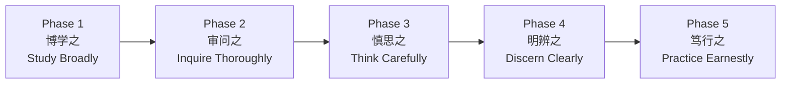

### Structure Pattern

Each skill's **Execution Flow** table becomes phase-based:

```
| Phase | Step | Name | Action | Gate |
|-------|------|------|--------|------|
| 1. 博学之 (Study Broadly) | 1.1 | {Step Name} | {Action} | {Gate} |
| | 1.2 | {Step Name} | {Action} | {Gate} |
| 2. 审问之 (Inquire Thoroughly) | 2.1 | {Step Name} | {Action} | {Gate} |
| 3. 慎思之 (Think Carefully) | — | SKIP | {Reason not applicable} | — |
| 4. 明辨之 (Discern Clearly) | 4.1 | {Step Name} | {Action} | {Gate} |
| 5. 笃行之 (Practice Earnestly) | 5.1 | {Step Name} | {Action} | {Gate} |
```

Each skill's **Execution Procedure** becomes phase-based XML:

```xml
<procedure name="{skill-name}">
  <execute_dor_checks_before_starting/>
  <schedule_dod_checks_with_sub_agent_before_starting/>

  <phase_1 name="博学之 — Study Broadly">
    <step_1_1>
      <name>{Step Name}</name>
      <action>...</action>
      <output>...</output>
    </step_1_1>
    <step_1_2>
      <name>{Step Name}</name>
      <action>...</action>
      <output>...</output>
    </step_1_2>
  </phase_1>

  <phase_2 name="审问之 — Inquire Thoroughly">
    <step_2_1>
      <name>{Step Name}</name>
      <action>...</action>
      <output>...</output>
    </step_2_1>
  </phase_2>

  <phase_3 name="慎思之 — Think Carefully">
    <skip reason="Not applicable: {reason}" />
  </phase_3>

  <phase_4 name="明辨之 — Discern Clearly">
    <step_4_1>
      <name>{Step Name}</name>
      <action>...</action>
      <output>...</output>
    </step_4_1>
  </phase_4>

  <phase_5 name="笃行之 — Practice Earnestly">
    <step_5_1>
      <name>{Step Name}</name>
      <action>...</action>
      <output>...</output>
    </step_5_1>
  </phase_5>
</procedure>
```

### Phase Definitions for Software Engineering

| Phase | Chinese | English | SE Meaning | Typical Activities |
|-------|---------|---------|------------|-------------------|
| 1 | **博学之** | Study Broadly | Gather comprehensive context before acting | Read specs, study domain, analyze existing code, research patterns, load configurations |
| 2 | **审问之** | Inquire Thoroughly | Question assumptions and probe for gaps | Ask clarifying questions, challenge requirements, identify ambiguities, probe edge cases |
| 3 | **慎思之** | Think Carefully | Reflect on trade-offs, risks, and alternatives | Analyze feasibility, assess risks, consider trade-offs, evaluate alternatives, plan approach |
| 4 | **明辨之** | Discern Clearly | Make informed decisions with documented rationale | Choose between alternatives, resolve conflicts, document decision rationale, confirm approach |
| 5 | **笃行之** | Practice Earnestly | Execute with discipline, verify with rigor | Implement, test, verify, commit, document, review — the action and verification steps |

### Skip Phase Rules

- All 5 phases MUST appear in every skill (maintaining the backbone)
- Non-applicable phases use explicit `<skip reason="..." />` with a standardized reason
- Skip reasons document WHY the phase doesn't apply, preserving intellectual honesty
- Common skip patterns:
  - Phase 2 skip: "Input is fully specified by upstream skill; no ambiguity to resolve"
  - Phase 3 skip: "No design decisions or trade-offs; purely procedural execution"
  - Phase 4 skip: "Single valid approach; no alternatives to evaluate"

## Key Features

### Feature 1: Updated Skill-Creator Template

Update `x-ipe-meta-skill-creator/templates/x-ipe-task-based.md`:
- Replace flat `<step_N>` structure with `<phase_N>` → `<step_N_M>` hierarchy
- Replace flat Execution Flow table with phase-based table
- Add phase definitions and skip pattern documentation
- Update Section Order to reflect phase-based ACTION section

### Feature 2: Updated Skill-Creator Guidelines

Update skill-creator's SKILL.md and guidelines:
- Document the 5-phase method as the mandatory structural backbone
- Provide guidance on mapping existing steps to phases
- Include skip criteria and examples

### Feature 3: Restructure 4 Ideation-Stage Skills

Apply 5-phase backbone to:
- **Ideation** — already well-aligned (strongest match per research)
- **Idea Mockup** — map visual creation steps into phases
- **Idea to Architecture** — map architecture creation steps into phases
- **Share Idea** — several phases will be SKIP (utility skill)

### Feature 4: Restructure 4 Requirement-Stage Skills

Apply 5-phase backbone to:
- **Requirement Gathering** — strengthen 博学 (domain research) and 慎思 (feasibility)
- **Feature Breakdown** — add 审问 (scope challenge) phase
- **Feature Refinement** — add 审问 (specification review questions)
- **Change Request** — strengthen 博学 (CR context study) and 审问 (CR challenge)

## Mapping Current Skills to 5-Phase Backbone

### Ideation (Current 9 Steps → 5 Phases)

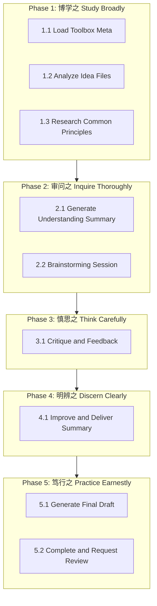

### Requirement Gathering (Current 7 Steps → 5 Phases)

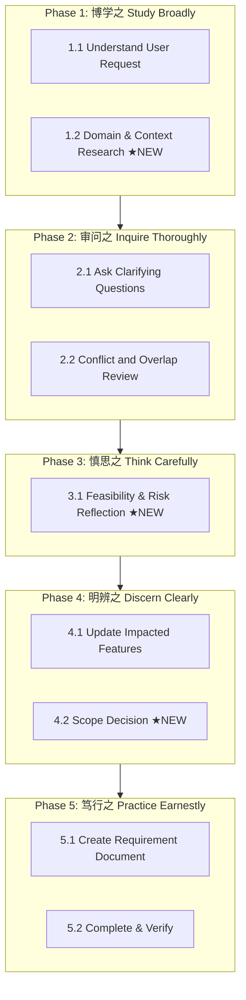

### Technical Design (Preview — Future Batch, Current 6 Steps → 5 Phases)

> Note: Technical Design is a **Design-stage skill**, not in scope for this batch. Shown here as a preview of how the 5-phase pattern will extend to Critical skills in batch 2.

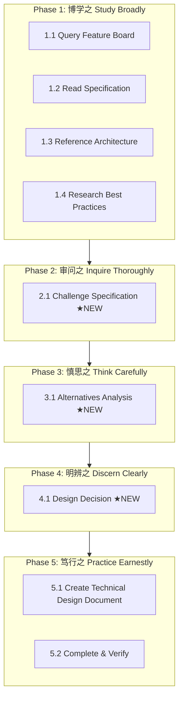

### Feature Breakdown (Current 6 Steps → 5 Phases)

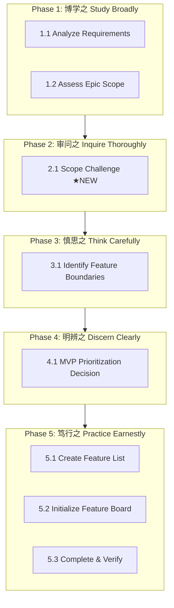

### Feature Refinement (Current 5 Steps → 5 Phases)

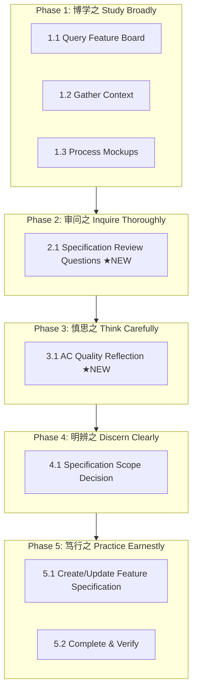

### Change Request (Current 6 Steps → 5 Phases)

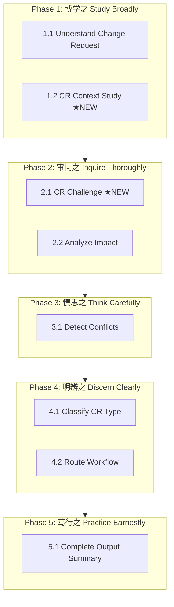

### Idea Mockup (Current 10 Steps → 5 Phases)

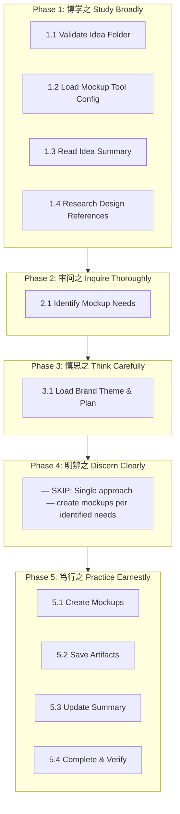

### Idea to Architecture (Current 8 Steps → 5 Phases)

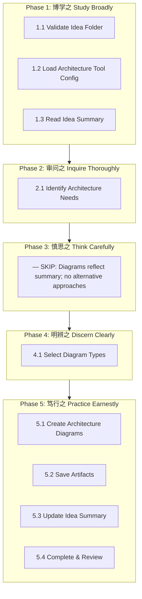

### Share Idea (Current 6 Steps → 5 Phases)

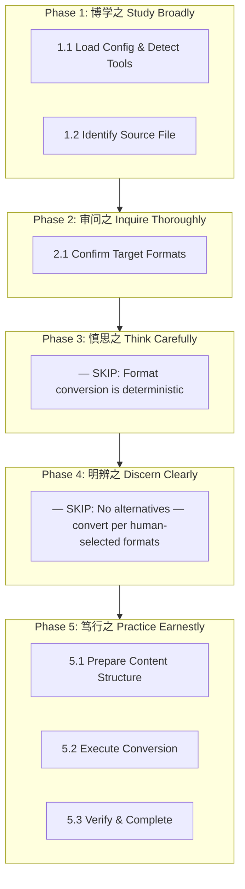

## Success Criteria

- [ ] Skill-creator template uses 5-phase backbone as mandatory structure
- [ ] Skill-creator guidelines document the 5-phase method and mapping guidance
- [ ] All 4 Ideation-stage skills restructured with 5-phase backbone
- [ ] All 4 Requirement-stage skills restructured with 5-phase backbone
- [ ] Every skill has all 5 phases present (with SKIP where not applicable)
- [ ] Phase names use both Chinese and English (e.g., "博学之 — Study Broadly")
- [ ] Existing DoD checkpoints are preserved (reordered under phases)
- [ ] XML procedure format uses `<phase_N>` → `<step_N_M>` hierarchy
- [ ] Execution Flow table uses phase-based format
- [ ] All restructured skills pass validation (< 500 lines body)

## Constraints & Considerations

- **Backward Compatibility:** Existing DoD checkpoints and output formats must be preserved — restructuring is about reordering/enriching, not breaking contracts
- **Line Limit:** Skills must stay under 500 lines — new phases that add verbosity may require moving details to `references/detailed-procedures.md`. See Line Budget section below.
- **Skip Discipline:** SKIP must be explicit, not implicit — every skill shows all 5 phases even if some are skipped
- **Incremental Rollout:** Start with skill-creator template → then 8 skills → remaining 11 skills will be tracked as a separate requirement (IDEA-102-batch2) triggered when batch 1 is completed
- **Agent Compatibility:** Phase names must be parseable by AI agents — the `<phase_N name="博学之 — Study Broadly">` format supports both Chinese and English consumption
- **Auto-Proceed in Phase 2 (审问之):** When `auto_proceed == "auto"`, the agent CANNOT ask human questions. Phase 2 behavior in auto mode: agent identifies ambiguities, logs assumptions to a decision log (via `x-ipe-tool-decision-making`), and proceeds. Phase 2 is NOT skipped in auto mode — it still performs inquiry on the inputs, it just self-resolves instead of asking human.

### 5-Phase Backbone Within Section Order

CRITICAL: The 5-phase backbone **only restructures the ACTION section** of the existing Section Order. It does NOT replace the full cognitive flow.

```
Section Order (unchanged):
  CONTEXT:  Purpose → Important Notes
  DECISION: Input Parameters → Definition of Ready
  ACTION:   Execution Flow (phase-based table) → Execution Procedure (phase-based XML) ← RESTRUCTURED HERE
  VERIFY:   Output Result → Definition of Done
  REFERENCE: Patterns & Anti-Patterns → Examples
```

### Line Budget Estimation

| Skill | Current Lines (est.) | Phase Structure Overhead | New Steps Added | Projected | Fits 500? |
|-------|---------------------|-------------------------|-----------------|-----------|-----------|
| Ideation | ~400 | +20 (phase headers) | 0 (reorder only) | ~420 | ✅ Yes |
| Idea Mockup | ~350 | +20 | 0 (reorder only) | ~370 | ✅ Yes |
| Idea to Architecture | ~300 | +20 | 0 (reorder only) | ~320 | ✅ Yes |
| Share Idea | ~250 | +20 | 0 (mostly SKIPs) | ~270 | ✅ Yes |
| Requirement Gathering | ~400 | +20 | +30 (domain research, feasibility) | ~450 | ✅ Tight |
| Feature Breakdown | ~350 | +20 | +20 (scope challenge) | ~390 | ✅ Yes |
| Feature Refinement | ~380 | +20 | +25 (spec review questions) | ~425 | ✅ Yes |
| Change Request | ~350 | +20 | +25 (context study, CR challenge) | ~395 | ✅ Yes |

If any skill exceeds 500 lines, move detailed sub-actions to `references/detailed-procedures.md` and reference from the phase step.

### Validation Strategy

After restructuring each skill:
1. **DoD Checkpoint Audit:** Diff old vs new DoD sections — every original checkpoint must appear in the restructured skill
2. **Line Count Check:** `wc -l SKILL.md` must be ≤ 500 (body only, excluding frontmatter)
3. **Phase Completeness:** All 5 phases present (with SKIP where applicable)
4. **Phase Order:** Phases appear in strict 1→2→3→4→5 order
5. **Step Numbering:** Steps use `N.M` format matching their phase

### Enriched vs. Reshuffled — Definition of Done Per Skill

| Type | Definition | Example Skills | Acceptance |
|------|-----------|----------------|------------|
| **Enriched** | New steps added (★NEW) to fill phase gaps identified in research | Requirement Gathering, Feature Breakdown, Feature Refinement, Change Request | New steps exist with meaningful content; research gap addressed |
| **Reshuffled** | Existing steps reorganized under phase headers, no new content needed | Ideation, Idea Mockup, Idea to Architecture, Share Idea | Steps correctly mapped; SKIP phases have explicit reasons |

## Brainstorming Notes

Key insights from the brainstorming session:

1. **5 phases as mega-steps:** The Chinese method provides the macro structure; existing fine-grained steps become sub-steps within phases. This creates a 2-level hierarchy that adds intellectual discipline without losing procedural clarity.

2. **SKIP is explicit, not absent:** Non-applicable phases are declared as `<skip reason="..."/>` rather than omitted. This preserves the complete cycle and forces skill creators to consciously justify why a phase doesn't apply — preventing accidental gaps.

3. **Template-first approach:** By updating the skill-creator template first, all future skills automatically inherit the 5-phase structure. Existing skills are then migrated in batches.

4. **Phase naming convention:** Bilingual names (`博学之 — Study Broadly`) serve dual purposes — the Chinese names ground the philosophy, the English names provide actionable guidance.

5. **Complementary to existing structure:** The 5-phase backbone doesn't replace the Section Order (CONTEXT → DECISION → ACTION → VERIFY → REFERENCE). It restructures the ACTION section specifically (Execution Flow + Execution Procedure).

## Ideation Artifacts

- Research Report: `x-ipe-docs/ideas/102. Research-Software Engineering/research-report.md`
- Original Idea: `x-ipe-docs/ideas/102. Research-Software Engineering/new idea.md`

## Source Files

- new idea.md
- research-report.md

## Next Steps

- [ ] Proceed to Requirement Gathering → Feature Breakdown → Feature Refinement → Implementation

## References & Common Principles

### Applied Principles

- **博学之，审问之，慎思之，明辨之，笃行之** (中庸 / Doctrine of the Mean) — The 5-phase learning and working method. Foundation of the structural backbone.
- **Bloom's Taxonomy** (1956) — Knowledge → Comprehension → Application → Analysis → Synthesis → Evaluation. Parallel hierarchical learning model validating the study→think→act progression.
- **OODA Loop** (John Boyd) — Observe → Orient → Decide → Act. Military decision cycle that maps closely: 博学≈Observe, 慎思≈Orient, 明辨≈Decide, 笃行≈Act.
- **Design Thinking** (IDEO/Stanford d.school) — Empathize → Define → Ideate → Prototype → Test. The empathize phase validates the importance of 博学, and ideate validates 慎思.

### Further Reading

- *中庸* (Doctrine of the Mean) — Chapter 20: The original source of the 5-phase method
- Boyd, John. "Destruction and Creation" (1976) — OODA loop foundations
- Bloom, B. S. "Taxonomy of Educational Objectives" (1956) — Hierarchical learning framework
- Brown, Tim. "Change by Design" (2009) — Design thinking methodology

## Implementation Order

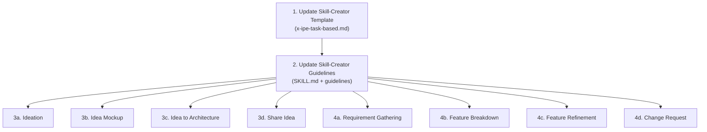
