# Idea Summary: X-IPE Homepage Infinity Loop

**Idea ID:** IDEA-008  
**Version:** v1  
**Status:** Refined  
**Last Updated:** 2026-02-05  

---

## Executive Summary

When users click on "X-IPE" in the application header, the right content panel displays an **interactive infinity loop (∞)** visualization representing the X-IPE development lifecycle. Similar to the DevOps infinity symbol, this loop has 8 stages that communicate the continuous, cyclical nature of AI-assisted development. Each stage is clickable and highlights the corresponding feature entry in the sidebar.

---

## Visual Concept


---

## Infinity Loop Structure

### Two Halves

| Half | Label | Theme | Color (from X-IPE Design System) |
|------|-------|-------|----------------------------------|
| **Left** | CONTROL | Managing what gets built | Primary: `#0f172a` (Slate 900) |
| **Right** | TRANSPARENCY | Visibility into progress | Accent: `#10b981` (Emerald 500) |

### 8 Stages Flow

```mermaid
sequenceDiagram
    participant I as Ideation
    participant R as Requirement
    participant Im as Implementation
    participant D as Deployment
    participant V as Validation
    participant M as Monitoring
    participant F as Feedback
    participant P as Planning
    
    Note over I,D: 🎮 CONTROL (Left Loop)
    I->>R: Define needs
    R->>Im: Build features
    Im->>D: Release
    
    Note over V,P: 👁️ TRANSPARENCY (Right Loop)
    D->>V: Test quality
    V->>M: Track behavior
    M->>F: Gather input
    F->>P: Plan next
    
    P->>I: Start new cycle
```



---

## Stage-to-Feature Mapping

| # | Stage | Sidebar Link | Tooltip/Tip | Status |
|---|-------|--------------|-------------|--------|
| 1 | **Ideation** | Workplace → Ideation | "Brainstorm and refine your ideas" | ✅ Ready |
| 2 | **Requirement** | Requirements folder | "Define what you need to build" | ✅ Ready |
| 3 | **Implementation** | Features folder + Code (src/) | "Build and code your features" | ✅ Ready |
| 4 | **Deployment** | (TBD) | "Release to production" | 🚧 TBD |
| 5 | **Validation** | Project Quality Report | "Verify quality and coverage" | ✅ Ready |
| 6 | **Monitoring** | Application Behavior Tracing | "Track system behavior" | ✅ Ready |
| 7 | **Feedback** | UI/UX Feedback | "Collect user feedback" | ✅ Ready |
| 8 | **Planning** | Planning section | "Plan your next iteration" | ✅ Ready |

---

## Interaction Design

### Click Behavior

1. **User clicks a stage** → Stage highlights with animation
2. **Tooltip appears** → Shows stage description and tip
3. **Sidebar item highlights** → Corresponding menu item glows/pulses
4. **Optional navigation** → User can click "Go to {Feature}" in tooltip

### Visual Feedback

- **Hover:** Stage slightly enlarges, cursor changes to pointer
- **Active:** Stage pulses with accent color (`#10b981`)
- **TBD stages:** Shown in muted color (`#94a3b8`) with "Coming Soon" tooltip

### Animation (Optional Enhancement)

- Subtle flowing animation along the infinity path
- Shows the continuous nature of the development cycle
- Can be toggled off for accessibility

---

## Design Specifications

### Colors (X-IPE Theme Default)

```css
/* Left Loop - Control */
--control-bg: #0f172a;      /* Slate 900 */
--control-text: #ffffff;
--control-border: #10b981;   /* Accent */

/* Right Loop - Transparency */
--transparency-bg: #10b981;  /* Emerald 500 */
--transparency-text: #0f172a;
--transparency-border: #0f172a;

/* Stage Labels */
--stage-text: #ffffff;
--stage-hover: #059669;      /* Emerald 600 */

/* TBD State */
--tbd-bg: #94a3b8;           /* Slate 400 */
--tbd-text: #64748b;         /* Slate 500 */
```

### Typography

- **Loop Labels ("CONTROL", "TRANSPARENCY"):** Inter, 24px, semibold
- **Stage Names:** Inter, 14px, medium
- **Tooltips:** System font, 12px, normal

### Sizing

- **Total Width:** 600-800px (responsive)
- **Height:** 300-400px
- **Stage Circles:** 60-80px diameter

---

## Technical Considerations

### Implementation Options

| Option | Pros | Cons |
|--------|------|------|
| **SVG with CSS animations** | Lightweight, scalable, easy styling | Limited interactivity |
| **HTML/CSS with JavaScript** | Full interactivity, easy tooltips | More complex |
| **Canvas** | Smooth animations | Harder to make accessible |

**Recommendation:** HTML/CSS + JavaScript for best interactivity and accessibility.

### Accessibility

- All stages keyboard navigable (Tab)
- ARIA labels for screen readers
- Reduced motion mode respects `prefers-reduced-motion`
- Minimum 4.5:1 contrast ratio

---

## Open Questions

1. **Should clicking a stage navigate directly, or just highlight the sidebar?**
   - Current decision: Highlight + optional "Go to" button in tooltip

2. **Should the animation be on by default or off?**
   - Suggest: On by default, toggle in settings

3. **Mobile responsiveness?**
   - Consider: Vertical layout or simplified view on small screens

---

## Related Artifacts

- **Reference Image:** `DevOps.png` (this folder)
- **Design System:** `x-ipe-docs/themes/theme-default/design-system.md`

---

## Next Steps

After approval, proceed to:
1. **Idea Mockup** → Create interactive HTML/CSS prototype
2. **OR Idea to Architecture** → Design component structure

---

*Created by Echo | TASK-185 | 2026-02-05*
