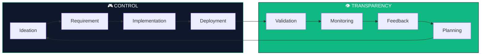
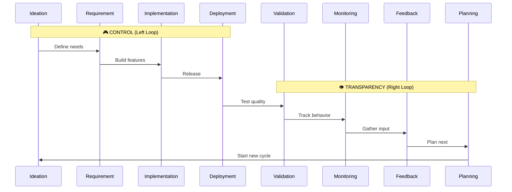

# Idea Summary: X-IPE Homepage Infinity Loop

**Idea ID:** IDEA-008  
**Version:** v2  
**Status:** Mockup Created  
**Last Updated:** 2026-02-05  

---

## Executive Summary

When users click on "X-IPE" in the application header, the right content panel displays an **interactive infinity loop (∞)** visualization representing the X-IPE development lifecycle. Similar to the DevOps infinity symbol, this loop has 8 stages that communicate the continuous, cyclical nature of AI-assisted development. Each stage is clickable and highlights the corresponding feature entry in the sidebar.

---

## 🎨 Mockups

### Interactive Prototypes

| Mockup | Description | Path |
|--------|-------------|------|
| **Homepage Infinity Loop v1** | SVG-based infinity loop with all elements drawn in code | [`mockups/homepage-infinity-v1.html`](mockups/homepage-infinity-v1.html) |
| **Homepage Infinity Loop v2** ⭐ | PNG background (`Control&Transparency.png`) with overlay buttons matching stage colors (blue/purple gradient) | [`mockups/homepage-infinity-v2.html`](mockups/homepage-infinity-v2.html) |

### Mockup Features Implemented

**v2 (Recommended):**
✅ **PNG background** using `Control&Transparency.png`  
✅ **8 interactive button overlays** positioned on arrow segments  
✅ **Button colors match image** - Blue gradient (Control) / Purple gradient (Transparency)  
✅ **Hover effects** with glow and scale animations  
✅ **Click tooltips** with stage description and navigation link  
✅ **TBD state** for Deployment (muted gray)  
✅ **Responsive** - buttons scale down on mobile  

**v1 (SVG-based alternative):**

✅ **SVG-based infinity loop** with gradient fills (Control=Slate, Transparency=Emerald)  
✅ **8 clickable stage nodes** positioned around the loop  
✅ **Tooltips on click** showing stage description and "Go to" link  
✅ **Sidebar highlight simulation** showing which menu item corresponds  
✅ **TBD state** for Deployment (muted color, "Coming Soon")  
✅ **Hover animations** (scale up on hover, pulse ring on active)  
✅ **Responsive design** (adapts to smaller screens)  
✅ **X-IPE theme colors** from design system  
✅ **Typography** using DM Sans (body) and Syne (display)  

---

## Visual Concept



---

## Infinity Loop Structure

### Two Halves

| Half | Label | Theme | Color (from X-IPE Design System) |
|------|-------|-------|----------------------------------|
| **Left** | CONTROL | Managing what gets built | Primary: `#0f172a` (Slate 900) |
| **Right** | TRANSPARENCY | Visibility into progress | Accent: `#10b981` (Emerald 500) |

### 8 Stages Flow



---

## Stage-to-Feature Mapping

| # | Stage | Sidebar Link | Tooltip/Tip | Status |
|---|-------|--------------|-------------|--------|
| 1 | **Ideation** | Workplace → Ideation | "Brainstorm and refine your ideas" | ✅ Ready |
| 2 | **Requirement** | Requirements folder | "Define what you need to build" | ✅ Ready |
| 3 | **Implementation** | Features folder + Code (src/) | "Build and code your features" | ✅ Ready |
| 4 | **Deployment** | (TBD) | "Release to production" | 🚧 TBD |
| 5 | **Validation** | Project Quality Report | "Verify quality and coverage" | ✅ Ready |
| 6 | **Monitoring** | Application Behavior Tracing | "Track system behavior" | ✅ Ready |
| 7 | **Feedback** | UI/UX Feedback | "Collect user feedback" | ✅ Ready |
| 8 | **Planning** | Planning section | "Plan your next iteration" | ✅ Ready |

---

## Interaction Design

### Click Behavior

1. **User clicks a stage** → Stage highlights with animation
2. **Full-page overlay appears** → Semi-transparent dark overlay covers entire page
3. **Sidebar highlight** → Corresponding menu entry is highlighted/emphasized on the sidebar
4. **Info panel shown** → Shows stage description, tip, and "Go to {Feature}" button
5. **Click overlay to dismiss** → Clicking outside the highlighted area closes the overlay

### Visual Feedback

- **Hover:** Stage slightly enlarges, cursor changes to pointer
- **Active:** Stage pulses with accent color (`#10b981`)
- **TBD stages:** Shown in muted color (`#94a3b8`) with "Coming Soon" tooltip

### Animation (Optional Enhancement)

- Subtle flowing animation along the infinity path
- Shows the continuous nature of the development cycle
- Can be toggled off for accessibility

---

## Design Specifications

### Colors (X-IPE Theme Default)

```css
/* Left Loop - Control */
--control-bg: #0f172a;      /* Slate 900 */
--control-text: #ffffff;
--control-border: #10b981;   /* Accent */

/* Right Loop - Transparency */
--transparency-bg: #10b981;  /* Emerald 500 */
--transparency-text: #0f172a;
--transparency-border: #0f172a;

/* Stage Labels */
--stage-text: #ffffff;
--stage-hover: #059669;      /* Emerald 600 */

/* TBD State */
--tbd-bg: #94a3b8;           /* Slate 400 */
--tbd-text: #64748b;         /* Slate 500 */
```

### Typography

- **Loop Labels ("CONTROL", "TRANSPARENCY"):** Syne, 1.1rem, bold
- **Stage Names:** DM Sans, 0.65rem, semibold
- **Tooltips:** DM Sans, 0.85rem, normal

### Sizing

- **Total Width:** 600-900px (responsive)
- **Height:** 350-420px
- **Stage Circles:** 70-90px diameter

---

## Technical Considerations

### Implementation Chosen

**HTML/CSS + JavaScript with SVG** - Best balance of:
- Full interactivity (click, hover, tooltips)
- Scalable vector graphics
- Easy theming with CSS variables
- Accessible (can add ARIA labels)

### Accessibility Notes

- ✅ Keyboard navigation possible (can add tabindex)
- ✅ Color contrast meets WCAG standards
- ⚠️ Add `prefers-reduced-motion` support before production
- ⚠️ Add ARIA labels for screen readers

---

## Open Questions (Resolved in Mockup)

1. **Should clicking a stage navigate directly, or just highlight the sidebar?**
   - ✅ Decision: Highlight + "Go to" button in tooltip (user choice)

2. **Should the animation be on by default or off?**
   - ✅ Decision: Subtle hover/click animations; no auto-play

3. **Mobile responsiveness?**
   - ✅ Decision: Scales down with smaller nodes; sidebar preview hidden on mobile

---

## Related Artifacts

| Artifact | Path |
|----------|------|
| DevOps Reference | `DevOps.png` |
| Background Image | `Control&Transparency.png` |
| Design System | `x-ipe-docs/themes/theme-default/design-system.md` |
| Mockup v1 (SVG) | `mockups/homepage-infinity-v1.html` |
| **Mockup v2 (PNG)** ⭐ | `mockups/homepage-infinity-v2.html` |

---

## Next Steps

After approval:
1. **Requirement Gathering** → Define detailed functional requirements
2. **Feature Breakdown** → Split into implementable features
3. **Technical Design** → Architecture and component design

---

*Created by Echo | TASK-185 → TASK-187 | 2026-02-05*
