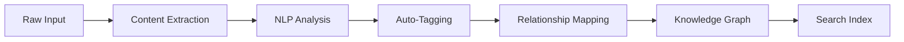
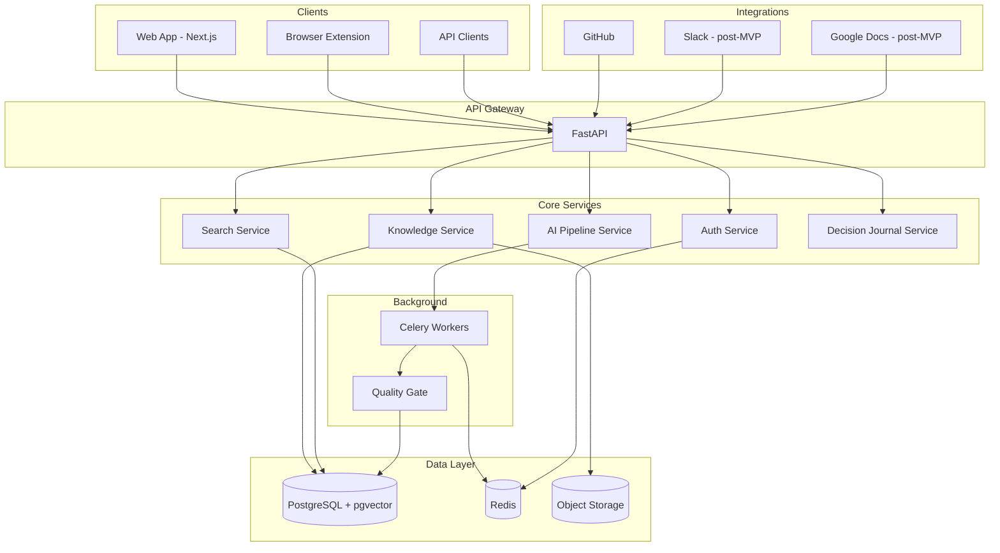
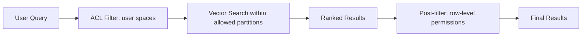

# Idea Summary — AI-Powered Team Knowledge Base

> **Status:** Refined v1
> **Created:** 2026-02-06
> **Author:** Cipher (AI Agent)
> **Origin:** User request to design a knowledge base product
> **Critique Applied:** Yes — incorporated sub-agent feedback on persona focus, content quality gates, decision journal, permission-aware search, and measurable metrics

---

## 1. Problem Statement

Teams across organizations struggle with **knowledge fragmentation**. Critical information is scattered across Slack messages, Google Docs, Confluence pages, email threads, and personal notes. This leads to:

- **Knowledge loss** when team members leave
- **Duplicate work** because people cannot find existing solutions
- **Onboarding friction** — new hires spend weeks discovering tribal knowledge
- **Decision amnesia** — teams forget why past decisions were made

Existing solutions (Confluence, Notion, SharePoint) require **manual curation** and become stale quickly. Teams need a system that **captures knowledge automatically** and makes it **instantly searchable**.

---

## 2. Core Concept

**KnowledgeForge** — an AI-powered team knowledge base that automatically captures, organizes, and surfaces relevant knowledge at the right time.

### Key Differentiators

1. **Auto-Capture**: Integrates with existing tools (Slack, GitHub, Jira, Google Docs) to passively capture knowledge without requiring manual entry
2. **AI Organization**: Automatically tags, categorizes, and links related knowledge artifacts using NLP
3. **Contextual Surfacing**: Proactively suggests relevant knowledge based on what a user is currently working on
4. **Living Documents**: AI detects when knowledge becomes stale and prompts updates
5. **Decision Journal**: Automatically captures decision context (alternatives considered, rationale, stakeholders)

---

## 3. Target Users

### Beachhead Persona (MVP)

| Persona | Pain Point | Key Need |
|---------|-----------|----------|
| **Engineering Teams** | Tribal knowledge, undocumented decisions, lost PR context | Searchable decision log, code context, architectural history |

> **Why engineers first?** Engineers produce high-signal artifacts (PRs, ADRs, RFCs, post-mortems, code reviews) that are structured enough for AI to process reliably. This persona has the clearest pain-to-solution mapping and the least noisy data sources.

### Future Personas (Post-MVP)

| Persona | Pain Point | Key Need |
|---------|-----------|----------|
| **Product Managers** | Scattered requirements, lost context | Unified product knowledge, decision history |
| **New Hires** | Overwhelming onboarding, hidden processes | Guided knowledge discovery, learning paths |
| **Team Leads** | Knowledge silos, bus factor risk | Knowledge health dashboard, gap detection |

---

## 4. Key Features

### 4.1 Knowledge Ingestion

- Connect integrations (GitHub PRs/Issues for MVP; Slack, Confluence, Google Docs post-MVP)
- Manual upload (documents, PDFs, images, videos)
- Browser extension for web clipping (post-MVP)
- API for custom integrations

### 4.1.1 Content Quality Gate (Auto-Capture)

Auto-captured content passes through a **two-stage quality filter** before entering the knowledge base:

1. **Heuristic Pre-Filter**: Scores candidates based on signals:
   - PR: merged + ≥2 reviewers + description length >200 chars
   - Slack: thread depth ≥3 replies + decision-related keywords + emoji reactions (✅, 📝)
   - GitHub Issue: label matches (ADR, RFC, post-mortem, design-doc)
2. **Human-in-the-Loop**: Candidates above threshold are surfaced to a team "knowledge curator" for quick approve/reject/edit. Below threshold = auto-discard. Above high-confidence threshold = auto-accept.

> **Rationale**: Raw auto-ingestion floods the knowledge graph with noise. This gate ensures only high-signal content enters the system.

### 4.2 AI Processing Pipeline

- Extract text from multimodal sources
- Generate summaries and key takeaways
- Identify entities, topics, and relationships
- Build a knowledge graph connecting related items
- Create embeddings for semantic search

### 4.3 Search & Discovery

- **Semantic search**: Find by meaning, not just keywords
- **Filters**: By team, topic, date, source, author
- **AI Q&A**: Ask natural language questions, get answers with source citations
- **Related suggestions**: "People who found this useful also read..."

### 4.4 Knowledge Organization

- **Spaces**: Team-level containers (Engineering, Product, Design)
- **Topics**: Auto-generated and manually curated topic clusters
- **Collections**: User-curated sets of related knowledge
- **Tags**: Both AI-generated and manual tags

### 4.5 Knowledge Health

- **Staleness detection**: Flag documents not updated in configurable timeframes
- **Gap analysis**: Identify topics with insufficient coverage
- **Usage analytics**: Track what knowledge is accessed, by whom, and when
- **Bus factor alerts**: Warn when critical knowledge is held by only one person

### 4.6 Decision Journal

A lightweight, structured log for capturing engineering decisions:

- **Structured fields**: Context, options considered, rationale, decision, stakeholders, date
- **Linked artifacts**: Attach related PRs, documents, and knowledge articles
- **Timeline view**: Chronological decision history per team/project
- **Search integration**: Decisions are first-class searchable entities

> **Why in MVP?** This is the most differentiated feature — no competitor does this well. It requires no AI and no integrations, costs little to build, and generates high-value content that makes AI features better when they ship.

---

## 5. Technical Stack (Proposed)

### Backend

| Layer | Technology | Rationale |
|-------|-----------|-----------|
| **Runtime** | Python 3.12+ | Rich ML/NLP ecosystem |
| **API Framework** | FastAPI | Async-first, OpenAPI docs, high performance |
| **Task Queue** | Celery + Redis | Background processing for AI pipelines |
| **Database** | PostgreSQL | Relational data, full-text search, JSONB |
| **Vector Store** | pgvector (PostgreSQL extension) | Semantic search, co-located with relational data |
| **Cache** | Redis | Session cache, rate limiting, pub/sub |
| **Search** | PostgreSQL FTS + pgvector | Start simple, upgrade to Elasticsearch if needed |

### AI/ML

| Component | Technology | Rationale |
|-----------|-----------|-----------|
| **Embeddings** | OpenAI text-embedding-3-small | High quality, cost-effective |
| **LLM** | GPT-4o / Claude | Summarization, Q&A, tagging |
| **NLP Pipeline** | spaCy | Entity extraction, tokenization |
| **Document Parsing** | Unstructured.io | Multi-format document extraction |

### Frontend

| Layer | Technology | Rationale |
|-------|-----------|-----------|
| **Framework** | Next.js 15 (App Router) | SSR, file-based routing, React Server Components |
| **UI Library** | shadcn/ui + Tailwind CSS | Consistent design, accessible components |
| **State** | Zustand | Lightweight, simple state management |
| **Real-time** | WebSockets (Socket.IO) | Live collaboration, notifications |
| **Search UI** | Custom with debounced input | Instant search with faceted filtering |

### Infrastructure

| Component | Technology | Rationale |
|-----------|-----------|-----------|
| **Containerization** | Docker + Docker Compose | Local dev, consistent environments |
| **Orchestration** | Kubernetes (production) | Scalability, self-healing |
| **CI/CD** | GitHub Actions | Native GitHub integration |
| **Monitoring** | Prometheus + Grafana | Metrics, alerting |
| **Logging** | Structured JSON → Loki | Centralized log aggregation |

---

## 6. High-Level Architecture

### 6.1 System Overview

### 6.2 Permission-Aware Search Architecture

Vector embeddings must respect access control. Without this, semantic search can leak content across permission boundaries.

**Design:**

- **Per-Space embedding partitions**: Each Space has its own embedding namespace in pgvector
- **Metadata-filtered search**: Every embedding row stores `space_id`, `team_id`, and `visibility` columns
- **Query-time ACL check**: Search queries are always filtered by the requesting user's accessible spaces before vector similarity is computed
- **Embedding isolation**: Private/restricted content embeddings are never mixed with public content in similarity computations

> **Critical invariant**: A user must never see content from a Space they don't have access to, even via semantic similarity results.

---

## 7. MVP Scope (Phase 1)

Focus on the **minimum viable knowledge base** for **engineering teams**:

1. **Manual knowledge entry** — Create, edit, and organize articles in Spaces
2. **AI summarization** — Auto-generate summaries for uploaded documents
3. **Semantic search** — Search by meaning using vector embeddings (permission-aware)
4. **Basic Q&A** — Ask questions, get answers with source citations
5. **Decision Journal** — Structured decision entries with context, options, rationale
6. **GitHub integration** — Auto-capture PRs, Issues, and ADRs via quality gate
7. **User auth** — Email/password + OAuth (Google/GitHub)

### Out of Scope for MVP

- Browser extension
- Slack, Confluence, Google Docs integrations
- Knowledge health dashboard
- Advanced analytics
- Real-time collaboration
- Auto-capture without quality gate

---

## 8. Success Metrics

### MVP-Measurable Metrics

| Metric | Target | How Measured |
|--------|--------|-------------|
| **AI answer helpfulness** | >3:1 positive:negative ratio | Thumbs-up/down on every AI answer (built into UI) |
| **Search-to-click rate** | >60% | Click tracking on search results (instrumented) |
| **Weekly active contributors** | >50% of team | Users who create/edit ≥1 article per week |
| **Decision journal adoption** | ≥1 entry per team per week | Count of decision entries |
| **Content ingestion quality** | <10% reject rate at quality gate | Curator approve/reject tracking |

### Long-Term KPIs (Post-MVP)

| Metric | Target | Measurement |
|--------|--------|-------------|
| **Search success rate** | >80% | Queries that result in a click |
| **Time to find info** | <30 seconds | From search to answer |
| **Knowledge freshness** | >90% | Articles updated within policy window |
| **AI answer accuracy** | >85% | Human evaluation pipeline |

---

## 9. Risks & Mitigations

| Risk | Impact | Mitigation |
|------|--------|-----------|
| **Low adoption** | Product fails | Start with one power-user team, iterate on feedback |
| **AI hallucination** | Trust erosion | Always show source citations, confidence scores |
| **Data privacy** | Compliance issues | Role-based access, data encryption, audit logs |
| **Integration complexity** | Slow delivery | Start with one integration, build abstraction layer |
| **Content staleness** | Reduced trust | Staleness detection + automated review prompts |

---

## 10. Open Questions

1. **Deployment model**: SaaS (multi-tenant) or self-hosted (single-tenant)?
2. **Pricing model**: Per-seat, per-team, or usage-based?
3. **Data residency**: Any specific compliance requirements (SOC2, GDPR)?
4. **Existing tools**: What tools does the target team currently use for knowledge management?
5. **Scale**: Expected number of users and knowledge artifacts?
