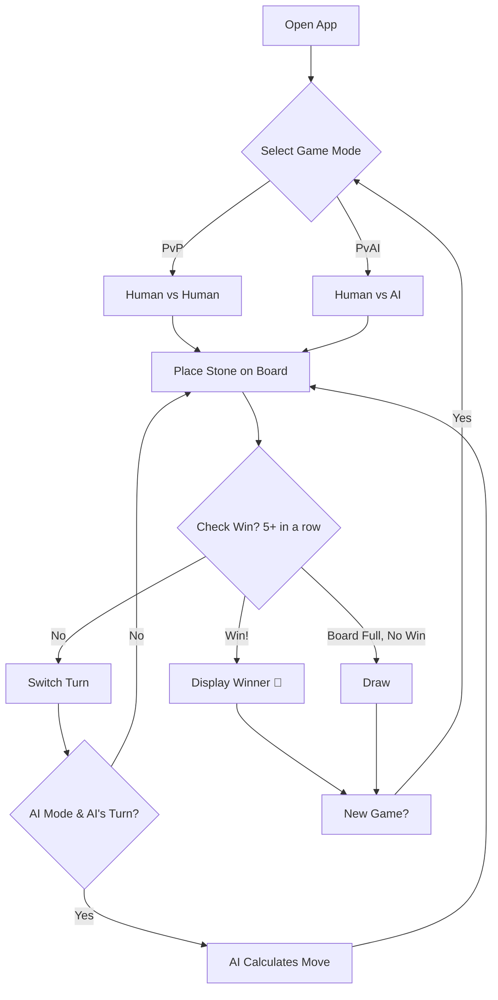
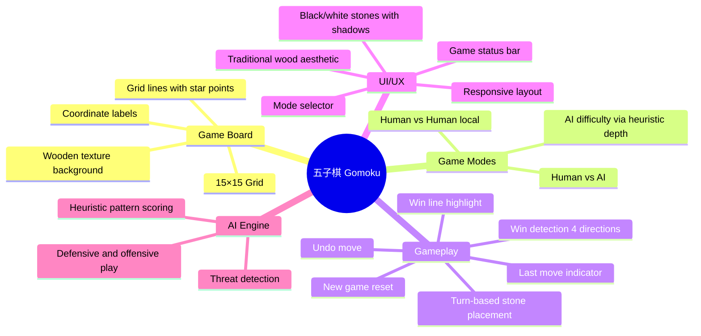

# Idea Summary

> Idea ID: IDEA-031
> Folder: wf-001-dddd
> Version: v1
> Created: 2026-02-28
> Status: Refined

## Overview

A web-based **五子棋 (Gomoku / Five in a Row)** game — a classic two-player strategy board game on a 15×15 grid. Players alternate placing black and white stones, aiming to connect five in a row horizontally, vertically, or diagonally. The app supports both **Human vs Human** (local) and **Human vs AI** (heuristic-based) game modes, wrapped in a traditional wooden-board aesthetic with modern UI polish.

## Problem Statement

Gomoku is a timeless strategy game that's simple to learn but deep to master. There's a need for a clean, responsive, browser-based Gomoku implementation that works offline, supports both local two-player and single-player (vs AI) modes, and delivers a visually appealing experience without requiring installation or server-side infrastructure.

## Target Users

- Casual gamers looking for a quick strategy game in the browser
- Players who enjoy traditional board games (Go, Chess) and want a lightweight Gomoku experience
- Developers interested in a well-structured game project as a reference implementation

## Proposed Solution

A single-page web application built with vanilla HTML, CSS, and JavaScript. The game uses **Canvas** to render a 15×15 wooden-textured board with black and white stone pieces (gradient fills + drop shadows for a premium feel). Game logic handles turn management, win detection (4-direction scan from last move, **free-style rules: 5+ in a row wins, overlines count**), and a heuristic AI opponent. The AI runs **synchronously** on the main thread (no Web Worker needed — heuristic scan of 225 cells is sub-millisecond). The UI provides controls for game mode selection, undo, new game, and real-time game status. **Black always plays first** (standard Gomoku convention).



## Key Features



### Feature Details

| # | Feature | Description | Priority |
|---|---------|-------------|----------|
| 1 | **15×15 Game Board** | Canvas or CSS-grid rendered board with traditional wooden look, grid lines, and star points (天元) | Must Have |
| 2 | **Stone Placement** | Click-to-place with alternating black/white turns, visual hover preview | Must Have |
| 3 | **Win Detection** | Scan horizontal, vertical, and both diagonals from last move for 5+ consecutive same-color stones (**free-style rules: overlines count as win**) | Must Have |
| 4 | **Human vs Human** | Local two-player mode, same device | Must Have |
| 5 | **Human vs AI** | Heuristic AI with pattern-based scoring pipeline: Threat Scanner → Heuristic Evaluator (pattern→score) → Move Scorer (aggregate) → Best Move Selector (argmax). Scoring weights: winning move (+100000), live-four (+10000), dead-four (+5000), live-three (+1000), half-open-three (+100), live-two (+50). AI runs synchronously (no Web Worker needed) | Should Have |
| 6 | **Last Move Indicator** | Red dot or marker on the most recently placed stone | Must Have |
| 7 | **Win Highlight** | Highlight the winning 5 stones when game ends | Must Have |
| 8 | **Undo** | In PvP mode: revert last 1 move. In AI mode: always revert last 2 moves (AI + human) to return to human's previous turn. Disabled when no moves to undo | Should Have |
| 9 | **New Game** | Reset board and score, re-select mode | Must Have |
| 10 | **Game Status Bar** | Shows current player, turn count, game result | Must Have |
| 11 | **Responsive Design** | Works on viewports ≥768px (desktop and tablet). Mobile (<768px) explicitly out of scope for v1 | Should Have |
| 12 | **Sound Effects** | Stone placement click sound, win fanfare | Nice to Have |

## Architecture Overview

```architecture-dsl
@startuml module-view
title "Gomoku Web App — Module Architecture"
theme "theme-default"
direction top-to-bottom
grid 12 x 6

layer "Presentation Layer" {
  color "#E8D5B7"
  border-color "#C4A876"
  rows 2

  module "Game Board UI" {
    cols 6
    rows 2
    grid 2 x 2
    align center center
    gap 8px
    component "Board Renderer" { cols 1, rows 1 }
    component "Stone Renderer" { cols 1, rows 1 }
    component "Hover Preview" { cols 1, rows 1 }
    component "Win Highlight" { cols 1, rows 1 }
  }

  module "Control Panel" {
    cols 6
    rows 2
    grid 2 x 2
    align center center
    gap 8px
    component "Mode Selector" { cols 1, rows 1 }
    component "Status Display" { cols 1, rows 1 }
    component "Undo Button" { cols 1, rows 1 }
    component "New Game Button" { cols 1, rows 1 }
  }
}

layer "Game Logic Layer" {
  color "#D4E8D4"
  border-color "#8BBF8B"
  rows 2

  module "Core Engine" {
    cols 6
    rows 2
    grid 2 x 2
    align center center
    gap 8px
    component "Board State (15x15)" { cols 1, rows 1 }
    component "Turn Manager" { cols 1, rows 1 }
    component "Move Validator" { cols 1, rows 1 }
    component "Win Detector" { cols 1, rows 1 }
  }

  module "AI Engine" {
    cols 6
    rows 2
    grid 2 x 2
    align center center
    gap 8px
    component "Heuristic Evaluator" { cols 1, rows 1 }
    component "Threat Scanner" { cols 1, rows 1 }
    component "Move Scorer" { cols 1, rows 1 }
    component "Best Move Selector" { cols 1, rows 1 }
  }
}

layer "Data Layer" {
  color "#D4D8E8"
  border-color "#8B8FBF"
  rows 2

  module "State Management" {
    cols 12
    rows 2
    grid 3 x 1
    align center center
    gap 8px
    component "Move History Stack [{row,col,player}]" { cols 1, rows 1 }
    component "Game Config {mode,aiFirst}" { cols 1, rows 1 }
    component "Score Tracker {wins,losses,draws}" { cols 1, rows 1 }
  }
}

@enduml
```

## Success Criteria

- [ ] Board renders correctly with 15×15 grid and wooden aesthetic
- [ ] Players can place stones with alternating turns (Black first)
- [ ] Win detection correctly identifies 5+-in-a-row in all 4 directions (free-style rules)
- [ ] Draw detection when board is full with no winner (rare but handled)
- [ ] Human vs Human mode works for local play
- [ ] AI blocks opponent's open-four 100% of the time
- [ ] AI creates winning move when available (live-four or better)
- [ ] AI creates own threats when no defensive move is needed
- [ ] Undo reverts 1 move in PvP, 2 moves in AI mode
- [ ] New Game resets all state
- [ ] Game status bar shows correct current player (Black/White) and game result
- [ ] Responsive layout works on viewports ≥768px
- [ ] Last move is visually indicated (red dot marker)
- [ ] Winning line (5+ stones) is highlighted
- [ ] Coordinate labels (A-O columns, 1-15 rows) displayed on board edges

## Constraints & Considerations

- **No server required** — fully client-side, runs in any modern browser
- **Vanilla tech stack** — HTML + CSS + JS, no frameworks or build tools
- **Canvas rendering** — chosen over CSS grid for smooth stone gradients and drop shadows
- **AI complexity** — heuristic pattern-based scoring (not minimax with deep search) to keep the codebase simple and sub-millisecond response time
- **No online multiplayer** — local play only to keep scope manageable
- **Session-only state** — score tracker resets on page reload, no localStorage persistence in v1
- **Black always first** — standard convention, no coin-flip option in v1
- **Coordinate labels** — A-O for columns, 1-15 for rows (chess-style notation)
- **Minimum viewport** — ≥768px width; mobile (<768px) explicitly out of scope for v1
- **Renju rules** — not included in initial version (standard free-style Gomoku rules, overlines count as win)
- **Accessibility** — keyboard navigation would be a future enhancement

## Brainstorming Notes

- 五子棋 is one of the most popular board games in East Asia, with simple rules but deep strategic depth
- A 15×15 board is the standard competitive size (19×19 is for Go)
- **Free-style rules:** 5 or more in a row wins (overlines count, unlike Renju)
- **Black always moves first** (standard convention)
- The AI should prioritize: (1) winning moves, (2) blocking opponent's 4-in-a-row, (3) extending own sequences, (4) controlling the center
- **AI scoring pipeline:** Threat Scanner identifies patterns → Heuristic Evaluator assigns scores → Move Scorer aggregates per empty cell → Best Move Selector picks argmax
- Star points (天元 + 8 additional stars) are traditional visual markers at positions (4,4), (4,8), (4,12), (8,4), (8,8), (8,12), (12,4), (12,8), (12,12) — total 9 points
- **Canvas rendering** chosen for smooth stone rendering with radial gradients and drop shadows — CSS grid would require complex overlay positioning
- The wooden board aesthetic (warm browns, subtle wood grain texture via CSS gradient) gives a premium traditional feel
- **Data structures:**
  - Board state: `int[15][15]` (0=empty, 1=black, 2=white)
  - Move history: `Array<{row: number, col: number, player: 1|2}>` (stack, supports undo via pop)
  - Game config: `{mode: 'pvp'|'pvai', currentPlayer: 1|2, gameOver: boolean, winner: 0|1|2}`
  - Score tracker: `{black: number, white: number, draws: number}` (session-only, resets on page reload)
- **Draw is extremely rare** on a 15×15 board (225 cells) — handled for completeness but not a primary concern

## Ideation Artifacts (If Tools Used)

- Game flow: Mermaid flowchart (embedded above)
- Feature map: Mermaid mindmap (embedded above)
- Architecture: Architecture DSL module view (embedded above)

## Source Files

- new idea.md

## Next Steps

- [ ] Proceed to Idea Mockup (recommended — UI-heavy idea benefits from visual mockup)
- [ ] Or proceed to Requirement Gathering (if skipping mockup)

## References & Common Principles

### Applied Principles

- **Separation of Concerns:** UI rendering, game logic, and AI engine are isolated modules — changes to one don't affect others
- **Single Responsibility:** Each component has one clear job (e.g., Win Detector only checks win conditions)
- **Progressive Enhancement:** Core PvP gameplay works first; AI mode and extras layer on top
- **Heuristic AI Pattern Scoring:** Standard approach for Gomoku AI — evaluate board positions by recognizing threat patterns (open-four, half-open-three, etc.)

### Further Reading

- Gomoku (Five in a Row) — classic abstract strategy board game played on a 15×15 grid
- Heuristic evaluation for Gomoku — pattern-based scoring assigns values to threat formations (live-four, dead-four, live-three, etc.)
- Renju rules — competitive variant with opening restrictions for Black to balance first-move advantage (not included in v1)
