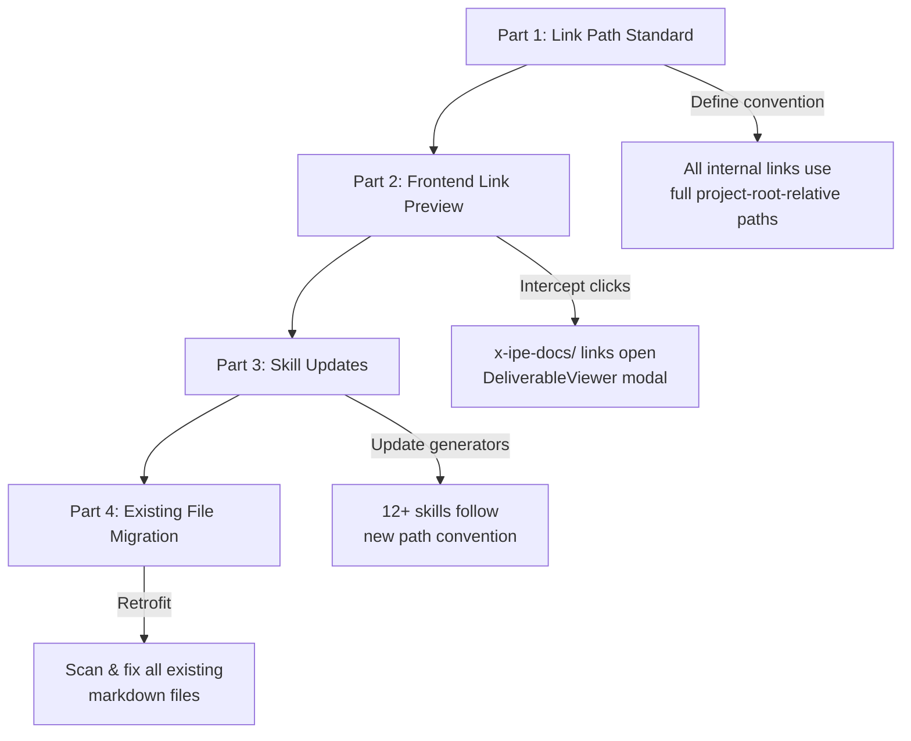
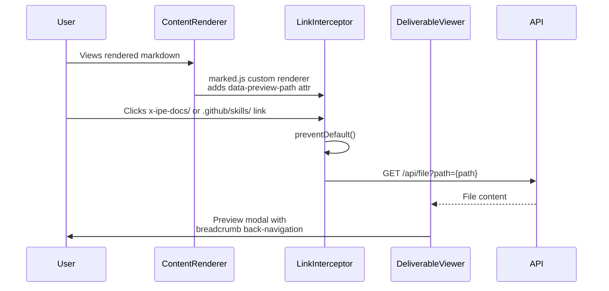

# Idea Summary

> Idea ID: IDEA-033
> Folder: wf-001-feature-file-link-preview
> Version: v1
> Created: 2026-03-03
> Status: Refined

## Overview

Enhance X-IPE's handling of internal file links in rendered markdown content. When markdown files reference other project resources via `x-ipe-docs/` or `.github/skills/` paths, clicking those links should open an in-app preview modal instead of navigating away. This also requires standardizing all internal link paths to use full project-root-relative paths, updating all 12 skills that generate markdown, and retrofitting all existing markdown files. Future skills must also comply with the path convention (enforced via the skill creation template).

## Problem Statement

Currently, markdown content rendered in X-IPE (idea summaries, specifications, technical designs, skill docs) contains links to other project files. These links have inconsistent path formats (some relative `../`, some partial) and clicking them either navigates away from the current view or results in 404 errors. There is no in-app preview mechanism — users lose context when they need to cross-reference linked documents.

## Target Users

- **Developers** using X-IPE for feature development who need to cross-reference specs, designs, and idea summaries
- **AI Agents** that generate markdown output with internal cross-references — they need clear rules for path formatting
- **Project Managers** reviewing documentation chains (idea → requirements → design → implementation)

## Proposed Solution

A 4-part solution covering the full stack from rendering to content generation:



### Part 1: Link Path Standard

Establish a project-wide convention: all markdown links referencing project resources **MUST** use full relative paths from the project root.

| Before (inconsistent) | After (standardized) |
|---|---|
| `[spec](../FEATURE-001/specification.md)` | `[spec](x-ipe-docs/requirements/EPIC-001/FEATURE-001/specification.md)` |
| `[design](./technical-design.md)` | `[design](x-ipe-docs/requirements/EPIC-001/FEATURE-001/technical-design.md)` |
| `[skill](SKILL.md)` | `[skill](.github/skills/x-ipe-task-based-bug-fix/SKILL.md)` |

### Part 2: Frontend Link Preview

Intercept clicks on links starting with `x-ipe-docs/` or `.github/skills/` in rendered markdown and open the existing DeliverableViewer modal.

**Implementation approach:**



**Key behaviors:**
- **Scope:** Works everywhere markdown is rendered (knowledge base, idea summaries, workflow deliverables, skill docs)
- **Link detection:** Intercepts links whose `href` starts with `x-ipe-docs/` OR `.github/skills/` — these are the two primary internal documentation trees
- **Preview modal:** Reuse existing `DeliverableViewer` component (supports markdown, HTML, code)
- **Nested navigation:** Clicking a link inside a preview replaces modal content with breadcrumb-style back navigation (see UX sketch below)
- **Visual distinction:** Internal links get a file icon (📄) and hover tooltip "Open preview"
- **Error handling:** If file not found, show inline error message in the modal ("File not found: path/to/file.md")
- **Supported file types:** Markdown (.md), HTML (.html/.htm), plain text, code files. Binary files (.png, .jpg, .csv, .json) show raw/formatted content or a "Cannot preview binary file" message.
- **Abort behavior:** When user clicks a new link while a file is loading, abort the pending request (via AbortController) and load the new file. The modal stays open with a loading indicator.

**Breadcrumb Navigation UX:**

```
┌─────────────────────────────────────────────────────────┐
│  ← Back │ idea-summary-v1.md > specification.md > ...   │  ✕
├─────────────────────────────────────────────────────────┤
│                                                         │
│  [Rendered content of current file]                     │
│                                                         │
│  Links to other x-ipe-docs/ files are clickable:        │
│  📄 technical-design.md ← click opens next level        │
│                                                         │
└─────────────────────────────────────────────────────────┘
```

The breadcrumb trail shows the navigation path. "← Back" returns to the previous file. The trail is capped at 5 levels deep to prevent excessive nesting.

**Backend API Note:**
The sequence diagram references `GET /api/file?path={path}`. This endpoint may already exist (the DeliverableViewer uses a similar API to fetch file content). If not, a simple file-read endpoint is needed with **path traversal protection** — the backend must validate that the resolved path stays within the project root directory. Only files under `x-ipe-docs/` and `.github/skills/` should be servable.

### Part 3: Skill Updates

Update all 12+ skills that generate markdown files to follow the new full-path convention:

| Skill | Output Files | Change |
|---|---|---|
| `x-ipe-task-based-ideation-v2` | `idea-summary-vN.md` | Full paths for cross-references |
| `x-ipe-task-based-feature-refinement` | `specification.md` | Full paths to related features, CRs |
| `x-ipe-task-based-technical-design` | `technical-design.md` | Full paths to spec, architecture |
| `x-ipe-task-based-requirement-gathering` | `requirement-details.md` | Full paths to idea summaries |
| `x-ipe-task-based-feature-breakdown` | `requirement-details.md` | Full paths to feature specs |
| `x-ipe-task-based-change-request` | `CR-XXX.md` | Full paths to original spec |
| `x-ipe-task-based-idea-to-architecture` | `architecture-description.md` | Full paths to idea summary |
| `x-ipe-task-based-feature-acceptance-test` | `acceptance-test-cases.md` | Full paths to spec, design |
| `x-ipe-task-based-refactoring-analysis` | `analysis-{task_id}.md` | Full paths to analyzed files |
| `x-ipe-task-based-improve-code-quality` | `{module}-requirements.md` | Full paths to source files |
| `x-ipe-task-based-code-implementation` | various docs | Full paths to test files, design |
| `x-ipe-task-based-user-manual` | `README.md` | Full paths to config, docs |

Each skill's execution procedure should include a constraint: "All internal links MUST use full project-root-relative paths (e.g., `x-ipe-docs/requirements/EPIC-XXX/specification.md`)."

### Part 4: Existing File Migration

Scan all markdown files in `x-ipe-docs/` and `.github/skills/` for relative or partial internal paths, convert to full project-root-relative format.

**Scope:**
- Files in `x-ipe-docs/` (ideas, requirements, planning, refactoring)
- Files in `.github/skills/` (references, examples within SKILL.md)
- Pattern detection: `../`, `./`, paths that don't start with `x-ipe-docs/` or `.github/` but reference project resources

**Migration strategy:**
- **One-time script** that scans markdown files, resolves relative paths to absolute project-root-relative paths, and rewrites links in-place
- **Ambiguous path resolution:** When a relative path like `../specification.md` could map to multiple files, the script uses the file's own location to compute the canonical path. If the target file doesn't exist, the link is flagged for manual review (not auto-rewritten)
- **Code block exclusion:** Links inside fenced code blocks (` ``` `) and inline code (`` ` ``) are NOT rewritten — only links in rendered markdown content
- **Ongoing enforcement:** After migration, add a path convention note to the skill creation template (`x-ipe-meta-skill-creator`) so future skills comply automatically. No runtime lint rule needed — the convention is enforced at generation time by skills

## Key Features

1. **Link Path Convention** — Project-wide standard for all markdown internal links using full root-relative paths (two prefixes: `x-ipe-docs/` and `.github/skills/`)
2. **Click-to-Preview** — Internal links open DeliverableViewer modal instead of navigating away
3. **Breadcrumb Navigation** — Navigate between linked documents within the preview modal with back-history (capped at 5 levels)
4. **Visual Link Distinction** — File icon (📄) and tooltip on preview-capable links
5. **Skill Compliance** — All 12 markdown-generating skills updated to follow path convention; skill creation template enforces convention for future skills
6. **Retroactive Migration** — One-time migration script converts existing files to standardized paths, with ambiguous-path flagging and code-block exclusion
7. **Backend Safety** — File API with path traversal protection, restricted to `x-ipe-docs/` and `.github/skills/` trees

## Success Criteria

**P0 — Must-have (MVP):**
- [ ] All `x-ipe-docs/` and `.github/skills/` links in rendered markdown open a preview modal (not navigate away)
- [ ] Preview modal displays markdown, HTML, and code files correctly using ContentRenderer
- [ ] File-not-found shows inline error message in modal
- [ ] No regression in existing ContentRenderer, DeliverableViewer, or FolderBrowserModal functionality

**P1 — Important (complete feature):**
- [ ] Clicking links inside a preview navigates within the modal with back-breadcrumb
- [ ] Internal links are visually distinguishable from external links (📄 icon + tooltip)
- [ ] All 12 skills updated with full-path convention constraint

**P2 — Follow-up:**
- [ ] All existing markdown files migrated to full root-relative paths
- [ ] Skill creation template updated to enforce path convention for future skills

## Constraints & Considerations

- **Two interception prefixes:** `x-ipe-docs/` and `.github/skills/` paths trigger preview — external URLs and other project paths (`src/`, `tests/`) behave normally
- **Reuse existing components** — DeliverableViewer and ContentRenderer, no new rendering engine
- **Backward compatibility** — During a transition period (until Part 4 migration completes), the frontend should attempt to resolve old-style relative paths by computing them against the current file's location. After migration, this fallback can be removed. No permanent backward-compat debt.
- **Performance** — File content fetched on-demand (not preloaded); AbortController cancels pending requests when user clicks a new link quickly
- **Feature decomposition** — Recommended implementation order: P0 (frontend preview) → P1 (breadcrumb + visual + skill updates) → P2 (migration). Each is independently shippable.
- **Exact skill count:** 12 skills identified (see table above). Future skills must also comply — enforced by updating the `x-ipe-meta-skill-creator` skill template with the path convention.

## Brainstorming Notes

- The user explicitly referenced the existing "file preview modal window in workflow" and wants markdown and HTML to render "the same" — confirming we should reuse DeliverableViewer + ContentRenderer
- Navigation within preview (breadcrumb-style back) was chosen over stacked modals — simpler UX, avoids modal-on-modal complexity
- Visual distinction (icon + tooltip) chosen to set user expectations that these links behave differently
- Inline error messages preferred over toast notifications — keeps context in the modal
- Skill updates + file migration are in-scope despite large blast radius — user wants comprehensive fix
- **Critique insight:** Initially scoped only to `x-ipe-docs/` links, but `.github/skills/` paths are also frequently cross-referenced in generated markdown (e.g., specs referencing skill docs). Expanded interception to both prefixes.
- **Critique insight:** Backend endpoint needs explicit path traversal protection — restrict to allowed directory trees only
- **Critique insight:** Migration needs code-block exclusion (don't rewrite paths inside ` ``` ` blocks) and ambiguous-path flagging
- **Critique insight:** Success criteria prioritized into P0/P1/P2 to support incremental delivery

## Source Files

- `x-ipe-docs/ideas/wf-001-feature-file-link-preview/new idea.md`
- `x-ipe-docs/uiux-feedback/Feedback-20260303-212659/feedback.md`
- `x-ipe-docs/uiux-feedback/Feedback-20260303-212659/page-screenshot.png`

## Next Steps

- [ ] Proceed to Requirement Gathering

## Mockups & Prototypes

| Mockup | Type | Path | Tool Used |
|--------|------|------|-----------|
| File Link Preview — Full Interactive | HTML | mockups/file-link-preview-v1.html | frontend-design |

### Scenarios Covered

The mockup includes 5 interactive scenarios switchable via tabs at the bottom:

1. **① Link Distinction** — Shows rendered markdown with visual difference between internal links (📄 icon, green dashed underline, "Open preview" tooltip) and external links (blue, normal behavior)
2. **② Preview Modal** — Click any internal link to open the DeliverableViewer-style modal with rendered file content
3. **③ Breadcrumb Nav** — Shows 3-level deep navigation with breadcrumb trail and ← Back button
4. **④ Error State** — "File not found" inline error with path display and hint text
5. **⑤ Loading State** — Spinner with file path being loaded

### Preview Instructions
- Open `mockups/file-link-preview-v1.html` in a browser to view the interactive mockup
- Click scenario tabs at the bottom to switch between states
- Click internal links (green with 📄) to trigger the preview modal
- Click links inside the preview to test nested breadcrumb navigation

## References & Common Principles

### Applied Principles

- **Progressive Enhancement:** Links work as standard `<a>` tags by default; JavaScript adds the preview behavior. If JS fails, links still navigate normally.
- **Single Responsibility:** ContentRenderer handles rendering, DeliverableViewer handles modal display, LinkInterceptor handles click interception — each component has one job.
- **Convention Over Configuration:** One path convention (full root-relative) eliminates ambiguity. No per-file or per-skill configuration needed.
- **Event Delegation:** Use a single delegated click handler on `.markdown-body` containers rather than attaching handlers to every `<a>` tag — better performance, works with dynamically rendered content.

### Architecture Context

```architecture-dsl
@startuml module-view
title "File Link Preview — Component Architecture"
theme "theme-default"
direction top-to-bottom
grid 12 x 5

layer "User Interaction" {
  color "#2D3748"
  border-color "#4A5568"
  rows 1

  module "Click Handling" {
    cols 12
    rows 1
    grid 3 x 1
    align center center
    gap 8px
    component "LinkInterceptor" { cols 1, rows 1 }
    component "Event Delegation" { cols 1, rows 1 }
    component "Visual Distinction" { cols 1, rows 1 }
  }
}

layer "Preview Layer" {
  color "#2C5282"
  border-color "#3182CE"
  rows 1

  module "Modal Components" {
    cols 12
    rows 1
    grid 3 x 1
    align center center
    gap 8px
    component "DeliverableViewer" { cols 1, rows 1 }
    component "Breadcrumb Nav" { cols 1, rows 1 }
    component "Error Display" { cols 1, rows 1 }
  }
}

layer "Rendering Layer" {
  color "#276749"
  border-color "#38A169"
  rows 1

  module "Content Rendering" {
    cols 12
    rows 1
    grid 3 x 1
    align center center
    gap 8px
    component "ContentRenderer" { cols 1, rows 1 }
    component "Marked.js Custom Renderer" { cols 1, rows 1 }
    component "Mermaid / Arch DSL" { cols 1, rows 1 }
  }
}

layer "API Layer" {
  color "#744210"
  border-color "#D69E2E"
  rows 1

  module "Backend" {
    cols 12
    rows 1
    grid 2 x 1
    align center center
    gap 8px
    component "File Content API" { cols 1, rows 1 }
    component "Path Resolution" { cols 1, rows 1 }
  }
}

layer "Content Generation" {
  color "#553C9A"
  border-color "#805AD5"
  rows 1

  module "Skills & Migration" {
    cols 12
    rows 1
    grid 2 x 1
    align center center
    gap 8px
    component "12+ Skill Updates" { cols 1, rows 1 }
    component "File Migration Script" { cols 1, rows 1 }
  }
}

@enduml
```
